**By 超神经**

**内容一览：**回顾 2019 年，人工智能领域时有大事发生，吸引着各界人士的关注。这一年，也诞生了数篇优质论文。我们收集了 Reddit 上网友 2019 最喜欢的论文，供大家一起分享、学习与探讨。

**关键词：**元学习 深度参数化 计算机视觉 

**来源：****reddit.com**

**编辑：****神经星星 神经小兮**

**技术顾问：姜汉（openbayes.com）** 

虽然 2019 年已经渐行渐远，但回顾这一年，人工智能领域发生的很多大事件产生的影响依然深远。

从黑洞照片公布到量子霸权实现，从清华天机芯到 ZAO App 的 AI 换脸，从中国人脸识别第一案到 AI 合成语音诈骗……

同时，在 AI 引发颇多思考的一年中，优秀的论文也源源不断地诞生，让我们得以了解和学习，在 AI 领域各个方向的技术所取得的新进展。

我们收集了 Reddit 上，网友分享的**「2019 最喜欢的论文」**，与大家分享，希望大家能从这些论文中，对 2020 年人工智能的发展方向、前沿技术，略窥一二。

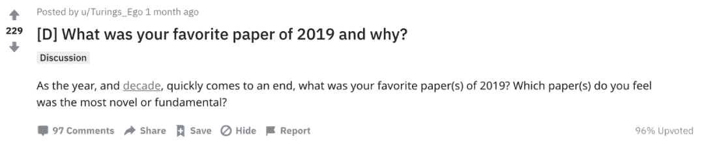

**Reddit 传送门：*******http://dwz.win/wke*****

1

**理论研究 **

**《借助欠平滑 HAL，有效估计路径可微分目标参数》**

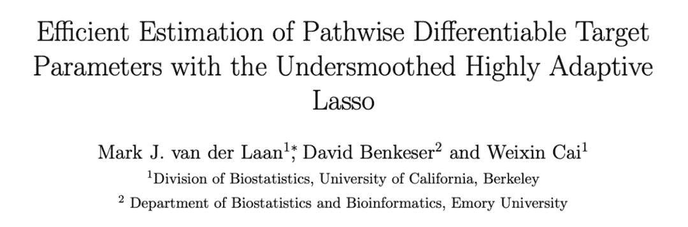

***论文链接：https://arxiv.org/pdf/1908.05607.pdf***

在本文中，作者认为，**功能参数平滑特征的渐近有效估计量，都可在易验证的全局欠平滑条件下，借助 Spline-HAL-MLE 获取。**

通过使用 targeted HAL-MLE 作为元学习步骤，有可能得到一个估计器，该估计器可将 superlearning、 undersrmoothed HAL-MLE 以及 TMLE 结合利用。

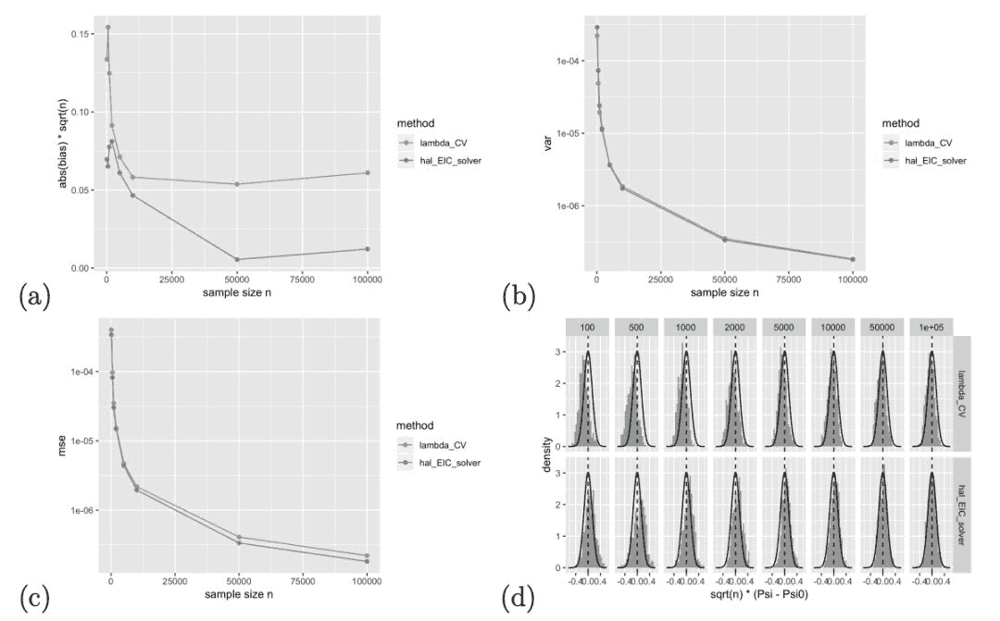

**平均密度值参数的模拟结果** 

2

**计算机视觉 **

**《BA-Net：****密集捆绑调整网络》**

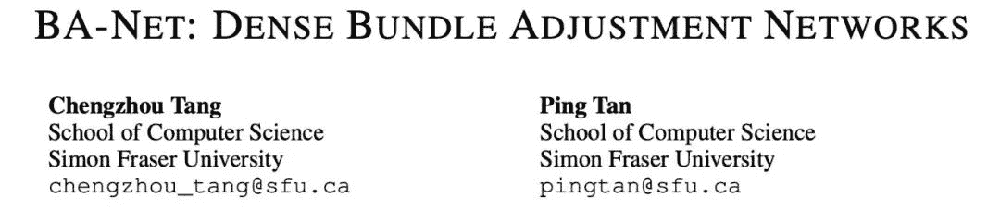

***论文链接：http://dwz.win/wmQ***

本文介绍了一种神经网络，**通过特征束调整（BA），来解决运动结构（SfM）问题。**此外，这项工作引入了一种新颖的深度参数化，来恢复密集的每像素深度。

整个系统很好地结合了领域知识（硬编码多视图几何约束）和机器学习，从而解决极具挑战性的 SfM 问题。大规模实验证明，该方法优于传统 BA 及当下的深度学习方法。

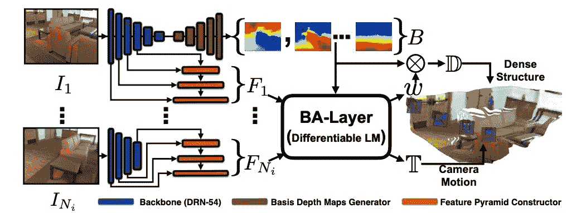

**BA-Net 结构一览**

3

**计算机视觉 **

**《MoCo：****无监督视觉表示学习方法》**

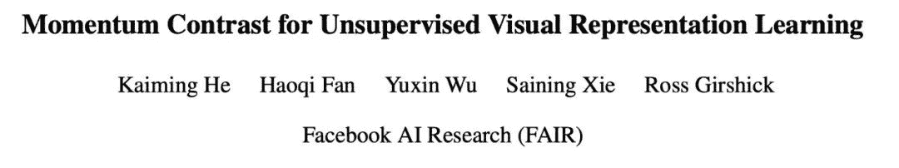

***论文链接：******https://arxiv.org/pdf/1911.05722.pdf***

论文的一作是计算机视觉领域大牛何恺明。**该方法在一系列无监督计算机视觉相关任务中，都表现优异。**MoCo 从 IN-1M 到 IG-1B 的改进引人注目，但相对较小，这表明较大规模的数据可能没有被充分利用。

除简单的实例区分任务以外， MoCo 还可以应用于 masked auto-encoding 等自监督任务，无论是语言方向还是视觉方向。

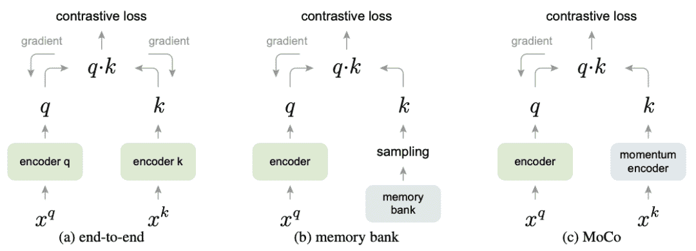

**三种对比损失机制的概念比较**

4

**无监督学习 **

**《通过隐藏单元对抗进行无监督学习》**

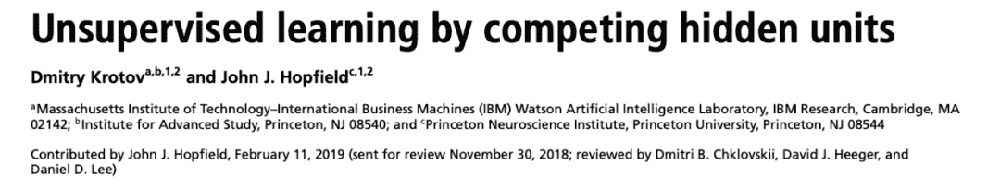***论文链接：http://dwz.win/wuJ***

在文中，作者设计了一种学习算法，**该算法利用隐藏层中的全局抑制，能够以一种完全无监督的方式，学习早期的特征检测器。**

这些低层特征检测器通常可借助监督的方式，训练高层权重，从而使整个网络的性能可与标准前馈网络的性能相提并论，通过反向传播算法，实现简单的训练任务。

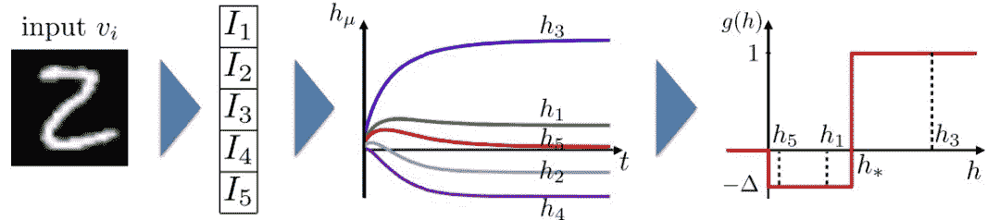

**训练算法的 Pipeline**

5

**理论研究 **

**《N-BEATS：可用于可解释时间序列预测的神经基础扩展分析》**

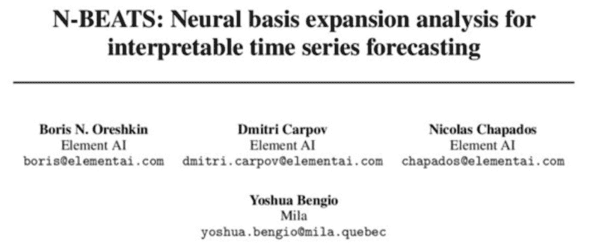***论文链接：https://arxiv.org/pdf/1905.10437.pdf***

作者在本文中提出并验证了用于单变量 TS 预测的新型架构。该架构通用且灵活，在各种 TS 预测中，都表现良好。

**该实验证明 DL 可以多任务方式，在多个时间序列上训练模型，并且支持共享独立的学习任务。**研究人员推测，N-BEATS 的优秀表现，可以部分归因于它执行了元学习的形式，未来将在该领域进行更深入的研究。

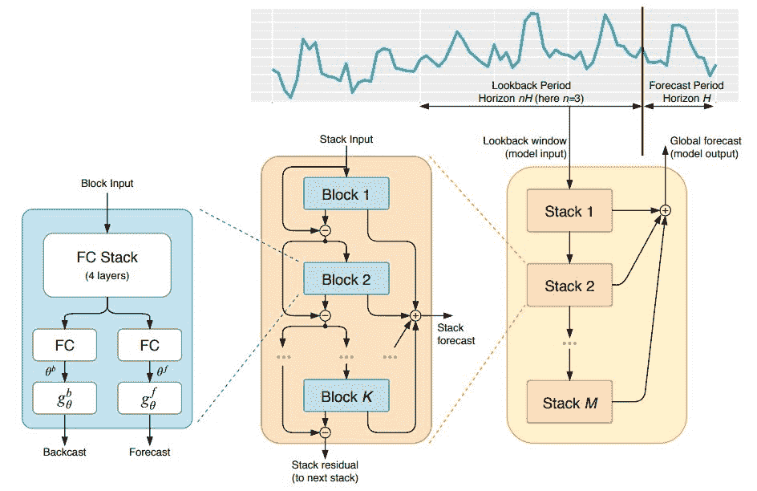

以上就是 Reddit 上用户分享的 2019 年机器学习精选论文，大家可以**复制链接在浏览器打开**查看。

*AI学习路线和优质资源，在后台回复"AI"获取*

