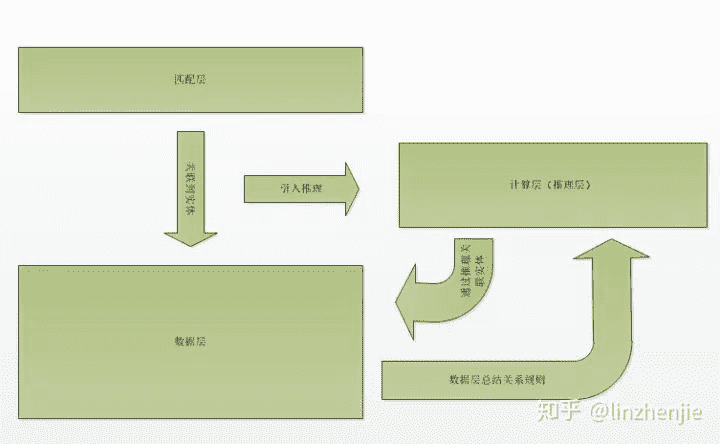
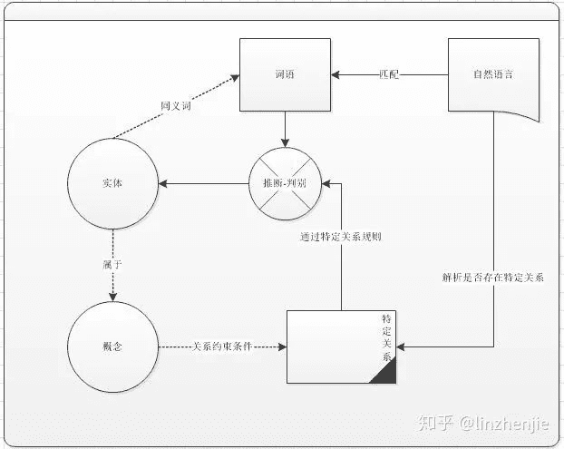
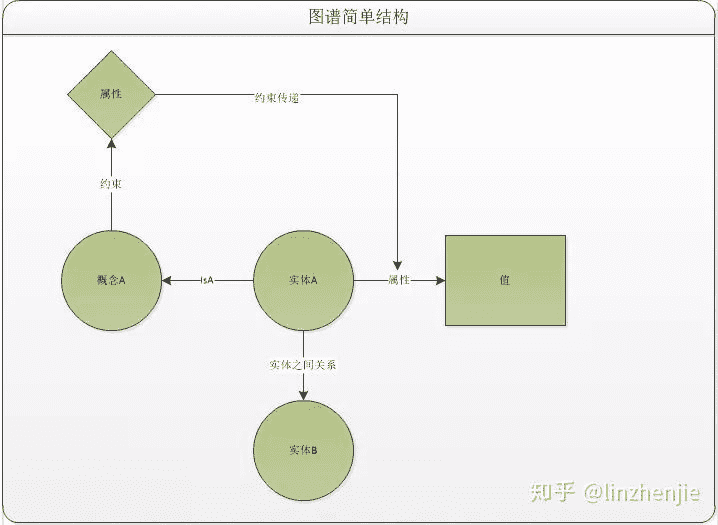

作者：cavities

来源：https://zhuanlan.zhihu.com/p/62824358

编辑：happyGirl

简要说明一下，搞了知识图谱架构一年半，快两年的一些小心得，后续不定期更新其他内容；写的时候发现要描述和声明的东西不要太多，偷懒写个概述；

如何理解知识图谱

## 什么是知识？

百度：知识是符合文明方向的，人类对物质世界以及精神世界探索的结果总和。

通常我们认为的知识，是我们在实践中对于认识客观世界的成果，其中包括诸多，如事实、信息描述、实践技能、归纳总结的客观规律，发现论证的推导。知识也可以看成是构成人类智慧的最根本因素。但是这是全人类知识的概述，不同于个人理解的知识，不同于知识图谱中的知识，也就是本文中所阐述的“知识”是狭义上的知识。因为知识是狭义的，所以我们更需要去界定什么样的“知识”是我们所需要的，通常对于我们来说，我们需要构建知识图谱的知识，是需要根据业务来确定，我们需要它来支撑什么样的业务，根据业务性质来确定需要总结的知识。

## 什么是图谱？

对于图谱我们可以稍微咬文嚼字，graph 即图，而我们称之为图谱，那么何所谓图？，图是知识的表述形式，图包含两个部分：1、节点（node），节点即知识；2、边（edge）,边即关系；即以图的形式来保存知识。那何所谓谱，我们知道家谱，菜谱，食谱，那谱的意思即按照事物的类别、系统制表，也就是说图谱，不但需要能够以图的方式，结构化地表述知识，还需要对知识进行类别分类，归纳总结。

## 知识图谱概述

根据知识和图谱的阐述，知识图谱的概念也明确了起来，即：整理总结业务中的知识，并建立这些知识之间的关联关系，最后以图的方式将其保存出来，并对这些知识进行分类，归纳和总结。

## 关于图谱分层

我们一般将知识分成两个部分，一部分是 **概念** （concept），一部分是 **实体**（entity），对于概念部分，我们更关注概念之间的关系，概念和实体的关系，而通常概念相对实体来说是非常少的，基本手工就能够维护，而实体部分我们更关注，实体的属性值，实体和实体之间的关系，但是概念也是实体，是一种特殊的标定的实体；所以针对知识的关注点，我们将知识分成实体层，和概念层；

在实际使用知识图谱过程中，会根据业务以及图谱特性对图谱进行更加细致的分层；可以根据使用划分，根据业务形态划分，根据数据形态划分，亦或根据图谱使用场景进行分层，图谱的分层是复合的，我们需要根据具体情况来对图谱抽象和定义；

举个栗子：

根据使用情况划分，我们能分成：匹配层（match layer）,数据层（triple layer），计算层（inference layer）;

关于 **匹配层**，也就是在业务使用过程中使用将自然语言数据，或者外部关系数据，转化匹配到对应的实体，我们称之为匹配层，这一层的任务主要是做匹配，至于匹配的方式，有可能是规则，也可以是词，也可以是模型，而在数据层面，这一层通常是：【实体】&【同义词】；【实体】&【相关词】；【实体】&【别称】；【实体】&【匹配规则元语】；在数据层面，图谱会存储实体和各种入口的关系，但是核心目的是为了对接外部数据关联到图谱实体。

关于 **数据层**，这一层也就是我们常说的三元组数据，三元组中记录实体和实体，实体和值的关系，一种情况：【姚明】-<职业>-【篮球运动员】，其中【姚明】和【篮球运动员】都是实体，另外一种情况【姚明】-<身高>-【2米26】,这其中【2米26】就是属于属性值，属性值和实体最主要区别是，属性值它不会再指向其他实体，类似于树节点上的叶子节点；我们为了方便定义通常会将值表和实体表分开存储；对于数据层，实际上就是知识图谱的核心层，也是只是图谱的数据基础。换一种说法，我们通常对实体进行描述，假设我们将某个实体的释义给mask，那么我们怎么能猜出这个实体是什么？，一方面我们定义实体的内涵，通过这些内涵来猜测这个实体，所谓内涵就是这个实体的内部含义，比如【姚明】的【身高】，【体重】等这一些实体的内部性质，我们称之为【**内涵** 】，内涵大部分都会以属性- 值的方式存储，也就是如果我们不断完善一个实体的属性值，那么我们就能比较容易的猜出这个东西是什么，毕竟内涵即对一个事物最直接的数据描述。另外一方面，我们可以通过外延来猜出评估出一个实体，所谓外延，便是这个实体和外界其他实体之间的关系，例如：果树- 果实-？，亚当- 曾经吃过-？，通过这两条信息我们也能很快猜出这个？是表示苹果。当然无论是外延还是内涵，其实都是用来对一个实体进行描述，如果一个实体没有任何描述它的关系，那么这个实体就毫无意义，不但是我们没有办法找到它，也没有办法使用和理解它，从计算机角度来说，更是它只是孤立的符号。

关于 **计算层，** 这一层比较特殊，因为它时不必须的，其实我定义计算层英文名为（inference layer）主要是因为这一层有对于推断推导有很大影响，首先我们需要理解，我们为什么需要inference layer。实际上如果我们的数据足够丰富，也就是说我们有足够丰富的知识，那么我们就不需要inference layer，例如：父亲的父亲是爷爷，如果在任务关系中存储了爷爷的关系，那么我们可以直接通过数据查到，也就不需要去做inference layer，但是实际上我们不可能将所有关系存储下来，而且有很多知识实际上是通用的，如果我们都存储的话，势必造成数据成倍的增加，实体和实体的笛卡尔积，想想就头皮发麻，这些还不包含实体的属性值；inference layer 很大一部分作用，是为了尽可能减少存储，减少冗余，如果当前业务还不需要那么大数据来支撑，其实这一层就有点鸡肋。毕竟这一层的维护也是非常痛苦的。对于这一层，我们需要记录怎么样数据？通常来讲，这一层我们会存储类型实体的schema，也就是定义 【type-entity】-【edge】之间的关联，也就是这个类型的实体和这个关系之间的约束条件，这一层会和匹配层做交叉，因为这一层可以定义图谱的数据入口；

总之，我们要让图谱能够work，那么

1、首先需要定义实体；

2、立外部数据和图谱关联的媒介层；

3、关联到图谱之后，决定进行的操作

在很多知识图谱的范式，例如RDF，OWL其实都是一种对图谱的表达，只不过它们也离不开这三个东西，例如RDF的各种描述，资源，实际上是定义实体的步骤；NER亦或者是通过同义词匹配获得还是其他方式，都是外部数据提供和实体联系的桥梁，而路由，图查询，逻辑规则，这些则是图谱如何对外部进行反馈的方式。但是其核心是不会改变的，既然如此，如果资源有限，我们肯定是从简单到复杂，从核心到整个图谱，一步一步地去完善图谱，后续我会给大家具体介绍和拆解，如果构建知识图谱，到最后使用这个知识图谱与某一项或者某几项业务的具体实施。

针对常见几个问题做解答：

## 1、图数据库是必须的么？

图数据库不是必须的，就查询型性能来说，关系型数据库完爆图数据库，并且对于full-search来说，elasticsearch or solr 等搜索引擎又完爆图数据库，但是图数据也有好处就是提供了一个比较严禁和完善的知识图谱体系架构，从实体到概念，从概念到本体，各种schema定义清晰，一阶逻辑规则嵌入，如果对知识图谱不是很理解，可以尝试使用图数据库，但是缺点是容易被框架束缚，对于各种实体定义是很花时间的，如果只作为核心的推理层，还是能接受的。前期在业务上实际上是不推荐使用的。基本上我认识的几个做知识图谱的朋友都不推荐使用图数据库。另外还是想吐槽一个这个恶心的owl2是怎么回事？到底谁还在整它。

## 2、NER模型重要么？什么情况使用NER模型？用在什么地方？

NER重要么？我肯定会回答看场景（屁话，和没说一样）；

其实在NLP很多场景都会使用NER相关模型，这种模型通常使用的label都是各种BEMS + TYPE 的标注，大家去网上找找 CRF-LSTM 之类的模型，观察下它们的tag实际上就知道了，NER模型是为了能很清楚指出文本之中所出现的实体，当实体数量非常多，并且实体大多数都是可数的几个明确的类型，那我们实际上推荐使用NER模型的，并且几万条数据的标注，对于实体识别来说就能有很好的效果。有一些情况NER模型就效果很不好，比如：

1、比如类型模糊不清，多类型，类型边界不清晰【人都很难判断何况是人】特别是上下文特征不明显的情况下；训练的效果都很差，这个是属于定义和标注的问题了，在这块没有特别明确情况下用NER模型通常都不会有太好效果，而知识图谱这货就是对定义、对理解特别依赖的东西。

2、实体数量少，花样少（可能才几千台我特闷标注了几万条就为了识别这几千条，在规则能很快穷举的情况下【这特么是废话】，这个主要是成本问题，抛开成本谈知识图谱都是虾扯蛋）；

3、还有就是冷启动的情况下（没钱怎么办，没钱有没钱的办法，用网上的语聊数据想要取得很好的效果？也就实体是人名，地名，职业，疾病，这几个比较通用的实体，其他的实体麻，没钱有没钱的办法）；

4、系统不完善hold没有规则完善，流程没弄清楚的情况，不建议花时间搞NER；

扯远了，不过NER是有钱人玩的，倒是说得不错。NER用途最主要还是用于图谱和外部的媒介（用在其他业务里也不反对，发现新的实体）。

## 3、除了NER我们还有哪些能够关联实体的方式？

主流除了NER，找出实体的还有两种方式

1、搜索引擎，这个就不用讲了，elasticsearch的DSL 直接查 label，同义词，desc，就能拿到一堆候选集合，然后我们只要建立一个模型，判断候选集是不是在文本中出现，做一个rerank，基本就能拿到挺好的结果。

2、字符匹配，这个依赖是我们有完善的同义词词关系，然后也可以搞个模型，把实体的特征和文本的特征一拼接，让模型判断是不是 文本中存在这个实体，偷懒的方式就是只要匹配到关键词，就算命中这个实体，最好是要分词了，没有也没关系，加一个同义词就能匹配上了，可能会有歧义，那实际上是看对实体的类型划分，划分明确的话，模型还是可以判断的出来的，这个时候最好的办法还是呼叫人工，呼叫运营小姐姐来帮忙解决问题。

这些都是在你有了一个还马马虎虎过得去的图谱的情况下，没有这些资源的情况怎么办？NER模型能帮助我们发现一些实体，最终这个是需要人工处理。

## 4、知识图谱人工的占比是？

只能说知识图谱要搞起来，首先需要明白什么是知识，知识肯定是我们确认过的东西，随随便便自动化的数据，当然不能录入到图谱当中，不然怎么叫做知识？自动化知识图谱能干啥？我觉得除了当成embeding特征外，自动化的图谱能干的事情太少了。所以知识图谱的人工占比大概是80%这个样子。因为大量数据要入库都需要审核，一个好的后台管理工具和能够迭代的一系列算法份外重要。

## 5、知识图谱实体来源？

这个很重要，实体的来源首先是靠业务定义，其次很大部分是靠爬虫（偷？爬虫的事情能叫偷么？），通过爬虫去爬去行业的百科网站，其三产品搜索引擎这块能去总结总结。可以去找海量数据，然后NER模型去跑一遍，最后丢给运营处理【运营小姐姐会因为大量数据需要审核而拿刀追着我跑】，所以怎么个优先级，其实大家心里清楚。

## 6、搞一个知识图谱大概要多少人？

我估摸，至少有一个后台开发，一个好的前端，一个懂知识图谱的产品设计后台和数据架构，运营是必须的，但是人不能太多，太多人一些细节的地方会协调困难，2~5个人。一个爬虫厉害的，然后一个到两个可以搞搞算法，算下来怎么也得10个人，这个是针对稍微中型点的项目来讲，如果没啥时间限制，实体又少，那一两个人就差不多搞定了，也不必搞什么复杂的后台运营和维护界面。

## 7、知识图谱能运用什么样的场景？

这个实际上就靠脑洞了，还有业务需求了，因为很多东西不用知识图谱也能做，用知识图谱来做的主要是，知识数据，记录在库里，看着舒心，有理有据。比如用在百科知识里，提供一个知识查看的产品，就像知识卡片一样，比如搜索引擎，把关联的知识组合在一起，专门做同义词对齐，用于提高召回率，再比如QA问答里，解决Question和Answer函数空间不对齐的GAP，又比如，应用在安全领域，规则图谱，用来判断黑客入侵和封装黑客的行为......真是数不胜数，甚至可以用在企业人才管理方面，用在企业知识库知识沉淀方向，这个其实很自由，知识图谱只是知识的一种表达，它提供的是一种和数据驱动不同的方式，叫知识驱动，这些理念可以不断延伸。很多场景不用图谱也能搞，最终搞不搞呢？我觉得一方面看决心，另一方面可以看是不是已有的解决方案都不能满足，那可以用知识图谱尝试一下。

## 8、知识图谱最大的问题是什么？

成本是最大的问题（废话）。就拿简单的说，google搞知识图谱的成本是一条三元组0.8美分【道听途说】，听说花了几个亿在上面，我只想说土豪，请和我做朋友。对于普通项目来说，想要让它搞下去，一方面要想办法落地，尽快转化出价值，另一方面要考虑怎么降低它的成本，高大上的模型固然帅气，BERT帅气，单卡10s predict 的一条数据结果，真是难以承受。也许还等不到图谱成型，项目就狗带了，尽量避免一点nlp基本知识都没有的小朋友搞知识图谱- 有钱就不在乎了，最后一点就是，针对入口开始整图谱，不失为一个好方法。

下面绘制几张图帮助理解；

*AI学习路线和优质资源，在后台回复"AI"获取*

