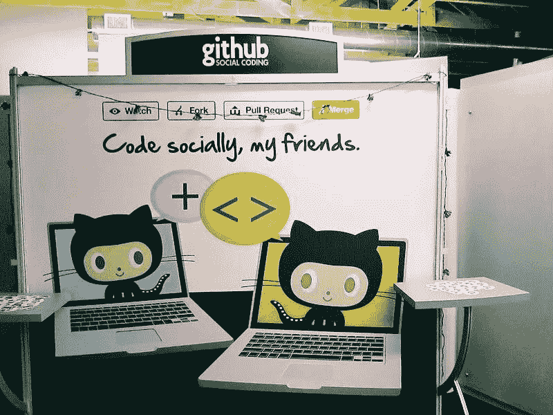

选自知乎

**机器之心报道**

> 陈天奇、李沐、贾扬清、老师木等人如何看待国内开源现状？这篇文章也许能为 AI 社区的开发者们提供洞见。

近年来，「开源」成为了国内科技公司对外传播技术实力的热门词汇。特别是在人工智能领域，开源成为了技术社区高频词汇。

近日，在阿里开源十年之际，阿里技术副总裁贾扬清发文小结了[自己的开源观念以及阿里十年开源历程](https://mp.weixin.qq.com/s?__biz=MzA4NjI4MzM4MQ%3D%3D&idx=1&mid=2660202461&scene=21&sn=a9df116b0741102bd37da307c458d60e#wechat_redirect)。在文章中，贾扬清表示，「当我们回想起为什么做开源的时候，也许理由都没有那么的高大上：也许就是单纯想分享一下代码，也许就是觉得社区很有意思，甚至也许不知道什么原因，代码放出去了，有人用了，于是我们开始开心地找同路人。逐渐地，我们发现，开源变成了我们的一个共同的信仰：我们喜欢它，我们用心呵护它，然后我们希望更多的人加入一起培养它。」

相关知乎话题《如何看待近几年国内开源的现状？你是如何理解开源的？》也成为了知乎上的热门帖子。

贾扬清在 AI 开源社区有极大的影响力。在 UC Berkeley 读博期间，他就开始接触深度学习，并开源了深度学习框架 Caffe。博士毕业后，贾扬清加入谷歌大脑担任研究科学家，参与了谷歌开源框架 TensorFlow 的开发。而后在 Facebook 任职期间，他领导了很多优秀的工作，包括 2016 到 2017 年主要开发的 Caffe2、2017 年创建的神经网络通用交换格式 ONNX，以及 2018 年联合领导的 PyTorch 1.0 项目。

除了贾扬清，在此话题下，亚马逊 AWS 首席科学家/MXNet 作者李沐，XGBoost、TVM 等知名机器学习工具作者陈天奇、一流科技创始人袁进辉（老师木）等都回答了此问题，发表了对开源的看法。

在此文中，机器之心对他们的回答做了整理，希望能为 AI 社区的开发者们提供洞见。

**李沐：****开源的好与坏**

我个人历程就是从在个人主页上挂 matlap zip（鄙视链底端）→ 把源文件放到 github → 实验代码一开始就是放在 github 上 → 开发工具放 github 上 → 创建 organization 来建设社区 → 先开源代码然后再进自己公司产品。

这些年下来，感觉开源同闭源比有两个主要好处：

*   新特性新模块能很快让别人用上，并得到及时反馈。反馈进而激励继续开发。相比正常每几个月发布一个版本出来，这种短时激励效果好很多。

*   开源的参与者一般比闭源项目要多。issue 上回复、相互 review 代码是程序猿的社交。我观察程序猿通常在现实世界中更闷骚一点（这里可以 at 我认识的所有给力码农），但开源上的交互能很好的满足社交需求（参见贾扬清回答结尾）。我认识一小哥就是持续几年手机一响半夜起来回 issue，从而成为大神。

（对不起各位大神，脑海中实在是赶不走下面画面）

享受便利的同时当然也得有额外付出。我觉得最大的一点是得有契约精神：我邀请你来用我新鲜出来的代码，那么我会负责回答你的问题，并帮助合并你的代码提交请求。这个也是好几个回答提到的「开源维护」。

但维护是个苦差事，很难被得到认可：

1\. 回 issue 回慢了别人觉得会怠慢。如果回答了，但人家没有关闭 issue 怎么办？放置久了就积累一大堆，造成这个项目问题多的映像。

2\. 虽然绝大部分 PR 就是改改文档语法错误，但总会有人突然提一个很大的 PR，可能从设计上就不对，或者代码品味根本不行。需要不伤人自尊的情况提出改进意见，或者让他们回炉重造。很大情况下帮别人 review 代码比自己重写花费时间多多了，而且质量可能还不见得更高。但这个不能避免，只有这样才能慢慢建设起社区。

3\. 假设社区起来了，人一多背景不同想法也多，大家意见不一致，想做大改动困难重重，从而导致最初开发者荣（沮）誉（丧）退（离）休（开）。如何维持一个活跃的开发者社区就成了一个组织上问题。当前两大组织框架是 dc 制（Linux）和民主协商制（Apache）。但绝大部分码农得重新学习和实践。

**陈天奇：****开源的三大阶段**

我还在读硕士的时候尝试的「开源」还是刀耕火种的阶段。直接在个人主页上面挂一个 zip 包，里面有一些简单的指令。软件的使用者也只包含我们实验室里面的少数几个同学。然后逐渐的学会了上 github，采用统一的代码规范，写测试，做文档和社区的小伙伴一起推动。也认识了逐渐明白了开源并非就把代码挂出来那么简单。

很多小伙伴都说的很好。我想补充一些我从开源社区中学到的几个东西：

开源的三个阶段

**1\. 开放源代码**

开放源代码也是大家所通常理解的开源。开放源代码可以给同学们提供相互交流学习的机会，也可以使得像社区的使用交流，bug report 等可以及时得到反应。从机制上，开源其实提供了一种无形的质量评价保障。评价一个工作的好坏，是骡子是马拉出来溜溜就知道了。对于普通的程序员来说，展示自己作品的一个最好让大家发掘的方式。现在的很多领域如机器学习鼓励开源也是这个道理，实验的结果直接开源复现才让大家相信。而对于整个社会来说，各种创新开放也使得技术的进步更加快速。

**2\. 开放开发**

如果说开放源代码是让把自己的软件展示出来的话。开放开发则是把一个软件变成社区的。软件不是一个固定的东西，需要维护、增加新特性、不断重构来保持它的生命力。这里面一个比较重要的问题是如何让任何一个对这个软件感兴趣的人可以参与进来。这其中包含了开放文档是否健全，改动的技术决策是否可以让开发者可以搜索获得等等，其他开发者的 pull request 是否可以被及时 review 接受等等。

不同的开源软件的开放开发程度其实也是不同的，有的软件主线的开发一直在一个内部机构，定期同步；有的会主要直接在主线开放开发等等。另外开放开发本身也并不是包含了代码实现。其实很多时候高质量的文档、code review、 社区互动等等都需要花费社区志愿者的大量精力。而只有对于这些方面都进行投入之后才会让更多的人来参与开发并且让项目更加健康地迭代下去。

**3\. 开放管理**

开放开发让大家都可以参与一个软件的开发。而开放管理则是让积极的参与者成为社区的主人。很多成功的开源软件都有比较成功的开放管理机制。对于开放管理的开源社区来说，开源软件本身像是一个股份公司，而获得股份（开发者的信任和对于项目的方向控制）的方式是参与开发。

开放的管理模式让更多的企业和高校可以共同参与开发和管理开源项目，把一个项目做的更加持久。而因为大家都可以成为开源项目的主人，也可以鼓励更多的合作。积极参与开发有贡献的个人会获得对于项目的写权限（committer）。许多成功的开源项目都才用开放管理的模式，比较著名的是 apache 模式，另外独裁模式如 python（曾经是），linux 也会有 committer 来共同管理社区。

**开源的「货币」**

开源本身是志愿行为，并没有货币交易（当然最近 github 的打赏功能把货币也加入其中），但是其中却发生了和货币一样的价值交换。开源社区的一种「货币」是时间。参与开源贡献，会有不同的社区同学帮忙代码 review 和参与讨论，这些行为都需要付出大量的时间。参与开源贡献的同学付出了自己的时间，用来交换别的开发者的时间来进行技术交流和学习。

随着时间的积累，很多时候开发者获得的另外一种「货币」是信任。一个人是否靠谱，是否愿意相信一个人的技术决策，是否可以胜任一个方向的 tech lead，这些东西都决定了一个开放开发社区里面开发者对于社区本身决策的影响能力。虽然开源可以获得不少「货币」，最重要一点，开源开发者都是带着理想和情怀投入到开发中去，而这些理想和情怀本身才是开源社区里面最重要的东西。

**代码并不是最关键的，最关键的是人**

在一开始的时候，我们会觉得开源最重要的是代码。于是很多关于开源软件的争论会集中在代码在哪里，属于谁。实际上因为大部分开源软件许可证允许任意拷贝并且授权代码里面的专利给代码使用人，代码本身在哪里并不是最关键的问题。

软件并不是一个固定不变的东西，需要有不断的升级，维护和新功能的添加。而在其中都会涉及到人—谁来做这些事情。人很多时候比代码重要。假设某一天一个开源软件的主要开发方突然宣布不再开放源代码了了，这个时候要看其他开发者可以集合起来，有能力接着前一天的分支继续进行开发和维护，那么这个软件就会依然可以被大家开发使用，甚至逐渐集合有能力的社区伙伴重构或者重写一份都不会是问题。

代码在哪里不关键，关键的是人。一个公司是否有人可以掌握开源软件本身的架构，是否有人可以对社区的方向有所影响，是否有人可以适配开源软件符合自己的需求，是否有人可以在必要的时候继续维护软件，这些才是最需要关心的问题。

活跃的开发者人群是大家使用开源软件的真正保障，也是社会得以快速创新发展的基础。

**贾扬清：****开源心态的培养**

我自己做开源其实并没有很多前辈来得久，基本上就是随着 AI 这一波，大家有个核心的痛点就是没有好的软件框架可以用（那位说下载 matlab zip 包的同学请站起来），机器学习框架如雨后春笋，大家从科研界来，自然地就把代码开放出来，包括在知乎的李沐、陈天奇等几位大牛，于是就入了门了。

入了门以后我们发现，哎还有那么多讲究，license 选什么，社区怎么交互，怎么做推广（对的开源也要做推广的），等等。逐渐了解得多了，就越来越觉得敬畏，之前以为开源就是个很酷的事情，但是后来发现其实开源背后的精神，背后的经济学，都有着很深的道理。

有兴趣的朋友可以读一读一篇非常有意思的文章，stackoverflow 的创始人写的「开源软件经济学」：https://www.joelonsoftware.com/2002/06/12/strategy-letter-v/

不过聊这个就太远了。

**我个人觉得开源是什么**

从我自己作为一个工程师的角度来说，我觉得开源是四个层面的东西：

1\. 开源是作品展。画家有画展，作家会出书，工程师想展示自己的作品，作品是什么？是代码。怎么展示？开源。

2\. 开源是技术沟通的渠道。工程师相互学习，怎么学？怎么讨论？秀代码讨论代码是最自然的途径。当然，这个是需要真心投入的，不是开出去就算了，见光死的开源不是开源。

3\. 开源是用户模式的迭代。开源的好处是，用户的尝试意愿高，对于 bug 的容忍度好（虽然也不是无限的），因此可以很快迭代出适合新的需求的设计。AI 框架就是一个很好的例子。

4\. 开源是新商业。在商言商，我觉得开源和商业是不矛盾的。和开源非常共生的一个词语是开放生态 - 操作系统，云原生，各种开放标准，大大降低了软件开发、软件生态对接的难度。蛋糕做大了，挖掘出更多的价值，大家都开心，同时也更愿意反哺开源社区发展。

**国内的开源现状怎么样？**

从一个开源开发者开始，到逐渐考虑管理挑战的时候，我问我自己一个问题：人有了，知识有了，意愿有了，缺什么？

缺组织保障。

这听着是个很像宣传部写出来的词语，你先别笑，我来列一下理由。开源项目要托管，要做 CI，要做 bug tracking，要定期举行社区活动，怎么有效运转？这个需要做。开源项目多了，怎么有正常的法务 CLA 流程（CLA 其实是保护开发者的），这个需要做。很多公司开源项目都是见光死，这个阿里也有，大家为了晋升而开源，导致质量堪忧，怎么解？要建立内部孵化器机制，开源项目准入机制，开源项目关停并转机制，这些都是很重要的事情。

举个例子，我组里的一位小姑娘办今年的 Flink Forward 大会，最忙的时候在朋友圈抱怨说，气得大半夜睡不着抹眼泪，一天被几拨人喷，但是事情还得推。这事情让我看到，一方面，开源是热情驱动的，但是另一方面，我们绝对不能饿死雷锋。所以一定要有体系化的能力沉淀，有很好的流程，把大家做开源的阻力做到最小。她和她的团队今年主办 Flink Forward Asia，请了头条，快手，Intel，Bilibili，360，滴滴，等一系列社区当中的优秀公司和优秀开发者，办成了一个两千多人的盛会，非常成功，非常不容易。

当然，我们要说，组织保障是保障我们开发者和开源项目，不是给公司吹牛。我们开源委员会考核自己，是以我们开源项目社区的活跃度，健康度，我们做开源的技术团队对于项目的支持程度，这些来考核的。这个初心不会变。

我们要治理什么问题？

phodal 的回答一语中的。阿里有没有他提到的这些问题？有，而且很严重，内部讨论的时候我还能举出更多例子。不过我们想不想做好开源？想。解决问题的第一步就是认识问题，所以我们很感谢这些对国内开源社区爱之深责之切的朋友们。

**不吐不快的部分**

说了好的，我还想说一句不好的。开源不是「我的开源 vs 你的开源」。这个是我看到国内经常容易出现的一个问题。开源代码本身是没有国界的，什么有国界？专家有国界。人才有国界。我们不能因为要培养我们自己的人才，就把开源代码本身给挡在外面，自己造轮子了。

举个 AI 框架的例子。偶尔会听见人说「AI 框架都是美国人做的」。这句话我很费解。非常多的优秀的 AI 工程师，设计 AI 框架的工程师，都是华人。不说远的，最近非常有潜力的 AI 编译框架 TVM，作者是陈天奇，不能说是美国人吧。TensorFlow 和 PyTorch 的代码都放在 github 上，全世界都是一套，欧洲人为什么没有说不是欧洲的呢？

开源代码本身没有国界。通过狭隘的国界区分，然后划江而治，恰恰会对咱们的开源建设起到反效果。我们要培养的，是我们国内开源的精神，和全球的开源社区互动的能力，和开源的项目、开源的基金会，深入共建的能力，进而最终形成我们在全球开源社区当中的影响力。不是在已有的技术体系里面搞一个我们的开源，是投入到开源社区和项目当中去，打出我们的技术深度和领导力来。

**开源最后还是心态的培养**

其实我觉得国内最近几年，最让我感到惊喜的就是，开源开放变得非常容易为人所接受了——20 年前知道 sourceforge 的工程师，和现在知道 github 的工程师，绝对数量和相对数量上都不可同日而语。相应地，我在工作当中遇到了非常多热心开源，一起建设开源的朋友们。

我自己现在编程少了，有时候想起来还挺伤心的。所以偶尔周末晚上了没事捣鼓捣鼓代码，放松一下发个 PR（是 pull request），还是个挺甜蜜的事情。

**袁进辉（老师木）：****开源成就程序员时代**

近些年国内开源发展很快，表现在：1，国内的产业和工程师从开源获益非常大，工程师的整体水平和国外水平差距越来越小；一部分国内顶尖的工程师在一些影响力大的项目中有突出贡献，有一定的话语权甚至主导权；2，出现了一些植根于国内，在国际上有一定影响力的项目。

国内外的差距也是比较明显的：领军人物和明星项目与国外相比，还是太少。

其它答主对开源的总结已经非常全面，补充一些不太被提到的观点：

0\. 讨论时可以区分作为爱好的开源，和带有商业目的的开源，以下观点是针对后面带有商业目的的开源而言。

1\. 开源是手段，不是目的（很多人都说过了），如果目的是研发更好的产品，开源更多是触达客户的手段，而不一定是研发更好产品的好办法。有些工程复杂性非常高的产品，在初始阶段开源不一定能从社区得到帮助，只有当工程底座比较稳固了，再开源，打磨/反馈/推广阶段或许能通过开源获取很多帮助。（想引用一下人月神话的观点，外科手术团队模式，去中心化、民主不一定有助于高质量研发）。

2\. 开源精神必须有「利益回报」才能持久，小到个人的成就感，名声，职场好的职位，大到主导开源产品的企业取得商业化成功。除非一个项目单枪匹马能搞定，大的项目在合作机制、利益分配机制上一定要合理，团队才能长久。一个创造了价值的开源项目，最好取得好的商业回报，无论是通过咨询，授权，订阅还是云服务。

3\. 开源开启了「程序员」时代，如果说互联网和移动互联网时代是「产品经理」的时代，能打造出爆款产品的产品经理更可能成就一番事业，开源时代，程序员有望凭借自己的本领撬动世界，只要确实打造出了有价值的项目，在开源社区这样一个「价值筛选器」中就能脱颖而出，获得名声和利益，如果运作成功，有望成就伟大的商业。

*原文链接：**https://www.zhihu.com/question/366370371*

*AI学习路线和优质资源，在后台回复"AI"获取*

