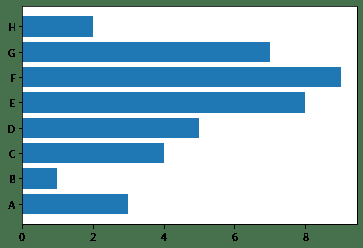
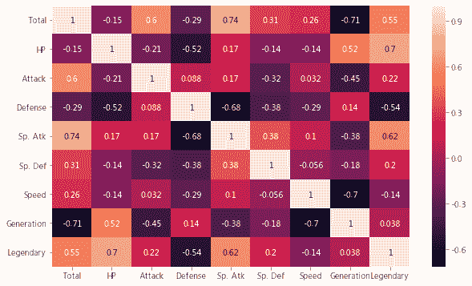

Datawhale

**Datawhale，和鲸社区编辑**

Matplotlib 是 Python 的绘图库。它可与 NumPy 一起使用，提供了一种有效的 MatLab 开源替代方案，也可以和图形工具包一起使用。和Pandas、Numpy并称为数据分析三兄弟。友情提示：代码虽好，自己动手才算学到。

### 导入

### 1.导入 matplotlib 库简写为 plt

```
import matplotlib.pyplot as plt 
```

### 基本图表

### 2.用 plot 方法画出 x=(0,10)间 sin 的图像 3.用点加线的方式画出 x=(0,10)间 sin 的图像 4.用 scatter 方法画出 x=(0,10)间 sin 的点图像 5.用饼图的面积及颜色展示一组 4 维数据 6.绘制一组误差为 ±0.8 的数据的误差条图 7.绘制一个柱状图 8.绘制一个水平方向柱状图

```
x = np.linspace(0, 10, 30)
plt.plot(x, np.sin(x)); 
```


```
plt.plot(x, np.sin(x), '-o'); 
```


```
plt.scatter(x, np.sin(x)); 
```


```
rng = np.random.RandomState(0)
x = rng.randn(100)
y = rng.randn(100)
colors = rng.rand(100)
sizes = 1000 * rng.rand(100)

plt.scatter(x, y, c=colors, s=sizes, alpha=0.3,
            cmap='viridis')
plt.colorbar(); # 展示色阶 
```


```
x = np.linspace(0, 10, 50)
dy = 0.8
y = np.sin(x) + dy * np.random.randn(50)

plt.errorbar(x, y, yerr=dy, fmt='.k') 
```


```
x = [1,2,3,4,5,6,7,8]
y = [3,1,4,5,8,9,7,2]
label=['A','B','C','D','E','F','G','H']

plt.bar(x,y,tick_label = label); 
```


```
x = [1,2,3,4,5,6,7,8]
y = [3,1,4,5,8,9,7,2]
label=['A','B','C','D','E','F','G','H']

plt.barh(x,y,tick_label = label); 
```



### 9.绘制 1000 个随机值的直方图 10.设置直方图分 30 个 bins，并设置为频率分布 11.在一张图中绘制 3 组不同的直方图，并设置透明度 12.绘制一张二维直方图 13.绘制一张设置网格大小为 30 的六角形直方图

```
data = np.random.randn(1000)
plt.hist(data); 
```


```
plt.hist(data, bins=30,histtype='stepfilled', density=True)
plt.show(); 
```


```
x1 = np.random.normal(0, 0.8, 1000)
x2 = np.random.normal(-2, 1, 1000)
x3 = np.random.normal(3, 2, 1000)

kwargs = dict(alpha=0.3, bins=40, density = True)

plt.hist(x1, **kwargs);
plt.hist(x2, **kwargs);
plt.hist(x3, **kwargs); 
```


```
mean = [0, 0]
cov = [[1, 1], [1, 2]]
x, y = np.random.multivariate_normal(mean, cov, 10000).T
plt.hist2d(x, y, bins=30); 
```


```
plt.hexbin(x, y, gridsize=30); 
```


### 自定义图表元素

### 14.绘制 x=(0,10)间 sin 的图像，设置线性为虚线 15 设置 y 轴显示范围为(-1.5,1.5) 16.设置 x,y 轴标签 variable x，value y 17.设置图表标题“三角函数” 18.显示网格 19.绘制平行于 x 轴 y=0.8 的水平参考线 20.绘制垂直于 x 轴 x<4 and x>6 的参考区域，以及 y 轴 y<0.2 and y>-0.2 的参考区域 21.添加注释文字 sin(x) 22.用箭头标出第一个峰值

```
x = np.linspace(0,10,100)
plt.plot(x,np.sin(x),'--'); 
```


```
x = np.linspace(0,10,100)
plt.plot(x,np.sin(x))
plt.ylim(-1.5,1.5); 
```


```
x = np.linspace(0.05, 10, 100)
y = np.sin(x)
plt.plot(x, y, label='sin(x)')
plt.xlabel('variable x');
plt.ylabel('value y'); 
```


```
x = np.linspace(0.05, 10, 100)
y = np.sin(x)
plt.plot(x, y, label='sin(x)')
plt.title('三角函数'); 
```


```
x = np.linspace(0.05, 10, 100)
y = np.sin(x)
plt.plot(x, y)
plt.grid() 
```


```
x = np.linspace(0.05, 10, 100)
y = np.sin(x)
plt.plot(x, y)
plt.axhline(y=0.8, ls='--', c='r') 
```


```
x = np.linspace(0.05, 10, 100)
y = np.sin(x)
plt.plot(x, y)
plt.axvspan(xmin=4, xmax=6, facecolor='r', alpha=0.3) # 垂直x轴
plt.axhspan(ymin=-0.2, ymax=0.2, facecolor='y', alpha=0.3);  # 垂直y轴 
```


```
x = np.linspace(0.05, 10, 100)
y = np.sin(x)
plt.plot(x, y)
plt.text(3.2, 0, 'sin(x)', weight='bold', color='r'); 
```


```
x = np.linspace(0.05, 10, 100)
y = np.sin(x)
plt.plot(x, y)
plt.annotate('maximum',xy=(np.pi/2, 1),xytext=(np.pi/2+1, 1),
             weight='bold',
             color='r',
             arrowprops=dict(arrowstyle='->', connectionstyle='arc3', color='r')); 
```


### 自定义图例

### 23.在一张图里绘制 sin,cos 的图形，并展示图例 24.调整图例在左上角展示，且不显示边框 25.调整图例在画面下方居中展示，且分成 2 列 26.绘制 sin(x),sin(x+π/2),sin(x+π)的图像，并只显示前 2 者的图例 27.将图例分不同的区域展示

```
x = np.linspace(0, 10, 1000)
fig, ax = plt.subplots()

ax.plot(x, np.sin(x), label='sin')
ax.plot(x, np.cos(x), '--', label='cos')
ax.legend(); 
```


```
ax.legend(loc='upper left', frameon=False);
fig 
```


```
ax.legend(frameon=False, loc='lower center', ncol=2)
fig 
```


```
y = np.sin(x[:, np.newaxis] + np.pi * np.arange(0, 2, 0.5))
lines = plt.plot(x, y)

# lines 是 plt.Line2D 类型的实例的列表
plt.legend(lines[:2], ['first', 'second']);

# 第二个方法
#plt.plot(x, y[:, 0], label='first')
#plt.plot(x, y[:, 1], label='second')
#plt.plot(x, y[:, 2:])
#plt.legend(framealpha=1, frameon=True); 
```


```
fig, ax = plt.subplots()

lines = []
styles = ['-', '--', '-.', ':']
x = np.linspace(0, 10, 1000)

for i in range(4):
    lines += ax.plot(x, np.sin(x - i * np.pi / 2),styles[i], color='black')
ax.axis('equal')

# 设置第一组标签
ax.legend(lines[:2], ['line A', 'line B'],
          loc='upper right', frameon=False)

# 创建第二组标签
from matplotlib.legend import Legend
leg = Legend(ax, lines[2:], ['line C', 'line D'],
             loc='lower right', frameon=False)
ax.add_artist(leg); 
```


### 自定义色阶

### 28.展示色阶 29.改变配色为'gray' 30.将色阶分成 6 个离散值显示

```
x = np.linspace(0, 10, 1000)
I = np.sin(x) * np.cos(x[:, np.newaxis])

plt.imshow(I)
plt.colorbar(); 
```


```
plt.imshow(I, cmap='gray'); 
```


```
plt.imshow(I, cmap=plt.cm.get_cmap('Blues', 6))
plt.colorbar()
plt.clim(-1, 1); 
```


### 多子图

### 31.在一个 1010 的画布中，(0.65,0.65)的位置创建一个 0.20.2 的子图 32.在 2 个子图中，显示 sin(x)和 cos(x)的图像 33.用 for 创建 6 个子图，并且在图中标识出对应的子图坐标 34.设置相同行和列共享 x,y 轴 35.用[]的方式取出每个子图，并添加子图座标文字 36.组合绘制大小不同的子图，样式如下


### 37.显示一组二维数据的频度分布，并分别在 x,y 轴上，显示该维度的数据的频度分布

```
ax1 = plt.axes()
ax2 = plt.axes([0.65, 0.65, 0.2, 0.2]) 
```


```
fig = plt.figure()
ax1 = fig.add_axes([0.1, 0.5, 0.8, 0.4], ylim=(-1.2, 1.2))
ax2 = fig.add_axes([0.1, 0.1, 0.8, 0.4], ylim=(-1.2, 1.2))

x = np.linspace(0, 10)
ax1.plot(np.sin(x));
ax2.plot(np.cos(x)); 
```


```
for i in range(1, 7):
    plt.subplot(2, 3, i)
    plt.text(0.5, 0.5, str((2, 3, i)),fontsize=18, ha='center')

# 方法二
# fig = plt.figure()
# fig.subplots_adjust(hspace=0.4, wspace=0.4)
# for i in range(1, 7):
#     ax = fig.add_subplot(2, 3, i)
#     ax.text(0.5, 0.5, str((2, 3, i)),fontsize=18, ha='center') 
```


```
fig, ax = plt.subplots(2, 3, sharex='col', sharey='row') 
```


```
for i in range(2):
    for j in range(3):
        ax[i, j].text(0.5, 0.5, str((i, j)),fontsize=18, ha='center')
fig 
```


```
grid = plt.GridSpec(2, 3, wspace=0.4, hspace=0.3)
plt.subplot(grid[0, 0])
plt.subplot(grid[0, 1:])
plt.subplot(grid[1, :2])
plt.subplot(grid[1, 2]); 
```


```
mean = [0, 0]
cov = [[1, 1], [1, 2]]
x, y = np.random.multivariate_normal(mean, cov, 3000).T

# Set up the axes with gridspec
fig = plt.figure(figsize=(6, 6))
grid = plt.GridSpec(4, 4, hspace=0.2, wspace=0.2)
main_ax = fig.add_subplot(grid[:-1, 1:])
y_hist = fig.add_subplot(grid[:-1, 0], xticklabels=[], sharey=main_ax)
x_hist = fig.add_subplot(grid[-1, 1:], yticklabels=[], sharex=main_ax)

# scatter points on the main axes
main_ax.scatter(x, y,s=3,alpha=0.2)

# histogram on the attached axes
x_hist.hist(x, 40, histtype='stepfilled',
            orientation='vertical')
x_hist.invert_yaxis()

y_hist.hist(y, 40, histtype='stepfilled',
            orientation='horizontal')
y_hist.invert_xaxis() 
```


### 三维图像

### 38.创建一个三维画布 39.绘制一个三维螺旋线 40.绘制一组三维点

```
from mpl_toolkits import mplot3d
fig = plt.figure()
ax = plt.axes(projection='3d') 
```


```
ax = plt.axes(projection='3d')

# Data for a three-dimensional line
zline = np.linspace(0, 15, 1000)
xline = np.sin(zline)
yline = np.cos(zline)
ax.plot3D(xline, yline, zline); 
```


```
ax = plt.axes(projection='3d')
zdata = 15 * np.random.random(100)
xdata = np.sin(zdata) + 0.1 * np.random.randn(100)
ydata = np.cos(zdata) + 0.1 * np.random.randn(100)
ax.scatter3D(xdata, ydata, zdata, c=zdata, cmap='Greens'); 
```


### 宝可梦数据集可视化

### 41.展示前 5 个宝可梦的 Defense,Attack,HP 的堆积条形图 42.展示前 5 个宝可梦的 Attack,HP 的簇状条形图 43.展示前 5 个宝可梦的 Defense,Attack,HP 的堆积图 44.公用 x 轴，展示前 5 个宝可梦的 Defense,Attack,HP 的折线图 45.展示前 15 个宝可梦的 Attack,HP 的折线图 46.用 scatter 的 x,y,c 属性，展示所有宝可梦的 Defense,Attack,HP 数据 47.展示所有宝可梦的攻击力的分布，bins=10 48.展示所有宝可梦 Type 1 的饼图 49.展示所有宝可梦 Type 1 的柱状图 50.展示综合评分最高的 10 只宝可梦的系数间的相关系数矩阵

```
import pandas as pd
df = pd.read_csv('/home/kesci/input/pokemon2846/Pokemon.csv')
df.head()

plt.style.use('ggplot')

pokemon = df['Name'][:5]
hp = df['HP'][:5]
attack = df['Attack'][:5]
defense = df['Defense'][:5]
ind = [x for x, _ in enumerate(pokemon)]

plt.figure(figsize=(10,10))
plt.bar(ind, defense, width=0.8, label='Defense', color='blue', bottom=attack+hp)
plt.bar(ind, attack, width=0.8, label='Attack', color='gold', bottom=hp)
plt.bar(ind, hp, width=0.8, label='Hp', color='red')

plt.xticks(ind, pokemon)
plt.ylabel("Value")
plt.xlabel("Pokemon")
plt.legend(loc="upper right")
plt.title("5 Pokemon Defense & Attack & Hp")

plt.show() 
```


```
N = 5
pokemon_hp = df['HP'][:5]
pokemon_attack = df['Attack'][:5]

ind = np.arange(N)
width = 0.35
plt.bar(ind, pokemon_hp, width, label='HP')
plt.bar(ind + width, pokemon_attack, width,label='Attack')

plt.ylabel('Values')
plt.title('Pokemon Hp & Attack')

plt.xticks(ind + width / 2, (df['Name'][:5]),rotation=45)
plt.legend(loc='best')
plt.show() 
```


```
x = df['Name'][:4]
y1 = df['HP'][:4]
y2 = df['Attack'][:4]
y3 = df['Defense'][:4]

labels = ["HP ", "Attack", "Defense"]

fig, ax = plt.subplots()
ax.stackplot(x, y1, y2, y3)
ax.legend(loc='upper left', labels=labels)
plt.xticks(rotation=90)
plt.show() 
```


```
x = df['Name'][:5]
y1 = df['HP'][:5]
y2 = df['Attack'][:5]
y3 = df['Defense'][:5]

# Create two subplots sharing y axis
fig, (ax1, ax2,ax3) = plt.subplots(3, sharey=True)

ax1.plot(x, y1, 'ko-')
ax1.set(title='3 subplots', ylabel='HP')

ax2.plot(x, y2, 'r.-')
ax2.set(xlabel='Pokemon', ylabel='Attack')

ax3.plot(x, y3, ':')
ax3.set(xlabel='Pokemon', ylabel='Defense')

plt.show() 
```


```
plt.plot(df['HP'][:15], '-r',label='HP')
plt.plot(df['Attack'][:15], ':g',label='Attack')
plt.legend(); 
```


```
x = df['Attack']
y = df['Defense']
colors = df['HP']

plt.scatter(x, y, c=colors, alpha=0.5)
plt.title('Scatter plot')
plt.xlabel('HP')
plt.ylabel('Attack')
plt.colorbar(); 
```


```
x = df['Attack']
num_bins = 10
n, bins, patches = plt.hist(x, num_bins, facecolor='blue', alpha=0.5)
plt.title('Histogram')
plt.xlabel('Attack')
plt.ylabel('Value')
plt.show() 
```


```
plt.figure(1, figsize=(8,8))
df['Type 1'].value_counts().plot.pie(autopct="%1.1f%%")
plt.legend() 
```


```
ax = df['Type 1'].value_counts().plot.bar(figsize = (12,6),fontsize = 14)
ax.set_title("Pokemon Type 1 Count", fontsize = 20)
ax.set_xlabel("Pokemon Type 1", fontsize = 20)
ax.set_ylabel("Value", fontsize = 20)

plt.show() 
```


```
import seaborn as sns

top_10_pokemon=df.sort_values(by='Total',ascending=False).head(10)
corr=top_10_pokemon.corr()

fig, ax=plt.subplots(figsize=(10, 6))
sns.heatmap(corr,annot=True)
ax.set_ylim(9, 0)
plt.show() 
```



*原文地址：**https://www.kesci.com/home/project/5de9f0a0953ca8002c95d2a9*

*本文部分参考：Matplotlib Tutorial for Beginners、宝可梦数据练手*

*文中提及数据集：宝可梦属性数据集*

*AI学习路线和优质资源，在后台回复"AI"获取*

