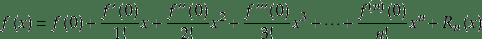
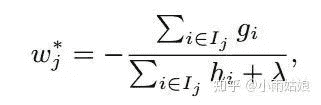

Datawhale

**作者：小雨姑娘，Datawhale成员**

事情的源头是这样的，某日我分享了一篇阿里机器学习工程师面试失败经历，其中提到了我回答关于Xgboost的部分，评论区的老哥就开始了灵魂拷问：“你真正看过Xgboost的原文吗？”哈哈哈，真让你猜中了，我这个菜逼还真没看过，所以当时答得自己像个憨比。

没关系，没看过不要紧，现在着手看就行了哈哈，就像知乎上常说的一句话，种一棵树最好的时间是十年前，其次是现在。

**未看过原文 VS 看过原文**

先复盘一下七个月前我没看过原文面试的情况：

**Q**

那像你提到有用到Xgboost，你有测试过Xgboost和GBDT的效果区别吗？你认为在你的项目上是什么原因导致了这个区别?

**答：**我们有试过，具体的效果是LightGBM大于Xgboost大于GBDT，但是具体为什么Xgboost效果比GBDT好我不知道，但是我知道LightGBM为什么好。据我所知，因为在Xgboost里面自带了对离散值的处理，所以效果会好一些

**Q**

对离散值是怎么处理的？

**答：**类似于Onehot之类的叭

**Q**

那你知道在什么情况下应该使用Onehot呢？

**答：**嗯……应该是在特征的类别比较少的时候叭，如果太多了会导致维度爆炸，就应该使用概率方法，把他转化为标签的条件概率。

**Q**

你能讲一下Xgboost和GBDT的区别吗？

**答：**Xgboost实际上是一种对GBDT的实现叭，Xgboost在建基模型树的时候，加入了正则项，相对于GBDT会控制基模型的…大小。然后Xgboost在建树的时候好像是采用了并行策略，多线程在跑。还有一点据我所知……GBDT在选择特征的时候使用的是基尼指数或者熵增之类的，而Xgboost是有优化过的。

那么如果是现在我会怎么回答呢？

**Q**

那像你提到有用到Xgboost，你有测试过Xgboost和GBDT的效果区别吗？你认为在你的项目上是什么原因导致了这个区别？

**答：**是的，我们有试过，Xgboost的精度要比GBDT高而且效率也要更高。我认为精度高的最大原因是大部分的CTR特征中，我们会将一些高基类别的离散值转化为连续值，会产生很多含有缺失值的稀疏特征，而Xgboost会对缺失值做一个特殊的处理。效率高是因为建树时采用了更好的分割点估计算法。

**Q**

对缺失值是怎么处理的？

**答：**在普通的GBDT策略中，对于缺失值的方法是先手动对缺失值进行填充，然后当做有值的特征进行处理，但是这样人工填充不一定准确，而且没有什么理论依据。而Xgboost采取的策略是先不处理那些值缺失的样本，采用那些有值的样本搞出分裂点，然后在遍历每个分裂点的时候，尝试将缺失样本划入左子树和右子树，选择使损失最优的情况。

**Q**

那你知道在什么情况下应该使用Onehot呢？

**答：**对于non-ordered特征来说需要做一个onehot，实践中我发现在线性模型中将连续值特征离散化成0/1型特征效果会更好(线性模型拟合连续特征能力弱，需要将连续特征离散化 成one hot形式提升模型的拟合能力)。所以对于稠密的类别型特征，可以对离散特征做一个OneHot变化，对于高基类别特征我们最好还是采用bin count或者embedding的方法去处理。

**Q**

你能讲一下Xgboost和GBDT的区别吗？

**答：**Xgboost是GBDT算法的一种很好的工程实现，并且在算法上做了一些优化，主要的优化在一下几点。首先Xgboost加了一个衰减因子，相当于一个学习率，可以减少加进来的树对于原模型的影响，让树的数量变得更多；其次是在原GBDT模型上加了个正则项，对于树的叶子节点的权重做了一个约束；还有增加了在随机森林上常用的col subsample的策略；然后使用二阶泰勒展开去拟合损失函数，加快优化的效率；然后最大的地方在于不需要遍历所有可能的分裂点了，它提出了一种估计分裂点的算法。在工程上做了一个算法的并发实现，具体我并不了解如何实现的。

哈哈，看过原文后对于Xgboost的理解是不是好了一些

**原文理****解**

先看第一章introduction，不需要声嘶力竭地争辩啥，只需要轻描淡写地说，没有Xgboost你们做不了数据挖掘比赛啦~

*In this paper, we describe XGBoost, a scalable machine learning system for tree boosting. The system is available as an open source package. The impact of the system has been widely recognized in a number of machine learning and data mining challenges. Take the challenges hosted by the machine learning competition site Kaggle for example. **Among the 29 challenge winning solutions 3 published at Kaggle’s blog during 2015**, 17 solutions used XGBoost. Among these solutions, eight solely used XGBoost to train the model, while most others combined XGBoost with neural nets in ensembles. For comparison, the second most popular method, deep neural nets, was used in 11 solutions. The success of the system was also witnessed in KDDCup 2015, where **XGBoost was used by every winning team in the top10**. Moreover, the winning teams reported that ensemble methods outperform a well-configured XGBoost by only a small amount.*

你看看人家的introduction，靓仔；你看看你的introduction，憨比。

有一说一，模型和算法里面用到的符号比较多，就不手打公式了，这里我就直接复制论文图片贴上去，请大家理解。之前GBDT的已经推过了，就直接从原文第2.2章开始了。

目标函数，后面那一项就是加进来的规整项。注意这是一个递归的式子，规整项仅仅是第t颗树的，具体起来就是这棵树所有叶子节点权重向量的二范数。

然后我们对目标函数做了上面这么一个泰勒展开，这里其实是假设残差接近于零的，所以和高数课本上的麦克劳林展开是一样的。注意前面那个损失L(y,y^t-1)是个常数，所以可以不用管它。

麦克劳林展开

最后一步，把样本 i 归类到所在的叶子节点 j 上，改写目标函数的形式如上图。其中Ij指的是那些归类到叶子节点 j 上的样本的集合。其中Wj 指的是叶子节点 j 的权重。

然后对w求导为0，求得w的解析解：

再把w代入到目标函数里面，得到：

注意，之前已经提到了，这是个递归的式子，由于yt - yt-1是个常数可以不管他，剩下的部分都是关于yt的，也就是第t颗树的。按照此公式优化完第t颗树之后，还要继续优化第t+1颗树。

后面就是具体优化这棵树的算法了，我们看看就知道找到一颗恰好能够使上面公式最小的树的结构肯定是个NP问题。GBDT优化的策略是什么呢？贪心，找到每一步最优的分裂结果，即二重循环遍历所有特征以及所有分割点，每次选最好的那个。这算法的确不错，只是每次遍历每个可能的分割点代价有点大。但陈天奇采用了一种近似分割的算法，这种算法首先通过加权分位数的算法选出了一些可能的分裂点，然后再遍历这些较少的分裂点来找到最佳分裂点。

具体产生可能分裂点的方式就是加权分位数，加权是用二阶导数加权的：

第一眼看蒙了，用二阶导加权，虽然给出了解释，但感觉还是离谱。问了老师，老师也懵逼，后来看了一篇文章给了很好的解释。

看这个公式是和损失函数等价的，前面hi就是某个样本的二阶导，后面gi/hi是个常数，所以hi可以看做计算残差时某个样本的重要性。

因为我们每个节点，要均分的是loss，而不是样本的数量，而每个样本对loss的贡献可能是不一样的，按样本均分会导致loss分布不均匀，取到的分位点会有偏差。加上权重，不要让某些结点重要的样本多而且还大，类似于下图：

这样的话最右边的子树，只要一个权重特别大的样本就够了，左边的子树，权重太低，多给点样本。这样loss在树结构中才均匀。

*AI学习路线和优质资源，在后台回复"AI"获取*

