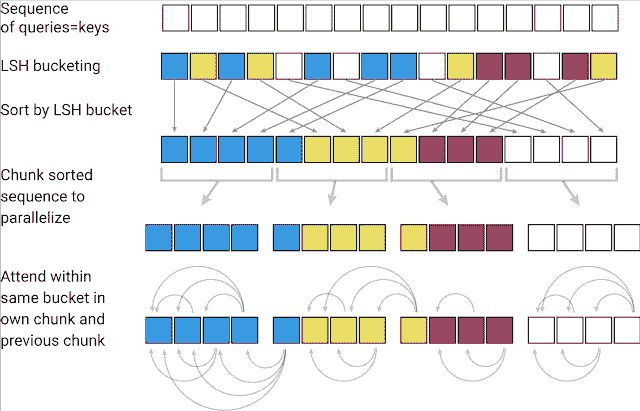
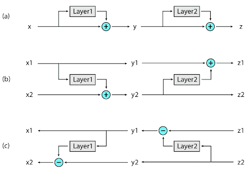
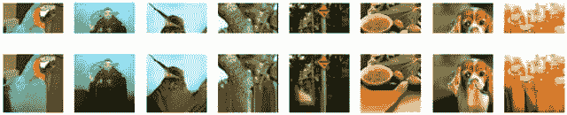

作者：Nikita Kitaev, Łukasz Kaiser

编译：ronghuaiyang

理解序列数据 —— 如语言、音乐或视频 —— 是一项具有挑战性的任务，特别是当它依赖于大量的周围环境时。例如，如果一个人或一个物体在视频中消失，很久以后又重新出现，许多模型就会忘记它的样子。在语言领域，长短时记忆(LSTM)神经网络覆盖了足够的上下文来逐句翻译。在这种情况下，上下文窗口（在翻译过程中需要考虑的数据范围），从几十个词到大约 100 个词不等。最新的 Transformer 模型不仅改进了逐句翻译的性能，还可以通过多文档摘要生成整个 Wikipedia 的文章。这是可能的，因为 Transformer 使用的上下文窗口可以扩展到数千个单词。有了这样一个大的上下文窗口，Transformer 可以用于文本以外的应用，包括像素或音符，使其能够用于生成音乐和图像。

但是，将 Transformer 扩展到更大的上下文窗口会遇到限制。Transformer 的能力来自于注意力，在这个过程中，它考虑上下文窗口中所有可能的单词对，以理解它们之间的联系。因此，对于 100K 个单词的文本，这需要评估 100K x 100K 个单词对，或者每一步 100 亿对，这是不切实际的。另一个问题是存储每个模型层输出的标准实践。对于使用大型上下文窗口的应用程序，存储多个模型层的输出的内存需求很快变得非常大(从只有几层的 GB 字节到有数千层的模型的 TB 字节)。这意味着，使用许多层的实际的 Transformer 模型只能用于几段文本或生成简短的音乐片段。

今天，我们将介绍 Reformer，这是一个 Transformer 模型，设计用于处理最多 100 万个单词的上下文窗口，所有这些都在一个单一的加速器上，并且只使用了 16GB 的内存。它结合了两种关键技术来解决注意力和内存分配问题，这些问题限制了 Transformer 的应用只能使用长上下文窗口。Reformer 使用位置敏感散列(LSH)来降低处理过长序列和可逆残差层的复杂性，从而更有效地使用可用内存。

**注意力机制的问题**

当将 Transformer 模型应用于非常大的文本序列时，第一个挑战是如何处理注意力层。LSH 通过计算一个哈希函数来实现这一点，该哈希函数将类似的向量匹配在一起，而不是搜索所有可能的向量对。例如，在翻译任务中，来自网络第一层的每个向量表示一个单词(在后续层中甚至有更大的上下文)，不同语言中相同单词对应的向量可能得到相同的散列。在下面的图中，不同的颜色描绘了不同的哈希，相似的单词有相同的颜色。当哈希值被分配时，序列会被重新排列，将具有相同哈希值的元素放在一起，并被分成片段(或块)，以支持并行处理。然后将注意力机制放在这些更短的块(以及它们的相邻块以覆盖溢出)中，从而大大减少了计算负载。

位置敏感哈希：Reformer接受一个输入key序列，其中每个key是一个向量，表示第一层中的单个单词(或图像中的像素)和后续层中的较大上下文。LSH应用于序列，然后按key的哈希和块排序。注意力只应用于单个块及其近邻。

**内存的问题**

虽然 LSH 解决了注意力的问题，但仍然存在一个内存的问题。一个网络的单层通常需要几 GB 的内存，并且通常适用于一个 GPU，所以即使是一个具有长序列的模型在只有一层的情况下也是可以执行的。但是，当训练一个具有梯度下降的多层模型时，需要保存每一层的激活值，以便在向后传递中使用。一个典型的 Transformer 模型有 12 个或更多的层，因此，如果用来缓存来自每个层的值，那么内存很快就会用完。

在 Reformer 中实现的第二个新方法是在反向传播期间按需重新计算每个层的输入，而不是将其存储在内存中。这是通过使用可逆层来实现的，其中来自网络的最后一层的激活被用来恢复来自任何中间层的激活，这相当于反向运行网络。在一个典型的残差网络中，栈中的每一层都不断地增加通过网络的向量。相反，可逆层对每个层有两组激活。一个遵循刚才描述的标准过程，并从一个层逐步更新到下一个层，但是另一个只捕获对第一个层的更改。因此，要反向运行网络，只需减去应用于每个层的激活。

可逆层：(A)在标准残差网络中，每一层的激活用于更新到下一层的输入。(B)在可逆网络中，维持两组激活，每层后只更新其中一组。(C)这种方法使反向运行网络以恢复所有中间值成为可能。

**Reformer 的应用**

在 Reformer 中，这两种新方法的应用使其具有很高的效率，使其能够仅使用 16GB 内存在单个 GPU 上处理长度高达 100 万字的文本序列。由于 Reformer 具有如此高的效率，它可以直接应用于上下文窗口比几乎所有当前最先进的文本域数据集大得多的数据。也许 Reformer 处理如此大的数据集的能力将刺激社区创建它们。

大上下文数据的一个不足之处是图像生成，因此我们对图像进行了 Reformer 的实验。在这篇文章中，我们将举例说明如何使用 Reformer 来“完成”部分图像。从下图最上面一行的图像片段开始，Reformer 可以逐像素地生成全帧图像(下面一行)。

顶部：图像片段用作Reformer的输入。底部：“完成”的全帧图像。原始图像来自Imagenet64数据集。

虽然 Reformer 在图像和视频任务上的应用潜力巨大，但在文本上的应用更令人兴奋。Reformer 可以一次性在单一的设备中处理整个小说。将来，当有更多的数据集需要训练长文本时，诸如 Reformer 之类的技术可能会使生成长连贯的文本成为可能。

**结论**

我们相信，Reformer 为 Transformer 模型的未来使用奠定了基础，既可以用于长文本，也可以用于自然语言处理之外的应用。按照我们公开研究的传统，我们已经开始探索如何将其应用于更长的序列，以及如何改进位置编码的处理。阅读 Reformer 的论文(被选为 ICLR 2020 的口头报告)，探索我们的代码并开发你自己的想法。目前在深度学习中广泛使用的长上下文数据集还很少，但在现实世界中，长上下文却无处不在。

*英文原文：**https://ai.googleblog.com/2020/01/reformer-efficient-transformer.html*

*AI学习路线和优质资源，在后台回复"AI"获取*

