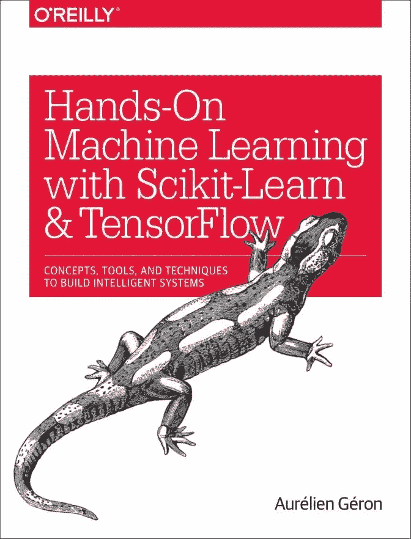
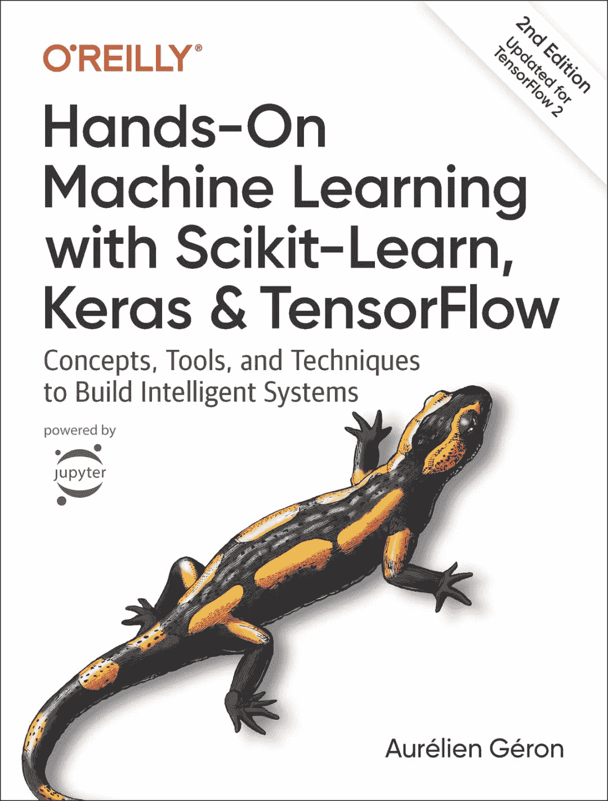
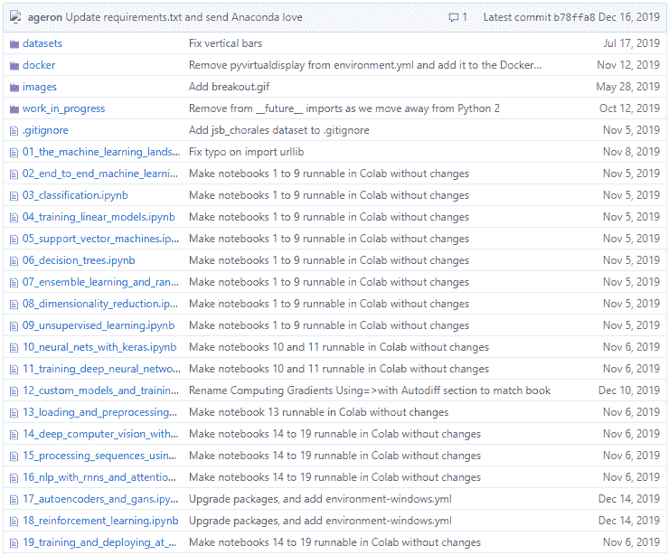

早在去年的这个时候，红色石头就发文给大家推荐过一本非常棒的机器学习实用指南书籍《Hands-On Machine Learning with Scikit-Learn & TensorFlow》，中文译为《Scikit-Learn 与 TensorFlow 机器学习实用指南》。

这本书最大的特色从理论上讲就是言简意赅，全书基本上没有太多复杂的数学公式推导，语言通俗易懂，很容易看得懂、看得下去。这一点红色石头也发现是现在很多教材所欠缺的。爱可可老师也曾推荐过这本书。

**重磅！**

时隔一年，这本超赞的机器学习实用指南终于正式出版了第二版：《Hands-On Machine Learning with Scikit-Learn, Keras, and TensorFlow, 2nd Edition》，中文译为《Scikit-Learn、Keras 与 TensorFlow 机器学习实用指南(第二版)》，并且在美国亚马逊上开售了，可惜国内还没有开售，影印版和中文翻译版还没出来。请看封面：

**书籍作者**

这本《Scikit-Learn、Keras 与 TensorFlow 机器学习实用指南(第二版)》的作者是 Aurélien Géron，法国人，毕业于AgroParisTech，曾任 Google Youtube 视频分类项目组负责人，创建过多家公司并担任 CTO，也曾在 AgroParisTech 担任讲师。现在是一名机器学习的顾问。

**版本变化**

总的来说，第二版相比第一版增加了许多新的内容，最直白的就是第一版使用了 Scikit-Learn 和 TensorFlow，而第二版增加了 Keras 深度学习框架。

从内容上来说，第二版增加了更多的机器学习前沿知识，包括：无监督学习，训练深度网络，计算机视觉，自然语言处理等等。

详细的版本更新可以看这里：

https://github.com/ageron/handson-ml2/blob/master/changes_in_2nd_edition.md

**书籍介绍**

第二版跟第一版一样，全书也分成了两大部分，第一部分是**机器学习基础**，包含了第 1~9 章内容：

*   Chapter 1. The Machine Learning Landscape

*   Chapter 2. End-to-End Machine Learning Project

*   Chapter 3. Classification

*   Chapter 4. Training Models

*   Chapter 5. Support Vector Machines

*   Chapter 6. Decision Trees

*   Chapter 7. Ensemble Learning and Random Forests

*   Chapter 8. Dimensionality Reduction

*   Chapter 9. Unsupervised Learning Techniques

第一部分与第一版书籍内容相差不多，仅多了一个第9章的无监督学习。

全书第二部分是**神经网络与深度学习**，包含了第 10~19 章内容：

*   Chapter 10. Introduction to Artificial Neural Networks with Keras

*   Chapter 11. Training Deep Neural Networks

*   Chapter 12. Custom Models and Training with TensorFlow

*   Chapter 13. Loading and Preprocessing Data with TensorFlow

*   Chapter 14. Deep Computer Vision Using Convolutional Neural Networks

*   Chapter 15. Processing Sequences Using RNNs and CNNs

*   Chapter 16. Natural Language Processing with RNNs and Attention

*   Chapter 17. Representation Learning and Generative Learning Using Autoencoders and GANs

*   Chapter 18. Reinforcement Learning

*   Chapter 19. Training and Deploying TensorFlow Models at Scale

这部分深度学习是作者更新最多的，跟第一版差别较大。

**随书代码**

作者将本书所有章节的详细代码都开源了并发布在 GitHub 上，目前已经收获了 5.3k star。项目地址为：

https://github.com/ageron/handson-ml2

不得不说，作者配套的随书代码质量很高！看过第一版的读者应该知道，每个章节的代码都是 .ipynb 文件，用 Jupyter Notebook 就能打开。除了代码，相应的文档解释非常多。

**配套资源**

这本《Hands-On Machine Learning with Scikit-Learn, Keras, and TensorFlow, 2nd Edition》现在有了电子版的 PDF，方便读者阅读。获取方式很简单，请在本公众号后台回复：**ML2** 即可！

*AI学习路线和优质资源，在后台回复"AI"获取*

