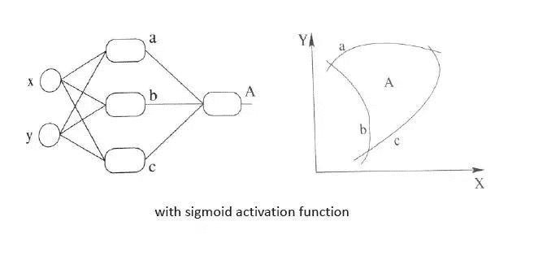

来自 | 知乎

地址 | https://www.zhihu.com/question/22334626/answer/103835591

**神经网络激励函数的作用是什么？有没有形象的解释？**

颜沁睿

https://www.zhihu.com/question/22334626/answer/103835591

这是一个单层的感知机, 也是我们最常用的神经网络组成单元啦. 用它可以划出一条线, 把平面分割开

那么很容易地我们就会想用多个感知机来进行组合, 获得更强的分类能力, 这是没问题的
如图所示：

那么我们动笔算一算, 就可以发现, 这样一个神经网络组合起来,输出的时候无论如何都还是一个线性方程, 说好的非线性分类呢

再盗用一幅经常在课堂上用的图...然而我已经不知道出处是哪了, 好像好多老师都是直接用的, 这幅图就跟前面的图一样, 描述了当我们直接使用step activation function的时候所能获得的分类器, 其实只能还是线性的, 最多不过是复杂的线性组合罢了~~~当然你可以说我们可以用无限条直线去逼近一条曲线啊......额,当然可以, 不过比起用non-linear的activation function来说就太傻了嘛....

祭出主菜. 题主问的激励函数作用是什么, 就在这里了!!
我们在每一层叠加完了以后, 加一个激活函数, 如图中的. 这样输出的就是一个不折不扣的非线性函数!

于是就很容易拓展到多层的情况啦, 更刚刚一样的结构, 加上non-linear activation function之后, 输出就变成了一个复杂的, 复杂的, 超级复杂的函数....额别问我他会长成什么样, 没人知道的，我们只能说, 有了这样的非线性激活函数以后, 神经网络的表达能力更加强大了(比起纯线性组合, 那是必须得啊!)

继续厚颜无耻地放一张跟之前那副图并列的图, 加上非线性激活函数之后, 我们就有可能学习到这样的平滑分类平面. 这个比刚刚那个看起来牛逼多了有木有!

这样表达应该能够比较清楚地回答题主的问题了吧? 这就是为什么我们要有非线性的激活函数!

额, 基于这两天刚交完ann的报告, 就再说点个人的想法吧. 关于activation function这个东西的选择确实很trick, 可以说是完全依赖于做什么application吧. 比如我在做regression的时候, 不仅尝试了tanh, sigmoid这些常用的, 还试了一把近两年在dl中超级火的ReLU. 结果发现ReLU做出来的准确度简直是不忍直视啊...于是在报告里吹了一大通可能这个function不work的原因...其实自己知道那就是扯淡好么, 如果实验结果好了, 肯定又能找到一堆其它理由去support它了. 

所以这也是NN一直以来饱受诟病的大问题, 别看这两年DL风生水起, 依然是个没办法好好解释的东西, 谁也不敢保证这东西放到某个应用上就一定能成, 最后调出来的就发paper, 调不出来就换参数, 甚至换一个模型继续试呗...
当然我也不是经验很丰富啦, 对调参这门手艺还是继续保持敬仰的~~~ 只是最近看到好多摩拳擦掌准备投身DL想要干一番大事业的同学, 有感而发...花点时间搞搞清楚原理可能就不会觉得这个东西那么靠谱了, 更多的像是magic, 还不如其它的模型用着心理踏实...入行需谨慎啊

* * *

# 

* * *

非理

https://www.zhihu.com/question/22334626/answer/21036590

翻译为激活函数（activation function）会更好。

激活函数是用来加入非线性因素的，因为线性模型的表达能力不够。

以下，同种颜色为同类数据。

某些数据是线性可分的，意思是，可以用一条直线将数据分开。比如下图：

这时候你需要通过一定的机器学习的方法，比如感知机算法(perceptron learning algorithm) 找到一个合适的线性方程。

但是有些数据不是线性可分的。比如如下数据：

第二组数据你就没有办法画出一条直线来将数据区分开。

这时候有两个办法，第一个办法，是做线性变换(linear transformation)，比如讲x,y变成x^2,y^2，这样可以画出圆形。如图所示：

如果将坐标轴从x,y变为以x^2,y^2为标准，你会发现数据经过变换后是线性可分的了。大致示意图如下：

另外一种方法是引入非线性函数。我们来看异或问题(xor problem)。以下是xor真值表

这个真值表不是线性可分的，所以不能使用线性模型，如图所示

我们可以设计一种神经网络，通过激活函数来使得这组数据线性可分。
激活函数我们选择阀值函数（threshold function），也就是大于某个值输出1（被激活了），小于等于则输出0（没有激活）。这个函数是非线性函数。

神经网络示意图如下：

其中直线上的数字为权重。圆圈中的数字为阀值。第二层，如果输入大于1.5则输出1，否则0；第三层，如果输入大于0.5，则输出1，否则0.

我们来一步步算。

第一层到第二层（阀值1.5）

第二层到第三层(阀值0.5)

可以看到第三层输出就是我们所要的xor的答案。

经过变换后的数据是线性可分的（n维，比如本例中可以用平面），如图所示：

总而言之，激活函数可以引入非线性因素，解决线性模型所不能解决的问题。

* * *

# 

* * *

论智

https://www.zhihu.com/question/22334626/answer/465380541

神经网络的**激励函数（activation function）**是一群空间魔法师，扭曲翻转特征空间，在其中寻找线性的边界。

<figcaption>图片来源： 漫威</figcaption>

如果没有激励函数，那么神经网络的权重、偏置全是线性的**仿射变换（affine transformation）：**

这样的神经网络，甚至连下面这样的简单分类问题都解决不了：

 

<figcaption>在这个二维特征空间上，蓝线表示负面情形（y=0），绿线表示正面情形（y=1）</figcaption>

在这个二维特征空间上，蓝线表示负面情形（y=0），绿线表示正面情形（y=1）

没有激励函数的加持，神经网络最多能做到这个程度：

<figcaption>线性边界——看起来不怎么好，是吧？</figcaption>

线性边界——看起来不怎么好，是吧？

这时候，激励函数出手了，扭曲翻转一下空间：

线性边界出现了！再还原回去，不就得到了原特征空间中的边界？

当然，不同的激励函数，因为所属流派不同，所以施展的魔法也各不相同。

<figcaption>上为变换后的特征空间的线性边界； 下为原特征空间的非线性边界</figcaption>

上图中，出场的三位空间魔法师，分别为sigmoid、tanh、relu

**sigmoid**

sigmoid是一位老奶奶，是激励函数中最有资历的。

<figcaption>图片来源： Katya Art</figcaption>

虽然比较老迈、古板，已经不像当年那么受欢迎了，但在分类任务的输出层中，人们还是信赖sigmoid的丰富经验。

 

<figcaption>sigmoid及其梯度（红色曲线为梯度）</figcaption>

我们可以看到，sigmoid将输入挤压进0到1区间（这和概率的取值范围一致），这正是分类任务中sigmoid很受欢迎的原因。

## **tanh**

tanh也是一位资深的空间魔法师：

<figcaption>图片来源： Katya Art</figcaption>

等等，这不就是sigmoid？背过身去以为我们就不认识了吗？

没错，tanh就是乔装打扮的sigmoid：

  

<figcaption>tanh及其梯度（红色曲线为梯度）</figcaption>

如上图所示，tanh**的**形状和sigmoid类似，只不过tanh将“挤压”输入至**区间(-1, 1)**。因此，**中心为零**，（某种程度上）激活值已经是下一层的正态分布输入了。

至于**梯度**，它有一个大得多的峰值1.0（同样位于z = 0处），但它下降得更快，当|z|的值到达3时就已经接近零了。这是所谓**梯度消失（vanishing gradients）**问题背后的原因，会导致网络的训练进展变慢。

## **ReLU**

ReLU是一个守门人，凡是麻瓜（0）一律拒之门外（关闭神经元）。

<figcaption>图片来源： Konami</figcaption>

它是今时今日寻常使用的激励**函数**。**ReLU**处理了它的sigmoid、tanh中常见的**梯度消失**问题，同时也是计算梯度**最快**的激励函数。

 

<figcaption>ReLU及其梯度（红色折线为梯度）</figcaption>

如上图所示，**ReLU**是一头完全不同的野兽：它并不“挤压”值至某一区间——它只是**保留正值**，并将所有**负值转化为零**。

使用**ReLU**的积极方面是它的**梯度**要么是1（正值），要么是0（负值）——**再也没有梯度消失了！**这一模式使网络**更快收敛**。

另一方面，这一表现导致所谓的**“死亡神经元”**问题，也就是输入持续为负的神经元激活值总是为零。

*AI学习路线和优质资源，在后台回复"AI"获取*

