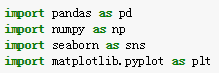
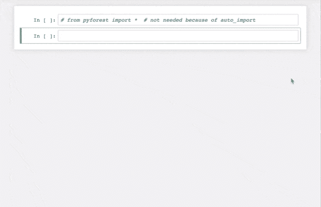

还记得入门Python数据分析时经常会import几个库，下面这几个可谓是入门学习时的四大护法，Python数据处理和可视化常会用的工具。



不知道大家有没有遇到过这样一个问题，每次重新开启一个建模流程或者分析过程时，会重新敲一遍import或者将之前的import代码copy进去。虽然已经用的滚花烂熟了，但是确耗费不必要的时间。

本篇给大家介绍一个可以偷懒的python库：pyforest

**一个示例**



看到了吧，开头什么都没import，依然可以正常使用常用库。

**安装**

需要安装Python3.6以上的版本，然后终端运行：

```
pip install pyforest 
```

链接：https://github.com/8080labs/pyforest

**使用方法**

非常简单！！！

一行代码就可以解决。

```
from pyforest import * 
```

如果使用Jupyter或IPython，甚至可以跳过此行，因为pyforest会将其自身添加到自动启动中。

而且，完成脚本后，可以通过以下方式导出所有导入语句：

```
active_imports() 
```

通过这个指令，我们就可以看到脚本所涉及到的全部已经被我省略的库。

**好了，你可能会问，如果需要的库不在pyforest中怎么办？**

首先，pyforest支持大部分流行的数据科学库，比如pandas，numpy，matplotlib，seaborn，sklearn，tensorflow等等，以及常用的辅助库如os，sys，re，pickle等。

```
### Data Wrangling
pd = LazyImport("import pandas as pd")

np = LazyImport("import numpy as np")

dd = LazyImport("from dask import dataframe as dd")
SparkContext = LazyImport("from pyspark import SparkContext")

load_workbook = LazyImport("from openpyxl import load_workbook")

### Data Visualization and Plotting
mpl = LazyImport("import matplotlib as mpl")
plt = LazyImport("import matplotlib.pyplot as plt")

sns = LazyImport("import seaborn as sns")

py = LazyImport("import plotly as py")
go = LazyImport("import plotly.graph_objs as go")
px = LazyImport("import plotly.express as px")

dash = LazyImport("import dash")

bokeh = LazyImport("import bokeh")

alt = LazyImport("import altair as alt")

pydot = LazyImport("import pydot")

# statistics
statistics = LazyImport("import statistics")

### Machine Learning
sklearn = LazyImport("import sklearn")
OneHotEncoder = LazyImport("from sklearn.preprocessing import OneHotEncoder")
TSNE = LazyImport("from sklearn.manifold import TSNE")
train_test_split = LazyImport("from sklearn.model_selection import train_test_split")
svm = LazyImport("from sklearn import svm")
GradientBoostingClassifier = LazyImport(
    "from sklearn.ensemble import GradientBoostingClassifier"
)
GradientBoostingRegressor = LazyImport(
    "from sklearn.ensemble import GradientBoostingRegressor"
)
RandomForestClassifier = LazyImport(
    "from sklearn.ensemble import RandomForestClassifier"
)
RandomForestRegressor = LazyImport("from sklearn.ensemble import RandomForestRegressor")

TfidfVectorizer = LazyImport(
    "from sklearn.feature_extraction.text import TfidfVectorizer"
)

# TODO: add all the other most important sklearn objects
# TODO: add separate ps within machine learning viz. Classification, Regression, Error Functions, Clustering

# Deep Learning
tf = LazyImport("import tensorflow as tf")
keras = LazyImport("import keras")

# NLP
nltk = LazyImport("import nltk")
gensim = LazyImport("import gensim")
spacy = LazyImport("import spacy")
re = LazyImport("import re")

### Helper
sys = LazyImport("import sys")
os = LazyImport("import os")
re = LazyImport("import re")
glob = LazyImport("import glob")
Path = LazyImport("from pathlib import Path")

pickle = LazyImport("import pickle")

dt = LazyImport("import datetime as dt")

tqdm = LazyImport("import tqdm") 
```

其次，如果真的没有也没关系，pyforest支持向其中添加库。操作方法也很简单，找到pyforest库的user_imports.py文件，然后添加一个语句就好了，比如像下面这样：

```
#############################
### User-specific imports ###
#############################
# You can save your own imports in ~/.pyforest/user_imports.py
# Please note: imports in ~/.pyforest/user_imports.py take precedence over the
# imports above. 
```

所以我们可以根据平时自己的使用习惯添加一套属于自己的万能import，爽歪歪了。

**有的同学可能还会问，所有的库添加进入运行速度会不会变慢？**

答案是不会，因为只有你后面真正使用了到了pyforest里的包含的库，程序才会真正import，否则不会。

抓紧试试吧。

*AI学习路线和优质资源，在后台回复"AI"获取*

