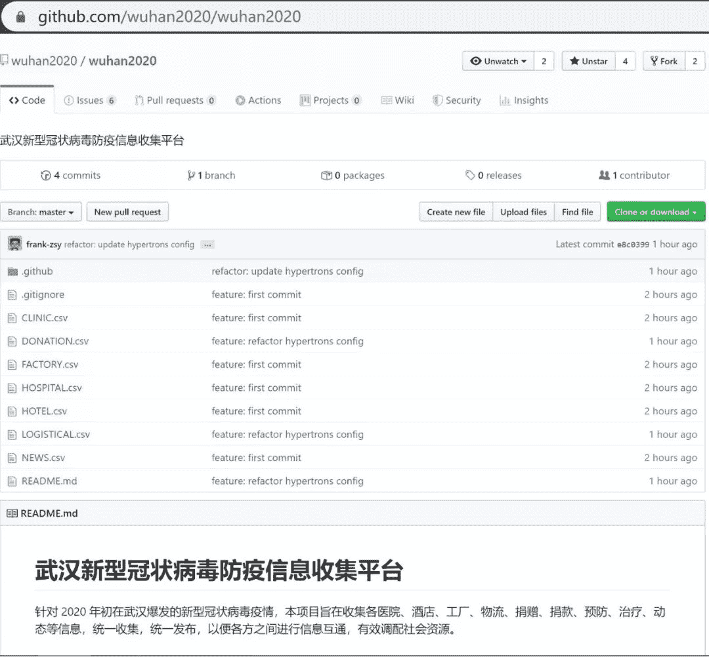
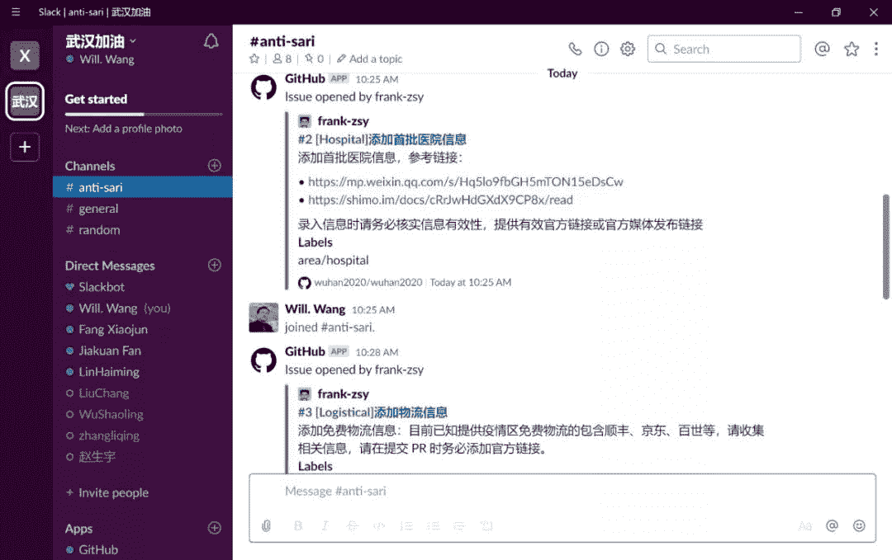
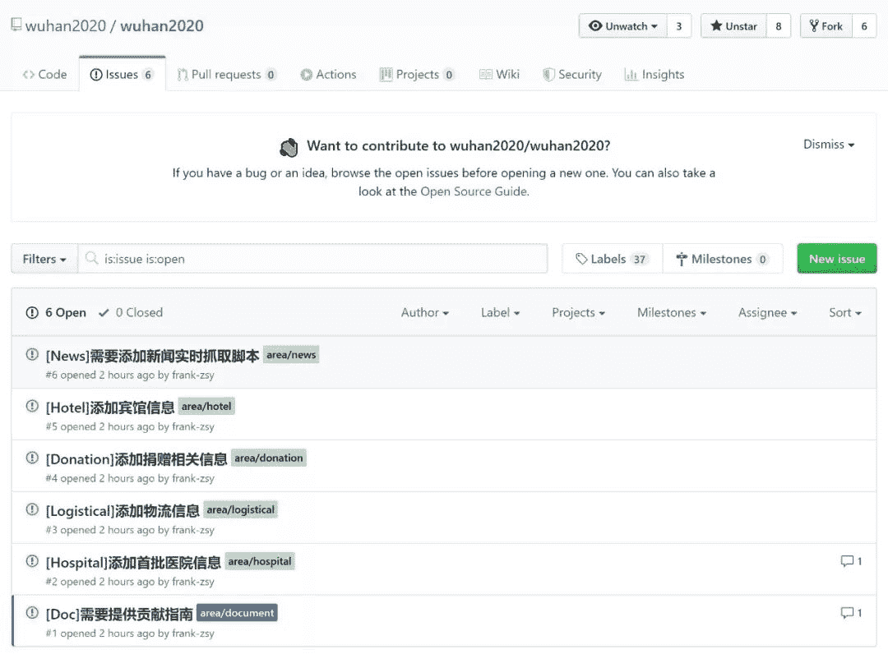

我们发起**wuhan2020**开源项目，收集经过审核与确认过的武汉新型冠状病毒防疫相关信息，望众程序员与开发者可以齐心协力，加入我们，共克时艰，项目地址：

*   **https://github.com/wuhan2020/wuhan2020**

针对目前新型冠状病毒疫情，武汉及周边各市县均爆出物资供给不足的情况，而重大公共卫生事件在公共社会事件中属于较复杂的类型，统筹安排难度大，周期长，利用数字平台优势，让各供需方进行分布式自助对接可大幅提升效率，而目前信息采集与公布平台不一致，信息散乱很难进行有效沟通，大量图片信息不利于实时沟通。故发起该项目，**旨在统一收集本次事件中相关事务处理方的信息，并利用开源和分布式协作优势实时更新并通报，提供各方的联系平台。**

本项目旨在收集各医院、酒店、工厂、物流、捐赠、捐款、预防、治疗、动态等信息（欢迎补充！），统一收集，统一发布，以便各方之间进行信息互通，有效调配社会资源。

本平台目前收集信息包含如下几类信息，请分别申报填写。为保证信息有效性，关于医院、酒店、物流、捐款等信息，**务必注明官方链接，本平台仅为信息收集平台，而非信息发布平台**。工厂信息申报，请提供资质证明，如经营许可、工商信息等，以保证供应商有效性。

本平台信息暂以 **csv 文件格式**提交存储，以便进行前端获取结构化数据。

*   **医院：**医院信息主要指目前物资与资源紧缺医院的申报信息，包含医院名称、省、市、县/区、医院地址、目前医护人员数量、每日所需各类医护用具数量、相关官方链接、联系方式、备注。

*   **酒店：**医护人员为保证隔离性，应集中休息，以免与家人交叉传染，需要酒店提供临时住宿。信息包含酒店名称、酒店地址、酒店可提供床位数、联系方式。

*   **物流：**各大物流都已开始提供免费物资物流，但均由各自官方渠道发布，信息不对称。物流名称、物流区域、物流能力、官方链接、联系方式。

*   **生产：**目前大量捐款到位，但生产厂商复工情况未知，可提供生产厂商信息，方便快速联系。

    厂商名称、资质证明、厂商位置、生产物资类型、产能、联系方式。

*   **捐款：**各类平台捐款方式，保证捐款信息的有效性。捐款发起方、捐款方式、官方链接、联系方式、当前状态等。

*   **预防与治疗：**收集相关疫情预防治疗信息，以图文形式提入项目。

*   **义诊：**收集各地义诊信息。包含义诊单位或个人、联系方式、备注等。

*   **动态：**收集关于疫情的新闻动态。

    包含新闻标题、新闻概要、时间、媒体链接等。

后续计划持续开发的事宜包括：

*   提供微信小程序可视化页面，提供数据修改后的实时部署能力以及各类信息的实时查询能力；

*   提供后端支持信息在前端的实时提交能力，信息提交以 PR 形式提到项目中，核实后可以合入；

*   定时收集微博、头条等的新闻内容，并以 Issue 形式提入项目，由开发者转化为内容后合入项目；

*   欢迎在Github项目上留言，添加你的想法，我们尽量来实现！

我们同时建立了**Slack交流群组**，欢迎大家加入共同探讨各类技术或非技术类问题：

https://join.slack.com/t/wuhan2020/shared_invite/enQtOTIzNjA2MDYwOTUxLWVjMjA4MjdhNGVmZmZlZTgxYjM1ZDY1NGVkZDVkNGI0NzhjZGVlYTM2Mjc5Mjk2YjgyYTk1NDJmNTkxODZlOTE

项目的框架已经搭建好，部分issues也已经开启，欢迎程序员与开发者们添砖加瓦！

**众志成城，共抗新型肺炎** **！**

