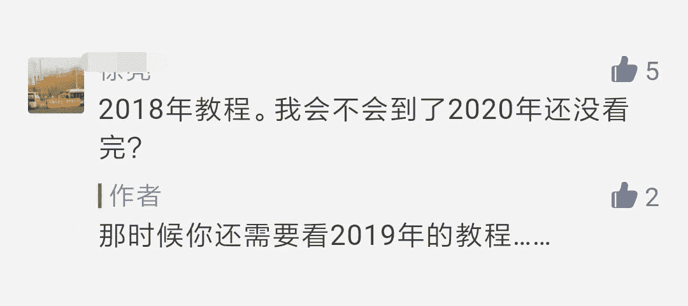

机器之心整理

**参与：张倩、蛋酱**

> 从 2016 年起，机器之心每年都会盘点全年的精华教程。去年就有小伙伴留言说要在 2019 年上半年把 2018 年的教程合集「啃下来」。现在都 2020 了，不知道这位朋友啃完没有？要是 flag 没倒，不妨再来一份？

与往年类似，今年的盘点分为入门解惑、优质教材及课程、语言、工具、GitHub 项目、经验分享几大板块。无论你是刚迈入 AI 领域的萌新，还是工作多年的数据分析师、炼丹师、码农，这份合集都能帮到你。

如果这些都学完了还没尽兴，可以跳到文末链接找出往年教程合集。

**入门解惑**

去年，教育部公布了 35 所新增 AI 本科高校名单，为想学 AI 的同学提供了更多选择。对于这部分刚迈入 AI 领域的萌新，我们提供了一系列完备的学习路线和入门教程：

*   [完备的 AI 学习路线，最详细的中英文资源整理](http://mp.weixin.qq.com/s?__biz=MzA3MzI4MjgzMw%3D%3D&chksm=871aac5eb06d2548a75eda9f2accf50aad8be315f71514c347fec2fc0b9b17a3ea898a4ba3eb&idx=1&mid=2650761248&scene=21&sn=25b306cb5e4e39730e960f109bfaf044#wechat_redirect)

*   [不交学费也能成为数据科学家，这里有一条免费学习路径 ](http://mp.weixin.qq.com/s?__biz=MzA3MzI4MjgzMw%3D%3D&chksm=871a56c5b06ddfd3f6ffe702ff91f26137d152942f4e874142608aba1019c5305f49266fcc6e&idx=1&mid=2650772155&scene=21&sn=b0d3c08189479e26916736ca09e30c5b#wechat_redirect)

*   [机器学习成才之路：这是一条 GitHub 高赞的学习路径](http://mp.weixin.qq.com/s?__biz=MzA3MzI4MjgzMw%3D%3D&chksm=871a9b3cb06d122a1e65b3f395a1caea43acfb1a5bfd5de7cf08136fb10a4be43e05b9aac72d&idx=1&mid=2650758978&scene=21&sn=de093bf3b9bd8436486cd0bbc1d66c9c#wechat_redirect)

*   [入门机器学习，照这个课程清单按顺序学就对了 ](http://mp.weixin.qq.com/s?__biz=MzA3MzI4MjgzMw%3D%3D&chksm=871abba3b06d32b5903ea0689a1b9c7606a689e3003a8b8f1398a1f9dc2f976ec9adebbcb645&idx=2&mid=2650767325&scene=21&sn=40fbe6cd7076bbc49eed34252066e6d7#wechat_redirect)

*   [18 个月自学 AI，2 年写就三万字长文，过来人教你如何掌握这几个 AI 基础概念 ](http://mp.weixin.qq.com/s?__biz=MzA3MzI4MjgzMw%3D%3D&chksm=871a4669b06dcf7f8373cc53ee4d431f02c388d814ee4b8135f01e82e4ac7fa781358e580476&idx=1&mid=2650767895&scene=21&sn=1cad73020b8e1b76650171bbb0483e86#wechat_redirect)

*   [机器学习必学 10 大算法](http://mp.weixin.qq.com/s?__biz=MzA3MzI4MjgzMw%3D%3D&chksm=871a9abbb06d13ad1683d02a3c29767b5ab0adbf8299b891f22bd5658df96996be4b00e29bb7&idx=4&mid=2650758853&scene=21&sn=fad1a71a12a0ec07b05bc255202ba5c3#wechat_redirect)

*   [机器学习基础：相似度和距离度量究竟是什么 ](http://mp.weixin.qq.com/s?__biz=MzA3MzI4MjgzMw%3D%3D&chksm=871a547bb06ddd6d4531fba1a820df42ae6526f75cd854283020805df6d0e4c1cbfb3032d294&idx=5&mid=2650771461&scene=21&sn=52b64440885d71fa23911cb6499198e7#wechat_redirect)

*   [p 值是什么？数据科学家用最简单的方式告诉你 ](http://mp.weixin.qq.com/s?__biz=MzA3MzI4MjgzMw%3D%3D&chksm=871abf8db06d369b981ee17904e8b837b5f0d0fbcc689ddd3107a41a6e629ada3ab470bc4be8&idx=3&mid=2650766323&scene=21&sn=91e468ed28968ae9cc952d926b5a23b3#wechat_redirect)

*   [Distribution is all you need：这里有 12 种做 ML 不可不知的分布 ](http://mp.weixin.qq.com/s?__biz=MzA3MzI4MjgzMw%3D%3D&chksm=871a481eb06dc108f0f680faf849a7a36013680ad465ac54b57c0f448eb45fcdae4fa2fb0f1c&idx=4&mid=2650770528&scene=21&sn=5ece1d49995b419a114017d26af8cc5b#wechat_redirect)

*   [计算机视觉入门大全：基础概念、运行原理、应用案例详解 ](http://mp.weixin.qq.com/s?__biz=MzA3MzI4MjgzMw%3D%3D&chksm=871a5175b06dd86362157f1c648aea99d7ff49b4ac50c3dacaad7a651c08ac789be12d2506ec&idx=3&mid=2650772747&scene=21&sn=60387cd13689e0041417cdaf184edccf#wechat_redirect)

*   [NLP 技术路线详解：这是从数学到算法的艺术 ](http://mp.weixin.qq.com/s?__biz=MzA3MzI4MjgzMw%3D%3D&chksm=871a4923b06dc03581aee35dbb1b2b4f49791b5a85f24caecc825eb71f8acde819baa1bb6dee&idx=3&mid=2650770781&scene=21&sn=7806d76b4a136700ada17276dbdfee58#wechat_redirect)

*   [深度强化学习入门难？这份资料手把手教会你 ](http://mp.weixin.qq.com/s?__biz=MzA3MzI4MjgzMw%3D%3D&chksm=871abdf8b06d34ee3e27a80c6dcdd7dae84ad267dd0f1e4542822bf23f5fc063cc06e6be57f2&idx=5&mid=2650765702&scene=21&sn=891faab2a12a7fc50d3575722700ff94#wechat_redirect)

*   [数据清洗&预处理入门完整指南](http://mp.weixin.qq.com/s?__biz=MzA3MzI4MjgzMw%3D%3D&chksm=871a9d3eb06d14289d9beaab13406e301180730b3bba6b8e372abf4bf1724bc00eb8e0023f7d&idx=4&mid=2650757440&scene=21&sn=132d98c2c64f2b6b76864437815e49ef#wechat_redirect)

*   [不要只关注算法与模型，这里有份产品级深度学习开发指南 ](http://mp.weixin.qq.com/s?__biz=MzA3MzI4MjgzMw%3D%3D&chksm=871a589db06dd18bc8cca25e614dcd9f7f9adaaccebe32d31d359c3790d7dd976f7c95e9e477&idx=1&mid=2650774755&scene=21&sn=fb97ae881d7b5d1805b3ba4b40e18acc#wechat_redirect)

*   [没人告诉你的大规模部署 AI 高效流程！](http://mp.weixin.qq.com/s?__biz=MzA3MzI4MjgzMw%3D%3D&chksm=871a940eb06d1d18070d8c8dadb9e2dd36397a1734da8932776a1b8358b35af694814865a01d&idx=4&mid=2650755184&scene=21&sn=f597d101749e9bbc1186a95900f4a26d#wechat_redirect)

*   [用纯 NumPy 码一个 RNN、LSTM：这是最好的入门方式了](http://mp.weixin.qq.com/s?__biz=MzA3MzI4MjgzMw%3D%3D&chksm=871a9589b06d1c9f70cb3e1d6f9e1e979261f623d84ee4a820331e080dfe1989ca9a3b94f83c&idx=3&mid=2650755575&scene=21&sn=f2a8d1254aedd78145d827f1fb1b785b#wechat_redirect)

*   [为什么我的 CV 模型不好用？没想到原因竟如此简单…… ](http://mp.weixin.qq.com/s?__biz=MzA3MzI4MjgzMw%3D%3D&chksm=871a5484b06ddd922420a303585786ac2c1c6184999f260dde784b18f40e37dcda706bb82459&idx=4&mid=2650771706&scene=21&sn=f06e3cf489c693737f9ba5c687308c0a#wechat_redirect)

*   [3 天上手，30 天精通！——深度学习 FPGA 加速器设计](http://mp.weixin.qq.com/s?__biz=MzA3MzI4MjgzMw%3D%3D&chksm=871aab00b06d221600e40b84c9d0e6870b360365e3ed3fcedac3a53df1889c4a1cfb85ac2666&idx=3&mid=2650763134&scene=21&sn=8e4cb2191f8544206fdf5c9b232aa4bb#wechat_redirect)

*   [预训练语言模型关系图+必读论文列表，清华荣誉出品 ](http://mp.weixin.qq.com/s?__biz=MzA3MzI4MjgzMw%3D%3D&chksm=871a54edb06dddfb28b31e8dd0ca20d650553d1624a370f1496d3ca7af5a7cd1b9307d26ee08&idx=3&mid=2650771603&scene=21&sn=d7616e643b7bfda5cb0f22b928f99775#wechat_redirect)

*   [学习 GAN 模型量化评价，先从掌握 FID 开始吧](http://mp.weixin.qq.com/s?__biz=MzA3MzI4MjgzMw%3D%3D&chksm=871a5484b06ddd92259cd790232a83619fa9d503d5d5ff4e6da84fe9347d51c0e4b648303abb&idx=5&mid=2650771706&scene=21&sn=5a726570caab46c33b91a4c0a669c2d2#wechat_redirect) 

*   [生成式模型入门：训练似然模型的技巧 ](http://mp.weixin.qq.com/s?__biz=MzA3MzI4MjgzMw%3D%3D&chksm=871aba74b06d33628d24a900e4e2c2088f34d471538215848645ce5e32aa0feb1e56d4e68ff0&idx=3&mid=2650766858&scene=21&sn=e4db96f69dd6a56e952db33254b61f1a#wechat_redirect)

*   [如何入门 CUDA 并行计算？](http://mp.weixin.qq.com/s?__biz=MzA3MzI4MjgzMw%3D%3D&chksm=871aaa0eb06d2318daf7f19860775341bbf1683e9450b5ef3618965590d465ad669eed403ff9&idx=3&mid=2650762864&scene=21&sn=6a11a0facab9701be669c0e6162eff65#wechat_redirect)

*   [图像配准的前世今生：从人工设计特征到深度学习 ](http://mp.weixin.qq.com/s?__biz=MzA3MzI4MjgzMw%3D%3D&chksm=871a4445b06dcd53a0aa9bdf2eb9f652e665678b62c939660a9b354bfe83e010d88b574ff5c6&idx=5&mid=2650767419&scene=21&sn=3d9e3576804e30439cb8a99798ef30cc#wechat_redirect)

当然，在搞定 AI 之前，你必须要先搞定数学：

*   [像堆乐高一样：从零开始解释神经网络的数学过程 ](http://mp.weixin.qq.com/s?__biz=MzA3MzI4MjgzMw%3D%3D&chksm=871abdf8b06d34eef1ac6e99d88ffd99e56de56dd75cf39a4ca7207a31eec7969c9ef4d46911&idx=1&mid=2650765702&scene=21&sn=fa979981cb49de3983b832b2663c106d#wechat_redirect)

*   [刷脸背后，卷积神经网络的数学原理原来是这样的](http://mp.weixin.qq.com/s?__biz=MzA3MzI4MjgzMw%3D%3D&chksm=871aa224b06d2b3240a79b904033ae2c971caed461a6d0653d8da20fca9c09f3407d72091c12&idx=2&mid=2650760794&scene=21&sn=046c50e418bfeae323cb8c30b795317d#wechat_redirect)

*   [1900 页数学基础：面向 CS 的线性代数、拓扑、微积分和最优化 ](http://mp.weixin.qq.com/s?__biz=MzA3MzI4MjgzMw%3D%3D&chksm=871aba74b06d33622c8c352b1fea359c2dd85766c9b379d169db4362683712c6a00147402f20&idx=2&mid=2650766858&scene=21&sn=4fe998dcdb1e6c45af2c8f65d2f90401#wechat_redirect)

*   [人工智能中的线性代数：如何理解并更好地应用它](http://mp.weixin.qq.com/s?__biz=MzA3MzI4MjgzMw%3D%3D&chksm=871a5299b06ddb8f57df78aed94ef8b4005a06cc96c7fbd3f5f05b665925a59a45be0e1db1c0&idx=4&mid=2650773223&scene=21&sn=1aea072679f1a89a9843590ad746fee7#wechat_redirect)

*   [新手上路：图文解读助你理解和使用正则表达式 ](http://mp.weixin.qq.com/s?__biz=MzA3MzI4MjgzMw%3D%3D&chksm=871a4018b06dc90e2509b61e278afe6fa76fc1718cfd394687b0990c9332a424ca52629dd45b&idx=3&mid=2650768486&scene=21&sn=6d164eead357f8b70240466e7e7e2c10#wechat_redirect)

*   [不可不知的数据科学入门数学指南 ](http://mp.weixin.qq.com/s?__biz=MzA3MzI4MjgzMw%3D%3D&chksm=871a4704b06dce12eae8625a1b00328b0e5eb37eeb83043bb9ca68d187a88b5f556ea832116d&idx=2&mid=2650768250&scene=21&sn=5a407240147623fedaa37d211b53ead6#wechat_redirect)

*   [数学还能这么学？高中要有这个网站我早就及格了](http://mp.weixin.qq.com/s?__biz=MzA3MzI4MjgzMw%3D%3D&chksm=871aa71bb06d2e0d0baf15891befd2fcd7b272ab02365bbda33a27b52616720dff41c77d06d1&idx=2&mid=2650760037&scene=21&sn=7fc17623f78dd99ad4e302e33f94433c#wechat_redirect)

*   [浅显易懂！「高中数学」读懂梯度下降的数学原理](http://mp.weixin.qq.com/s?__biz=MzA3MzI4MjgzMw%3D%3D&chksm=871aa74bb06d2e5da1baa92867f5e95deb4ead632502abd437ede6a5553d5c23650e8a765e50&idx=1&mid=2650759989&scene=21&sn=9f35384251ef8295fbc7caf2d9c2dc8d#wechat_redirect)

*   [高中就开始学的正态分布，原来如此重要](http://mp.weixin.qq.com/s?__biz=MzA3MzI4MjgzMw%3D%3D&chksm=871abcf7b06d35e1ba2cb6bc8ea54b86173e2bb3cc6d2910556e1028a762fe041dfb5c6eddef&idx=1&mid=2650765449&scene=21&sn=aa2e46c8bed1061f804aaf65231445ea#wechat_redirect)

接下来是一些简短而全面的教程，「一文读懂」基本概念：

*   [卷积有多少种？一文读懂深度学习中的各种卷积](http://mp.weixin.qq.com/s?__biz=MzA3MzI4MjgzMw%3D%3D&chksm=871a9dafb06d14b9e0254f88aea8a1f7ba574c74b16575bf92fa2623403f33fa9245d5b2b04d&idx=2&mid=2650757585&scene=21&sn=f151be200edd56c2309b3d52288a996e#wechat_redirect)

*   [从 ReLU 到 GELU，一文概览神经网络的激活函数 ](http://mp.weixin.qq.com/s?__biz=MzA3MzI4MjgzMw%3D%3D&chksm=871a6176b06de860885bc45f50945a945536ea32c8a7b8ed774f09ebd9e823392ee350e86a05&idx=4&mid=2650776840&scene=21&sn=bf3145e97b09eacec7ebf10f28ef0628#wechat_redirect)

*   [关于图算法 & 图分析的基础知识概览](http://mp.weixin.qq.com/s?__biz=MzA3MzI4MjgzMw%3D%3D&chksm=871aaf9db06d268b67cb468acd64fbf2f46d1efc2e5484cecb5592401bd44b9bed893de77199&idx=5&mid=2650762211&scene=21&sn=1eb340d03de958d0d157d65374248cc5#wechat_redirect)

*   [图论与图学习（一）：图的基本概念 ](http://mp.weixin.qq.com/s?__biz=MzA3MzI4MjgzMw%3D%3D&chksm=871aba28b06d333e688954b4dfb0fb673da67689ec54d1271a21041e86d5a8d110db59bd7c44&idx=5&mid=2650766934&scene=21&sn=ce9064c4f720c81ee17bbc783bf4b615#wechat_redirect)

*   [图论与图学习（二）：图算法 ](http://mp.weixin.qq.com/s?__biz=MzA3MzI4MjgzMw%3D%3D&chksm=871abb37b06d322153602abbf154666470891e9c693cda2621d805ab973b028c0359f9390de2&idx=3&mid=2650767177&scene=21&sn=87f938e5b04558da780d319655e3b9ce#wechat_redirect)

*   [PageRank、最小生成树：ML 开发者应该了解的五种图算法 ](http://mp.weixin.qq.com/s?__biz=MzA3MzI4MjgzMw%3D%3D&chksm=871a4c96b06dc58038ee5ccbbb50cc0cc0be0334736094456cf72389cfac269ccb27b73128ff&idx=3&mid=2650769640&scene=21&sn=3f6729e3d073d319fa9ab3c6becad5a8#wechat_redirect)

*   [一文读懂：图卷积在基于骨架的动作识别中的应用 ](http://mp.weixin.qq.com/s?__biz=MzA3MzI4MjgzMw%3D%3D&chksm=871a64cbb06deddd4e9d7047df2e5333291a31b52f82d17a092b97054dc2680eb1c67cb0941b&idx=3&mid=2650775733&scene=21&sn=8d0efda0dc4e3d479474676a3292046d#wechat_redirect)

*   [HyperparameterHunter 3.0：一文教你学会自动化特征工程 ](http://mp.weixin.qq.com/s?__biz=MzA3MzI4MjgzMw%3D%3D&chksm=871a41a8b06dc8be6b049d8b80fae44b72de1b074da68b58b4a94cae9b79305ba3d957e889c0&idx=4&mid=2650768854&scene=21&sn=f5c6ba9f90e19352ededc43187014b0d#wechat_redirect)

相比于文字，图解教程能够帮助你更直观、快速地领会知识的精髓：

*   [图解神经机器翻译中的注意力机制](http://mp.weixin.qq.com/s?__biz=MzA3MzI4MjgzMw%3D%3D&chksm=871a93adb06d1abbf19e407c7aec5b2f342c7c788d3fee608324db456584972e32ce643c8ccc&idx=4&mid=2650757075&scene=21&sn=56c59e46ba4ca2c420119aadef72600f#wechat_redirect)

*   [图解人工智能，这群大学生做了个有趣的交互项目（中文版）](http://mp.weixin.qq.com/s?__biz=MzA3MzI4MjgzMw%3D%3D&chksm=871aa3f4b06d2ae23277ebc78ced6ce9a83fa6895bf16b62aff00ffe8d997328c5c6364d396e&idx=5&mid=2650761098&scene=21&sn=a587bc4135bd7e419e0d00aaf1e679b8#wechat_redirect)

*   [图解 NumPy，这是理解数组最形象的一份教程了 ](http://mp.weixin.qq.com/s?__biz=MzA3MzI4MjgzMw%3D%3D&chksm=871abdb6b06d34a0c88a51c1e9c469b7dde2febd75c698a5b1cf5bc4ef231489f60d74889123&idx=2&mid=2650765768&scene=21&sn=6ef0dae4e7a7603c7fdb15d68d990c94#wechat_redirect)

*   [完全图解 GPT-2：看完这篇就够了（一）](http://mp.weixin.qq.com/s?__biz=MzA3MzI4MjgzMw%3D%3D&chksm=871a414fb06dc859bf6f1552a1e1b89c5368e69db14e750982405db45308108b25017ffef224&idx=2&mid=2650768689&scene=21&sn=ff46397819b544a19c3200297f180dea#wechat_redirect)

*   [完全图解 GPT-2：看完这篇就够了（二）](http://mp.weixin.qq.com/s?__biz=MzA3MzI4MjgzMw%3D%3D&chksm=871a41fcb06dc8ea94489c9dfcc8cd8d7474a0c445ecbc35b51f8d693a5ba962938f122867b8&idx=4&mid=2650768770&scene=21&sn=8db650a12fc6c177a6e41a03895c23e1#wechat_redirect)

*   [透过现象看本质，图解支持向量机 ](http://mp.weixin.qq.com/s?__biz=MzA3MzI4MjgzMw%3D%3D&chksm=871a5affb06dd3e9f85aa2b3752b759931d4e0722d25f43c6ac652da09b165c91732efc329e2&idx=4&mid=2650775169&scene=21&sn=b0470859272f34ba80283d6caa4d71b7#wechat_redirect)

*   [能「看到」的张量运算：因子图可视化](http://mp.weixin.qq.com/s?__biz=MzA3MzI4MjgzMw%3D%3D&chksm=871a5222b06ddb343c8b9aa1a979063c6a8e12b58cbf5f1cc1b57d316962b9a7adeef7d01936&idx=5&mid=2650773084&scene=21&sn=7efcc71fdd808120f2eb0d2fa788667e#wechat_redirect)

*   [BERT 模型超酷炫，上手又太难？请查收这份 BERT 快速入门指南！](http://mp.weixin.qq.com/s?__biz=MzA3MzI4MjgzMw%3D%3D&chksm=871a6c7fb06de56961b82d26fa56378b106b66dd3eef4f6511b4437a1e2e1da7ada78a7aa58a&idx=4&mid=2650777601&scene=21&sn=a9e74ff44b054f945f84849ebc6da425#wechat_redirect)

*   [包学包会，这些动图和代码让你一次读懂「自注意力」](http://mp.weixin.qq.com/s?__biz=MzA3MzI4MjgzMw%3D%3D&chksm=871a646eb06ded78383fcaf86cdb6640f7ba957216bfab442a4671ce53aed0b223d89307cf54&idx=4&mid=2650775568&scene=21&sn=24d8a21c7ef0031ec045bb54d8682a05#wechat_redirect)

*   [手把手教你将矩阵&概率画成图](http://mp.weixin.qq.com/s?__biz=MzA3MzI4MjgzMw%3D%3D&chksm=871aa490b06d2d8647bd4b93afd1ee809633fe09d68884f4364035420bc3ab25b235ea323f9b&idx=3&mid=2650759406&scene=21&sn=aba9ba0745faaadfcb33efd948cce36f#wechat_redirect)

*   [手把手教你将矩阵画成张量网络图](http://mp.weixin.qq.com/s?__biz=MzA3MzI4MjgzMw%3D%3D&chksm=871aa9b6b06d20a0e3b87930d9e608885f6532220d656ef63f30b8968f20daa821b9f5cc5048&idx=2&mid=2650762696&scene=21&sn=9ebbc88f0c855af0b7e22046a473eab4#wechat_redirect)

*   [看得见的高斯过程：这是一份直观的入门解读](http://mp.weixin.qq.com/s?__biz=MzA3MzI4MjgzMw%3D%3D&chksm=871a9328b06d1a3e82f2a5a08b45eeb4999d1d8f09a570a417582215ca491284055e06d5fc24&idx=4&mid=2650756950&scene=21&sn=eff13e168444e3b26205e5db7474e134#wechat_redirect)

**优质教材、课程**

如果你去购物网站、在线课程网站直接搜索，会发现与「人工智能」相关的图书资料有上万种，课程也有数百种。在学习资料异常丰富的今天，挑出优质的教材、课程也成了一大难题。不过不用担心，在机器之心编辑部和读者的共同努力下，今年的优质参考书、课程都已经筛选好了：

**开卷有益**

2019 年，周志华等多位老师联合撰写的《演化学习：理论与算法进展》问世；李航老师的《统计学习方法》第二版上线；李沐老师的《动手学深度学习》有了 TF 2.0、PyTorch 版本；贝叶斯之父 Judea Pearl 的《The Book of Why》也有了中文版本……要获取这些优质教材的新动向，关注机器之心就够了：

*   [十四年的 NYU 教学精华，开放书《机器学习基础》第二版可以下载啦](http://mp.weixin.qq.com/s?__biz=MzA3MzI4MjgzMw%3D%3D&chksm=871aa83fb06d2129f80ca6123fd73cdf927dfa45d80cc8858c7c14f9fea445930a2abfdc5b8f&idx=2&mid=2650762305&scene=21&sn=24793710f3f19f229993b7fa8df7f86e#wechat_redirect)

*   [李航《统计学习方法》第二版上线，6 年耕耘增加无监督学习（新书赠送）](http://mp.weixin.qq.com/s?__biz=MzA3MzI4MjgzMw%3D%3D&chksm=871aad9eb06d248850442b161c6a5beada2f979928ecdb1ca184b3f65e1c551580ec764bd8b1&idx=1&mid=2650761696&scene=21&sn=e748ee422289339ae46201deb8e65042#wechat_redirect)

*   [学它！李航《统计学习方法》课件，清华大学深圳研究院教授制作 ](http://mp.weixin.qq.com/s?__biz=MzA3MzI4MjgzMw%3D%3D&chksm=871a5ddeb06dd4c8eea29554ff4a8cbe0c4ea0226aa2adb98a0fe187219658a0ab73bc18fbe9&idx=2&mid=2650773920&scene=21&sn=af25fc911fc2d6ec644210b9f402d985#wechat_redirect)

*   [实战入门深度学习，李沐中文新书赠送 ](http://mp.weixin.qq.com/s?__biz=MzA3MzI4MjgzMw%3D%3D&chksm=871abe0fb06d3719ed8df79e1851d63c0da7e3ea01a9ae855c9116e6be1a6d6ed2fa16efec17&idx=3&mid=2650765937&scene=21&sn=ad2bba1ff1402b063e019bb87db81040#wechat_redirect)

*   [全新版本，李沐《动手学深度学习》TF2.0 版本来了 ](http://mp.weixin.qq.com/s?__biz=MzA3MzI4MjgzMw%3D%3D&chksm=871a65a7b06decb165aa3aebdd2c320f9b5bbb15960e7c4371645f4a31d9f4c5a7fd15d5c626&idx=3&mid=2650776025&scene=21&sn=5f9613d74613a765cdc9cf12f5f731ad#wechat_redirect)

*   [PyTorch 版《动手学深度学习》开源了，最美 DL 书遇上最赞 DL 框架](http://mp.weixin.qq.com/s?__biz=MzA3MzI4MjgzMw%3D%3D&chksm=871a4ebdb06dc7ab025366335198dc9d86f8ae5bb5838ca6f02b90452251274f0da701908404&idx=2&mid=2650770115&scene=21&sn=4f50bfdfaaa58245c22c2a069940e910#wechat_redirect)

*   [开放下载！复旦大学邱锡鹏教授发布教科书《神经网络与深度学习》](http://mp.weixin.qq.com/s?__biz=MzA3MzI4MjgzMw%3D%3D&chksm=871aa71bb06d2e0d2df715c8146f6bc751e4ed14b541f2053208bbc7b6fcedb8002107ef146e&idx=1&mid=2650760037&scene=21&sn=9c5a6e22c324430e7f796e146d107361#wechat_redirect)

*   [「机器学习基础与趋势」系列丛书最新成员：140 页《深度强化学习入门》发布](http://mp.weixin.qq.com/s?__biz=MzA3MzI4MjgzMw%3D%3D&chksm=871a9057b06d1941bd6614114fe749737679dcaf2754c8f48fdd9db6d78689dafcdd6456506c&idx=4&mid=2650756137&scene=21&sn=9b8b3e00a9c0395fda50d76983815dc1#wechat_redirect)

*   [南大周志华、俞扬、钱超最新力作：《演化学习：理论与算法进展》正式上线](http://mp.weixin.qq.com/s?__biz=MzA3MzI4MjgzMw%3D%3D&chksm=871aa900b06d2016b4328096011c2e64764845482b0b970488f91bfcc7d672aa092f5dbacbb3&idx=2&mid=2650762622&scene=21&sn=38ab3c9af4e5cd1dc796e4678f413736#wechat_redirect)

*   [线性代数与数据学习：MIT 教授 Gilbert Strang 帮你打下坚实的数学基础](http://mp.weixin.qq.com/s?__biz=MzA3MzI4MjgzMw%3D%3D&chksm=871a957fb06d1c695a83776f48cec6af0cbb740dd55225444b8d87fbf49b99ad2b652cce237e&idx=5&mid=2650755329&scene=21&sn=b8c8d842e3ffc16adf00edbdb55203eb#wechat_redirect)

*   [沉浸式学习线性代数！这里有一本全交互的线性代数书](http://mp.weixin.qq.com/s?__biz=MzA3MzI4MjgzMw%3D%3D&chksm=871a9e89b06d179ff0528d6b16a713567649c16216bce3758810f9dc4eb84f64b67c7ede5972&idx=3&mid=2650757879&scene=21&sn=9f314715be35e1137fecaf8d40ef3edf#wechat_redirect)

*   [一图胜千言，这本交互式线代教科书让你分分钟理解复杂概念，佐治亚理工出品 ](http://mp.weixin.qq.com/s?__biz=MzA3MzI4MjgzMw%3D%3D&chksm=871a5a95b06dd383913424d4afaad5f4186f4980bce480271c0ebe581600c88ae34b1722fc4f&idx=2&mid=2650775275&scene=21&sn=11c3206afa83c518db79ba6d276b4f51#wechat_redirect)

*   [一场因果革命，Judea Pearl 最新力作《为什么》中文版发布（赠书）](http://mp.weixin.qq.com/s?__biz=MzA3MzI4MjgzMw%3D%3D&chksm=871ab065b06d3973b7da56ce3263c143018eff09dc5671308f9968356d555bee5fadd0b11596&idx=4&mid=2650764315&scene=21&sn=7d858388aaf81c69693a09d18313f716#wechat_redirect)

*   [为机器学习插上因果推理的翅膀：这是一本系统的因果推理开源书](http://mp.weixin.qq.com/s?__biz=MzA3MzI4MjgzMw%3D%3D&chksm=871a947cb06d1d6a587832fce27530dbf400dbb6881aeccad33502529ee0a097af47da1a8127&idx=3&mid=2650755074&scene=21&sn=e64a756023a1e993cc9628be41d287cb#wechat_redirect)

*   [500 页开放书搞定概率图建模，图灵奖得主 Judea Pearl 推荐](http://mp.weixin.qq.com/s?__biz=MzA3MzI4MjgzMw%3D%3D&chksm=871a49b5b06dc0a367d699fe485b051dd38b177f67cc32dd98ee67fcf77588a9da32c0a06b64&idx=5&mid=2650770891&scene=21&sn=7fac59c32f2c31ad5c311bb166cfbf6e#wechat_redirect) 

*   [集 20 年之大成，这是一本开源的算法教科书](http://mp.weixin.qq.com/s?__biz=MzA3MzI4MjgzMw%3D%3D&chksm=871a8b97b06d02817ce1f4ff650cdad07f3a3d45136ed8387d1c62e5aab4116d844c6a48cff1&idx=2&mid=2650755049&scene=21&sn=67ccde0f9e8a82e464f8606b86d5871e#wechat_redirect)

*   [从六大概念总结吴恩达新书：做好工程实践应该这样走](http://mp.weixin.qq.com/s?__biz=MzA3MzI4MjgzMw%3D%3D&chksm=871a9f36b06d1620e72dd0388fc46cd786bb562486621c7216b6a271832e29223c474685333e&idx=3&mid=2650757960&scene=21&sn=0b3147d9cc36d5baa72c6d858a17764c#wechat_redirect)

*   [从算法到 HPC：最全优秀编程书籍列表](http://mp.weixin.qq.com/s?__biz=MzA3MzI4MjgzMw%3D%3D&chksm=871aa0beb06d29a8044840f9938b50a7c3dbff0cd7ae1e3aaf9e1af897c20485241b68e6f41c&idx=2&mid=2650760384&scene=21&sn=d006a18a34c2e350b837fa1210950542#wechat_redirect)

*   [如何用 Julia 做数据统计？这里有一本全面教材（附代码图示）](http://mp.weixin.qq.com/s?__biz=MzA3MzI4MjgzMw%3D%3D&chksm=871ab9b9b06d30af40b5eff5b7edfa27bc9b7d9c2e80d6e1176c992e68c93dee66366f685da9&idx=5&mid=2650766791&scene=21&sn=bee9cbcb6d9e16663b37283a9e803bb0#wechat_redirect)

*   [系统探讨「跨语言词嵌入」，这是一本刚出炉新书](http://mp.weixin.qq.com/s?__biz=MzA3MzI4MjgzMw%3D%3D&chksm=871ab718b06d3e0e8d4ccdd8eee77ea8cadd2bfb32da58aa6d71ac297450832af5d8b0859463&idx=3&mid=2650764134&scene=21&sn=3b537c5bd6de11cd32dd40ffab1b4da0#wechat_redirect)

**站在巨人的肩膀上**

除了以上经典教材，还有些优质课程可以参考。这些课程来自麻省理工学院、斯坦福大学、多伦多大学、哥伦比亚大学等多所国内外知名高校，授课者包括 Bengio、吴恩达、李宏毅等名师：

*   [最强学习资料：国内多所重点大学课程攻略](http://mp.weixin.qq.com/s?__biz=MzA3MzI4MjgzMw%3D%3D&chksm=871aa13cb06d282a1865ef737c938257450a75f5a71c3f0a5719549e7bfe3e57547d14932b1b&idx=1&mid=2650760514&scene=21&sn=654f0b55d8803442f9a8c2a78a2848bf#wechat_redirect)

*   [最全中科大计算机学院课程资源（含答案）](http://mp.weixin.qq.com/s?__biz=MzA3MzI4MjgzMw%3D%3D&chksm=871a9dd8b06d14ce3b1fc7f71c7426dcc5a9224e571efee47b28ee26af225c261146730b7f22&idx=3&mid=2650757542&scene=21&sn=c054aac3dee9ce4903363657f74d511e#wechat_redirect)

*   [做个爱学习的孩子！收藏 2019 知名机器学习暑期学校大列表](http://mp.weixin.qq.com/s?__biz=MzA3MzI4MjgzMw%3D%3D&chksm=871a940eb06d1d18b226ebccdbcb59dec88d2e1bdb6973e5cf27737f45340e3f4d8e5757391d&idx=2&mid=2650755184&scene=21&sn=672070cc28912e9ee0978b0d5165477b#wechat_redirect)

*   [选机器学习课程怕踩雷？有人帮你选出了 top 5 优质课](http://mp.weixin.qq.com/s?__biz=MzA3MzI4MjgzMw%3D%3D&chksm=871a9f18b06d160e955aa5db8c28bc662cc583f0e294417b3db179fb9db58d2a8a458548095d&idx=2&mid=2650757990&scene=21&sn=2a1184c71aab94ae51cdc730da4ac1cd#wechat_redirect)

*   [硬核暑假要学习：Imperial College London 开放 ML 暑期课程视频 ](http://mp.weixin.qq.com/s?__biz=MzA3MzI4MjgzMw%3D%3D&chksm=871a46feb06dcfe8a8c8e7fbfde26a7c60046ea2c330eaa3f334076e321fd5b291e2762255be&idx=4&mid=2650768000&scene=21&sn=e9a6a915336f85cc8150b637c013ee57#wechat_redirect)

*   [中文课程！台大李宏毅机器学习公开课 2019 版上线](http://mp.weixin.qq.com/s?__biz=MzA3MzI4MjgzMw%3D%3D&chksm=871a9a02b06d1314b4b76e4f4f2c35c0f47e378a12909ceeb1643e40d654cfe997fefef8e005&idx=2&mid=2650758780&scene=21&sn=25dbf006ead8e67676ba3d7062324ede#wechat_redirect)

*   [李宏毅机器学习完整笔记发布，AI 界「最热视频博主」中文课程笔记全开源](http://mp.weixin.qq.com/s?__biz=MzA3MzI4MjgzMw%3D%3D&chksm=871a4419b06dcd0fa7d48a74e78a999518f33eff9ac8b8e1d5704b45311230d4ffa22fe385e7&idx=1&mid=2650767463&scene=21&sn=f3dba2069d04303f88e503db771f6957#wechat_redirect) 

*   [MIT 2019 深度学习课程开课，第一课视频&PPT 已放出](http://mp.weixin.qq.com/s?__biz=MzA3MzI4MjgzMw%3D%3D&chksm=871a963fb06d1f29c9e7f7be31eb83ea27b4c4e439dfc969795a942914c9fdd01305bbb3658a&idx=4&mid=2650755649&scene=21&sn=8fd9d34e090532ca0ed355243b9b6163#wechat_redirect)

*   [14 周无监督学习课程，UC 伯克利出品，含课件、视频](http://mp.weixin.qq.com/s?__biz=MzA3MzI4MjgzMw%3D%3D&chksm=871a57efb06ddef9f0ccc29bd6d6bdc41a4fc569cf10d965e60f363366b7497f3cbd325942f1&idx=4&mid=2650772369&scene=21&sn=61e8952d27ca5c46abd82fba1d494692#wechat_redirect)

*   [吴恩达深度学习课最新补充教程：交互式 demo 助你轻松理解神经网络](http://mp.weixin.qq.com/s?__biz=MzA3MzI4MjgzMw%3D%3D&chksm=871aaa52b06d23445685e63cb1f1880eb122f78aab015b733ba6a139699c574eace7f5a5b862&idx=5&mid=2650762796&scene=21&sn=0720ce571c06caaa4d81078ca8060eee#wechat_redirect)

*   [Bengio、Sutton 的深度学习&强化学习暑期班又来了，2019 视频已放出](http://mp.weixin.qq.com/s?__biz=MzA3MzI4MjgzMw%3D%3D&chksm=871a50a3b06dd9b535bfc7be40988daefb85dd8339a20ef1351203e833905fd06636de6f823c&idx=2&mid=2650772701&scene=21&sn=5663b931956f2be636b508cf9437aab8#wechat_redirect)

*   [2019 年最佳计算机视觉课程推荐](http://mp.weixin.qq.com/s?__biz=MzA3MzI4MjgzMw%3D%3D&chksm=871ab34cb06d3a5a16b0a7cfcaf40c365dbdd5fac9402d8138c907345d716578fd892edc0eed&idx=3&mid=2650765106&scene=21&sn=aaab84fa4bd79aa69ae506aa8caf9cb8#wechat_redirect)

*   [多伦多大学出品：Coursera 宣布首个自动驾驶专项课程](http://mp.weixin.qq.com/s?__biz=MzA3MzI4MjgzMw%3D%3D&chksm=871a927db06d1b6b7ce12f3986fd47e73cb336710f11bf6c04c2fc8bc662a76f9a06c1d9ecfe&idx=3&mid=2650756611&scene=21&sn=ba268b5b1aaeb0be184769dc3ec3b083#wechat_redirect)

*   [时隔两年，斯坦福 NLP 标准公开课 CS224N 将再次开放视频](http://mp.weixin.qq.com/s?__biz=MzA3MzI4MjgzMw%3D%3D&chksm=871a94dbb06d1dcda543c783e62c4ac66b909cc522c1cc08135d9a4b38070a6f8e6e6df5068b&idx=2&mid=2650755237&scene=21&sn=c8545eeb4a29aec377640019cbd8a714#wechat_redirect)

*   [学习时间！2019 斯坦福 CS224n、CMU NLP 公开课视频开放啦](http://mp.weixin.qq.com/s?__biz=MzA3MzI4MjgzMw%3D%3D&chksm=871a99ddb06d10cbfedf8d01c4413d189772bcfb479d41bbf4576274be4534891a52616b500b&idx=3&mid=2650758563&scene=21&sn=91db157f614f29b1d5bbcfcd94c7da34#wechat_redirect)

*   [只知道 CS224N？斯坦福最新推出 NLU 公开课 CS224U](http://mp.weixin.qq.com/s?__biz=MzA3MzI4MjgzMw%3D%3D&chksm=871ab006b06d39102cf139a1cfde19dc9ce4201d49d132b577578339eb2ec67d3d38f20ba232&idx=3&mid=2650764408&scene=21&sn=26409fd7864d2ce76e26463c3ca9839f#wechat_redirect)

*   [社科 NLP 课程来了：斯坦福开年公开课主讲 NLP 和社交网络应用](http://mp.weixin.qq.com/s?__biz=MzA3MzI4MjgzMw%3D%3D&chksm=871a5bebb06dd2fd2c72d2409156f24e2971b9cc52b24859dfd1815c32102847112ab04db0c2&idx=4&mid=2650775445&scene=21&sn=29b83ffd609cc693dce67d9bfdc45f93#wechat_redirect)

*   [想快速学会数据可视化？这里有一门 4 小时的 Kaggle 微课程](http://mp.weixin.qq.com/s?__biz=MzA3MzI4MjgzMw%3D%3D&chksm=871aa3b1b06d2aa7cc1cc34973b07d180e410d9bbcb27112b05e287f84242e2139e11bab6603&idx=2&mid=2650761167&scene=21&sn=5cc95157e03069476a672feb413a32a3#wechat_redirect)

*   [如何自学 MIT 的应用数学课程？这里有个参照给你](http://mp.weixin.qq.com/s?__biz=MzA3MzI4MjgzMw%3D%3D&chksm=871aaf35b06d262322f0266938d513927ebae78dbfa243e42ab32138b9c7ac92de37f6c431fa&idx=5&mid=2650762059&scene=21&sn=b0a81e4c2f2fc6f7e30435475c83096c#wechat_redirect)

**温故而知新**

教程、课程看完一遍很容易忘记，这时候就需要笔记来帮忙了。在过去的一年中，我们发现了以下几份优秀的笔记项目，可以作为学习的辅助材料。

*   [80 页笔记看遍机器学习基本概念、算法、模型，帮新手少走弯路 ](http://mp.weixin.qq.com/s?__biz=MzA3MzI4MjgzMw%3D%3D&chksm=871a4f37b06dc6211e31bb31c3191f1804a68851ccb5d8c9f8ab56eacef5d1f23aa35e3ec514&idx=2&mid=2650770249&scene=21&sn=f7042c0c07074046e1ec3436c2bba0c0#wechat_redirect)

*   [百页课程笔记，统计物理视角下的深度学习](http://mp.weixin.qq.com/s?__biz=MzA3MzI4MjgzMw%3D%3D&chksm=871a97f8b06d1eee73576b334d449b688f905c3f97a9af73db836ef9183359a590cf8bcf9c0c&idx=2&mid=2650755974&scene=21&sn=d2d16e77ad14f72cf811a5175cb59c5f#wechat_redirect)

*   [周志华西瓜书详细公式推导，Datawhale 开源 pumpkin-book 项目](http://mp.weixin.qq.com/s?__biz=MzA3MzI4MjgzMw%3D%3D&chksm=871aa631b06d2f2730a81062a45d9cc29fb2ecc7093caa99c397174f8b741c06a425d5667cb9&idx=2&mid=2650759759&scene=21&sn=b1fa8ee4a19d273332c5e7b72bc90d46#wechat_redirect)

*   [一日千星的「机器学习系统设计指南」，这个英伟达小姐姐的项目火了 ](http://mp.weixin.qq.com/s?__biz=MzA3MzI4MjgzMw%3D%3D&chksm=871a591ab06dd00c96f9d316565db658afbb1bfc94c310c4fef382511dc50b5987859dc59e2b&idx=2&mid=2650774884&scene=21&sn=488076835d05244ba5f3272e39c27621#wechat_redirect)

**语言**

去年 11 月，地产大佬潘石屹突然宣布开始学 Python，众读者纷纷惊呼：居然不是广告？从这串长长的列表来看，你大概能够体会到 Python 有多火了，毕竟它也是最有益于保持头发浓密的语言之一。在这部分，我们列举了 Python 的官方文档、使用技巧、实用工具包等有用信息（谁帮忙 @ 一下潘总？）。

*   [Python 用不好？看官方中文文档啦](http://mp.weixin.qq.com/s?__biz=MzA3MzI4MjgzMw%3D%3D&chksm=871aa4cbb06d2ddd205e5b029e0fbf8082335aed3b395e68bf47f2a380db366dbe8187bb34aa&idx=2&mid=2650759349&scene=21&sn=60efa6549cfc320a1805ccaa64151551#wechat_redirect)

*   [Python 从入门到精通：一个月就够了！](http://mp.weixin.qq.com/s?__biz=MzA3MzI4MjgzMw%3D%3D&chksm=871a4b3eb06dc22840a506479d52f1a08bd61adf4f3c1747b61a63d34a6f1eb5194b6433c38f&idx=2&mid=2650771264&scene=21&sn=82ea18f3bbf99229e3ead8d09c329772#wechat_redirect)

*   [微软出品，文科生也能学得懂的 Python 免费入门视频 ](http://mp.weixin.qq.com/s?__biz=MzA3MzI4MjgzMw%3D%3D&chksm=871a4a93b06dc385fd02ffcf139861fb873eedd6919cf89249fd7d61b964d286a95470a7640b&idx=2&mid=2650771181&scene=21&sn=249d9d959afbd64f7ac35d5ff14474b0#wechat_redirect)

*   [编程大神进阶之路：Python 技巧小贴士 ](http://mp.weixin.qq.com/s?__biz=MzA3MzI4MjgzMw%3D%3D&chksm=871a5798b06dde8e07ec89d0db9d847f66554ce456fac1204c418ceee606d33c0859c5d83b8f&idx=2&mid=2650772454&scene=21&sn=c236899f27ec6fc97ae771c920578cff#wechat_redirect)

*   [30 段极简 Python 代码：这些小技巧你都 Get 了么 ](http://mp.weixin.qq.com/s?__biz=MzA3MzI4MjgzMw%3D%3D&chksm=871a4890b06dc186aa7e580446acbfc704b823f38df60e7039b4a6ba12fdb60fbf0e8819904a&idx=5&mid=2650770670&scene=21&sn=332193c3453bdb70af400f63c6b78db0#wechat_redirect)

*   [学 Python，从列表推导到 zip() 函数，这五种技巧应知应会](http://mp.weixin.qq.com/s?__biz=MzA3MzI4MjgzMw%3D%3D&chksm=871a49ecb06dc0fad4791d382e2445e3aba4f7a66c40b1da374af77a6821d7ac905bf9e6fe74&idx=3&mid=2650770834&scene=21&sn=e07351ead2e9177f259a76728bf1226c#wechat_redirect) 

*   [迭代列表不要 For 循环，这是 Python 列表推导式最基本的概念 ](http://mp.weixin.qq.com/s?__biz=MzA3MzI4MjgzMw%3D%3D&chksm=871a4f09b06dc61f1d1376ba94e350f18da061faa609bc21dbc46b69a82507be748eb18f31f8&idx=4&mid=2650770295&scene=21&sn=26adab7562ae4614fbed2c79935d9d71#wechat_redirect)

*   [7 个 Python 特殊技巧，助力你的数据分析工作之路 ](http://mp.weixin.qq.com/s?__biz=MzA3MzI4MjgzMw%3D%3D&chksm=871a50a3b06dd9b53a63559dfa303d6b617147ecaa23d4e013fa6438049a930c05d96844cfdf&idx=1&mid=2650772701&scene=21&sn=4a270c1f4f625ea69d3701072355f050#wechat_redirect)

*   [Python 3.8 即将到来，这是你需要关注的几大新特性](http://mp.weixin.qq.com/s?__biz=MzA3MzI4MjgzMw%3D%3D&chksm=871abf5fb06d364910c6abc2f667f48c4c29cfcf50f6dadf0b664fa26963b3004f1ee881638f&idx=3&mid=2650766113&scene=21&sn=13712070ca9cfebd884f492b5f7b4bd0#wechat_redirect) 

*   [详解 Python 3.8 的海象算子：大幅提高程序执行效率 ](http://mp.weixin.qq.com/s?__biz=MzA3MzI4MjgzMw%3D%3D&chksm=871a63ddb06deacbeee63c013336e666ab83f918b757373be87a8d6a1e4aa39a6d5807444d70&idx=4&mid=2650777507&scene=21&sn=d823a107ecadad426e3df69a50fa40e4#wechat_redirect)

*   [Python 初学者常犯的 5 个错误，布尔型竟是整型的子类 ](http://mp.weixin.qq.com/s?__biz=MzA3MzI4MjgzMw%3D%3D&chksm=871a41fcb06dc8ea91d0db8a4edc02ca2dca4feeff105f6558e07ceaf3928660f22a0ba6a21f&idx=5&mid=2650768770&scene=21&sn=10cec2e7624ab15de21bb9977456597c#wechat_redirect)

*   [Python 的高级特征你知多少？来对比看看](http://mp.weixin.qq.com/s?__biz=MzA3MzI4MjgzMw%3D%3D&chksm=871aa2c5b06d2bd32bf1d9ce7fd48f879a7fa61033361d0cf47764340fccf98b0b31b9d30447&idx=2&mid=2650760891&scene=21&sn=a508b209224455f6cdb6b0308a86a47a#wechat_redirect)

*   [新手如何发布第一个 Python 项目开源包？这里有一份详细指南](http://mp.weixin.qq.com/s?__biz=MzA3MzI4MjgzMw%3D%3D&chksm=871ab57bb06d3c6d5f1de27859ec2857baa002c12f653d03ade8e81caec752308f6e8b30a975&idx=1&mid=2650763525&scene=21&sn=248fd03561ee695ebad60cf32ba70d40#wechat_redirect)

*   [如何从 C++转 Python：改变你的思维方式](http://mp.weixin.qq.com/s?__biz=MzA3MzI4MjgzMw%3D%3D&chksm=871a96a7b06d1fb10cf415a88ea75e9d216eff157a71a1d4a08183a5b28a52cb14a52949108d&idx=4&mid=2650755801&scene=21&sn=37571e2163cf18d96bb3956e57c67c95#wechat_redirect)

*   [用半励志的方式告诉你，怎么学习 Python 开发](http://mp.weixin.qq.com/s?__biz=MzA3MzI4MjgzMw%3D%3D&chksm=871a92e5b06d1bf30c03bfe0dabee289d2166de2da6b1cc34b9ff00727064e36bf3296303f80&idx=4&mid=2650756763&scene=21&sn=16558c5704693022d60db4fecdfeac16#wechat_redirect)

*   [平均 3293 颗星的 34 个年度开源 Python 库](http://mp.weixin.qq.com/s?__biz=MzA3MzI4MjgzMw%3D%3D&chksm=871a9fadb06d16bb3ecc380ede182b0219262c01c0bf5a67898b273ffab38f18856f7b637324&idx=4&mid=2650758099&scene=21&sn=36821863791f8b7ee09dabaa9313ca7d#wechat_redirect)

*   [这里有 8 个流行的 Python 可视化工具包，你喜欢哪个？](http://mp.weixin.qq.com/s?__biz=MzA3MzI4MjgzMw%3D%3D&chksm=871aac5eb06d2548df839d73913d25b57e4a70ca7b591fdd55fed9211278809260b23aa9f08b&idx=2&mid=2650761248&scene=21&sn=c40367e506218ae728a2ae6fdff22ddf#wechat_redirect)

*   [一文读懂 Python 装饰器，这是一个会打扮的装饰器](http://mp.weixin.qq.com/s?__biz=MzA3MzI4MjgzMw%3D%3D&chksm=871aa71bb06d2e0ddc43be78efc3f5c2fde8b66d79d1a0db8a9c9ad8cee70c0e6898757f5d61&idx=4&mid=2650760037&scene=21&sn=6b53783bbd6dafc87dc863a50f921acd#wechat_redirect)

*   [哪种 Python IDE 最适合你？这里有一份优缺点列表 ](http://mp.weixin.qq.com/s?__biz=MzA3MzI4MjgzMw%3D%3D&chksm=871a5607b06ddf1101709a6ccd01573120ed4d851c41a78e54f926ea4a4c12488ec3bd82e5eb&idx=4&mid=2650772089&scene=21&sn=707ffcfad9225b4f5ea9ac1e2735d31c#wechat_redirect)

*   [人生苦短，我用 PyCharm ](http://mp.weixin.qq.com/s?__biz=MzA3MzI4MjgzMw%3D%3D&chksm=871a4c96b06dc58011dcb6b49318ff5b53f8b3ddcbc7b02b04f8552686b7ac98ae0c59e49303&idx=1&mid=2650769640&scene=21&sn=78082aaa6288496763050ca447edd25f#wechat_redirect)

*   [Python 新工具：用三行代码提取 PDF 表格数据 ](http://mp.weixin.qq.com/s?__biz=MzA3MzI4MjgzMw%3D%3D&chksm=871a547bb06ddd6dab67e8183ac78afa20c76659f62f648d25a5c6697b552528b4c3c42d1e54&idx=3&mid=2650771461&scene=21&sn=9d0116bfbf03a97c79ab5c624d768049#wechat_redirect)

*   [想成为高效数据科学家？不会 Pandas 怎么行](http://mp.weixin.qq.com/s?__biz=MzA3MzI4MjgzMw%3D%3D&chksm=871a9287b06d1b911eade0c9549a9b7aebfdb08471cb82a8d853f97696b78b82ff8260d4b111&idx=3&mid=2650756857&scene=21&sn=afdf0cf8e9f6dfbd120329c368b2e20d#wechat_redirect)

*   [DeBug Python 代码全靠 print 函数？换用这个一天 2K+Star 的工具吧](http://mp.weixin.qq.com/s?__biz=MzA3MzI4MjgzMw%3D%3D&chksm=871aa295b06d2b83deade4fc16f99ed5354572c8838d202d0a229d804bb535815f2315d980d0&idx=1&mid=2650760939&scene=21&sn=5b69c106549f329f83ca241e1bc71ff3#wechat_redirect)

*   [如何将 Numpy 加速 700 倍？用 CuPy 呀 ](http://mp.weixin.qq.com/s?__biz=MzA3MzI4MjgzMw%3D%3D&chksm=871a4238b06dcb2ec85e97b1ef589efd8b4296b14d765f1671b1acc87db73c30809a6d57c2df&idx=4&mid=2650768966&scene=21&sn=a5f2d603b9a8b80546906fc540a278fe#wechat_redirect)

*   [用 Python 登录主流网站，我们的数据爬取少不了它](http://mp.weixin.qq.com/s?__biz=MzA3MzI4MjgzMw%3D%3D&chksm=871a98acb06d11ba93cd1151c7027187528a950608c9d4b4568aa36a058448bff2ec24a60c6e&idx=2&mid=2650758354&scene=21&sn=0d6de0f9645b57264d572094b5161b0a#wechat_redirect)

*   [Windows 文件名非用反斜杠？Python 小技巧帮你解决这个麻烦 ](http://mp.weixin.qq.com/s?__biz=MzA3MzI4MjgzMw%3D%3D&chksm=871abfc7b06d36d1e099cd96cd4c7216fbc816305705c4ca2c5777b0c161b34dd1ccd531db9e&idx=2&mid=2650766265&scene=21&sn=b8fbfe46fb276ed9125e8564c4501510#wechat_redirect)

*   [如何在 Windows 上做 Python 开发？微软出了官方教程 ](http://mp.weixin.qq.com/s?__biz=MzA3MzI4MjgzMw%3D%3D&chksm=871abf8db06d369b3c61cd50bd47a27ff500e7ff51610d2cf5c775c772c9244aeabe82d8a7a9&idx=2&mid=2650766323&scene=21&sn=bd362d0650171d33ab2a0e8910086e20#wechat_redirect)

*   [在 Win 上做 Python 开发？当然是用官方的 MS Terminal 和 VS Code 了 ](http://mp.weixin.qq.com/s?__biz=MzA3MzI4MjgzMw%3D%3D&chksm=871a414fb06dc8595094372e70d41a104f0bdf87f56b6c815dd93574181928cea594693bf93a&idx=1&mid=2650768689&scene=21&sn=161ea97c005bb3b8747f53f6317c7f08#wechat_redirect)

*   [40 行 Python 代码，实现卷积特征可视化](http://mp.weixin.qq.com/s?__biz=MzA3MzI4MjgzMw%3D%3D&chksm=871a9144b06d18521888f5acad0c910a622d7c7933ecb57b4f6a07766a3ff1d3a755405f0391&idx=4&mid=2650756410&scene=21&sn=4d3553de950ba26b78d489d94f9ade19#wechat_redirect)

*   [Heartrate：如追综心跳般实时动态可视化监测 Python 程序运行 ](http://mp.weixin.qq.com/s?__biz=MzA3MzI4MjgzMw%3D%3D&chksm=871a4669b06dcf7f03f294e38903acde75e4478d4f9555614b46c8085512ecfa32ccb62fbfe8&idx=4&mid=2650767895&scene=21&sn=752bb4b06987439fe498608f9fcbfd2d#wechat_redirect)

*   [四种高性能数据类型，Python collections 助你优化代码、简洁任务](http://mp.weixin.qq.com/s?__biz=MzA3MzI4MjgzMw%3D%3D&chksm=871a52e8b06ddbfeb7a9d7b2cb9a6a484f921ee2e4ee175ca8b4ec81baa6b2e754014a18b69e&idx=2&mid=2650773142&scene=21&sn=5ee7e5226661e986aff6453684d23d44#wechat_redirect)

*   [PySpark 源码解析，教你用 Python 调用高效 Scala 接口，搞定大规模数据分析 ](http://mp.weixin.qq.com/s?__biz=MzA3MzI4MjgzMw%3D%3D&chksm=871a62f2b06debe4a6c1652eacc4c16def8daab5ba014a68392b321e5c274be738f1de6212cc&idx=4&mid=2650777228&scene=21&sn=aae9fecc4f62edb76503a36d678e44d9#wechat_redirect)

**工具及技巧**

古人说过，「工欲善其事，必先利其器」。工具的好坏及使用技巧与我们的学习效果息息相关。要列举 AI 学习中用到的重要工具，首先要从深度学习框架说起。

**深度学习框架**

2019 年，ML 框架之争中只剩两个实力玩家：PyTorch 和 TensorFlow。研究者大批涌向 PyTorch，而业界的首选仍然是 TensorFlow。因此，这部分着重筛选出这两个框架的相关教程。

*   [TensorFlow 与 PyTorch 之争，哪个框架最适合深度学习 ](http://mp.weixin.qq.com/s?__biz=MzA3MzI4MjgzMw%3D%3D&chksm=871a4295b06dcb839d581a593525d358d6be36cc7d8d01e74461771371ff9c929f54a9b74fdc&idx=2&mid=2650769131&scene=21&sn=4def04d2834637e38915641190727b60#wechat_redirect)

*   [PyTorch 称霸学界，TensorFlow 固守业界，ML 框架之争将走向何方？](http://mp.weixin.qq.com/s?__biz=MzA3MzI4MjgzMw%3D%3D&chksm=871a54d6b06dddc06349f9908bf49855baa60c448f4e060c7d209be709369e90b91a598b568c&idx=3&mid=2650771624&scene=21&sn=d6ec422d15c0e12b0790d3dd83d4729f#wechat_redirect)

*   [一行代码切换 TensorFlow 与 PyTorch，模型训练也能用俩框架 ](http://mp.weixin.qq.com/s?__biz=MzA3MzI4MjgzMw%3D%3D&chksm=871abe5eb06d374859b744b79310a0c9dde8d11d898b3e8736a9436a026e0de6d724b7756ee9&idx=3&mid=2650765856&scene=21&sn=26a9de9b7f4152ff14d2f6ee478848ba#wechat_redirect)

*   [Texar-PyTorch：在 PyTorch 中集成 TensorFlow 的最佳特性](http://mp.weixin.qq.com/s?__biz=MzA3MzI4MjgzMw%3D%3D&chksm=871a51a1b06dd8b7cd45f0b814932292891cabc10e138e4c1d710ecafee9d9d210a4d6b43a5d&idx=3&mid=2650772959&scene=21&sn=08bbd64acf3ec197e6758d222728d897#wechat_redirect) 

1\. TensorFlow

*   [英文教程太难啃？这里有一份 TensorFlow2.0 中文教程（持续更新中）](http://mp.weixin.qq.com/s?__biz=MzA3MzI4MjgzMw%3D%3D&chksm=871aacabb06d25bdbb4edaada7194656189c8c73e6c4724147c17479acdc78cb661b36c33afe&idx=1&mid=2650761429&scene=21&sn=310c373fdb6dd0509044e42b11b6b740#wechat_redirect)

*   [TensorFlow 2.0 中文开源书项目：日赞 700，登上 GitHub 热榜 ](http://mp.weixin.qq.com/s?__biz=MzA3MzI4MjgzMw%3D%3D&chksm=871a5f43b06dd655a19ec46f695ba938a243737b5ef30905d17c37a8aea8711187616f6b1603&idx=3&mid=2650774333&scene=21&sn=08074252f320436b86ce3eb9a5db93be#wechat_redirect)

*   [请快点粘贴复制，这是一份好用的 TensorFlow 代码集](http://mp.weixin.qq.com/s?__biz=MzA3MzI4MjgzMw%3D%3D&chksm=871a9cedb06d15fbda2858747a4de2fee0cc8767beb019bc035ed71bd7a32fe1a43700a6bdf3&idx=4&mid=2650757267&scene=21&sn=31cfed7163a6c049001b0a7a69a30eb2#wechat_redirect)

*   [你真的会正确地调试 TensorFlow 代码吗？](http://mp.weixin.qq.com/s?__biz=MzA3MzI4MjgzMw%3D%3D&chksm=871a99ddb06d10cb4e2110d94efd3150ec09e06b455a8dde99e28be7fcb7b36caf42487d54ec&idx=4&mid=2650758563&scene=21&sn=5fb7f9bf8cb07329ee70bd2bfc1e3e58#wechat_redirect)

*   [Tensorflow Lite 人体姿势跟踪功能上线：基于 PosNet 的实时人体姿态估计 ](http://mp.weixin.qq.com/s?__biz=MzA3MzI4MjgzMw%3D%3D&chksm=871a41a8b06dc8be08e651ad9fd7184db4baf374b644853a10f1a12cb44b82448b3dcbc0e59d&idx=3&mid=2650768854&scene=21&sn=8afa9df512fab65de8adace8f2752926#wechat_redirect)

*   [如何在 TensorFlow 2.0 中构建强化学习智能体](http://mp.weixin.qq.com/s?__biz=MzA3MzI4MjgzMw%3D%3D&chksm=871a974bb06d1e5df199f005db8807be2a4273884ea7ba38ce369a86188485026b8ba5412918&idx=5&mid=2650755893&scene=21&sn=8bc44613be1939895b1d2dba6bd99ca7#wechat_redirect)

*   [TensorFlow 2.0 中的 tf.keras 和 Keras 有何区别？为什么以后一定要用 tf.keras？](http://mp.weixin.qq.com/s?__biz=MzA3MzI4MjgzMw%3D%3D&chksm=871a6577b06dec61d398bab028d6290251a0155b141e4fbfbdb72f9aa64b4722249e6b44b414&idx=4&mid=2650775817&scene=21&sn=58476287a3a3550248ce0845a07590cd#wechat_redirect)

2.PyTorch

*   [万字综述，核心开发者全面解读 PyTorch 内部机制](http://mp.weixin.qq.com/s?__biz=MzA3MzI4MjgzMw%3D%3D&chksm=871aabd5b06d22c38550e6bdf2c645be073537d65e4a686c0345ca70f71ab68d8ff86f5ae35d&idx=1&mid=2650763179&scene=21&sn=c41e016ef58f4b4079bb70fbe05081f4#wechat_redirect)

*   [60 分钟入门 PyTorch，官方教程手把手教你训练第一个深度学习模型](http://mp.weixin.qq.com/s?__biz=MzA3MzI4MjgzMw%3D%3D&chksm=871a55ffb06ddce9c6c862c76d4327cdfa74a9ad4d608edc1c9b74e2654d7f008ff396456253&idx=4&mid=2650771841&scene=21&sn=26d1bfb8980ec6e32b5ef3ecf316ce89#wechat_redirect)

*   [点赞收藏：PyTorch 常用代码段整理合集](http://mp.weixin.qq.com/s?__biz=MzA3MzI4MjgzMw%3D%3D&chksm=871aa3f4b06d2ae2375755834ad8afa77ce87f0a1dbb8f02efa2d1b296a94016ebf6b8d1d840&idx=3&mid=2650761098&scene=21&sn=7eb6445dd10c7e826eab5d05e21c5860#wechat_redirect)

*   [LeCun 力荐，PyTorch 官方权威教程书来了，意外的通俗易懂 ](http://mp.weixin.qq.com/s?__biz=MzA3MzI4MjgzMw%3D%3D&chksm=871a5800b06dd1164098dde90374ea01a1a3c29c6e556a006e8401868678da81fc51f0c9cef4&idx=1&mid=2650774654&scene=21&sn=cc515f9ee978707103c406a026d006b7#wechat_redirect)

*   [PyTorch 进阶之路（一）：张量与梯度](http://mp.weixin.qq.com/s?__biz=MzA3MzI4MjgzMw%3D%3D&chksm=871a9951b06d104739d353904ee4d418e2c67ee1c326cadfc81559d715f605336d302c4391c8&idx=3&mid=2650758447&scene=21&sn=6e224d27d99794c7259a29d3165b0163#wechat_redirect)

*   [PyTorch 进阶之路（二）：如何实现线性回归](http://mp.weixin.qq.com/s?__biz=MzA3MzI4MjgzMw%3D%3D&chksm=871a99b0b06d10a657b802fe2d4d8f5d234b54960395647dfbc9ac51b3ed074257fec3f5a03b&idx=2&mid=2650758606&scene=21&sn=c77656ddc45118b238521ad92350425d#wechat_redirect)

*   [PyTorch 进阶之路（三）：使用 logistic 回归实现图像分类](http://mp.weixin.qq.com/s?__biz=MzA3MzI4MjgzMw%3D%3D&chksm=871a9a3cb06d132a780a7aee9e82fd96ce4488e14f05a2d18fb324a9d690f3415402d46557be&idx=3&mid=2650758722&scene=21&sn=dd8b239a44d5b37370f31e8128c048f6#wechat_redirect)

*   [PyTorch 进阶之路（四）：在 GPU 上训练深度神经网络](http://mp.weixin.qq.com/s?__biz=MzA3MzI4MjgzMw%3D%3D&chksm=871aa7b6b06d2ea0bec7d83453e1aeb3b99fd594ba9ff17b3f2bb78f600cd48aaa5ab75e91cf&idx=3&mid=2650760136&scene=21&sn=aa6bab50036266a36e28c93c93a216ad#wechat_redirect)

*   [PyTorch 最佳实践，怎样才能写出一手风格优美的代码](http://mp.weixin.qq.com/s?__biz=MzA3MzI4MjgzMw%3D%3D&chksm=871aac28b06d253e99e89f4cadd4a9eec9d4787d799819a81ec1e51114717bf5e608e1fa7999&idx=2&mid=2650761302&scene=21&sn=700cb8c17433acd66ef02b88999c56ec#wechat_redirect)

*   [分布式入门，怎样用 PyTorch 实现多 GPU 分布式训练](http://mp.weixin.qq.com/s?__biz=MzA3MzI4MjgzMw%3D%3D&chksm=871aac9eb06d258833f93894d9224b1afff223a5e09998d1c890f453ba7f92419c56ae31b806&idx=2&mid=2650761440&scene=21&sn=440e9ad832ba6c8cb20d36c5ff3724f1#wechat_redirect)

*   [五天入门深度学习，这里有一份 PyTorch 实战课程](http://mp.weixin.qq.com/s?__biz=MzA3MzI4MjgzMw%3D%3D&chksm=871ab3a3b06d3ab5ce0343233e098060461dd563c7adba6f5f366d5a9a7eda7cbc60a371d16f&idx=4&mid=2650765277&scene=21&sn=de050d07eaef8c340ed47763a2ac9674#wechat_redirect)

*   [三四行代码打造元学习核心，PyTorch 元学习库 L2L 现已开源 ](http://mp.weixin.qq.com/s?__biz=MzA3MzI4MjgzMw%3D%3D&chksm=871a4ef0b06dc7e627b782e377afefde0854451ee0b1551c1db8248128ef45ce99c523db1908&idx=4&mid=2650770062&scene=21&sn=cb5bf717a10e7f234353db525cce5f4f#wechat_redirect)

*   [超原版速度 110 倍，针对 PyTorch 的 CPU 到 GPU 张量迁移工具开源 ](http://mp.weixin.qq.com/s?__biz=MzA3MzI4MjgzMw%3D%3D&chksm=871a4ea3b06dc7b5b06c44e3aa2efced1a32a92b9157885924574fa15e6b66ddc7a1d52eeb4a&idx=2&mid=2650770141&scene=21&sn=66ff38ca4e8a153c769ce8069def395f#wechat_redirect)

*   [基于 PyTorch 的「Keras」：除了核心逻辑通通都封装 ](http://mp.weixin.qq.com/s?__biz=MzA3MzI4MjgzMw%3D%3D&chksm=871abba3b06d32b5ed875cb90060a3c5436f38464afc6ba9645efac32aaa8fd03ef99b5f1e0c&idx=1&mid=2650767325&scene=21&sn=dc36e55d6201529e4fd3e984b8c618b1#wechat_redirect)

*   [基于 PyTorch 的 CV 模型框架，北大学生出品 TorchCV ](http://mp.weixin.qq.com/s?__biz=MzA3MzI4MjgzMw%3D%3D&chksm=871a55ffb06ddce99326a4e55861c6d2192cc1bb4abd7d59d28b5691feeb1749b03a10d29e48&idx=3&mid=2650771841&scene=21&sn=2f5de2969772153b86c06197503cdaea#wechat_redirect)

**其他工具**

1\. 神奇的编辑器

*   [世界上最好的编辑器 Vim：1700 多页数学笔记是如何实时完成的](http://mp.weixin.qq.com/s?__biz=MzA3MzI4MjgzMw%3D%3D&chksm=871aa5d8b06d2cce967d5076d8396af7a3231c327236dec489cbc9ab2d252da55a5e15e96aba&idx=1&mid=2650759590&scene=21&sn=d3d56a09b621906fb4f13c19f1e1acdb#wechat_redirect)

*   [最好用的文字与公式编辑器，这套数学笔记神器送给你](http://mp.weixin.qq.com/s?__biz=MzA3MzI4MjgzMw%3D%3D&chksm=871aa6aeb06d2fb896d411bcd1ec004fc7adc248ab0decb7010a6659040c98587299e22a2179&idx=1&mid=2650759888&scene=21&sn=9fc4df730d4588c52eabf7d2e2e75009#wechat_redirect)

*   [免费数学神器 Mathpix 发布移动版，一起来写更快的公式 ](http://mp.weixin.qq.com/s?__biz=MzA3MzI4MjgzMw%3D%3D&chksm=871a452bb06dcc3d8c7353799c6b539dc71777f456bc673cc0f59e0fc00cfdaa13fead193e26&idx=2&mid=2650767701&scene=21&sn=469af532eea3303e286a26518af40e8d#wechat_redirect)

*   [公式免费转 LaTex 代码，截图、转换一气呵成，每月 1000 次全免费 ](http://mp.weixin.qq.com/s?__biz=MzA3MzI4MjgzMw%3D%3D&chksm=871a5adeb06dd3c8a666872fb88dc61fedeb86dda10115c288063751d05046a64adb5de272af&idx=2&mid=2650775200&scene=21&sn=4ae30cef70c4c12e10af8ce9cdf8b9d7#wechat_redirect)

*   [写下 LaTeX 代码就要看结果？这款编辑器让你「所见即所得」](http://mp.weixin.qq.com/s?__biz=MzA3MzI4MjgzMw%3D%3D&chksm=871a646eb06ded78d2afd2b62677f42ee4f9b90106bed7b3ce8a286e8f83c8b11d32638dd44d&idx=2&mid=2650775568&scene=21&sn=acd2e2a56c0e533febb9d110d4bdc206#wechat_redirect)

*   [向 Excel 说再见，神级编辑器统一表格与 Python ](http://mp.weixin.qq.com/s?__biz=MzA3MzI4MjgzMw%3D%3D&chksm=871a4445b06dcd5330a9cbdadb5a40df92a03e876c1f20daa1976d0457632a57ac482b47ed2e&idx=1&mid=2650767419&scene=21&sn=fa47c20018be248e0035fea2acd83d6d#wechat_redirect)

2\. 代码补全利器

*   [DL 时代的代码补全利器，北大出品，效果远超语言模型 ](http://mp.weixin.qq.com/s?__biz=MzA3MzI4MjgzMw%3D%3D&chksm=871a46bdb06dcfab5033b06bf3dd2fddee0ea88dbfdd97842fdffe03fa0d8e84e4c34e601682&idx=1&mid=2650768067&scene=21&sn=250173a08ea38cc3bf1ebeff6e7fdc5a#wechat_redirect)

*   [你是一个成熟的 AI 了，应该自己学会补全 Python 代码了](http://mp.weixin.qq.com/s?__biz=MzA3MzI4MjgzMw%3D%3D&chksm=871abccbb06d35dde98c286a1932932d63164f24c4eef308d3af33cc2b9afe77c0a50fe8705d&idx=3&mid=2650765493&scene=21&sn=ecf4b9b84f38d74958c24f8dc5ad81a9#wechat_redirect)

*   [AI 加持，Kite 增加智能代码补全功能：减少一半操作，实时补全](http://mp.weixin.qq.com/s?__biz=MzA3MzI4MjgzMw%3D%3D&chksm=871a4f37b06dc6211129f407ef73bd9dd75acac570ab2556a672627513e87e6b0178e398fcff&idx=4&mid=2650770249&scene=21&sn=45fa2fefcd78eca818b37c43677c5af6#wechat_redirect)

3.Git

*   [如何优雅地向别人介绍高端大气上档次的 Git](http://mp.weixin.qq.com/s?__biz=MzA3MzI4MjgzMw%3D%3D&chksm=871a97f8b06d1eee9d4f906d66eecdcf95df69fa12b3d4c6b779703fd49a26fb3bdcea035271&idx=4&mid=2650755974&scene=21&sn=7ca85a18fe65b9666d05a57ade648396#wechat_redirect)

*   [你可能不太会用的 10 个 Git 命令](http://mp.weixin.qq.com/s?__biz=MzA3MzI4MjgzMw%3D%3D&chksm=871a9a22b06d13346132d0187cb8cb68177dea63bd27149c2dedb51d6ee199e9cb1159cd26bb&idx=3&mid=2650758748&scene=21&sn=252f4936f2952a65068e79504775426f#wechat_redirect)

*   [走在前沿的弄潮儿，怎能不会 Git 的那些奇技淫巧](http://mp.weixin.qq.com/s?__biz=MzA3MzI4MjgzMw%3D%3D&chksm=871aa224b06d2b32a8ca9574f2386b3293acac8fdc7f243bc19df8067ab9f150eda3807e4255&idx=1&mid=2650760794&scene=21&sn=5e7fdd77be6e5f09f3b84febda384d8f#wechat_redirect)

*   [根据 Git 推算程序员大佬作息：同样是熬夜，为什么他发量那么多？](http://mp.weixin.qq.com/s?__biz=MzA3MzI4MjgzMw%3D%3D&chksm=871abf2fb06d36393197964e578ddd98cce9eaa5d5d66b9ee747cc4bfc47a6cf44ae68bd122a&idx=2&mid=2650766161&scene=21&sn=649e49b8266e1db5b2adf316503d1335#wechat_redirect)

4\. 笔记本

*   [是时候联盟 Jupyter 与 PyCharm 了，Jupytext 就是你需要的](http://mp.weixin.qq.com/s?__biz=MzA3MzI4MjgzMw%3D%3D&chksm=871aacc6b06d25d093ac6c89732859180db13ce463068fab3a0dd99ffe58a9164681129f7b33&idx=3&mid=2650761400&scene=21&sn=acbcd04c5da9ec9ef4bb04523c74a9f6#wechat_redirect)

*   [只有想不到，「99」种扩展 Jupyter 功能的好方法](http://mp.weixin.qq.com/s?__biz=MzA3MzI4MjgzMw%3D%3D&chksm=871ab37bb06d3a6d35d6b2bf7c3302df1528e65bd4d6e30b002fb8cd4c38f768d563d4101593&idx=2&mid=2650765061&scene=21&sn=2d45c6154fbfcc9ce05c31edeeb48a80#wechat_redirect)

*   [Jupyter Notebook 界面也可以如此炫酷？有人把 Notebook 玩出了新花样 ](http://mp.weixin.qq.com/s?__biz=MzA3MzI4MjgzMw%3D%3D&chksm=871ab85eb06d3148fa11bd1d0a20eed3f8a3f91a812b777d17daa89b6dfc7aac399104890f4e&idx=3&mid=2650766368&scene=21&sn=36542839f7f86b1c7c7ad03fd30897bb#wechat_redirect)

*   [增强 Jupyter Notebook 的功能，这里有四个妙招 ](http://mp.weixin.qq.com/s?__biz=MzA3MzI4MjgzMw%3D%3D&chksm=871a48fab06dc1ecf478d199cd582330a88defcf5cc3ab1ff5a8e0f94f510c5eaaf346ab244d&idx=3&mid=2650770564&scene=21&sn=6b21b4eeb2b3e0f4cbdf0a9ada6766d4#wechat_redirect)

*   [Netflix 开源 Polynote：对标 Jupyter，一个笔记本运行多种语言 ](http://mp.weixin.qq.com/s?__biz=MzA3MzI4MjgzMw%3D%3D&chksm=871a5d2ab06dd43c309c261d6cb7ab1c7cbb599b1a0e431febf53554e2d19b90bde425ac11d6&idx=2&mid=2650773844&scene=21&sn=b3c33805809f90a6258d6de6be5df0b4#wechat_redirect)

5\. 其他

*   [命令行忘性大？这个开源备忘工具一次解决你的所有烦恼 ](http://mp.weixin.qq.com/s?__biz=MzA3MzI4MjgzMw%3D%3D&chksm=871a48fab06dc1ecaea540e68cbea2464543ddae702a4d2af2cf1229e47b67c282293cf20b0a&idx=1&mid=2650770564&scene=21&sn=b9c6227e85c45b0d277efab18a4031ae#wechat_redirect)

*   [50 种常用的 matplotlib 可视化，再也不用担心模型背着我乱跑了](http://mp.weixin.qq.com/s?__biz=MzA3MzI4MjgzMw%3D%3D&chksm=871a950db06d1c1b9d7a08b38f2f16f974e5a79f994fb44175dab7a3ef5d7ece39e7763c8f49&idx=3&mid=2650755443&scene=21&sn=0229c2d8eeb8e07486d6393cd9b983ae#wechat_redirect)

*   [新模型学到头秃？gobbli 统一模型库帮你快速上手文本分类，内置 BERT、fastText 等 ](http://mp.weixin.qq.com/s?__biz=MzA3MzI4MjgzMw%3D%3D&chksm=871a483eb06dc128b1166385bf7fdf842742adaef6b49945f26893c1ebf98453037d2e400906&idx=4&mid=2650770496&scene=21&sn=8e0f610bc66ec4deb9495db32d531e0a#wechat_redirect)

*   [集成图网络模型实现、基准测试，清华推出图表示学习工具包 ](http://mp.weixin.qq.com/s?__biz=MzA3MzI4MjgzMw%3D%3D&chksm=871a602fb06de9391e6d1d1fd0f04a658be32f62314237cfc1e89a2839079e02836f81e15023&idx=3&mid=2650776657&scene=21&sn=a96b44135f1744da4a5404d24caaf8f7#wechat_redirect)

*   [强化学习、联邦学习、图神经网络，飞桨全新工具组件详解 ](http://mp.weixin.qq.com/s?__biz=MzA3MzI4MjgzMw%3D%3D&chksm=871a5b97b06dd281af6677a46de46c2b370d310d8699e115260a58197cfcc76dbcdcd9729a6e&idx=2&mid=2650775529&scene=21&sn=07028a450665baa351ca49ccf4d034bb#wechat_redirect)

*   [更改形状和背景色、自定义风格、颜色流动…这款词云工具都能做到 ](http://mp.weixin.qq.com/s?__biz=MzA3MzI4MjgzMw%3D%3D&chksm=871a610cb06de81a60dc601a44ce3d2d4b13fa4b07d72b6ec647648102390da42828ced1d6bc&idx=3&mid=2650776946&scene=21&sn=930cf5500dbaff50d9d4654fecdafbb6#wechat_redirect)

**技巧**

这里还有一些小技巧，可以帮助你解决一些「令人头秃」的问题：

*   [模型秒变 API 只需一行代码，支持 TensorFlow 等框架 ](http://mp.weixin.qq.com/s?__biz=MzA3MzI4MjgzMw%3D%3D&chksm=871a5962b06dd074077cb100e869f19526d10a549d3f96b3d63e2139d0702df2a172ace0666f&idx=2&mid=2650774812&scene=21&sn=bc14f43998f510273ad43fc5cb386923#wechat_redirect)

*   [图像转换 3D 模型只需 5 行代码，英伟达推出 3D 深度学习工具 Kaolin ](http://mp.weixin.qq.com/s?__biz=MzA3MzI4MjgzMw%3D%3D&chksm=871a5e9bb06dd78dd3eba12bb39d15e5e653f028491b16fb43b194537c0842fe3ff76d21272d&idx=5&mid=2650774245&scene=21&sn=da38e0bcaecff87c30a1a27930ac6676#wechat_redirect)

*   [如何让计算机工作环境更便捷？几行简单的命令即可](http://mp.weixin.qq.com/s?__biz=MzA3MzI4MjgzMw%3D%3D&chksm=871aa295b06d2b8302a7563ff4283a1cbd9ca42a108cf0492f89e7fb0c8b2e75dc2aa8327f52&idx=5&mid=2650760939&scene=21&sn=9e7557c6d5db86a09def30d407b2af5e#wechat_redirect)

*   [GitHub 最热！码代码不得不知的所有定律法则](http://mp.weixin.qq.com/s?__biz=MzA3MzI4MjgzMw%3D%3D&chksm=871aaf12b06d2604dba9b34d792986402c4f554317b1ec1d77bf004ef5a91725da902b15c208&idx=3&mid=2650762092&scene=21&sn=026850612026506f7c5c3c64b6e21b53#wechat_redirect)

*   [数据科学家易犯的十大编码错误，你中招了吗？](http://mp.weixin.qq.com/s?__biz=MzA3MzI4MjgzMw%3D%3D&chksm=871aac9eb06d2588fb7757bf028c9de03becad91f25ae810786906598f7d7450f4acbca3b04b&idx=3&mid=2650761440&scene=21&sn=9de3e66050478a1ecc26485072994fb6#wechat_redirect)

*   [5 种高效利用 value-counts 函数的方法，一键提升数据挖掘姿势水平 ](http://mp.weixin.qq.com/s?__biz=MzA3MzI4MjgzMw%3D%3D&chksm=871a5962b06dd074b298212838368df6918a2e2a9038b697ade5d344d25cbd027ac8fc2ea10b&idx=3&mid=2650774812&scene=21&sn=abab1cf7c57e80fef3c3fb6df191c021#wechat_redirect)

*   [数据处理遇到麻烦不要慌，5 个优雅的 Numpy 函数助你走出困境](http://mp.weixin.qq.com/s?__biz=MzA3MzI4MjgzMw%3D%3D&chksm=871a5d56b06dd440bb1b38cdfeb23c1e2f1e041fc8160e1164043a589c228bc9b3f722c0f021&idx=3&mid=2650773800&scene=21&sn=b0a38da20427b31958d64867600d8618#wechat_redirect)

*   [内存不足、钱包不鼓怎么办？三种技巧助你摆脱内存使用困境 ](http://mp.weixin.qq.com/s?__biz=MzA3MzI4MjgzMw%3D%3D&chksm=871a5b4db06dd25bcd8497e53522e47e600c78f379b50d5af924fa06ccd68c80edb8a90d5fb7&idx=4&mid=2650775347&scene=21&sn=8d60f08d7821463bc956a9ae91aadc25#wechat_redirect)

*   [26 秒单 GPU 训练 CIFAR10，Jeff Dean 也点赞的深度学习优化技巧 ](http://mp.weixin.qq.com/s?__biz=MzA3MzI4MjgzMw%3D%3D&chksm=871a405bb06dc94d7586569a901c984a421b935db33ad679f0b68a6dc4f546e9496e81269b84&idx=1&mid=2650768421&scene=21&sn=9380e2daf3e776ed373a63be2d3f833a#wechat_redirect)

*   [还在为数据清洗抓狂？这里有一个简单实用的清洗代码集](http://mp.weixin.qq.com/s?__biz=MzA3MzI4MjgzMw%3D%3D&chksm=871a9739b06d1e2fe90d66e57abec297aecae1cb1166647a64c4f00fbd56a6b9554afeb9e95a&idx=3&mid=2650755911&scene=21&sn=d6f6950e8fade5f55d11b68279dff26f#wechat_redirect)

**GitHub 年度精选**

作为全球最大的同性交友网站，GitHub 上几乎能找到你想要的一切。「我在 GitHub 上北大，他在 Pornhub 考研究生」这句话不是说说而已（忽略后半句）：

*   [这是一份专为程序员编写的英语学习指南](http://mp.weixin.qq.com/s?__biz=MzA3MzI4MjgzMw%3D%3D&chksm=871a950db06d1c1b6710f2a24ddf6ddc77d1fe1ecd488db47caf66f9c60326a01670963070e1&idx=1&mid=2650755443&scene=21&sn=c47c48e34316a5f0547ba3792ecba4bd#wechat_redirect)

*   [Github 近 5 万赞的计算机专业课程，从小白到大牛的学习之路 ](http://mp.weixin.qq.com/s?__biz=MzA3MzI4MjgzMw%3D%3D&chksm=871a4bcdb06dc2db01ba26ad3d288a1fb73caf7615fded58d11fc6553a0f3bdae29ae438ee2d&idx=3&mid=2650771379&scene=21&sn=c603e3e6bf8dd1eb7afb453693f302c7#wechat_redirect)

*   [GitHub 上 Star 量最高的 5 个机器学习项目 ](http://mp.weixin.qq.com/s?__biz=MzA3MzI4MjgzMw%3D%3D&chksm=871abb37b06d322113f663c228039109cffee45c04f15a3566c9e22b9ff493af8f2cde0a9638&idx=2&mid=2650767177&scene=21&sn=70b8e45f5b78cc198d72f55c56cdf3af#wechat_redirect)

*   [GitHub 不为人知的小秘密…让你的工作更高效](http://mp.weixin.qq.com/s?__biz=MzA3MzI4MjgzMw%3D%3D&chksm=871a9012b06d1904954355d8eb723f3e079d0c97f796db2c026cddbca1a513f9c9f8d12e42e4&idx=3&mid=2650756204&scene=21&sn=be68d4ba43d73a951a75402fdeb17c16#wechat_redirect)

同时，GitHub 上还有很多神奇项目，让我们流连忘返，唱、跳、Rap、篮球，应有尽有：

*   [我这个人不懂什么 CPU，于是我用代码模拟出了一个](http://mp.weixin.qq.com/s?__biz=MzA3MzI4MjgzMw%3D%3D&chksm=871aa962b06d2074aaf27c31b00eeffa28f0544f73e00a455e2d4767860ecdac5fd9933b5229&idx=3&mid=2650762524&scene=21&sn=b678a1d91cfb125f6ea1c1464b57ade6#wechat_redirect)

*   [框一下就能从视频隐身，这是现实版的「隐身衣」？](http://mp.weixin.qq.com/s?__biz=MzA3MzI4MjgzMw%3D%3D&chksm=871abd7fb06d34690c43cc81b8c26def8184bbba7eb1ead59bd2faa0bf9ecdb2ec5b040b6954&idx=4&mid=2650765569&scene=21&sn=6cc03530d51fa0541284f619dbb08259#wechat_redirect)

*   [在浏览器训练个剪刀石头布探测器，你的小电脑也可以 ](http://mp.weixin.qq.com/s?__biz=MzA3MzI4MjgzMw%3D%3D&chksm=871a40b6b06dc9a0f241dc1b06b23c300ec38a5d01f60b3520991399bbac0f6a877e0d492544&idx=4&mid=2650768584&scene=21&sn=470eef1f653447cfe61d08d13c228c19#wechat_redirect)

*   [漫画汉化组福音：深度学习工具一键抠图](http://mp.weixin.qq.com/s?__biz=MzA3MzI4MjgzMw%3D%3D&chksm=871a40eab06dc9fc8f79c0292ab81801a54cf8ac43631e94340230ac20ebcd0718d6ff1eca5c&idx=2&mid=2650768532&scene=21&sn=a783bf185cdaed93e21f05c95bf21919#wechat_redirect)

*   [你跳宅舞的样子很专业：不，这都是 AI 合成的结果 ](http://mp.weixin.qq.com/s?__biz=MzA3MzI4MjgzMw%3D%3D&chksm=871a4a70b06dc366b5e615a63b1cbbd513f57c4d7fd850ac3924c8799627884dc28eb43a07f7&idx=1&mid=2650770958&scene=21&sn=d98f569a76bba7ef8dede58478ea5196#wechat_redirect)

*   [用自己的风格教 AI 说话，语言生成模型可以这样学 ](http://mp.weixin.qq.com/s?__biz=MzA3MzI4MjgzMw%3D%3D&chksm=871a4862b06dc174a6776dff3e672408b4748ff0ad366a67715eb52e20e660fd53207ea97549&idx=5&mid=2650770460&scene=21&sn=9e50385d0d0ef0d94c003bb975bc9eca#wechat_redirect)

*   [破解神经网络、攻击 GPU，AI 黑客教程来了，已登 GitHub 热榜 ](http://mp.weixin.qq.com/s?__biz=MzA3MzI4MjgzMw%3D%3D&chksm=871a5fd0b06dd6c6eca1fc8736bd10825a68d5acdf5f4ce4bc4ba73288e15699097f77b8a92c&idx=2&mid=2650774446&scene=21&sn=ffac9cda388a33a081e80e8c1284f410#wechat_redirect)

*   [老婆问「我今天穿什么合适」？让 AI 来帮你想答案吧 ](http://mp.weixin.qq.com/s?__biz=MzA3MzI4MjgzMw%3D%3D&chksm=871a54bab06dddacbb67d95335957a66d9a19cc3766e7f698e87f861512455a0778d236a7303&idx=2&mid=2650771652&scene=21&sn=3dceda612e8ea4b846a84a06c7da1dc8#wechat_redirect)

*   [Github 中文项目排行榜，你永远想不到开发者都用它干了什么](http://mp.weixin.qq.com/s?__biz=MzA3MzI4MjgzMw%3D%3D&chksm=871a5435b06ddd23fb24a2d5a74273270bac2fe54f79a62ad2f3bf22fc8e0056fb0671929c48&idx=1&mid=2650771531&scene=21&sn=5ca8526682768e71cfa38934f6576697#wechat_redirect)

*   [只需单击三次，让中文 GPT-2 为你生成定制故事](http://mp.weixin.qq.com/s?__biz=MzA3MzI4MjgzMw%3D%3D&chksm=871a5db3b06dd4a5d19ab9c540223de2b19d3509cd2b8d7912843b1ddad63acb7e0630d47a63&idx=4&mid=2650773965&scene=21&sn=c974e222235d79af62c83c74bc5251b3#wechat_redirect)

*   [决战春运之巅，我们用这个项目抢到了火车票](http://mp.weixin.qq.com/s?__biz=MzA3MzI4MjgzMw%3D%3D&chksm=871a6312b06dea0472d504d4e48ffd049bc4572051c74c4d5c59bab795d2c4bdb5a79b4c1da4&idx=2&mid=2650777452&scene=21&sn=5629778392d9143825e1d4c1fe7c279d#wechat_redirect)

*   [真工程师：20 块钱做了张「名片」，可以跑 Linux 和 Python](http://mp.weixin.qq.com/s?__biz=MzA3MzI4MjgzMw%3D%3D&chksm=871a6371b06dea6767f8b75b72b912afbc6dac666ba6f21042fd78fbc2daac41ec40b5470d47&idx=1&mid=2650777359&scene=21&sn=31c2bc3bdbddbbaf9ff2ebe7680b5c09#wechat_redirect)

*   [3D 模型学会了「唱、跳、Rap、篮球」，GitHub 网友也沉迷「鸡你太美」](http://mp.weixin.qq.com/s?__biz=MzA3MzI4MjgzMw%3D%3D&chksm=871a653ab06dec2c3ee5a16738ddd1c2029d9de19af72a32082cb46c3347f3be1cbcf932dd7c&idx=1&mid=2650775876&scene=21&sn=eca28ba3a05cf9a54d477b372810e0e8#wechat_redirect)

*   [使用 Python 和 Mask R-CNN 自动寻找停车位，这是什么神操作？](http://mp.weixin.qq.com/s?__biz=MzA3MzI4MjgzMw%3D%3D&chksm=871a92cfb06d1bd979a70ba99f7191a30aeb0f1ffe9a8af0b50e9cbc9057c6d6e4c655440581&idx=3&mid=2650756785&scene=21&sn=887058704468a8f31f428814c4febb28#wechat_redirect)

*   [用霍夫变换&SCNN 码一个车道追踪器](http://mp.weixin.qq.com/s?__biz=MzA3MzI4MjgzMw%3D%3D&chksm=871a9370b06d1a66ba6c2dbd9ed63a2578f79c947df74f740b4e5a78a0fab9ff095f83711a18&idx=3&mid=2650756878&scene=21&sn=11e0d5f33aa17609dc86b1aee8acd3c8#wechat_redirect)

*   [惊为天人，NumPy 手写全部主流机器学习模型，代码超 3 万行](http://mp.weixin.qq.com/s?__biz=MzA3MzI4MjgzMw%3D%3D&chksm=871abc76b06d356036bd2782939796fdc6e51cdf8fd3c87f69bf9ef87aedd780fe0afb5724ef&idx=1&mid=2650765320&scene=21&sn=bc0d14565dfa81c18df218f63303442c#wechat_redirect)

*   [让大卫雕塑跳舞、蒙娜丽莎说话，英伟达视频合成有如此多「骚操作」](http://mp.weixin.qq.com/s?__biz=MzA3MzI4MjgzMw%3D%3D&chksm=871a5175b06dd863a3d0efa9285277ce4309dc0e4f02a53745f45e3d687eb00b5e3731d41c10&idx=1&mid=2650772747&scene=21&sn=9477376c7e943747b58e248a473caf8b#wechat_redirect)

*   [大小仅 1MB，超轻量级通用人脸检测模型登上 GitHub 趋势榜 ](http://mp.weixin.qq.com/s?__biz=MzA3MzI4MjgzMw%3D%3D&chksm=871a5484b06ddd92e4a5bdb8c8b73d1b9f60633889e628108693f1d29b6294a59b0eb7e852d2&idx=2&mid=2650771706&scene=21&sn=fa58a8735dc6876c4f1c62994e3f953f#wechat_redirect)

*   [让二次元妹子动起来，用一张图生成动态虚拟主播 ](http://mp.weixin.qq.com/s?__biz=MzA3MzI4MjgzMw%3D%3D&chksm=871a5affb06dd3e9052cd2d8ded052e7cac2ebe456276d75626a5961cc65ff50978435f64d7e&idx=3&mid=2650775169&scene=21&sn=a6cba312d64e0c471e602d6cc68db638#wechat_redirect)

一个靠谱的数据集会让模型训练工作事半功倍，这一年里，我们分享过这些优质 GitHub 数据集：

*   [情人节：一本正经地为单身狗推荐这个 158 万张图像的鉴黄数据集](http://mp.weixin.qq.com/s?__biz=MzA3MzI4MjgzMw%3D%3D&chksm=871a93adb06d1abbbaab1bdf49e9def338a8c9c0456bd678bb961da4be0bf270ec581fe433d3&idx=1&mid=2650757075&scene=21&sn=8c43604dd39336ee4b05491c54916a80#wechat_redirect)

*   [DeepFashion2 数据集：87.3 万对买家秀-卖家秀图像+海量标注](http://mp.weixin.qq.com/s?__biz=MzA3MzI4MjgzMw%3D%3D&chksm=871a929bb06d1b8dc911476cdec5acae99e98f764481ff31a8c980fc8c9627522308894568f7&idx=3&mid=2650756837&scene=21&sn=b9e0733c05626fe9f74ff5c38be77f10#wechat_redirect)

*   [神经网络也能解数学题，DeepMind 发布千万数学题海数据集](http://mp.weixin.qq.com/s?__biz=MzA3MzI4MjgzMw%3D%3D&chksm=871aa631b06d2f271706cad417d2d9fffc4940e7a0e60f305eec966209a890d6d428bcbb2d1f&idx=3&mid=2650759759&scene=21&sn=9ef067e756f740a09d9bd1503cfec0e8#wechat_redirect)

*   [280 万分割掩码，谷歌 Open Images 数据集再更新](http://mp.weixin.qq.com/s?__biz=MzA3MzI4MjgzMw%3D%3D&chksm=871aa8f9b06d21efe1b8601471cd9733733413b249d5146f539c4cece5e234cf7cec72579adf&idx=3&mid=2650762375&scene=21&sn=12d2d6319251ca1659b97f3f02731755#wechat_redirect)

*   [找不到合适的数据？这里有 281 个计算机视觉数据集任你选](http://mp.weixin.qq.com/s?__biz=MzA3MzI4MjgzMw%3D%3D&chksm=871aabc5b06d22d3b31d13211b219062dc3920d3532dd4c53a3dbe41a99dca39c497ad2181c0&idx=3&mid=2650763195&scene=21&sn=5e06c2d4879b107c0ee7b1d400812192#wechat_redirect)

*   [打击换脸技术滥用，谷歌发布大型数据集对抗 deepfake ](http://mp.weixin.qq.com/s?__biz=MzA3MzI4MjgzMw%3D%3D&chksm=871a4bcdb06dc2db6a223a06956395515aecbe970db2cb6dccb2c0e31ed6d7bf101688d616c3&idx=5&mid=2650771379&scene=21&sn=748c7e4678d8f1c521093c5cf8d5cedb#wechat_redirect)

*   [图神经网络的 ImageNet？斯坦福大学等开源百万量级 OGB 基准测试数据集 ](http://mp.weixin.qq.com/s?__biz=MzA3MzI4MjgzMw%3D%3D&chksm=871a627fb06deb69a7552a2fc172804f7bd4bf6010c3b4ccab949df9d9f068d58bb6eda77128&idx=2&mid=2650777089&scene=21&sn=d592c685c9d059eb91a1c333514ae312#wechat_redirect)

*   [20 个安全可靠的免费数据源，各领域数据任你挑](http://mp.weixin.qq.com/s?__biz=MzA3MzI4MjgzMw%3D%3D&chksm=871aad80b06d24964a5b684ebeff6a0255e3984391c56f8ce561b4b7b6d5661b1e043a10291b&idx=3&mid=2650761726&scene=21&sn=9e59299bda1cc1bd4d7b81b7c00ed273#wechat_redirect)

*   [开放的一天，吴恩达、谷歌、Facebook 纷纷开源数据集](http://mp.weixin.qq.com/s?__biz=MzA3MzI4MjgzMw%3D%3D&chksm=871a97cab06d1edcd6ba93a652c1be901851705101d59b58f49de8084bcab0c039d1b97eed12&idx=4&mid=2650756020&scene=21&sn=437a0ac0fe75de524d2a0745da397d8c#wechat_redirect)

**经验分享，「深度好文」**

最后，我们总结了一系列经验分享，涵盖读博、面试、职场经验等多个方面。低头赶路的时候，也要抬头看看远方。

**读博那点事儿**

*   [博士生的 deadline 血泪史，这是一份来自 Nature 的避坑指南](http://mp.weixin.qq.com/s?__biz=MzA3MzI4MjgzMw%3D%3D&chksm=871a547bb06ddd6d7a2d4cc45f5eaaee2caec22dae677bd2d2de835bfbf61a787a9212445fa6&idx=1&mid=2650771461&scene=21&sn=7d1af8c226c520fe7e4bf85fd4db56b9#wechat_redirect)

*   [守住发际线：南大蒋炎岩谈读博那些事儿](http://mp.weixin.qq.com/s?__biz=MzA3MzI4MjgzMw%3D%3D&chksm=871a4ea3b06dc7b5f59bc9f8a17bc7853c1a29c6d6d1aae5187f3df877d80bbef52d0bd08aef&idx=1&mid=2650770141&scene=21&sn=676d729671ea73383c07c97474c6cd1d#wechat_redirect)

*   [成为数据科学家，到底需要怎样的学历？](http://mp.weixin.qq.com/s?__biz=MzA3MzI4MjgzMw%3D%3D&chksm=871a8b47b06d025122c5f7f313f3c27a13edc05e5090b4977a46fe90429a13f1492fae3736fa&idx=4&mid=2650754873&scene=21&sn=d0c196edd1715204809b417e5c5ee4fe#wechat_redirect)

*   [读博一时爽，不听这些建议会一直爽…… ](http://mp.weixin.qq.com/s?__biz=MzA3MzI4MjgzMw%3D%3D&chksm=871a5175b06dd863eb99117eb8d36d0949504c5b5fcef94cf566720c5bf49ecd186e5771cee1&idx=5&mid=2650772747&scene=21&sn=e764d3fe2ca36e722a93bf6377423e57#wechat_redirect)

*   [毕业论文无从下手？一文帮你理清头绪](http://mp.weixin.qq.com/s?__biz=MzA3MzI4MjgzMw%3D%3D&chksm=871a929bb06d1b8dcb9cc66c7f7780d3f26d8569664a578b3cfa616f18cf6e8f495177568bae&idx=2&mid=2650756837&scene=21&sn=99f8a7983d319fe2a038d8a2b9effe0a#wechat_redirect)

*   [Science「劝退文」：读博压力山大，是时候退学了](http://mp.weixin.qq.com/s?__biz=MzA3MzI4MjgzMw%3D%3D&chksm=871ab34cb06d3a5ab5e61dd4e1807595cb4c7b7173fab011e94caf44489cdfda14d80f6bc78a&idx=1&mid=2650765106&scene=21&sn=d6753dcf867c6209d9f459b26ff0734d#wechat_redirect)

*   [读博熬不住了，拿个硕士学位投身业界如何？看过来人怎么说](http://mp.weixin.qq.com/s?__biz=MzA3MzI4MjgzMw%3D%3D&chksm=871aa9b6b06d20a0b12db05db49c981aad6198ca4cd79e2caf8d86bcc8bb6df8041f36a310a4&idx=1&mid=2650762696&scene=21&sn=848bdc234660cd672730c6376ae0857b#wechat_redirect)

**备战春招**

*   [准备好春招了么？上科大小哥的面试题与复习资料祝你寒假无忧](http://mp.weixin.qq.com/s?__biz=MzA3MzI4MjgzMw%3D%3D&chksm=871a940eb06d1d1808523d9fcc9320a6a1c00423a7c762628fa558d0da16cb6661939e57c0a7&idx=1&mid=2650755184&scene=21&sn=dd3a2007c02544a724c64f8d56ad6b33#wechat_redirect)

*   [春招已近，这份 GitHub 万星的 ML 算法面试大全请收下](http://mp.weixin.qq.com/s?__biz=MzA3MzI4MjgzMw%3D%3D&chksm=871a9d24b06d14326b88b65dda8c3c745fa88930cd3c537337b1bbb576eb8b97f7d904daecbd&idx=1&mid=2650757466&scene=21&sn=b35dbfbb30c52c40cc4a91589c73937e#wechat_redirect)

*   [春招苦短，我用百道 Python 面试题备战](http://mp.weixin.qq.com/s?__biz=MzA3MzI4MjgzMw%3D%3D&chksm=871a9fadb06d16bbcad16e1484c7432e7bec1f504d3792c457707de0baf84b1b21f2bfe076ce&idx=1&mid=2650758099&scene=21&sn=f4e62a185013c445ee3fbb4630cd89f7#wechat_redirect)

*   [技术面试中，当面试官「套路」你时，怎么「反套路」回去？](http://mp.weixin.qq.com/s?__biz=MzA3MzI4MjgzMw%3D%3D&chksm=871aa490b06d2d86347f8484173a4480a7d0c564909660e5166e31e688699677481e8f995e89&idx=2&mid=2650759406&scene=21&sn=00ae312046f5270cff21b3d24553f214#wechat_redirect)

*   [如何把薪资谈高一倍？请看大厂 offer 拿到手软的 ML 大神自述](http://mp.weixin.qq.com/s?__biz=MzA3MzI4MjgzMw%3D%3D&chksm=871aa78ab06d2e9c5660df67906607abd325efbeddd638e6664bcb0dbb0964541b4249746300&idx=1&mid=2650760180&scene=21&sn=27398d16c2ea56ef6873499993c6d0c3#wechat_redirect)

*   [2019 高考编程卷：谷歌面试编程题及解题技巧（MIT 版）](http://mp.weixin.qq.com/s?__biz=MzA3MzI4MjgzMw%3D%3D&chksm=871ab4e9b06d3dff22e8c026b3fed004bc92d775c134a79a7ad8598bab09d46f84f5ebc680b7&idx=1&mid=2650763415&scene=21&sn=41a19ee10b27dd9967c4cf005f939965#wechat_redirect)

*   [准备程序员面试？你需要了解这 14 种编程面试模式](http://mp.weixin.qq.com/s?__biz=MzA3MzI4MjgzMw%3D%3D&chksm=871ab5a0b06d3cb65174762b624eefc67f1d46ab0a7477fa8c477c435a68c0b005f61bdb2605&idx=3&mid=2650763742&scene=21&sn=bc9df21e027dfdd2da6b7297c0245933#wechat_redirect)

*   [备战秋招：国内大厂技术面试指南，GitHub 六千星 ](http://mp.weixin.qq.com/s?__biz=MzA3MzI4MjgzMw%3D%3D&chksm=871abfeeb06d36f8374f1c6db9f8d7a96fa3457a13f23bd85c2ae3ed08c097780e279e007059&idx=4&mid=2650766224&scene=21&sn=a93e3038b2968b5f188e4dfd49f4408c#wechat_redirect)

*   [百道 Python 面试题实现，搞定 Python 编程就靠它](http://mp.weixin.qq.com/s?__biz=MzA3MzI4MjgzMw%3D%3D&chksm=871aa01bb06d290d81dd211cc05b0be06af77bde304cbabb148af249b6eb655c771ade508fcf&idx=2&mid=2650760293&scene=21&sn=19410375879e09761af062fdef44ad7a#wechat_redirect)

**职业生涯回顾与行业展望**

*   [陈天奇：深度学习编译技术的现状和未来](http://mp.weixin.qq.com/s?__biz=MzA3MzI4MjgzMw%3D%3D&chksm=871aae8bb06d279dfcc50ca71e9bad25abea1bae3aa923b7e1215fca8683a1c53bc67bfe370e&idx=2&mid=2650761973&scene=21&sn=b038efd7093a578ecd9d05f666e811a8#wechat_redirect)

*   [数据科学岗位将在未来 5 年内重新洗牌，你准备好转型了吗？](http://mp.weixin.qq.com/s?__biz=MzA3MzI4MjgzMw%3D%3D&chksm=871a9f83b06d1695d5d5996282ac0527c064b5fac51be7506b66058dcf8926faba567911328f&idx=4&mid=2650758141&scene=21&sn=30ca0540339f760526af425048b4a1bc#wechat_redirect)

*   [微软沈向洋自述：在实现职业目标的道路上，我得到了七个教训](http://mp.weixin.qq.com/s?__biz=MzA3MzI4MjgzMw%3D%3D&chksm=871a9f46b06d16500b2cf4157424b5b305e50e87e6c4ef40a25e481af7ecdfee9892b008dc5a&idx=3&mid=2650757944&scene=21&sn=103c846fc7a8a3e0d6ce6cd8ad93bf41#wechat_redirect)

*   [在 12 家科技创业公司工作后，这是我的 8 条经验](http://mp.weixin.qq.com/s?__biz=MzA3MzI4MjgzMw%3D%3D&chksm=871aa8d7b06d21c1f11c0015e122a5d9df8298e139b4f1ddfc51f344db6d472c74f7c1f962bc&idx=4&mid=2650762409&scene=21&sn=8be58178137bc9bd697d7e86d6c9acf7#wechat_redirect)

*   [这是一篇关于如何成为一名 AI 算法工程师的长文](http://mp.weixin.qq.com/s?__biz=MzA3MzI4MjgzMw%3D%3D&chksm=871ab231b06d3b2764879dc1135ae6fbf43cfe0fa58bdbe8c47951349bc71fcec994b7044204&idx=3&mid=2650764879&scene=21&sn=53694a01e2bf31c7223aa57afd862551#wechat_redirect)

*   [谷歌高级研究员 Nature 发文：避开机器学习三大「坑」](http://mp.weixin.qq.com/s?__biz=MzA3MzI4MjgzMw%3D%3D&chksm=871abaedb06d33fb74b4aacfbc1825d7525184a94514ee8a8f3c65aff79a152347fedd68b7e7&idx=4&mid=2650766995&scene=21&sn=2417570839b7ccb2e630cef36a363e0a#wechat_redirect)

*   [香侬科技李纪为：初入 NLP 领域的一些小建议](http://mp.weixin.qq.com/s?__biz=MzA3MzI4MjgzMw%3D%3D&chksm=871a99b0b06d10a623c2fdb7923495b1b2f7c135cc85bc2ace3b22a884948ad3fac49642659b&idx=4&mid=2650758606&scene=21&sn=19df01973134f60e1d014bb50daa7f41#wechat_redirect)

*   [我从资深软件工程师学到的避坑大法](http://mp.weixin.qq.com/s?__biz=MzA3MzI4MjgzMw%3D%3D&chksm=871a4209b06dcb1fd196a25c556be29ab7ff36981b6818847f828a3c958d40d944e9716556cb&idx=3&mid=2650769015&scene=21&sn=2dfdb0226df3e8e069d3eb18ce494f13#wechat_redirect)

*   [五个给机器学习和数据科学入门者的学习建议 ](http://mp.weixin.qq.com/s?__biz=MzA3MzI4MjgzMw%3D%3D&chksm=871a4ea3b06dc7b523a9014ef23f57dd363dffcd80d1fb5778e001f4279b27d59e6c76df96d1&idx=3&mid=2650770141&scene=21&sn=063143e47efd2ce2e320fe5b360093ec#wechat_redirect)

*   ## [独立研究中顶会 Spotlight，从读博就业无门到一举成名，这位小哥的经验分享火了](http://mp.weixin.qq.com/s?__biz=MzA3MzI4MjgzMw%3D%3D&chksm=871a6cc4b06de5d28ab744435277137aa4ba9e376b9433b3dc087115ca25799b577fb5709477&idx=2&mid=2650777786&scene=21&sn=fe011832dc20782741c08843a657ad7f#wechat_redirect)

**码农的自我修养**

*   [高级码农反思录：我当菜鸟时不懂的七件事](http://mp.weixin.qq.com/s?__biz=MzA3MzI4MjgzMw%3D%3D&chksm=871aa23fb06d2b29bbffd19f3868e7ec454d39d10cfaa8c68d822d4ab089d6aa447e83076885&idx=1&mid=2650760769&scene=21&sn=3e6586edd7bac4b434a493bba44d8d2f#wechat_redirect)

*   [谷歌软件工程师分享编程经验：有效的流程很关键](http://mp.weixin.qq.com/s?__biz=MzA3MzI4MjgzMw%3D%3D&chksm=871aa6aeb06d2fb89a56836cacda70e3991a400b7d41c750957f85cbf7f744eca30dbd878a8d&idx=2&mid=2650759888&scene=21&sn=2648afe6fee6cb25dbfe230a56b1eccd#wechat_redirect)

*   [你已经是一个成熟的码农了，这些思维习惯你要有](http://mp.weixin.qq.com/s?__biz=MzA3MzI4MjgzMw%3D%3D&chksm=871aa0a4b06d29b25127f377cf354744dd4be24e2f5e1be23e6d51b5880cba0cdc8b502863af&idx=2&mid=2650760410&scene=21&sn=18784811578cc0f5274984dda038076e#wechat_redirect)

*   [经验之谈：代码该怎样写才能干净整洁（36 页）](http://mp.weixin.qq.com/s?__biz=MzA3MzI4MjgzMw%3D%3D&chksm=871aacedb06d25fb8a4b6bd2d05bf82fb18c284dd5b959b31c3f1ec01098614e2207223ee8c3&idx=3&mid=2650761363&scene=21&sn=ae76e94cdc38a1cc7a1037b6c621b104#wechat_redirect)

*   [如何把自己包装成程序员大佬？这里有一份「装 X 指南」](http://mp.weixin.qq.com/s?__biz=MzA3MzI4MjgzMw%3D%3D&chksm=871a5e0db06dd71b37a220d538e28c913fff635545f8fc313afb9483b5763c90434eab61a5f6&idx=2&mid=2650774131&scene=21&sn=31170cce39e302d524b32e7ffc2ed9f6#wechat_redirect)

*   [16 岁成为全栈开发者：我从开发游戏到写加密货币投资机器人的心路历程 ](http://mp.weixin.qq.com/s?__biz=MzA3MzI4MjgzMw%3D%3D&chksm=871a4ebdb06dc7ab558a7822f3686845edc1da01fff149da5881f3350629305ef9d308204ed7&idx=1&mid=2650770115&scene=21&sn=1ccfcf48e5d3f3962e5bdc005671b48a#wechat_redirect)

*   [脱发、秃头防不胜防？这里有一份给码农的减压指南](http://mp.weixin.qq.com/s?__biz=MzA3MzI4MjgzMw%3D%3D&chksm=871aa178b06d286e283a9d84c5c1070ef7713c541aafbaab303c06a68777210bcd4bd1a28e1d&idx=1&mid=2650760454&scene=21&sn=789650dff3f5d7bb47ab16e696f9d671#wechat_redirect)

**参赛、参会经验贴**

*   [年轻人的第一块金牌：我是如何成为 Kaggle 全网第一的](http://mp.weixin.qq.com/s?__biz=MzA3MzI4MjgzMw%3D%3D&chksm=871a436db06dca7b438115da78064349f093306739b4cbc934366d04e43caa2c32ae3d628395&idx=1&mid=2650769171&scene=21&sn=1ccfb3f41b16041895f06c7046b6c5df#wechat_redirect)

*   [半年 5 战 5 金：Kaggle 史上最快 GrandMaster 是如何炼成的](http://mp.weixin.qq.com/s?__biz=MzA3MzI4MjgzMw%3D%3D&chksm=871a5222b06ddb3416334e122d1ba8ea1de6a7594f16e2fb6b2f179dba080cff8149d5302696&idx=2&mid=2650773084&scene=21&sn=e21a700f6fbe230d4526d61b8a398e69#wechat_redirect)

*   [7 年斩获 15 金，最高全球第 8：Kaggle Grandmaster 分享竞赛经验](http://mp.weixin.qq.com/s?__biz=MzA3MzI4MjgzMw%3D%3D&chksm=871a653ab06dec2cd440a0090d30a39b9905d488a455a0c1d4de94e15b86a698b260761604d9&idx=3&mid=2650775876&scene=21&sn=c2a74c3238fac67d2c3f83b13a219af1#wechat_redirect)

*   [想在 Kaggle 中脱颖而出？先听听这位 GrandMaster 怎么说](http://mp.weixin.qq.com/s?__biz=MzA3MzI4MjgzMw%3D%3D&chksm=871a9f18b06d160e62d8330ec80e7912d69e1cfde79ec79a698f385b97fc92065a82772a7392&idx=3&mid=2650757990&scene=21&sn=4c7de62268ccb56849d099eac1f984c9#wechat_redirect)

*   [Kaggle 首战斩获第三，看深度学习菜鸟团队如何一鸣惊人](http://mp.weixin.qq.com/s?__biz=MzA3MzI4MjgzMw%3D%3D&chksm=871aa2c5b06d2bd3c3f04bb459794879c69e61c55b8c7912eb7640a8ccd5593814e41712e30f&idx=1&mid=2650760891&scene=21&sn=f26018c0c0f40c4368e2a9d9315e9d6a#wechat_redirect)

*   [想快速学会数据可视化？这里有一门 4 小时的 Kaggle 微课程](http://mp.weixin.qq.com/s?__biz=MzA3MzI4MjgzMw%3D%3D&chksm=871aa3b1b06d2aa7cc1cc34973b07d180e410d9bbcb27112b05e287f84242e2139e11bab6603&idx=2&mid=2650761167&scene=21&sn=5cc95157e03069476a672feb413a32a3#wechat_redirect)

*   [仅需 10 分钟：开启你的机器学习之路](http://mp.weixin.qq.com/s?__biz=MzA3MzI4MjgzMw%3D%3D&chksm=871aad66b06d247018c976525e062c837761dd85e118ecf2ac577fb5b16fedb6c99bbdd77cc0&idx=1&mid=2650761496&scene=21&sn=ad462b1808e2ae5e59278c7d643f339c#wechat_redirect)

*   [除了 Kaggle，这里还有一些高质量的数据科学竞赛平台](http://mp.weixin.qq.com/s?__biz=MzA3MzI4MjgzMw%3D%3D&chksm=871aa13cb06d282a7e8ef960af943ff2ed48ebe1511594f521a56ba046d1ccc0432797476235&idx=3&mid=2650760514&scene=21&sn=bc065c08d80be31d5a1917d9e8c2cb65#wechat_redirect)

*   [如何在 9000 多人的 NeurIPS 会场优雅地展示 Poster](http://mp.weixin.qq.com/s?__biz=MzA3MzI4MjgzMw%3D%3D&chksm=871a9608b06d1f1eb83408b74c94c27bb728b81fae48920071f3b65860e37d62d8878388e6bb&idx=2&mid=2650755702&scene=21&sn=3e3da0d1a62473aa510115d9e4f7aac8#wechat_redirect)

*   [数千人顶会的干货，ICML、CVPR2019 演讲视频资源在此](http://mp.weixin.qq.com/s?__biz=MzA3MzI4MjgzMw%3D%3D&chksm=871abccbb06d35dd0cd9fcc71ee89453920347187cae5d23d85c4c0eed66b7616539f4201be0&idx=4&mid=2650765493&scene=21&sn=d1690b00e611d9093f6faa9be75244c8#wechat_redirect)

**往年教程盘点**

*   2018：[新年大礼包：机器之心 2018 高分教程合集](http://mp.weixin.qq.com/s?__biz=MzA3MzI4MjgzMw%3D%3D&chksm=871a8b6ab06d027cb60f470abf45885b81faf60c91d5757f8da69eea203bf85ff2e61bc1292c&idx=1&mid=2650754836&scene=21&sn=6e05e0961bb0aa292cb2d3059aa04e00#wechat_redirect)

*   2017：[灵魂追问 | 教程那么多，你……看完了吗？](http://mp.weixin.qq.com/s?__biz=MzA3MzI4MjgzMw%3D%3D&chksm=871ac936b06d40202dc982d420f7e2052a0b61cabd2be08764291a3419165b9453b24a325c84&idx=2&mid=2650737992&scene=21&sn=753da163e9d4d35e838fcc628922c45a#wechat_redirect)

*   2016：[人工智能从入门到进阶，机器之心高分技术文章全集](http://mp.weixin.qq.com/s?__biz=MzA3MzI4MjgzMw%3D%3D&chksm=871b15a4b06c9cb27521a6d22fa1546947c16cd1d620a8816ec37ea3e61bc7f9331ef648f600&idx=1&mid=2650722778&scene=21&sn=941eb40c57654222b3e883affa3d08b0#wechat_redirect)

过去几年的干货都在这里了，flag 是不是也该立起来了？

明年想上墙的朋友欢迎留言。

*AI学习路线和优质资源，在后台回复"AI"获取*

