**目录：**

1.  GBDT多分类算法
    1.1 Softmax回归的对数损失函数
    1.2 GBDT多分类原理

2.  GBDT多分类算法实例

3.  手撕GBDT多分类算法
    3.1 用Python3实现GBDT多分类算法
    3.2 用sklearn实现GBDT多分类算法

4.  总结

5.  Reference

**本文的主要内容概览：**

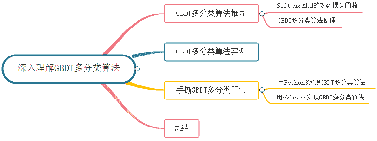

# 1\. GBDT多分类算法

## 1.1 Softmax回归的对数损失函数

当使用逻辑回归处理多标签的分类问题时，如果一个样本只对应于一个标签，我们可以假设每个样本属于不同标签的概率服从于几何分布，使用多项逻辑回归（Softmax Regression）来进行分类：

其中，   为模型的参数，而   可以看作是对概率的归一化。一般来说，多项逻辑回归具有参数冗余的特点，即将   同时加减一个向量后预测结果不变，因为 <embed style="width: 47.271ex" src="https://mmbiz.qlogo.cn/mmbiz_svg/9UjCmequjU9o18w31df8yibwWq6Fx1NuYP4cWJ9Mp2slTzZDlFfuMn4U0WODI9iaFSl2ZLanl7qaWXQkCMao79kzo4gXBGqEgP/0?wx_fmt=svg"> ，所以 <embed style="width: 47.271ex" src="https://mmbiz.qlogo.cn/mmbiz_svg/9UjCmequjU9o18w31df8yibwWq6Fx1NuYXNkAwCGt4MCSib9q8arjOArcRV9caTblF0VqNGz2nUBWQyhbibvic7h2iaR5aibS7ggEia/0?wx_fmt=svg"> 。

假设从参数向量   中减去向量   ，这时每一个 都变成了 。此时假设函数变成了以下公式：

从上式可以看出，从   中减去   完全不影响假设函数的预测结果，这表明前面的 回归模型中存在冗余的参数。特别地，当类别数为 时，

利用参数冗余的特点，我们将所有的参数减去   ，上式变为：

其中   。而整理后的式子与逻辑回归一致。因此，多项逻辑回归实际上是二分类逻辑回归在多标签分类下的一种拓展。

当存在样本可能属于多个标签的情况时，我们可以训练   个二分类的逻辑回归分类器。第   个分类器用以区分每个样本是否可以归为第   类，训练该分类器时，需要把标签重新整理为“第   类标签”与“非第   类标签”两类。通过这样的办法，我们就解决了每个样本可能拥有多个标签的情况。

在二分类的逻辑回归中，对输入样本   分类结果为类别 和 的概率可以写成下列形式：

其中，   是模型预测的概率值，   是样本对应的类标签。

将问题泛化为更一般的多分类情况：

由于连乘可能导致最终结果接近 的问题，一般对似然函数取对数的负数，变成最小化对数似然函数。

> **补充：交叉熵**
> 假设   和   是关于样本集的两个分布，其中   是样本集的真实分布，   是样本集的估计分布，那么按照真实分布   来衡量识别一个样本所需要编码长度的期望（即，平均编码长度）：
> 
> 如果用估计分布   来表示真实分布   的平均编码长度，应为：
> 
> 这是因为用   来编码的样本来自于真实分布   ，所以期望值  中的概率是   。而   就是交叉熵。
> 可以看出，在多分类问题中，通过最大似然估计得到的对数似然损失函数与通过交叉熵得到的交叉熵损失函数在形式上相同。

# 1.2 GBDT多分类原理

将GBDT应用于二分类问题需要考虑逻辑回归模型，同理，对于GBDT多分类问题则需要考虑以下Softmax模型：

其中   是   个不同的CART回归树集成。每一轮的训练实际上是训练了   棵树去拟合softmax的每一个分支模型的负梯度。softmax模型的单样本损失函数为：

这里的   是样本 在 个类别上作one-hot编码之后的取值，只有一维为 ，其余都是 。由以上表达式不难推导：

可见，这   棵树同样是拟合了样本的真实标签与预测概率之差，与GBDT二分类的过程非常类似。下图是Friedman在论文中对GBDT多分类给出的伪代码：

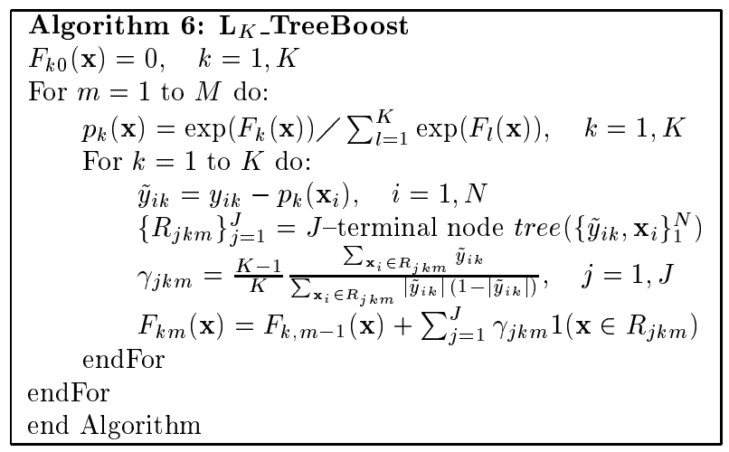

根据上面的伪代码具体到多分类这个任务上面来，我们假设总体样本共有   类。来了一个样本   ，我们需要使用GBDT来判断   属于样本的哪一类。

**第一步我们在训练的时候，是针对样本   每个可能的类都训练一个分类回归树。** 举例说明，目前样本有三类，也就是   ，样本   属于第二类。那么针对该样本的分类标签，其实可以用一个三维向量   来表示。   表示样本不属于该类，   表示样本属于该类。由于样本已经属于第二类了，所以第二类对应的向量维度为   ，其它位置为   。

**针对样本有三类的情况，我们实质上在每轮训练的时候是同时训练三颗树。** 第一颗树针对样本   的第一类，输入为   。第二颗树输入针对样本   的第二类，输入为   。第三颗树针对样本    的第三类，输入为   。这里每颗树的训练过程其实就是CART树的生成过程。在此我们参照CART生成树的步骤即可解出三颗树，以及三颗树对   类别的预测值    , 那么在此类训练中，我们仿照多分类的逻辑回归 ，使用Softmax 来产生概率，则属于类别   的概率为：

并且我们可以针对类别   求出残差   ；类别    求出残差   ；类别    求出残差  。

然后开始第二轮训练，针对第一类输入为   , 针对第二类输入为   ，针对第三类输入为   。继续训练出三颗树。一直迭代M轮。每轮构建3颗树。

当   时，我们其实应该有三个式子：

当训练完以后，新来一个样本   ，我们要预测该样本类别的时候，便可以有这三个式子产生三个值   。样本属于某个类别的概率为：

# 2\. GBDT多分类算法实例

## （1）数据集

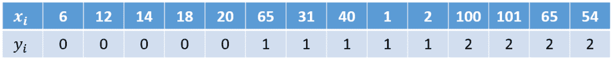

## （2）模型训练阶段

首先，由于我们需要转化 个二分类的问题，所以需要先做一步one-hot：

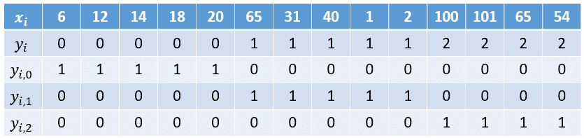

> 参数设置：
> 
> *   学习率：learning_rate = 1
>     
>     
> *   树的深度：max_depth = 2
>     
>     
> *   迭代次数：n_trees = 5

首先对所有的样本，进行初始化 <embed style="width: 17.059ex" src="https://mmbiz.qlogo.cn/mmbiz_svg/9UjCmequjU9o18w31df8yibwWq6Fx1NuYjgMbcEmNUictKVKTVwjEyG3Jf6KNUsM1VTITu1dibkmNrUvVFKAvY8R9icFicJsqtb0B/0?wx_fmt=svg"> ，就是各类别在总样本集中的占比，结果如下表。

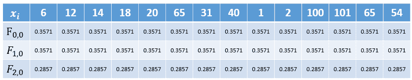

**注意：** 在Friedman论文里全部初始化为 ，但在sklearn里是初始化先验概率（就是各类别的占比），这里我们用sklearn中的方法进行初始化。

### 1）对第一个类别   拟合第一颗树   。

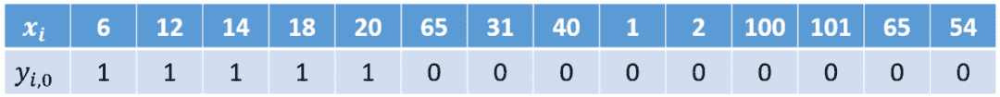

**首先**，利用公式 <embed style="width: 23.592ex" src="https://mmbiz.qlogo.cn/mmbiz_svg/9UjCmequjU9o18w31df8yibwWq6Fx1NuY6JZGR7TpP7ATmXzCZWxiaY1PYnl8QKzxFEnF68Qmbcib8GUBGxhsXnjz2SYSPIpiaial/0?wx_fmt=svg"> 计算概率。

**其次**，计算负梯度值，以   为例   ：

同样地，计算其它样本可以有下表：

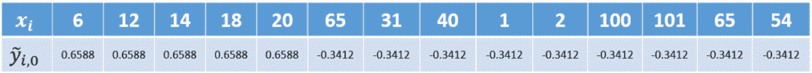

**接着**，寻找回归树的最佳划分节点。在GBDT的建树中，可以采用如MSE、MAE等作为分裂准则来确定分裂点。本文采用的分裂准则是`MSE`，具体计算过程如下。遍历所有特征的取值，将每个特征值依次作为分裂点，然后计算左子结点与右子结点上的MSE，寻找两者加和最小的一个。

比如，选择 作为分裂点时   。

*   左子结点上的集合的MSE为：

*   右子节点上的集合的MSE为：

比如选择   作为分裂点时   。

对所有特征计算完后可以发现，当选择   做为分裂点时，可以得到最小的 ，   。

下图展示以   为分裂点的   拟合一颗回归树的示意图：

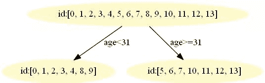

**然后**，我们的树满足了设置，还需要做一件事情，给这棵树的每个叶子节点分别赋一个参数   （也就是我们文章提到的   ），来拟合残差。

最后，更新   可得下表：

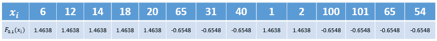

至此第一个类别（类别 ）的第一颗树拟合完毕，下面开始拟合第二个类别（类别 ）的第一颗树。

### 2）对第二个类别   拟合第一颗树   。

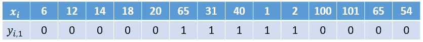

**首先**，利用 <embed style="width: 23.592ex" src="https://mmbiz.qlogo.cn/mmbiz_svg/9UjCmequjU9o18w31df8yibwWq6Fx1NuY6JZGR7TpP7ATmXzCZWxiaY1PYnl8QKzxFEnF68Qmbcib8GUBGxhsXnjz2SYSPIpiaial/0?wx_fmt=svg"> 计算概率。

**其次**，计算负梯度值，以   为例   ：

同样地，计算其它样本可以有下表：

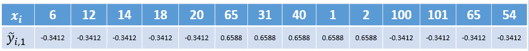

**然后**，以   为分裂点的   拟合一颗回归树，可计算得到叶子节点：

<svg xmlns="http://www.w3.org/2000/svg" viewBox="0 -900 16589.1 1200" style="-webkit-overflow-scrolling: touch;vertical-align: -0.679ex;width: 37.532ex;height: 2.715ex;max-width: 300% !important;"><g stroke="currentColor" fill="currentColor" stroke-width="0" transform="matrix(1 0 0 -1 0 0)"><g><g transform="scale(1.2)"><g transform="translate(6018, 0)">，</g></g></g></g></svg>

**最后**，更新   可得下表：

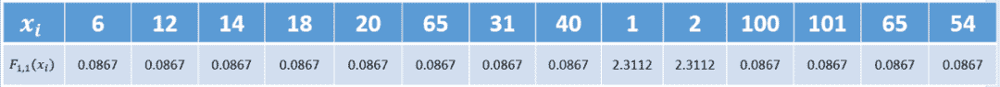

至此第二个类别（类别 ）的第一颗树拟合完毕。然后再拟合第三个类别（类别 ）的第一颗树，过程也是重复上述步骤，所以这里就不再重复了。在拟合完所有类别的第一颗树后就开始拟合第二颗树。反复进行，直到训练了 轮。

# 3\. 手撕GBDT多分类算法

本篇文章所有数据集和代码均在我的GitHub中，地址：https://github.com/Microstrong0305/WeChat-zhihu-csdnblog-code/tree/master/Ensemble%20Learning/GBDT_Multi-class

## 3.1 用Python3实现GBDT多分类算法

**需要的Python库：**

```
pandas、PIL、pydotplus、matplotlib 
```

其中`pydotplus`库会自动调用`Graphviz`，所以需要去`Graphviz`官网下载`graphviz-2.38.msi`安装，再将安装目录下的`bin`添加到系统环境变量，最后重启计算机。

由于用`Python3`实现`GBDT`多分类算法代码量比较多，我这里就不列出详细代码了，感兴趣的同学可以去我的`GitHub`中看一下，地址：https://github.com/Microstrong0305/WeChat-zhihu-csdnblog-code/tree/master/Ensemble%20Learning/GBDT_Multi-class/GBDT_GradientBoostingMultiClassifier

## 3.2 用sklearn实现GBDT多分类算法

```
import numpy as np
from sklearn.ensemble import GradientBoostingClassifier

'''
调参：
loss：损失函数。有deviance和exponential两种。deviance是采用对数似然，exponential是指数损失，后者相当于AdaBoost。
n_estimators:最大弱学习器个数，默认是100，调参时要注意过拟合或欠拟合，一般和learning_rate一起考虑。
learning_rate:步长，即每个弱学习器的权重缩减系数，默认为0.1，取值范围0-1，当取值为1时，相当于权重不缩减。较小的learning_rate相当于更多的迭代次数。
subsample:子采样，默认为1，取值范围(0,1]，当取值为1时，相当于没有采样。小于1时，即进行采样，按比例采样得到的样本去构建弱学习器。这样做可以防止过拟合，但是值不能太低，会造成高方差。
init：初始化弱学习器。不使用的话就是第一轮迭代构建的弱学习器.如果没有先验的话就可以不用管
由于GBDT使用CART回归决策树。以下参数用于调优弱学习器，主要都是为了防止过拟合
max_feature：树分裂时考虑的最大特征数，默认为None，也就是考虑所有特征。可以取值有：log2,auto,sqrt
max_depth：CART最大深度，默认为None
min_sample_split：划分节点时需要保留的样本数。当某节点的样本数小于某个值时，就当做叶子节点，不允许再分裂。默认是2
min_sample_leaf：叶子节点最少样本数。如果某个叶子节点数量少于某个值，会同它的兄弟节点一起被剪枝。默认是1
min_weight_fraction_leaf：叶子节点最小的样本权重和。如果小于某个值，会同它的兄弟节点一起被剪枝。一般用于权重变化的样本。默认是0
min_leaf_nodes：最大叶子节点数
'''

gbdt = GradientBoostingClassifier(loss='deviance', learning_rate=1, n_estimators=5, subsample=1
                                  , min_samples_split=2, min_samples_leaf=1, max_depth=2
                                  , init=None, random_state=None, max_features=None
                                  , verbose=0, max_leaf_nodes=None, warm_start=False
                                  )

train_feat = np.array([[6],
                       [12],
                       [14],
                       [18],
                       [20],
                       [65],
                       [31],
                       [40],
                       [1],
                       [2],
                       [100],
                       [101],
                       [65],
                       [54],
                       ])
train_label = np.array([[0], [0], [0], [0], [0], [1], [1], [1], [1], [1], [2], [2], [2], [2]]).ravel()

test_feat = np.array([[25]])
test_label = np.array([[0]])
print(train_feat.shape, train_label.shape, test_feat.shape, test_label.shape)

gbdt.fit(train_feat, train_label)
pred = gbdt.predict(test_feat)
print(pred, test_label) 
```

用`sklearn`实现`GBDT`多分类算法的`GitHub`地址：https://github.com/Microstrong0305/WeChat-zhihu-csdnblog-code/blob/master/Ensemble%20Learning/GBDT_Multi-class/GBDT_multiclass_sklearn.py

# 4\. 总结

在本文中，我们首先从Softmax回归引出GBDT的多分类算法原理；其次用实例来讲解GBDT的多分类算法；然后不仅用Python3实现GBDT多分类算法，还用sklearn实现GBDT多分类算法；最后简单的对本文做了一个总结。至此，GBDT用于解决回归任务、二分类任务和多分类任务就完整的深入理解了一遍。

# 5\. Reference

【1】Friedman J H. Greedy function approximation: a gradient boosting machine[J]. Annals of statistics, 2001: 1189-1232.
【2】《推荐系统算法实践》，黄美灵著。
【3】《百面机器学习》，诸葛越主编、葫芦娃著。
【4】Softmax函数与交叉熵，地址：https://blog.csdn.net/behamcheung/article/details/71911133#%E5%AF%B9%E6%95%B0%E4%BC%BC%E7%84%B6%E5%87%BD%E6%95%B0
【5】图示Softmax及交叉熵损失函数，地址：https://blog.csdn.net/Hearthougan/article/details/82706834
【6】GBDT详细讲解&常考面试题要点，地址：https://mp.weixin.qq.com/s/M2PwsrAnI1S9SxSB1guHdg
【7】机器学习算法GBDT的面试要点总结-上篇，地址：https://www.cnblogs.com/ModifyRong/p/7744987.html
【8】Gradient Boosting Decision Tree，地址：http://gitlinux.net/2019-06-11-gbdt-gradient-boosting-decision-tree/
【9】GBDT算法用于分类问题 - hunter7z的文章 - 知乎，地址：https://zhuanlan.zhihu.com/p/46445201
【10】GBDT原理与实践-多分类篇，地址：https://blog.csdn.net/qq_22238533/article/details/79199605
【11】代码实战之GBDT，地址：https://louisscorpio.github.io/2018/01/19/%E4%BB%A3%E7%A0%81%E5%AE%9E%E6%88%98%E4%B9%8BGBDT/
【12】Freemanzxp/GBDT_Simple_Tutorial，地址：https://github.com/Freemanzxp/GBDT_Simple_Tutorial

*AI学习路线和优质资源，在后台回复"AI"获取*

