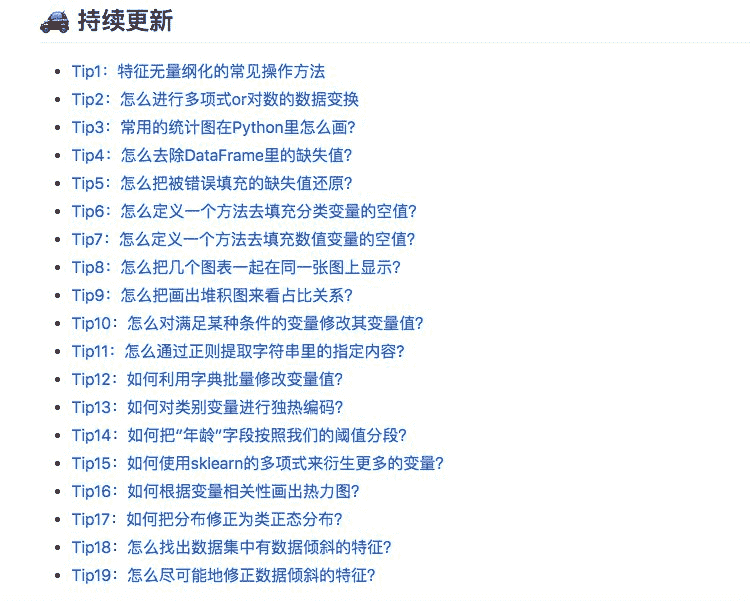
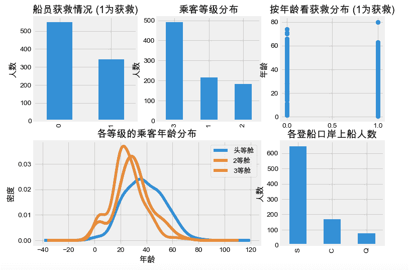
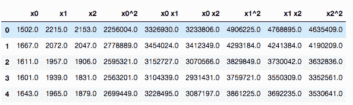
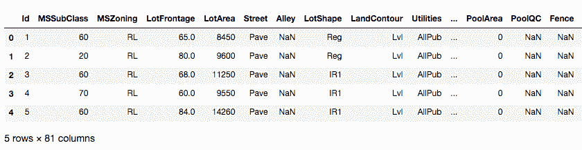
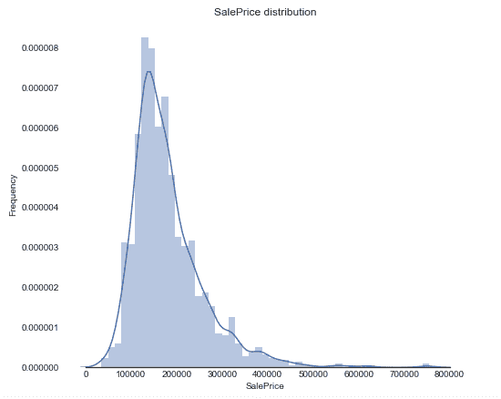
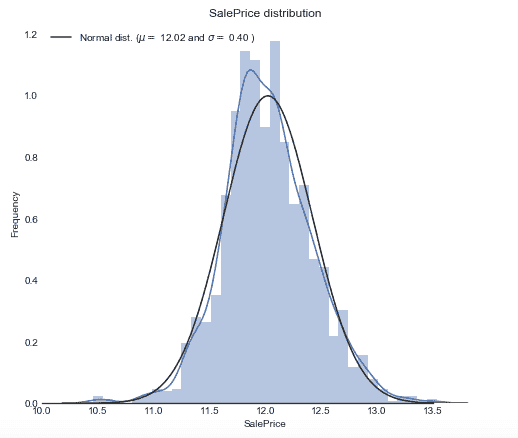

随着我们在机器学习、数据建模、数据挖掘分析这条发展路上越走越远，其实越会感觉到特征工程的重要性，平时我们在很多地方都会看到一些很好的特征工程技巧，但是都会是一个完整项目去阅读，虽然说这样子也可以学习挖掘思路，但有的时候浓缩的技巧总结也是十分重要！

GitHub上有一个专门针对**特征工程技巧**的“锦囊”，叫做**《Tips-of-Feature-engineering》**，作者把网路上、书本上的一些特征工程的项目，抽取其中的挖掘技巧，并把这些小技巧打包成一个又一个的小锦囊，供大家去检索并且学习，还蛮不错的！

**项目地址为：**

https://github.com/Pysamlam/Tips-of-Feature-engineering

大家可以先看看目前更新到的内容明细：



项目目前更新到19节，一般来说是每天一更新，每一节都会有配套的数据集以及代码，**下面我们拿几个“锦囊”来看一下！**

### Tip8：怎么把几个图表一起在同一张图上显示？

这里是使用泰坦尼克号的数据集，前期我们做EDA的时候需要探查数据的分布，从而发现其中的规律，这一节的技巧就是教我们如何画一些常见的图形，同时显示在同一张图上。

<figcaption></figcaption>

#### 关键代码

```
import matplotlib.pyplot as plt

# 设置figure_size尺寸
plt.rcParams['figure.figsize'] = (8.0, 6.0)

fig = plt.figure()

# 设定图表颜色
fig.set(alpha=0.2)

# 第一张小图
plt.subplot2grid((2,3),(0,0))
data_train['Survived'].value_counts().plot(kind='bar')
plt.ylabel(u"人数")
plt.title(u"船员获救情况 (1为获救)")

# 第二张小图
plt.subplot2grid((2,3),(0,1))
data_train['Pclass'].value_counts().plot(kind="bar")
plt.ylabel(u"人数")
plt.title(u"乘客等级分布")

# 第三张小图
plt.subplot2grid((2,3),(0,2))
plt.scatter(data_train['Survived'], data_train['Age'])
plt.ylabel(u"年龄")
plt.grid(b=True, which='major', axis='y')
plt.title(u"按年龄看获救分布 (1为获救)")

# 第四张小图，分布图
plt.subplot2grid((2,3),(1,0), colspan=2)
data_train.Age[data_train.Pclass == 1].plot(kind='kde')
data_train.Age[data_train.Pclass == 2].plot(kind='kde')
data_train.Age[data_train.Pclass == 3].plot(kind='kde')
plt.xlabel(u"年龄")
plt.ylabel(u"密度")
plt.title(u"各等级的乘客年龄分布")
plt.legend((u'头等舱', u'2等舱',u'3等舱'),loc='best')

# 第五张小图
plt.subplot2grid((2,3),(1,2))
data_train.Embarked.value_counts().plot(kind='bar')
plt.title(u"各登船口岸上船人数")
plt.ylabel(u"人数")
plt.show() 
```



我们从上面的可视化操作结果可以看出，其实可以看出一些规律，比如说生还的几率比死亡的要大，然后获救的人在年龄上区别不大，然后就是有钱人（坐头等舱的）的年龄会偏大等。

### Tip15：如何使用sklearn的多项式来衍生更多的变量？

关于这种衍生变量的方式，理论其实大家应该很早也都听说过了，但是如何在Python里实现，也就是今天在这里分享给大家，其实也很简单，就是调用`sklearn`的`PolynomialFeatures`方法，具体大家可以看看下面的demo。

这里使用一个人体加速度数据集，也就是记录一个人在做不同动作时候，在不同方向上的加速度，分别有3个方向，命名为x、y、z。

#### 关键代码

```
# 扩展数值特征
from sklearn.preprocessing import PolynomialFeatures

x = df[['x','y','z']]
y = df['activity']

poly = PolynomialFeatures(degree=2, include_bias=False, interaction_only=False)

x_poly = poly.fit_transform(x)
pd.DataFrame(x_poly, columns=poly.get_feature_names()).head() 
```



就这样子简单的去调用，就可以生成了很多的新变量了。

### Tip17：如何把分布修正为类正态分布？

今天我们用的是一个新的数据集，也是在kaggle上的一个比赛，大家可以先去下载一下：


下载地址：

https://www.kaggle.com/c/house-prices-advanced-regression-techniques/data

```
import pandas as pd
import numpy as np
# Plots
import seaborn as sns
import matplotlib.pyplot as plt

# 读取数据集
train = pd.read_csv('./data/house-prices-advanced-regression-techniques/train.csv')
train.head() 
```



首先这个是一个价格预测的题目，在开始前我们需要看看分布情况，可以调用以下的方法来进行绘制：

```
sns.set_style("white")
sns.set_color_codes(palette='deep')
f, ax = plt.subplots(figsize=(8, 7))
#Check the new distribution
sns.distplot(train['SalePrice'], color="b");
ax.xaxis.grid(False)
ax.set(ylabel="Frequency")
ax.set(xlabel="SalePrice")
ax.set(title="SalePrice distribution")
sns.despine(trim=True, left=True)
plt.show() 
```



我们从结果可以看出，销售价格是右偏，而大多数机器学习模型都不能很好地处理非正态分布数据，所以我们可以应用log(1+x)转换来进行修正。那么具体我们可以怎么用Python代码实现呢？

```
# log(1+x) 转换
train["SalePrice_log"] = np.log1p(train["SalePrice"])

sns.set_style("white")
sns.set_color_codes(palette='deep')
f, ax = plt.subplots(figsize=(8, 7))

sns.distplot(train['SalePrice_log'] , fit=norm, color="b");

# 得到正态分布的参数
(mu, sigma) = norm.fit(train['SalePrice_log'])

plt.legend(['Normal dist. ($\mu=$ {:.2f} and $\sigma=$ {:.2f} )'.format(mu, sigma)],
            loc='best')
ax.xaxis.grid(False)
ax.set(ylabel="Frequency")
ax.set(xlabel="SalePrice")
ax.set(title="SalePrice distribution")
sns.despine(trim=True, left=True)

plt.show() 
```



目前这个项目更新到了19节，但是会持续不断更新“锦囊”，欢迎大家来进行star哦！

**项目地址为：**

https://github.com/Pysamlam/Tips-of-Feature-engineering

*AI学习路线和优质资源，在后台回复"AI"获取*

