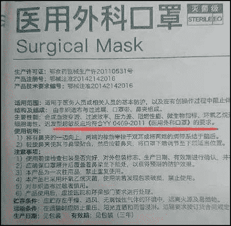
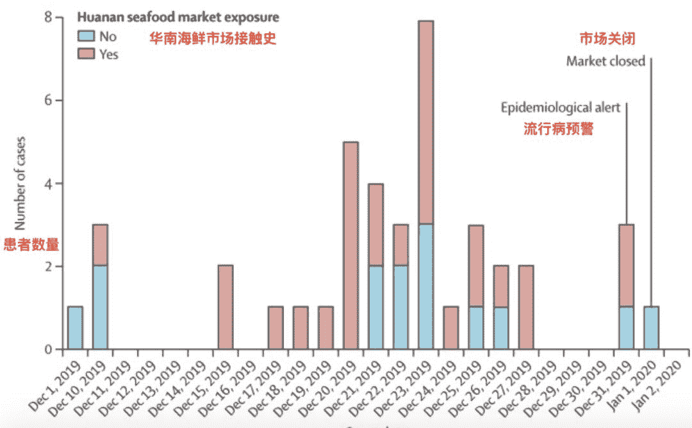
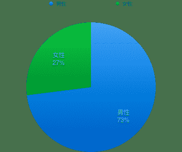
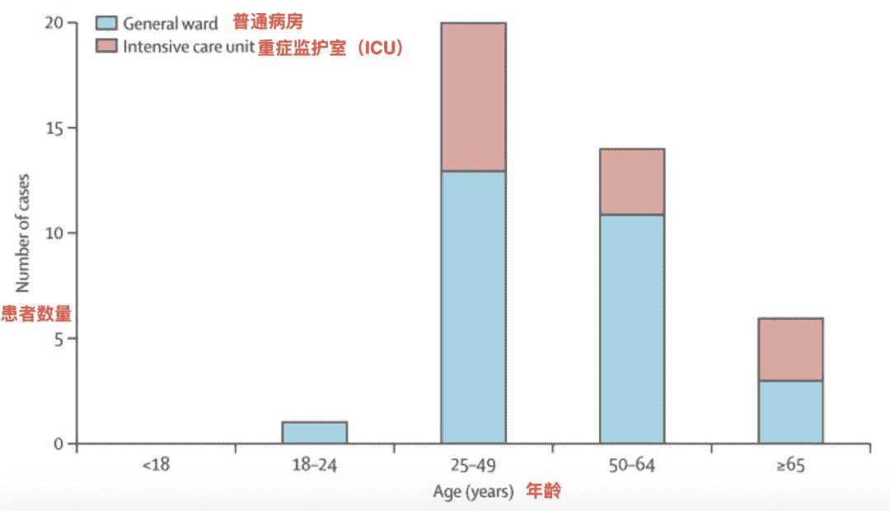
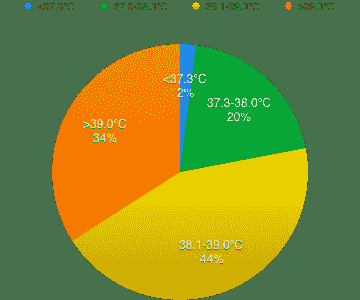
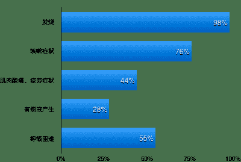
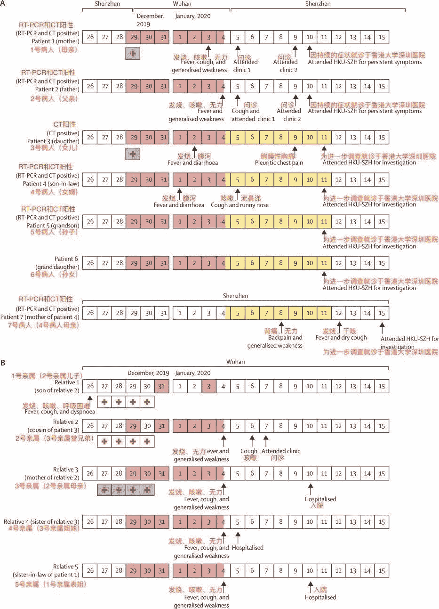
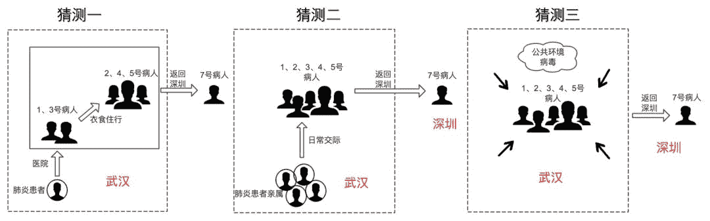

自微信订阅号《夕小瑶的卖萌屋》

**前言**

新型冠状病毒（2019-nCoV）的突发恰逢春节，千家万户都对疫情十分关注。令人心痛的是，病毒带来的不止有病痛，还有来自各路媒体的大量谣言和不实解读。作为科研工作者的我们，希望能略尽绵薄之力，为大家整理学术界最新研究成果，并进行通俗易懂、严谨客观的翻译和解读。

具体来说，我们对 2020年1月24日发表在医学领域国际顶级期刊**《柳叶刀》**上的关于新型冠状病毒（2019-nCoV）的两篇论文*（这也是目前唯二且最新的两篇论文）*进行了整理和编译，客观且通俗的呈现论文的原始数据、原始分析和原始结论，并进行了部分重要细节的强调。

在正文开始之前，先插播一个普遍存在的口罩选择误区。

**口罩选择**

论文和各路报道中普遍提到的**N95医用防护口罩**虽然是最佳选择，但是价格贵，并且现在相当难买。如果不是近期需要去医院、人流密集地带或与病人密切接触，性价比更高的选择是购买**医用外科口罩**。

注意，是医用**外科**口罩，普通的医用口罩是没有过滤作用的。几种医用口罩的区别科普见

> https://www.cn-healthcare.com/articlewm/20200122/wap-content-1083539.html

这里不对购买渠道作任何推荐，大家在购买时一定要留意包装上是否有注明这是医用外科口罩，符合**YY 0469-2011**的要求。如下图。

**Clinical features of patients infected with 2019 novel coronavirus in Wuhan, China **

该论文发表于2020年1月24号（三天前），对前41个确诊的新型冠状病毒患者（2019年12月16日至2020年1月2日）进行了详细的病症观测和相关特征提取。论文中将本次新型冠状病毒命名为the 2019 novel coronavirus，简称**2019-nCoV**。

这41例确诊的患者都是通过**下一代测序（**nextgeneration sequencing）或**实时RT-PCR（**real-time RT-PCR）的方法检测到了**呼吸道标本**中存在2019-nCoV。患者的临床表现与SARS非常相似。重症患者会发展为急性呼吸窘迫综合征（**ARDS**），需要转入ICU输氧治疗

> 提醒：近期一些利欲熏心的黑心商家开始传播一些谣言，声称研制出了可以确诊的特殊试纸、仪器并公开上市发售，请大家理智判断，谨防上当受骗。

**死亡率**

关于新型冠状病毒**死亡率存在很多****错误的计算方式和****不实****谣****言**。

*谣言一：**死亡率很低，死了50个，确诊2000个，死亡率只有**2.5%**；*

*谣言二：**死亡率很高的，确诊2000个，但是现在只治愈了50个，治愈率只有**2.5%**！**！*

*谣言三：**死亡率很高的，治好了49个，死了56个，死亡率高达**53%**！**！**！*

以上计算都是明显不严谨、不科学的！！！

对死亡率最科学、客观的计算方式是**先确定一批确诊患者，然后对其进行持续追踪，直到所有患者均出院或死亡为止，计算出死亡者所占比例。**

在这篇论文中追踪的41例确诊患者中，最终28名（68％）已出院，六名**（15％）**患者已死亡。出院适应性的基础是至少消退10天的发烧，并改善胸部放射学证据和上呼吸道呼吸道样本的病毒清除率。**所以目前研究成果中的对死亡率的初步估计是****15%****。**

但是，这个15%可能不是最终的数据，一方面是小样本估计会有偏差，另一方面早期会更加关注危重病例，可能会导致死亡率估计比实际值偏高。期待后面对更多的患者进行追踪、统计，减小对死亡率估计的偏差。

**患者特性**

**1\. 是否有华南海鲜市场接触史**

下图是从首例发病日期（2019年12月1日）起到2020年1月2日，发病患者是否有海南市场接触史柱状图。其中蓝色表示无华南海鲜市场接触史，红色代表有华南海鲜市场接触史），横坐标为发病日期，纵坐标为患者数量。

 总得来说，66%的患者有武汉华南海鲜市场接触史，因此该地点被高度怀疑为发病源头。但是需要注意的一个细节是，2019.12.1第一例患者发病，但是该患者并没有武汉华南海鲜市场接触史，并且他的家人均未发烧或出现任何呼吸道症状，而且他和之后的患者之间也没有发现流行病学的联系；接下来2019.12.10发病的三例患者中，有两位也是没有华南海鲜市场接触史。**因此谨慎的说，疾病的发病源头仍然存在其他地方的可能性。**

而第一例因病致死的患者则是一直在华南海鲜市场活跃，最终由于连续7天有发烧，咳嗽和呼吸困难而住院，最终死亡。发病5天后，他的妻子在没有接触华南海鲜市场的情况下也患上了肺炎。

**2\. 性别**

在研究的41位确诊患者中，男性占比较大占73%，女性占27%。

**3. 年龄分布**

横坐标为年龄，纵坐标为患者数（蓝色为非重症患者数，红色为ICU重症患者数）。

* 注：41位患者年龄中位数为49岁，前41例中无儿童和青少年。*

**4. 病史**

有32%的患者在感染前已经患有其他疾病。其中，有20%（占总患者比例）的患者患有糖尿病，15%患有高血压，15%患有心血管疾病。

**症状（患病特征）**

在所观测的41位患者中，**98%**的患者有发烧症状，这是召回该病症的最强特征。具体的体温占比如下：

  

如下是其他症状的发病占比

在55%呼吸困难患者中，从发病到出现呼吸困难经历的天数范围为5到13天，中位数为8天。有32%的患者因重度急性呼吸窘迫综合征（ARDS）转至重症监护室（ICU）治疗，其中，从入院到病情恶化到ARDS最短**短至两天**。

虽然2019-nCoV感染的这些特征与SARS-CoV和MERS-CoV有一些相似之处，但是2019-nCoV的患者**很少感染有明显的上呼吸道症状（例如鼻涕，打喷嚏或喉咙痛），表示2019-nCoV的目标细胞可能位于****下呼吸道****。**此外，2019-nCoV患者很少出现肠道症状和体征（例如腹泻），而约20–25％的MERS-CoV患者或SARS-CoV感染引起腹泻。

**发病机理与治疗方案**

发病机理尚未被完全解释，尸检或活检研究将是了解该疾病的关键。

鉴于SARS-CoV，MERS-CoV，和本次的2019-nCoV感染可诱导大量细胞因子，因此糖皮质激素经常用于治疗重症患者，以期减少炎症引起的肺损伤。然而在SARS和MERS中的经验表明，**接受该激素治疗不但没有降低死亡率，反而会导致病毒被清除的更为缓慢**。因此对于2019-nCoV的激素治疗方案需要进一步系统性评估。

之前的一项研究表明，洛匹那韦和利托那韦的联合使用可为SARS-CoV患者带来实质性的临床获益（不良的临床结局较少）。雷姆昔韦（广谱抗病毒核苷酸前药）也被证明可以有效治疗MERS-冠状病毒和SARS-CoV感染。然而，由于2019-nCoV是一种新兴病毒，因此截止到发文日期（1月24日），尚未开发出有效的方法来治疗由该病毒引起的疾病。由于指定医院已经可以使用lopinavir和ritonavir的组合，因此已迅速启动了一项随机对照试验，以评估lopinavir和ritonavir联合使用对2019-nCoV感染住院的患者的疗效和安全性。

**A familial cluster of pneumonia associated with the 2019 novel coronavirus indicating person-to-person transmission: a study of a family cluster**

这篇论文也是在2020年1月24日发表于柳叶刀。论文对一个感染肺炎的七口之家进行了详细的医学诊疗和调查溯源。

这一家七口的迁移路径如下图（手机端请点开放大）

 上图是七口之家2019年12月29日到2020年1月4日从深圳去武汉再从武汉回深圳，最终6人确诊感染病毒的过程。**红色框**代表1-6号病人在武汉和武汉的亲属有亲密接触（吃饭聚餐等），**黄色框**代表3-6号病人回到深圳家中和7号病人一起生活。**红色十字****白底框**代表1号和2号亲属在医院过夜，**红色十字****蓝底框**代表1号病人、3号病人和3号亲属去医院探望被诊断为发热肺炎的1号亲属。

深圳的这七口之家，一位老人留在深圳家中，六位去武汉看望亲属（12月19日到1月4日），看望亲属后回到深圳家中，其中四位和留在深圳的老人一起生活（1月4日到1月11日）。**七口之家中的六位先后出现发热等症状并最终确诊，而他们都没有接触过动物、去过华南海鲜市场和吃过野生动物。**值得注意的是，**7号病人**在此前的14天中没有去过武汉或者深圳的市场，仅于1月8日由于背痛去当地医院门诊部就诊。

关于这个家庭案例，存在多种可能的传播路径：

第一个最有可能的传播路径是1号病人在武汉看望病人时被感染后，从武汉回深圳的1-5号病人将病毒再传播给一直在深圳的7号病人。

第二种可能是，1-5号病人均在武汉期间被2-5号亲属传染，然后回到深圳后将其传播给7号病人。但是这种情况的可能性较小，因为1-5号病人的症状出现在2-5号亲属之前。

第三种可能性是1-5号病人由于一个未知的公共源在武汉期间被感染，将其传播给7号病人。

2-5号亲属没有接触过动物、去过华南海鲜市场和吃过野生动物，很有可能在医院或者其他社群中被感染，但是这无法从科学的角度去考证。值得注意的是，去武汉市医院探视过的1号和3号病人很有可能在出现症状之前就被感染，因为5号病人没有症状但是仍可以传播病毒。

该发现表明**新型冠状病毒可能通过人传人，再通过被感染者的旅行在城市之间传播**。且令人难以相信的是，**去过武汉的家庭感染率高达****83%****（**6位去武汉的家庭成员中1-5号共5位被感染）

> 虽然译者认为数据基数过小，可能在统计意义上的缺乏可信度

另一个发现是，**存在****无症状****的感染案例（5号病人）**。虽然SARS无症状的感染并不常见，但是在2004年出现的小型SARS中有记录。此外，**3号和4号病人****无发热症状****，这种隐蔽的被感染者很有可能加速病毒的传播和疫情的扩散。**

以上就是这两篇论文的主要内容，如有错误之处烦请在评论区指出。最后，控制疫情，政府、社会各界和公众都在持续努力。请大家对疫情防护有信心，不传谣不信谣。

*AI学习路线和优质资源，在后台回复"AI"获取*

