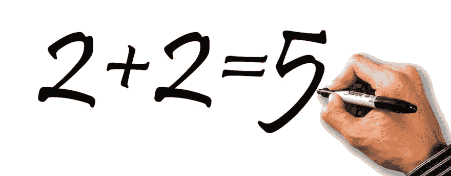

选自towardsdatascience

**作****者：Niklas Donges**

**机器之心编译**

> 在 ML 工程实践中，很多时候都会走一些弯路，可能是模型选错了，也可能是某个超参数一直不正确。那么我们该如何根据模型结果确定下一步方向呢？在这一篇文章中，Niklas Donges 从六个基本概念总结了吴恩达 Machine Learning Yearning 整本书的精髓，这六个概念能引导我们快速迭代和更新 ML 系统。

《机器学习训练秘籍》（Machine Learning Yearning）这本书讲的是如何构建项目的开发流程。该书包括了许多在别处难得一见的实用见解，讲述的形式又非常适合分享给团队中的其他成员以及合作者。大多数人工智能方面的课程会向你阐释不同机器学习算法的工作原理，而这本书教授的是如何实际使用它们。

中文书籍地址：https://accepteddoge.com/machine-learning-yearning-cn/

如果你想要成为人工智能行业的技术主管，这本书会助你一臂之力。过去，要想学习如何在人工智能项目中做决策，唯一的方法是去攻读研究生课程、或者在公司积累经验。现在，《机器学习训练秘籍》这本书可以助你快速获得这项技能，从而变得更加擅长构造复杂的人工智能系统。

**目录**

*   前言

*   概念 1：迭代，迭代，迭代

*   概念 2：使用单一评估指标

*   概念 3：错误分析很关键

*   概念 4：定义一个最优错误率

*   概念 5：研究人类能做好的问题

*   概念 6：如何划分数据集

*   总结

**前言**

该书从一个小故事讲起。想象一下，你的公司想要建造一个先进的猫咪检测系统。你已经做了一个原型，可惜的是，这个系统的性能不太行。你的团队提出了多个改进系统的想法，但你有点搞不清楚接下来该走哪条路。或许你会造出世界领先的猫咪检测平台，又或许，你会因走错路而浪费掉几个月的时间。

这本书则能告诉你，在这样的情形下如何做抉择、如何排定优先级。吴恩达指出，大多数机器学习问题都会为下一步最应该做什么或者避免什么留下线索，学习「读懂」这些线索是机器学习领域的关键技能。

简而言之，《机器学习训练秘籍》的主旨是让你深入理解如何确定机器学习项目的技术方向。

由于你的团队成员们可能会对你提出的新想法产生质疑，吴恩达把书本章节写得非常精简（1-2 页）。这样你的成员们就能在几分钟内读完，并理解这些概念背后的思想。此外，这本书并不适合完全的初学者，因为它需要对有监督学习和深度学习有一些基本的了解。

在本文中，我会用我自己的语言和理解来分享这本书中的六个概念。

**概念 1：迭代，迭代，迭代……**

吴恩达在该书中从头到尾一直强调：由于机器学习是一个迭代的过程，快速迭代至关重要。比起去思考如何为你的问题建造一个完美的机器学习系统，不如先尽快造出一个简单的原型系统。若你不是这个问题所属领域的专家，就更应如此，因为要正确找出最佳方向，不靠实验实在是太难了。

你应该在几天内造出第一个原型，然后就会有线索帮你找到改进原型的最佳方向。在下一个迭代中，你可以基于其中一个线索改进这个系统，并生成下一个版本，然后周而复始。

接着他阐释道，你迭代得越快，进步就越多。这本书中的其它概念也都基于这个原则。要注意的是，这一点适用于那些只想做一个基于人工智能的应用，而不是在这个领域做研究的人。

**概念 2：使用单一评估指标 **

这个概念是建立在不停迭代的基础上。为何要选择一个单值评估指标，道理也很简单：它使你能够快速评估算法，从而更加快速地迭代。使用多种评估指标会使算法之间的比较变得更为困难。

想象你有两个算法。第一个准确率 94%，召回率 89%。第二个准确率 88%，召回率 95%。

这种情况下，如果你不选择一个单一评估指标，就很难显而易见地指出哪个分类器更好，于是你就需要花费更多的时间搞定它。而问题在于，每一次迭代都需要损失一些时间，积累到最后就非常可观了。因为你会尝试很多不同的想法，调整架构、参数、特征等等，如果你用的是一个单值评估指标（比如准确率或者 f1-值），你就能把你所有的模型按照他们的性能排序，快速决定哪个最好。另外，还有一个方法可以改善评估的过程，就是把多个指标合并成一个，比如给多个错误度量求平均。

当然，有一些机器学习问题需要满足不止一个指标，比如要考虑运行时间。吴恩达这样说：你应该定义一个「可接受」的运行时间，从而快速排除那些太慢的算法，然后用你的单值评估指标比较那些符合条件的算法。

简单而言，一个单值评估指标使你能够快速评估算法，从而更快地迭代。

**概念 3：误差分析至关重要**

误差分析指的是检查算法结果中错误样例的过程。比如，假设你的猫咪检测系统把鸟误认为是猫，那么你就需要对这个问题有一些解决方案。

在恰当的误差分析后，你可以估计出某个改进方案实际能为这个系统提供多少性能增益。因此我们不用花费好几个月先去实现某个方案，然后才发现它对你的系统没多大影响。这样你就能判断，把资源投到哪个方案上效果会最好。如果你发现误识别的图片中只有 9% 是鸟，那无论在鸟的图片上把算法性能提高到多少都没什么用，因为它最多也就能改善你 9% 的错误。

另外，通过误差分析，你还能快速判断多个改进方案的好坏。如果验证集里有 100 张分类错误的图片，只需要新建一个表单，一边检查一边填写。在表单里，每个分类错误的图片为一行，每个改进方案为一列。然后你遍历所有分类错误的图片，记录哪些改进方案能正确分类这张图。

然后你就会清楚，比方说，方案 1 能使系统把 40% 的误分类图片分对、方案 2 为 12%、方案 3 仅仅为 9%。所以，可知你的团队最应该进行的是改进是方案 1。

同时，一旦开始仔细查看这些误分类样本，你还可能找到更多新的灵感来改善算法。

**概念 4：定义一个最优错误率**

最优错误率可以指导你接下来该怎么做。在统计学中，我们也常称之为贝叶斯错误率。

想象这样一个场景，你在做一个的系统。你发现用户们上传的音频文件中，预计会有 19% 的音频背景噪音太大，连人都无法识别到底说了啥。如果是这种情况，那么即便是最优秀的系统大概也会有接近 19% 的错误率。与之相反，如果你要研究的问题最优错误率几乎能到达 0%，那就可以指望你的系统也能做得差不多好。

它也可以帮你检测算法是否存在高偏差或者高方差的问题，从而帮你判断接下来如何改进算法。

但怎么才能知道最优错误率是多少呢？对于那些人类擅长的任务，你可以把你的系统的性能和人相比，差不多就是最优错误率了。如果是人类不擅长的任务，要定义最优错误率往往很难。正因为此，你应该去研究人类本身也能做好的问题，这一点我们会在下一个概念中进行讨论。

**概念 5：研究人类能做好的问题**

在这本书中，吴恩达多次探讨了为什么建议大家去研究人类本身也能做好的问题，比如语音识别、图像分类、物体检测等等。原因有以下几点。

首先，更容易获取或创建一个带标签的数据集。因为如果人们自己可以解决这个问题，那对他们来说，给你的机器学习算法准备些标签也不是什么难事。

其次，你可以把人的水准作为最优错误率，即你的算法想要达到的目标。吴恩达表示，定义好一个合理可行的最优错误率，有助于加速团队的开发进程，也可以帮你检测算法是否有高偏差或者高方差的问题。

再者，这样你就可以用你的人类直觉来做误差分析。比如，如果你在做一个语音识别系统，而你的模型给了错误的答案，那你可以试着去思考：一个人想要正确转录这个音频会需要什么信息，由此去改进算法。虽然算法在越来越多人类不太擅长的任务上已经超过了人类，你还是应该尽量避免去研究这些问题。

总而言之，你应该避免这些任务，因为：获取数据的标签更难、你不再能依赖人类直觉、很难确定最优错误率。

**概念 6：如何划分数据集**

吴恩达也提出了划分数据集的方法，建议如下：

*   训练集：你只用它来训练算法，不做别的。

*   ：用于调试超参、选择并创建合适的特征、做误差分析，基本上我们需要根据它来为算法做决策。

*   测试集：测试集用于评估你系统的性能，不能用于做决策。只在评估时使用，不做别的。

验证集和测试集使你的团队得以快速评估算法的性能，它们的目的是提供引导，让你为系统做出最正确的改进。

选择验证集和测试集时，吴恩达建议你考虑系统部署后你想要搞定的真实场景，使这两个集合能如实反映该场景中的数据。如果你预期实际数据会和你当下的训练数据有所不同，这一点就更为重要。比如，你训练时用的是普通的相机图片，而以后你的系统作为一个手机应用的一部分，只会收到手机图片。如果你没有足够的手机图片来训练系统，你就会面临这个问题。所以，你应该选择能反映未来真实目标数据的样例作为测试集，而不是你用来训练的数据。

同时，你应该根据同一分布选取验证集和测试集。否则，有可能你的团队造出的东西在验证集上效果很好，但在测试集上效果极差，而后者才是你最关注的的。

**总结**

在本文中，你学到了《机器学习训练秘籍》中的六个概念。现在你知道为什么快速迭代很重要，为什么该用一个单值评估指标，误差分析是干什么的，以及它为什么重要。同时，你也认识了最优错误率，明白了为什么应该研究人类也能做好的问题。另外，你还了解了应该使验证集和测试集与实际场景数据相一致，以及这两个集合应该近似同一分布。希望本文让你对这本书的概念有了初步的理解，这绝对是一本值得一读的书。******

*原文链接：https://towardsdatascience.com/6-concepts-of-andrew-ngs-book-machine-learning-yearning-abaf510579d4*

*AI学习路线和优质资源，在后台回复"AI"获取*

