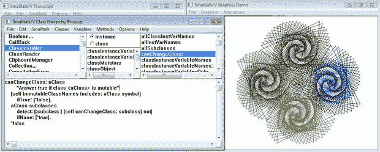

选自fast.ai

**作者：****Jeremy Howard**

**机器之心编译**

> 不久前，fast.ai 创始研究员 Jeremy Howard 撰文介绍了 fast.ai 最近提出的新型编程环境 nbdev，它基于 Jupyter Notebook 构建，并将 IDE 编辑器的优点带入 Jupyter Notebook，可以在 Notebooks 中开发而不影响整个项目生命周期。

*   nbdev GitHub 地址：https://github.com/fastai/nbdev/

*   nbdev 文档：https://nbdev.fast.ai/

> 「我认为，nbdev 是编程环境的一项巨大进步。」——Swift、LLVM 以及 Swift Playgrounds 创造者 Chris Lattner

近年来，我和同事 Sylvain Gugger 一直为热爱的事情而努力工作，它就是 Python 编程环境 nbdev。nbdev 允许用户在 Jupyter Notebook 中创建包含测试和丰富文档系统的完整 Python 包。我们已使用 nbdev 编写了一个大型编程库（fastai v2）以及多个小型项目。

*本文作者、fast.ai创始研究员Jeremy Howard。*

**nbdev 系统适用于「探索式编程」（exploratory programming）**。我们发现，大多数程序员将大部分工作时间用在探索和试验上。比如我们会试验从未用过的新型 API，来理解其运作原理；我们探索正在开发的算法的行为，以查看其处理不同数据类型的方式；我们探索不同的输入组合，来调试代码……

**nbdev：****探索式编程**

我们认为探索流程是有价值的，应该保存下来，以便其他程序员（或自己）在六个月时间之内能够看到发生了什么并通过示例学习。把它看作科学期刊，你可以利用它展示自己尝试了什么东西（包括奏效的和无效的），和为了增强对工作系统的理解付出的努力。在探索过程中，你会发现你理解到的某些部分对于系统运行非常关键，所以探索应包含测试和断言（tests and assertions）。

当你基于 prompt（或 REPL）开发，或者使用 notebook-oriented 开发系统（如 Jupyter Notebook）开发时，「探索」是最简单的。但这些系统的「编程」部分没有那么强大。这也是人们主要使用这类系统执行早期探索，然后转向 IDE 或文本编辑器的原因。

转而使用其他系统是为了获得 notebook 或 REPL 不具备的功能，比如：优秀的文档查找功能、优秀的语法高亮功能、集成单元测试，以及（关键的）生成最终可分发源代码文件的能力。

nbdev 将 IDE/编辑器开发的优势带入 notebook 系统中，以便用户在 notebook 中完成开发，且不会影响整个项目生命周期。为支持此类探索，nbdev 基于 Jupyter Notebook 构建（这意味着，相比普通编辑器或 IDE，nbdev 能够更好地支持 Python 的动态特性），并针对软件开发添加了以下重要工具：

*   遵循最佳实践自动创建 Python 模块，如利用导出函数、类和变量自动定义 __all__；

*   在标准文本编辑器或 IDE 中执行代码导航和编辑，并将所有更改自动导出回 notebook 中；

*   基于代码自动创建可搜索的超链接文档，引号中的任意单词均被超链接至合适的文档，文档站点的侧边栏可链接至每个模块等等；

*   pip 安装包（上传到 PyPI）；

*   测试（在 notebook 中直接定义，可并行运行）；

*   持续集成；

*   版本控制和冲突处理。

下图是 nbdev 真实源代码中的一个片段，该片段即在 nbdev 中写成。

*在 nbdev 源代码中探索 notebook 文件格式。*

如上图所示，用这种方式构建软件时，项目团队中的所有成员均可以从你为理解问题域所做的工作中获益，如文件格式、性能特点、API 边缘案例（edge case）等。由于开发过程在 notebook 中进行，因此你还可以添加图表、文本、链接、图像、视频等，这些将被自动纳入库文档中。定义代码的单元格将被隐藏，并被标准化函数文档代替，从而展示其名称、参数、文档字符串和源代码 GitHub 链接。

关于 nbdev 特性、安装和使用的更多信息，参见 nbdev 文档：https://nbdev.fast.ai/。

下文将介绍构建 nbdev 的原因以及 nbdev 设计原理背后的历史和背景。首先，我们先来了解历史。（如果你对此不感兴趣，可以跳至「Jupyter Notebook 少了什么？」）

**软件开发工具**

大部分软件开发工具不是基于探索式编程创建的。**大约 30 年前我刚开始写代码时，瀑布软件开发几乎处于垄断地位**。这种编程方法预先详细定义整个软件系统，然后在编程时尽可能地靠近规格。那时我便认为，这种方法并不适合我的工作方式。

**1990 年代，事情出现变化，敏捷开发开始流行**。人们开始理解「大部分软件开发是迭代过程」这一现实，并开发出符合这一事实的工作方式。但是，当时我们使用的软件开发工具并没能完成变革，去匹配工作方式的改变。一些工具被添加到库中，用来更轻松地执行测试驱动开发。**但这些工具只是现有编辑器和开发环境的轻度扩展，并没有真正去重新思考开发环境应该是什么样子**。

探索式测试是敏捷测试的重要组成部分，**近年来，人们对探索式测试的兴趣逐渐增长**。我们绝对赞同这一点，但我们认为走的还不够远。我们认为**在软件开发流程的每个部分中，探索都应当成为核心**。

传奇人物 Donald Knuth 走在时代前列，他想看到不同的开发方式。1983 年，他提出了一种叫做「文学式编程」的方法，并将其描述为「结合编程语言和文档语言，从而使写出来的程序比仅用高级语言编写的程序更加稳健、更具可移植性、更容易维护、编写时更富有乐趣。其主要思想是将程序看作受众为人类而非计算机的文学作品。」

在很长一段时间里我为这个想法而痴迷，但很不幸这个想法并没有成功。因为这样会致软件开发时间变长，没人认愿意付出这种代价。

将近 30 年后，另一位变革性的思想家 Bret Victor 表达了对当时开发工具的深刻不满，并描述了如何设计「理解程序的编程系统」。他在突破性演讲「Inventing on Principle」中表示：「我们现在的计算机程序概念是一串文本定义，你把它们传递到基于 1950 年代末 Fortran 和 ALGOL 直接得到的编译器。但是 Fortran 和 ALGOL 语言是为穿孔卡片设计的啊。」

他提出了完善的示例，以及多项编程系统设计新原则。尽管没人完全实现他的全部想法，但已经有人尝试实现其中的一部分。或许最知名也最完整的实现（包含对中间结果的展示）是 Chris Lattner 创建的 Swift 和 Xcode Playgrounds。

*Xcode Playgrounds 的演示图。*

尽管这是一次重要飞跃，但它仍然受限于一项基本限制，即开发环境的构建初衷并不涉及此类探索。例如，开发环境无法捕捉探索过程，测试不能直接集成到开发环境内，无法实现文学式编程的完善版本。

**交互式编程环境**

软件开发还有一个不同的方向，即交互式编程（以及相关的实时编程）。对交互式编程的尝试在几十年前已经出现，如 LISP 和 Forth REPL，它们允许开发者在运行的应用程序中交互式地添加和移除代码。Smalltalk 将其又推进了一步，它提供了完全交互式的视觉工作区。在所有这些案例中，语言本身与交互式工作方式适配良好，如 LISP 的宏系统和「code as data」基础。

*Smalltalk 语言中的实时编程（1980）。*

在今天，该方法不是最常规的软件开发方式，但它是科学、统计学和其他数据驱动编程等多个领域中最流行的方法。（JavaScript 前端编程不断从这些方法中借鉴思路，如 hot reloading 和浏览器内实时编辑。）例如，1970 年代 Matlab 刚出现时是完全交互式的工具，现在仍广泛用于工程、生物学等领域（目前它还提供常规软件开发功能）。S-PLUS 也使用过类似的方法，与 S-PLUS 有关联的开源语言 R 目前在统计和数据可视化社区中非常流行。

25 年前我第一次使用 Mathematica 时非常兴奋。对我而言，Mathematica 是最有可能支持文学式编程的语言，且不会影响生产效率。Mathematica 使用「notebook」界面，其行为类似传统的 REPL，但允许其他类型的信息，如图表、图像、格式化文本、大纲部分等。事实上，它不仅没有影响生产效率，我还使用它构建出了之前无法构建的东西。它帮助我在试验算法后立即得到视觉化反馈。

最终，Mathematica 并没有帮助我构建出任何有用的东西，因为我无法把自己的代码或应用分发给同事（除非他们花数千美元购买 Mathematica 许可证），无法轻松创建浏览器内可用的 web 应用。此外，我发现 Mathematica 代码通常比使用其他语言写的代码更慢、更耗费内存。

因此，你可以想象 Jupyter Notebook 诞生时我有多兴奋。Jupyter Notebook 和 Mathematica 的基础 notebook 界面一样（尽管最初 Jupyter Notebook 的界面只有后者的一小部分功能），而且开源了，这样我就可以使用广泛支持和免费可用的语言写代码。我曾使用 Jupyter 探索算法、API 和新的研究想法，还把它作为 fast.ai 的教学工具。很多学生发现它具备试验输入、查看中间结果和输出的能力，且允许修改，从而帮助他们更完备、深刻地理解正在讨论的主题。

我们还使用 Jupyter Notebook 写了一本书，这是一件很有趣的事。基于 Jupyter Notebook，我们在书中结合了 prose、代码示例、层级结构化标题等，同时保证样本输出（包含图表、表格和图像）完美匹配代码示例。

简而言之：我们真的喜欢用 Jupyter Notebook，并利用它做出了很棒的作品，学生也喜欢它。但是我们竟然没法用它来构建自己的软件！

**Jupyter Notebook 少了什么？**

Jupyter Notebook 擅长「探索式编程」中的「探索」部分，但它不太擅长「编程」。例如，它没有提供执行以下操作的方式：

*   创建模块化可重用代码，这些代码可在 Jupyter 外部运行；

*   创建可搜索超链接文档；

*   测试代码（包括通过持续集成实现的自动化代码测试）；

*   代码导航；

*   版本控制。

因此，开发者通常需要在未得到良好集成的工具间转换，以获取这些工具的优势，而在工具间来回转换会导致冲突。不同工具的优势如下所示：

我们认为处理这些冲突的最好方法是，利用现有的好用工具构建所需的功能。例如，对于处理 pull request 和查看 diff，已经存在一个好用工具：ReviewNB。当你在 ReviewNB 中查看图解版 diff 时，你会突然发现纯文本 diff 中的遗漏信息。例如，如果某个 commit 使图像生成结果变得模糊不清，或者使图表没有标签该怎么办？当你将这些 diff 视觉化呈现时，你会确切了解到底发生了什么。

*ReviewNB 中的视觉化 diff，展示了表格输出的更改。*

nbdev 避免了很多合并冲突，因为它安装了 git hook，从而首先去除引发冲突的部分元数据。如果你执行 git pull 时出现合并冲突，只需运行 nbdev_fix_merge 即可。运行该命令时，nbdev 只需使用输出存在冲突的单元格输出，如果单元格输入存在冲突，那么最终 notebook 中会包含两个单元格以及冲突标记。这样你就可以轻松找出它们，并在 Jupyter 中直接修复。

*nbdev 中基于单元格的合并冲突示例。*

nbdev 只需创建标准 Python 模块，即可创建模块化可重用代码。nbdev 寻找代码单元格中的特殊注释，如 #export（表示该单元格应被导出至 Python 模块）。在 notebook 开头处使用特殊注释，可将每个 notebook 与特定 Python 模块结合起来。文档站点（使用 Jekyll，以便得到 GitHub Pages 的直接支持）基于 notebook 和特殊注释自动创建。我们编写了自己的文档系统，因为现有方法（如 Sphinx）无法提供我们所需的全部功能。

至于代码导航，大部分编辑器和 IDE（如 vim、Emacs 和 vscode）中内置有一些不错的功能。GitHub 的网页界面甚至直接支持代码导航（目前尚处于测试阶段，仅针对特定选中项目，如 fast.ai）。因此我们确保 nbdev 导出的代码可在任意系统中直接导航和编辑，且任意编辑均被自动同步至 notebook。

至于测试，我们已经编写了自己的简单库和命令行工具。作为探索和开发（以及文档）流程的一部分，测试可直接在 notebook 中编写，命令行工具在所有 notebook 中并行运行测试。notebook 的天然有状态（natural statefulness）是开发单元测试和集成测试的重要方式。你无需使用特殊语法来学习创建测试套件，只需使用 Python 中的常规 collection 和 looping 结构，这样要学习的新概念就少得多了。

这些测试还可以在普通的持续集成工具中运行，它们对测试错误源提供明确信息。默认 nbdev 模板集成了 GitHub Actions，以实现持续集成等功能。

**动态 Python**

在常规编辑器或 IDE 中完全支持 Python 的一大挑战是，Python 具备强大的动态特性。例如，你可以在任意时间向类中添加方法，使用元类系统改变创建类的方式以及类的工作方式，使用装饰器改变函数和方法的运行方式。微软开发了 Language Server Protocol，可用于开发环境，以获取自动补全、代码导航等所需的当前文件和项目信息。但是，对于真正动态的语言（如 Python），此类信息通常只是猜测，因为提供正确信息需要运行 Python 代码（出于种种原因，Python 无法执行该操作，例如写代码时代码可能处于混乱状态，导致所有文件被删除）。

另一方面，notebook 包含实际运行的 Python 解释器实例，这完全在你的掌控之中。因此，Jupyter 可以基于代码的实际状态提供自动补全、参数列表和上下文相关文档。例如，在使用 Pandas 时，我们得到 DataFrames 所有列名的 tab 自动补全。我们发现 Jupyter Notebook 的这一特性提高了探索式编程的生产效率。无需作出任何更改，它就能在 nbdev 中良好运行。而这只是基于 Jupyter Notebook 构建开发环境所免费获取的部分 Jupyter 功能而已。

**现状**

伴随着 nbdev 的开发，我们使用 nbdev 从头编写了 fastai v2。fastai v2 为构建深度学习模型提供丰富、结构完善的 API，将于 2020 年上半年发布。目前其功能完善，早期使用者已经使用预发布版本搭建了很酷的项目。我们还在 fastai v2 中编写了其他项目，其中一些将在未来几周发布。

我们发现使用 nbdev 比使用传统编程工具的生产效率高 1-2 倍。对我而言这是一个巨大的惊喜。我已经写了 30 多年代码，试过几十个构建程序的工具、库和系统，我原本没想到生产效率还有如此大的提升空间。现在，我对未来感到振奋，我觉得开发者效率还有很大的提升空间，我期望看到人们用 nbdev 创建新的项目。

*AI学习路线和优质资源，在后台回复"AI"获取*

