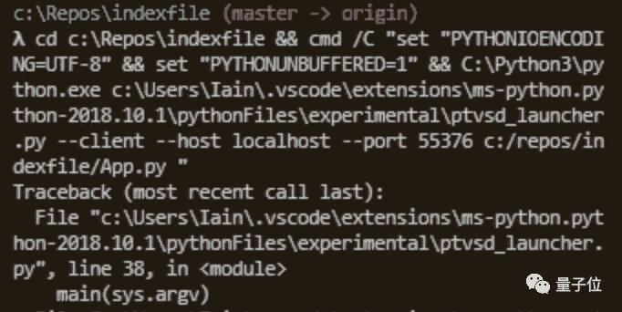
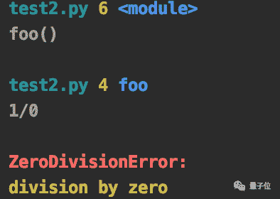
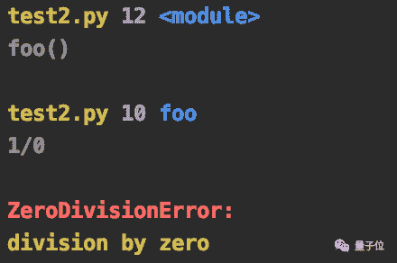
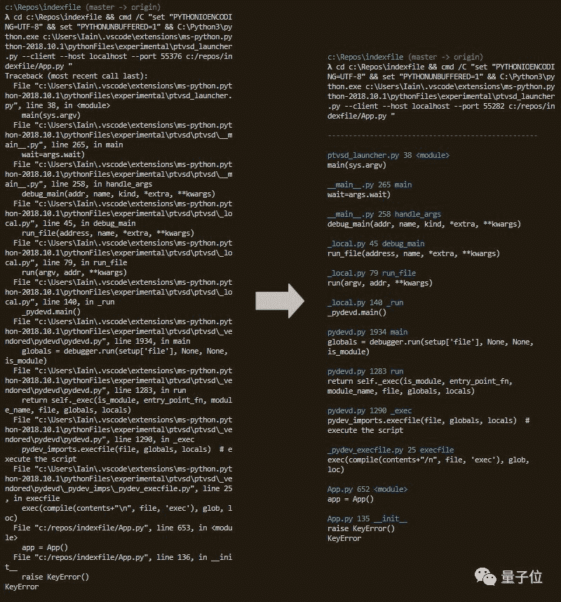

##### 鱼羊 发自 凹非寺
量子位 报道 | 公众号 QbitAI

即使是Python，报错时也令人头大。

看着这一堆乱麻，不知道是该怀疑人生，还是怀疑自己手残。



那么，Python异常输出美化工具**PrettyErrors**了解一下？

只需一个import，报错也能整齐划一，错误代码位置、错误原因清晰明了，一眼就能看清。debug仿佛都没有那么痛苦了。


## 一行代码简化报错

先来试试一个简单的错误。

```
def foo():
    1/0

foo() 
```

不使用PrettyErrors库，报错信息长这样：


倒是能看清，就是这一长串红字十分丑陋。

让我们来import一下pretty_errors。输出变成了这个样子：



是不是清晰简洁了许多？

还可以自定义颜色。



bug少的时候，还不觉得有什么太大区别。当报错信息铺满一整页，美观不美观，对心灵的打击程度就完全不同了。



## 使用指南

像Python的所有第三方库一样，PrettyErrors的安装十分简单。

pip一下：

```
python -m pip install pretty_errors 
```

如果你想让你的每一个程序都能这样在报错时也保持美貌，那么运行下面这这行命令，就不用每次都 import pretty_errors 啦。

```
python -m pretty_errors 
```

并且，如此一来，语法错误（SyntaxError）的格式也同样能被美化。仅在程序中 import pretty_errors 时，这一点是无法实现的。

不喜欢默认配置，想要打造自己满意的美化效果？那就试试这几个函数：

*   pretty_errors.configure()

*   pretty_errors.whitelist()

*   pretty_errors.blacklist()

*   pretty_errors.pathed_config()

比如要改变输出文件名的颜色，代码是这样的：

```
pretty_errors.configure(filename_color = pretty_errors.BRIGHT_YELLOW)
```

如果你发现上面这一番操作之后，啥改变也没发生，那就检查一下PYTHON_PRETTY_ERRORS，当它的值为0时，PrettyErrors是被禁用的。

```
set PYTHON_PRETTY_ERRORS=1 
```

需要注意的是，你使用的终端本身具有颜色输出功能，异常信息输出才会带有不同的颜色。如果不巧你惯用的是单色终端，那么可以试试 pretty_errors.mono() 中的设置。

人生苦短，bug实多。

何不试试PrettyErrors，给Debug的过程添加几分美感~

## 传送门

https://github.com/onelivesleft/PrettyErrors

*AI学习路线和优质资源，在后台回复"AI"获取*

