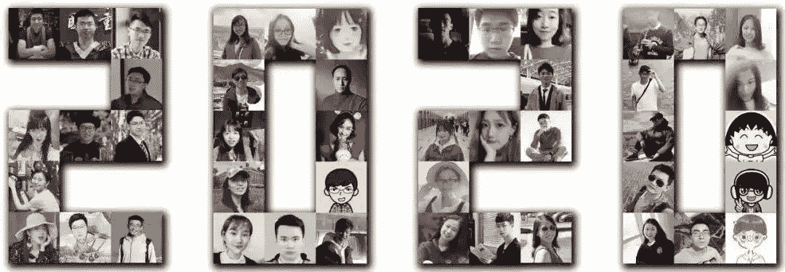
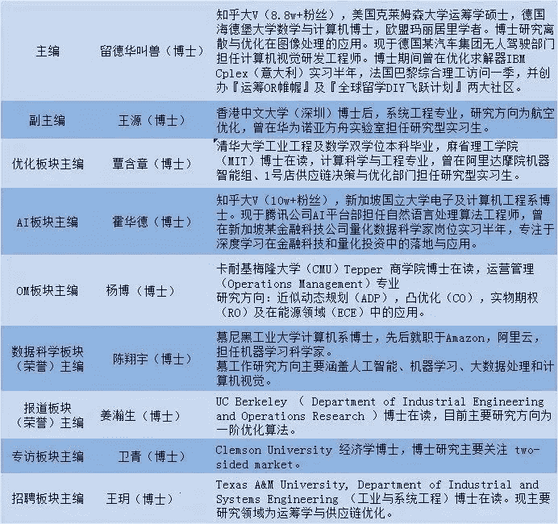
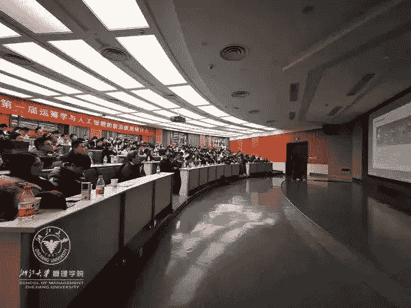
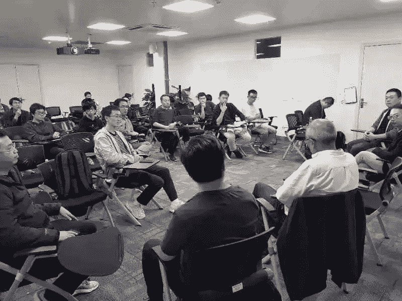
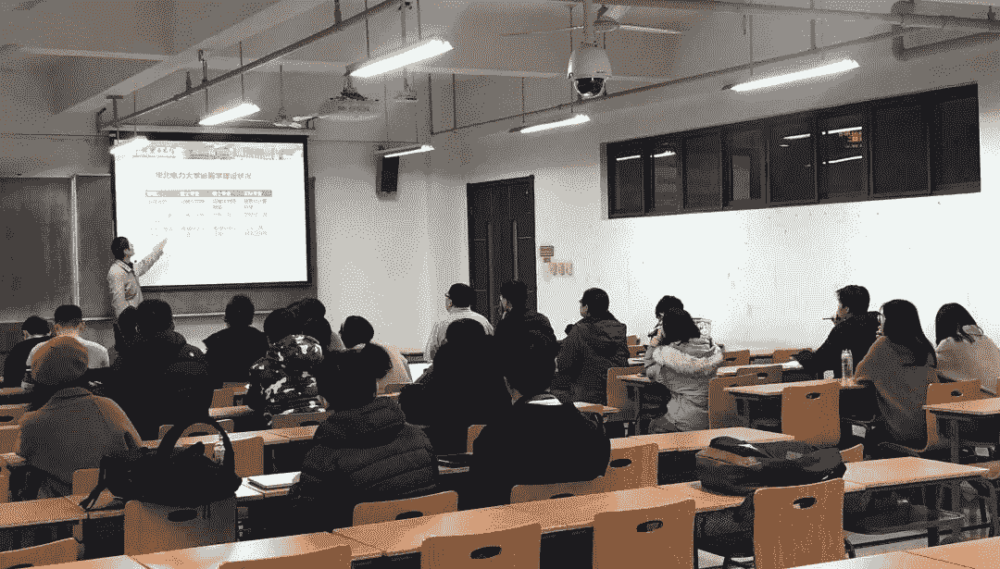
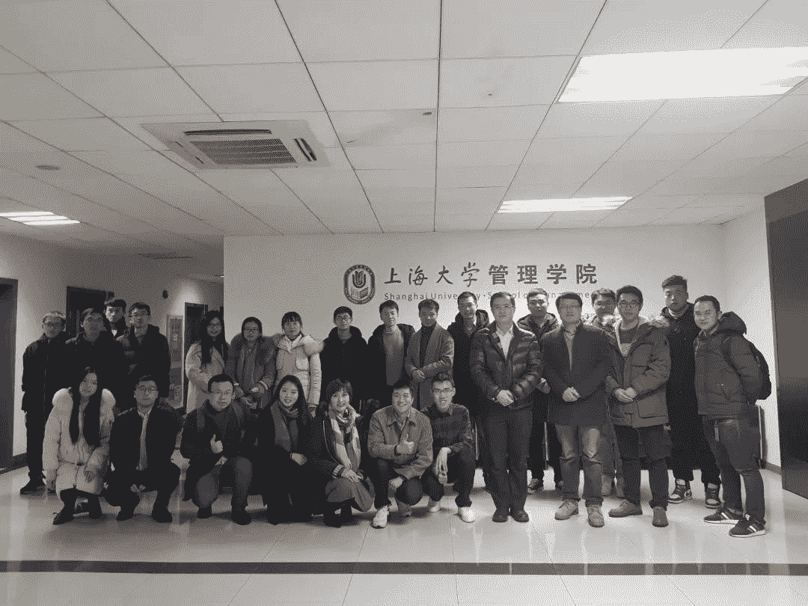

今天给大家介绍我的朋友 留德华叫兽，他博士毕业于全球Top 50的海德堡大学，目前在德国定居，并从事无人驾驶感知算法的研发，知乎粉丝达到近9万人，在头条|抖音还有超过5万粉丝！

**留德华叫兽**创建的公众号**『运筹OR帷幄』**，该号记录了他以及一帮**世界名校**学霸博士们的笔记和经验总结，干货满满。**他的公众号至今写了200多篇高质量原创文章，全网有30万的粉丝！该平台也成为国内最大的运筹学|优化理论分享平台！**

01

PART

『运筹OR帷幄』公众号与学术社区简介

社区旨在为读者带来运筹学|优化理论最专业和前沿的咨询与报道，及其在供应链管理，人工智能等学科的交叉应用。专栏设有优化、OM、AI、DS、专访、报道、招聘等版块，专栏主编多为世界名校OR博士。自2018年创立起，目前『运筹OR帷幄』知乎+公众号+头条号+微信QQ群+知识星球粉丝总量超过30W，细分专业微信硕博群超过30个。

『运筹OR帷幄』部分成员

02

PART

优质文章分类展示

**1 优化理论|算法**

[优化 | 鲁棒优化基础](http://mp.weixin.qq.com/s?__biz=Mzg2MTA0NzA0Mw%3D%3D&chksm=ce1c48a6f96bc1b01f4cdab85e11e5d8dee0ef1baeebcd5518bd578c4497a730542b131ac907&idx=1&mid=2247489738&scene=21&sn=d3235cac119ecf4bda040be16e5bee64#wechat_redirect)

[优化 | 非光滑优化的光滑化](http://mp.weixin.qq.com/s?__biz=Mzg2MTA0NzA0Mw%3D%3D&chksm=ce1c4c57f96bc54172e17cc51b703a0a3373e22be09c7137c2cf0d3ca52358d929750796744e&idx=1&mid=2247490619&scene=21&sn=278f56d46358031ad47eb27c80573e02#wechat_redirect)

[优化 | 拉格朗日对偶理论](http://mp.weixin.qq.com/s?__biz=Mzg2MTA0NzA0Mw%3D%3D&chksm=ce1c4a77f96bc36111d68eed537798856596d28351aaca6e9d9560cf91f7b7144cbd5b326c82&idx=1&mid=2247490075&scene=21&sn=662c60871dd5f11f516179257adcd7d0#wechat_redirect)

[优化 | 粒子群算法介绍](http://mp.weixin.qq.com/s?__biz=Mzg2MTA0NzA0Mw%3D%3D&chksm=ce1c4435f96bcd236beb444311c47895efa3702db64f2e8000324e0e4dc9269daf782054f6a1&idx=1&mid=2247488601&scene=21&sn=c8d13f9843b5ffe9352063f159d285b7#wechat_redirect)

[优化 | Nesterov's accelerated method](http://mp.weixin.qq.com/s?__biz=Mzg2MTA0NzA0Mw%3D%3D&chksm=ce1c4899f96bc18ffad5e698b75ccf533704b04b69fa225424f34f504081998bf329461d5487&idx=1&mid=2247489781&scene=21&sn=c3efad143ffac907036a3e94d03889ad#wechat_redirect)

[优化∣浅析黑洞成像背后的稀疏重构算法原理](http://mp.weixin.qq.com/s?__biz=Mzg2MTA0NzA0Mw%3D%3D&chksm=ce1c4468f96bcd7e8bf128693c6aaac64472ae32339c5d81d58edc8a6333f352bfaa817cac1a&idx=1&mid=2247488516&scene=21&sn=a6286a3ddd8c2959cb2dffda4c6a14c9#wechat_redirect)

[优化|什么是动态规划（Dynamic Programming）?](http://mp.weixin.qq.com/s?__biz=Mzg2MTA0NzA0Mw%3D%3D&chksm=ce1c47d4f96bcec231d47813125e7aecf2785e9d17423ea7a08b6bd38ea354b4d79fe8dd34d6&idx=1&mid=2247489464&scene=21&sn=30c59258e7bc96d17be7a13727c3b9eb#wechat_redirect)

[优化 | 怎么判断一个优化问题是凸优化还是非凸优化？](http://mp.weixin.qq.com/s?__biz=Mzg2MTA0NzA0Mw%3D%3D&chksm=ce1c492ef96bc038e358ad36593af6aa7147b0649853e07986045c4379b98c8dc60be26f6d45&idx=1&mid=2247489858&scene=21&sn=73d6a072c22c3fd926cd05aca39e05a8#wechat_redirect)

[优化 | 浅谈交替方向乘子法(ADMM)的经典使用](http://mp.weixin.qq.com/s?__biz=Mzg2MTA0NzA0Mw%3D%3D&chksm=ce1c4abff96bc3a90539330da8f070ec28355bd5ea15425b4dadfcbc8b844c396a2aab585b64&idx=1&mid=2247490259&scene=21&sn=5e640bf5fc83695b654dce702a42c844#wechat_redirect)

[AI | Deep Compression 神经网络压缩经典之作](https://mp.weixin.qq.com/s?__biz=Mzg2MTA0NzA0Mw%3D%3D&chksm=ce1c49dff96bc0c9a4c8ede35b55245b833418fd5df5af9b6e387d4cc352d8444e0eb3d58c2c&idx=1&mid=2247489971&scene=21&sn=5a991802e25119287e7c2befa7823e4d#wechat_redirect)

[学界 | 整数规划经典方法--割平面法（Cutting Plane Method）](http://mp.weixin.qq.com/s?__biz=Mzg2MTA0NzA0Mw%3D%3D&chksm=ce1c4bb2f96bc2a4d4350399a6ab9fa6cb83837358b3baea4111e9bf41e624d5f62717d20104&idx=1&mid=2247490526&scene=21&sn=a8f4219350570959837f26c6902fad7a#wechat_redirect)

[优化 | 混合整数规划/离散优化的精确算法--分支定界法及优化求解器](http://mp.weixin.qq.com/s?__biz=Mzg2MTA0NzA0Mw%3D%3D&chksm=ce1c4bf7f96bc2e12952b46e9db4f8a28f6f9cc2d0012597c799ff10ae2b2ef5e4e360548d27&idx=1&mid=2247490459&scene=21&sn=8ad943332c42a764cb90b6e04cce385b#wechat_redirect)

**2 运筹|优化技术在业界应用**

[【OM】如何解决春运中的铁路列车调度问题](http://mp.weixin.qq.com/s?__biz=Mzg2MTA0NzA0Mw%3D%3D&chksm=ce1c415ff96bc849806ad1a8eff12b66b3fed15e5c7e2c075d22d3d43cf82cd67e26dff7f27f&idx=1&mid=2247487795&scene=21&sn=20134411e65ae097ae2452a250df2cbb#wechat_redirect)

[OM | 机组排班优化及悠桦林的实践](http://mp.weixin.qq.com/s?__biz=Mzg2MTA0NzA0Mw%3D%3D&chksm=ce1c4ce9f96bc5ff6ffbcdc7591f9739a9a0e4ba889c4879ab85b2218302e6a9e050febd7ae1&idx=1&mid=2247490693&scene=21&sn=4add55e56f1382107030e14ae564af7a#wechat_redirect)

[OM | 建模优化与两会报告：实施癌症筛查与防治](http://mp.weixin.qq.com/s?__biz=Mzg2MTA0NzA0Mw%3D%3D&chksm=ce1c42a3f96bcbb545eb808c6f1244204b94da45cea0cf263cc7c166b61cf60e742ffb4ff8af&idx=1&mid=2247488207&scene=21&sn=5f0b4e3b6bc7049642906f95a0de5766#wechat_redirect)

[OM | 运筹学理论和业界应用到底差了什么？- 以企业生产计划为实例解析](http://mp.weixin.qq.com/s?__biz=Mzg2MTA0NzA0Mw%3D%3D&chksm=ce1c47ddf96bcecbd6ce9982a2920faa8367d2922e054a9cdf80e0531ff444de24158f4ae4d0&idx=1&mid=2247489457&scene=21&sn=e2efdf6e715859090fadbcbec1822021#wechat_redirect)

[OM | 柔性生产理念](http://mp.weixin.qq.com/s?__biz=Mzg2MTA0NzA0Mw%3D%3D&chksm=ce1c4968f96bc07e3255bf50fb5f733f13a342efb190e47a1710b44a1aeb7e14457a57ab8601&idx=1&mid=2247489796&scene=21&sn=039fb684f41838e0814e32f4d26414f5#wechat_redirect)

[OM | 混合整数规划模型在页岩气开采中的应用：EQT公司的案例](http://mp.weixin.qq.com/s?__biz=Mzg2MTA0NzA0Mw%3D%3D&chksm=ce1c4244f96bcb52ff2339e07b36573321471bea4ce390cf5c92d7cfca32c1d7777b706a158d&idx=1&mid=2247488040&scene=21&sn=9712f7a3a0f2a42a256003cdf0529db6#wechat_redirect)

[OM | 多工序、多机台(产线)环境下的排程要点](http://mp.weixin.qq.com/s?__biz=Mzg2MTA0NzA0Mw%3D%3D&chksm=ce1c47fff96bcee949ce835566e985b05d53bf921285b9d1ba79181a2068f841a57a4b0632c5&idx=1&mid=2247489427&scene=21&sn=a3ac8e352d9ad4a0aa18182f32e29c5b#wechat_redirect)

[【优化】遗传算法实例应用之管网拓扑结构优化](https://mp.weixin.qq.com/s?__biz=Mzg2MTA0NzA0Mw%3D%3D&chksm=ce1c4092f96bc984bca53f91cdd8cc2a1ecd3a4c7cc1d5e6d3a63f7cb30579b54f63bea18ce3&idx=1&mid=2247487742&scene=21&sn=306146ae623ae449ff94963e10a43856#wechat_redirect)

**3 运筹学与人工智能 机器学习 数据科学交叉**

[优化 | 优化理论能给深度学习带来怎样的革命？](https://mp.weixin.qq.com/s?__biz=Mzg2MTA0NzA0Mw%3D%3D&chksm=ce1c43bdf96bcaab8a4efb9395c83fed5c1f81a3e1e2c8c517d61538fc146ae9a89d612abab5&idx=1&mid=2247488465&scene=21&sn=dc06b8f64007b3211a5ccfbdea617a2b#wechat_redirect)

[【优化】为什么凸优化这么重要？](http://mp.weixin.qq.com/s?__biz=Mzg2MTA0NzA0Mw%3D%3D&chksm=ce1c41dcf96bc8cae4b087f7217230f24a13360b21c360f9d976feac67c0b0f48a3b6be552f1&idx=1&mid=2247487920&scene=21&sn=63a60fe36b83e00db0a54767d6aa052b#wechat_redirect)

[【学界】深度学习如何影响运筹学？](http://mp.weixin.qq.com/s?__biz=Mzg2MTA0NzA0Mw%3D%3D&chksm=ce1c4a41f96bc3579dd3abb8aaf7455c867a6af4e82f0e38953a3939811c84765c2f7cd44c28&idx=1&mid=2247490093&scene=21&sn=1590924f40d61c7bca80da69deef22ca#wechat_redirect)

[【学界】离散/整数/组合/非凸优化概述及其在AI的应用](http://mp.weixin.qq.com/s?__biz=Mzg2MTA0NzA0Mw%3D%3D&chksm=ce1c4cc6f96bc5d0605756029a5a7e816e05c538d4d9ff34dd4d26c02f9badde6b463012777c&idx=1&mid=2247490730&scene=21&sn=03e151dc74acb7c2e56f204739048d5d#wechat_redirect)

[主编推荐 | 深度学习和强化学习在组合优化方面有哪些应用？](http://mp.weixin.qq.com/s?__biz=Mzg2MTA0NzA0Mw%3D%3D&chksm=ce1c4560f96bcc76973e7e712f0561fc68e7dfb5d9a3f38750c4343f3ec342a6021e9527d03c&idx=1&mid=2247488780&scene=21&sn=0fe0f9aed03a787bc31582ba72474b39#wechat_redirect)

[【优化】在线学习(MAB)与强化学习(RL)入门系列](http://mp.weixin.qq.com/s?__biz=Mzg2MTA0NzA0Mw%3D%3D&chksm=ce1c5fa1f96bd6b7bd10177d47e56a8f7969ce49cdc145f317f7b927bdd9afa174feab16c8f4&idx=1&mid=2247487437&scene=21&sn=4c53989a1cc852958cd05502e0d8dfcb#wechat_redirect)

[数据科学 | 如何有效的利用和自建机器学习数据集](https://mp.weixin.qq.com/s?__biz=Mzg2MTA0NzA0Mw%3D%3D&chksm=ce1c4919f96bc00fb642df116655bc88f5a1706c9785671fda6b188ccb43fa870401d63676ac&idx=1&mid=2247489909&scene=21&sn=1e97750b69cd224c174415e778282367#wechat_redirect)

[整数规划精确算法/近似算法/(元)启发算法/神经网络反向传播等算法的区别与关联](http://mp.weixin.qq.com/s?__biz=Mzg2MTA0NzA0Mw%3D%3D&chksm=ce1c4d4ff96bc459f65dab8cb72ef03aad62d9a4fb96f12b74dd7c3646ebe6d5dad9d2df89db&idx=1&mid=2247490851&scene=21&sn=f651fd31e9ea2a1141b2f861a70427ca#wechat_redirect)

**4 学习路线规划与求职|留学攻略与经验分享**

[数据科学|从小白走向算法工程师](https://mp.weixin.qq.com/s?__biz=Mzg2MTA0NzA0Mw%3D%3D&chksm=ce1c44f4f96bcde292d7d009e714451d7582d70aa2b284fbeaa2453e139c53e40cf6dcf4ce25&idx=1&mid=2247488664&scene=21&sn=c8636cc6e3a829a78558cd2300ba119c#wechat_redirect)

[OR申请 | 美国三所大学的运筹学硕士申请要求](https://mp.weixin.qq.com/s?__biz=Mzg2MTA0NzA0Mw%3D%3D&chksm=ce1c4898f96bc18e19380a4ccee18864eb1289890ebadc79e37b314ea22ef1b4a8be15ecde7c&idx=2&mid=2247489780&scene=21&sn=fd073f60b01b33cbcd3b8c4a42791a34#wechat_redirect)

[AI | 怎样快速入门机器学习和深度学习？](http://mp.weixin.qq.com/s?__biz=Mzg2MTA0NzA0Mw%3D%3D&chksm=ce1c4a32f96bc324b611c64b7695671c36229320c99a8b67598e883b3238c0a0d50d9d969746&idx=1&mid=2247490142&scene=21&sn=ea4fb41405ff6b20066f0ee8a327ba62#wechat_redirect)

[主编推荐∣运筹学必备书单推荐（文末有福利和彩蛋）](https://mp.weixin.qq.com/s?__biz=Mzg2MTA0NzA0Mw%3D%3D&chksm=ce1c4b42f96bc254cfa214dc6d3769bab4a5daab1ce2b898dae7f068cb9b30a038275d8e84cf&idx=2&mid=2247490350&scene=21&sn=b4e4f08f0096fd12729767d3864495ba#wechat_redirect)

[知乎直播|俩位运筹学博士聊德国荷兰留学及就业](https://mp.weixin.qq.com/s?__biz=Mzg2MTA0NzA0Mw%3D%3D&chksm=ce1c4bacf96bc2baa2086568f0a6bd9fb480e5cc3acb40c09d98693946b384305321474327d9&idx=3&mid=2247490496&scene=21&sn=89d40a9831b077a3285a366a97b5bbb6#wechat_redirect)

[数据科学 | 为什么数据科学团队需要多面手而非专家？](https://mp.weixin.qq.com/s?__biz=Mzg2MTA0NzA0Mw%3D%3D&chksm=ce1c4339f96bca2fc26063fc7505f950284f156a0c4f4e8192fc712ca62d40c94f2dc989f49b&idx=1&mid=2247488341&scene=21&sn=339eb12018e3a7baf216d4a67de37d17#wechat_redirect)

[AI | 如何看待 2020 届校招算法岗「爆炸」的情况？](https://mp.weixin.qq.com/s?__biz=Mzg2MTA0NzA0Mw%3D%3D&chksm=ce1c49b8f96bc0ae3a721d68a8de4b793a9cad2b2a95261ef13c3d27c4a3f4a767df3e85c9d6&idx=1&mid=2247490004&scene=21&sn=a8f18aa16e296d667159584854f5352b#wechat_redirect)

[经验分享 | AI、机器学习和供应链方向如何拿到心仪的offer！](https://mp.weixin.qq.com/s?__biz=Mzg2MTA0NzA0Mw%3D%3D&chksm=ce1c43dbf96bcacd44091d796371b86288ed37910d966bd5364eb135e51768b77af8d381b478&idx=1&mid=2247488439&scene=21&sn=175af675ef5cff3068c7fc421489c260#wechat_redirect)

[主编推荐 | 千里之行，始于足下，运筹学学习路线规划与入门法则精选](http://mp.weixin.qq.com/s?__biz=Mzg2MTA0NzA0Mw%3D%3D&chksm=ce1c43f7f96bcae1e122a0c5ce8b9d051519280ff5b17a75c32241c18fe686c4300cc82de585&idx=1&mid=2247488411&scene=21&sn=4d303388fb8244f0ce5dedc6eef40a33#wechat_redirect)

**5 直播|专访**

[活动&直播 |『运筹OR帷幄』知识星球Meetup（1月16日上海站）](https://mp.weixin.qq.com/s?__biz=Mzg2MTA0NzA0Mw%3D%3D&idx=1&mid=2247491078&scene=21&sn=b8091254345d30220e5863b7e1593f20#wechat_redirect)

[回顾 | 直播 NO.3 滴滴 AI Labs 秦志伟：深度强化学习在网约车交易市场中的应用（附内推）](http://mp.weixin.qq.com/s?__biz=Mzg2MTA0NzA0Mw%3D%3D&chksm=ce1c4c37f96bc52152ae022869c3cefdaadabafb7d9a99b61625d89b0e337e1e18f5e1dbf4dd&idx=1&mid=2247490651&scene=21&sn=7040265aecdb576f2c476886cb1a21a0#wechat_redirect)

[直播预告 | 与知乎劝退大佬霍华德聊一聊转行AI和一些业界经验](https://mp.weixin.qq.com/s?__biz=Mzg2MTA0NzA0Mw%3D%3D&chksm=ce1c4b2ef96bc238b920110173fa58c6bd401e9efa1e2001838cefb1954effd0ab5370225ba3&idx=2&mid=2247490370&scene=21&sn=c3a42e964c2e535e31dc7fde07272733#wechat_redirect)

[专访 | Gurobi 最新版本发布，超越自己成为唯一目标](http://mp.weixin.qq.com/s?__biz=Mzg2MTA0NzA0Mw%3D%3D&chksm=ce1c4cfef96bc5e8f9040296e873e5005b40c85f881aa6807fc1dc43a502edb576c3427a40f8&idx=1&mid=2247490706&scene=21&sn=be8e3f3c5f9b1fbf2238e898b55b6d64#wechat_redirect)

[【专访】南科大数学系何炳生教授——四十年上下求索](http://mp.weixin.qq.com/s?__biz=Mzg2MTA0NzA0Mw%3D%3D&chksm=ce1c415ef96bc848aa5e75b4920c5761ed32d69f796ef15d47fd5657815d36602486a8af091b&idx=1&mid=2247487794&scene=21&sn=a74351f0580d861f439d5bb1356c2ccf#wechat_redirect)

[专访 | 美团郝井华，深度剖析“最后一公里”配送的动态优化问题](http://mp.weixin.qq.com/s?__biz=Mzg2MTA0NzA0Mw%3D%3D&chksm=ce1c449cf96bcd8aa962be63402fb65b503e1e10b6bd7dd40a33cd3f1d6c0e562ef354c833b1&idx=1&mid=2247488752&scene=21&sn=3589d390564ad4e2446c4db33ea821f7#wechat_redirect)

[人物 | 两次入狱，数次移民，从罗马尼亚地下党到卡耐基梅隆教授 — 整数规划奠基者Egon Balas的彪悍人生](https://mp.weixin.qq.com/s?__biz=Mzg2MTA0NzA0Mw%3D%3D&chksm=ce1c4a25f96bc3331328fd9ae6a13959ffca60f0f2a2bec929053dd7b8f1af795ca6fbcf897d&idx=1&mid=2247490121&scene=21&sn=06e314499a7a3e8c435c1e8712a54461#wechat_redirect)

**6 前沿报道**

[报道 | 全球前10万科学家排名—— OR篇](http://mp.weixin.qq.com/s?__biz=Mzg2MTA0NzA0Mw%3D%3D&chksm=ce1c4c79f96bc56f5a526376222be7a6a2db28f7b167a150ccfa32248a1fc8c9245c08024ab7&idx=1&mid=2247490581&scene=21&sn=3a7bbf973d7100695f89fe3d50a58fc2#wechat_redirect)

[报道 | 全球前10万科学家排名—— AI篇](http://mp.weixin.qq.com/s?__biz=Mzg2MTA0NzA0Mw%3D%3D&chksm=ce1c4c70f96bc5661e45fedbae11fab131c8b965a3770ddee40967fd40a361d2fdc8b547eb83&idx=1&mid=2247490588&scene=21&sn=fb0b727e481c709322444efff9d2906e#wechat_redirect)

[报道 | 2019QS学科排名发布：运筹专业谁家强？](http://mp.weixin.qq.com/s?__biz=Mzg2MTA0NzA0Mw%3D%3D&chksm=ce1c4280f96bcb96d35052b997995c449034fcff7888ecc1f49932063601045cdd1948aef8bf&idx=1&mid=2247488236&scene=21&sn=cf93f1d89fce72791d2462f0f0964ba8#wechat_redirect)

[报道 | 2020USNews大学排名出炉，内地院校工程学科表现抢眼](http://mp.weixin.qq.com/s?__biz=Mzg2MTA0NzA0Mw%3D%3D&chksm=ce1c4b37f96bc221f55387e623b0e521b1a408f64eca3841debce6401a028a2f5fc1ada37b66&idx=1&mid=2247490395&scene=21&sn=3662fef7af6767c25a1d85755c366034#wechat_redirect)

[报道 | 泰晤士2020世界大学排名:中国首次包揽亚洲前两名](http://mp.weixin.qq.com/s?__biz=Mzg2MTA0NzA0Mw%3D%3D&chksm=ce1c4a09f96bc31fca96f681dc87a62669f256798c67683f74580a027d698337110ea1285227&idx=1&mid=2247490149&scene=21&sn=7fa8c8b0065ab60d65e6e9bd850ed880#wechat_redirect)

[【报道】人工智能顶会 ICLR 2019 中优化与AI领域新动向概览](http://mp.weixin.qq.com/s?__biz=Mzg2MTA0NzA0Mw%3D%3D&chksm=ce1c5f4cf96bd65a2a7111df438ae5efb471790a5307bf198701ac729073104b520ae1adab9f&idx=1&mid=2247487264&scene=21&sn=d4291c62f49762af2207da1064cfd679#wechat_redirect)

[报道 | 2019Google Scholar学术指标排名：运筹与优化等领域Top概览](http://mp.weixin.qq.com/s?__biz=Mzg2MTA0NzA0Mw%3D%3D&chksm=ce1c480ff96bc119a1eb6c7ca77549bc2e9b28643d1f29665dd27924032bc9d15acf7a7f7975&idx=1&mid=2247489635&scene=21&sn=b50c11e58ce1b491f0f711d1e49aada2#wechat_redirect)

**7 代码|教程分享**

[数据科学 |  手把手教你搭建一个LSTM时序模型](http://mp.weixin.qq.com/s?__biz=Mzg2MTA0NzA0Mw%3D%3D&chksm=ce1c4baef96bc2b85fee45aa675ee448e3869b1f06173f0fdb2284cc85d6e36b0fafcfe3508e&idx=1&mid=2247490498&scene=21&sn=18824b0f7d9e978be95080b65c14b1e7#wechat_redirect)

[数据科学 | OpenCV方块体识别解决方案](http://mp.weixin.qq.com/s?__biz=Mzg2MTA0NzA0Mw%3D%3D&chksm=ce1c49f1f96bc0e77515f1d82b22c9aa95a8fb8a2f34472c48ac3539978a3ffd9c2a02adc638&idx=1&mid=2247489949&scene=21&sn=379fe974749448758b84036b7d3b9e00#wechat_redirect)

[数据科学 | Pandas数据分析入门](https://mp.weixin.qq.com/s?__biz=Mzg2MTA0NzA0Mw%3D%3D&chksm=ce1c45a4f96bccb2a58dadc25cacf11ed240e2b2d76ebc6c8fa390f74e4c69ee4e1aa36243f2&idx=1&mid=2247488968&scene=21&sn=08cebb30ecfd4ef76f9afebc93fb4e3e#wechat_redirect)

[优化 | 从集合划分问题到列生成算法](https://mp.weixin.qq.com/s?__biz=Mzg2MTA0NzA0Mw%3D%3D&chksm=ce1c4ae5f96bc3f3c284c38d1526a5932e42c48a07ab98841330ff2461a1358d374661f2cc0c&idx=1&mid=2247490185&scene=21&sn=b775a9ef4008ef13a4f83516a62b2c31#wechat_redirect)

[数据科学 | pandas数据导入与导出](https://mp.weixin.qq.com/s?__biz=Mzg2MTA0NzA0Mw%3D%3D&chksm=ce1c4b2af96bc23ca733f88df03183653a1b8df423b905df8add928f9152a212ffd2e13d7403&idx=1&mid=2247490374&scene=21&sn=229fa888c6401dbe94ae167b79eb0eee#wechat_redirect)

[视频教程 | 用Python玩转运筹优化求解器IBM Cplex（一 ）](http://mp.weixin.qq.com/s?__biz=Mzg2MTA0NzA0Mw%3D%3D&chksm=ce1c421af96bcb0c5067d0f4390087deed145a693fd22bcb899e27c29f974bf91963d3287504&idx=1&mid=2247488118&scene=21&sn=13b7c2c200dfe678f0a6d49dbbd34df2#wechat_redirect)

[视频教程 | 用Python玩转运筹优化求解器IBM CPLEX（二）](https://mp.weixin.qq.com/s?__biz=Mzg2MTA0NzA0Mw%3D%3D&chksm=ce1c4323f96bca35b62dc089175de6ed3776c4b701039fda30f1d1f21e8475a2907650f3dc56&idx=1&mid=2247488335&scene=21&sn=02de2bc82f2da01c5dc51602a35068b5#wechat_redirect)

03

PART

社区线下|线上活动展示

『运筹OR帷幄』与浙江大学管理学院、览众科技合办的“第一届运筹学与人工智能Workshop”会场盛况

『运筹OR帷幄』与南方科技大学数学系合办的线下Meetup

『运筹OR帷幄』与华北电力大学可再生能源学院合办的线下MEETUP

『运筹OR帷幄』与上海大学管理学院合办的线下Meetup

最后，欢迎运筹学|数据科学|优化理论|工业工程|管理科学的同行加入微信群交流～

