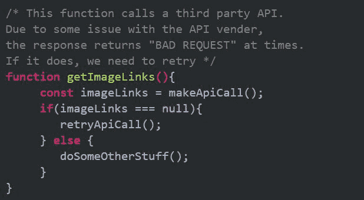

选自 Medium

**作者：Chris Blakely**

**机器之心编译**

> 能把代码写出来是一回事，但是写出整洁、可读的代码又是另一回事。然而，什么是「干净的代码」呢？怎么才能写出「干净的代码」？为了解答这些问题，本文作者写了一份针对开发者的干净代码指南。

不妨想象一下，你正在阅读一篇文章，文章开头段简要概述了文章的内容。文中还有一些小标题，它们会引出各部分的段落。段落是通过将相关信息按照合理的顺序组合起来而构成的，这样文章就会变得「行云流水」，可读性很强。

现在，你可以反过来再想象一下如果这篇文章没有任何小标题。文中只有很多小段落，它们十分冗长并杂乱无章。那么你就无法快速浏览这篇文章，必须真正深入到内容中去，这样才能对整篇文章有大概的了解。这确实会带来很差的阅读体验！

你的代码应该像一篇美文一样，需要给读者带来很好的阅读体验。将你代码的类/文件视为文章的小标题，将你的方法（函数）视为文章的段落。你代码中的语句就相当于文章中的句子。下面本文将列出一些干净代码的特征：

1.  干净的代码是专一的：每个函数、类和模块都应该只做一件事，并且将其做好。

2.  干净代码应该是优雅的：干净的代码应该易于阅读，阅读干净的代码会让你感到愉悦，它应该让你认为「我确实知道这里的代码在做什么」。

3.  干净代码应该经常维护：我们需要花时间让它保持简单有序，并适当关注代码的细节。

4.  干净代码应该通过各种测试：会崩溃的代码肯定不是干净的！

那么现在主要的问题就是，作为一个开发者，你如何才能编写出干净的代码？下面是一些实用的小建议。

**使用一致的格式和缩进**

如果行距不一致、字体大小不一、或到处都是换行，那么这样的书肯定难以阅读。代码也是如此。

要使你的代码清晰易读，请确保缩进、换行、以及格式是一致的。下面本文将给出一个优秀范例和反面例子：

**优秀范例**


*   你一眼就可以看出函数中有一个「if/else」语句

*   大括号和一致的缩进让代码块开始和结束的位置一目了然

*   大括号是一致的，请注意函数和 if 代码块的左大括号是和函数名和 if 关键字放在同一行上的

**反面例子**


这里有太多不对劲的地方！

*   到处都是随意的缩进，你无法看清函数在哪里结束，也无法快速判断「if/else」代码块从哪里开始（是的，这一段里面确实有一个「if/else」代码块！）

*   括号混淆不清，使用方法不一致

*   行距不一致

这个例子稍微有些夸张，但是它显示出了使用一致的缩进和规范格式的好处。我不知道你怎么看，但我认为「优秀范例」中给出的例子对我来说读起来容易地多！

好消息是，你可以使用过许多 IDE 的插件自动规定代码的格式。哈利路亚！

*   VS Code：https://marketplace.visualstudio.com/items?itemName=esbenp.prettier-vscode

*   Atom：https://atom.io/packages/atom-beautify

*   Sublime Text：https://packagecontrol.io/packages/HTML-CSS-JS%20Prettify

**使用清晰的变量名和方法名**

在文章的开头，我谈到了让你的代码变得容易阅读是多么的重要。要做到这一点，一个重要的方面就是你选择的命名方式（这是我在菜鸟阶段犯过的错误之一）。下面让我们看一个好的命名的例子（JS使用小驼峰命名规则）：


这段代码有下面 2 个优点：

*   函数的命名很清晰，参数也被命名地很好。当开发者看到这段代码时，他们的思路会很清晰。「如果我给出 studentId 参数，并调用 getStudentName() 方法，我将得到一个学生的名字」——如果没有必要的话，我们不必再转而查看「getStudentName()」方法！

*   在「getStudentName()」方法内部，对变量和方法的调用也被很清晰地命名了——可以很清楚地看到该方法调用了一个 api，得到了一个 student 对象，并返回了一个 name 属性。太容易了！

对于新手来说，在编写干净的代码时选取好的命名比你想象的要难。随着你的应用程序不断升级，请使用下面的规则确保你的代码易于阅读：

*   选择一种命名风格并始终保持一致。要么使用「camelCase」（驼峰式命名法），要么使用「under_scores」（下划线命名法），但是不要同时使用这两种命名风格！

*   对于你的函数、方法、变量，根据他们所完成的任务来进行命名。例如，如果你的方法要获取什么东西，请将「get」放到该方法的名字中。如果你的变量要「存储」一种汽车的颜色，请将它命名为「carColour」。

温馨提示，如果你无法命名你的函数或方法，那就说明这个函数承载的任务太多了。请继续将其分解为更小的函数！例如，如果你最终调用的是你的函数「updateCarAndSave()」，请分别创建两个方法「updateCar()」和「saveCar()」。

**在必要时使用注释**

人们常说：「代码应该是自文档化的」，这从根本上意味着，你的代码应该足够易读，从而减少对注释的需求。这个观点貌似很有道理，我猜这种说法在理想世界是说得通的。然而，码农的世界却远远不是一个完美的世界，所以使用一些注释还是很有必要的。

文档注释是描述某个特定的函数或类做了什么的注释。如果你编写了一个程序库，这样的注释会对其它开发者们很有帮助。下面是「useJSDoc」中的一个注释的例子：


说明注释对于可能需要维护、重构或扩展你的代码的任何人（包括未来的你自己）都适用。通常而言，可以避免使用说明注释，转而采用「自文档化代码」。下面是一个说明注释的例子：



下面给出了一些你应该尽量避免使用的注释。他们不会提供太多的有效信息，可能会误导用户，并使代码变得混乱。

不增添有效信息的冗余注释：


误导性的注释：


搞笑或轻蔑的注释：


牢记「DRY」原则（Don't Repeat Yourself，不要做重复的事）

「DRY」原则可以被表述为：

> 每一小段知识在一个系统中必须拥有一个单一、清晰、权威的呈现。

最简单地说，这从根本上意味着你应该致力于减少存在的重复代码的数量。（注意，我这里说的是「减少」而不是「消除」——有些情况下，重复的代码也并不是世界末日！）

对于代码维护来说，重复的代码可能是一场噩梦。让我们来看看一个例子：

```
function addEmployee(){ 
    // create the user object and give the role
    const user = {
        firstName: 'Rory',
        lastName: 'Millar',
        role: 'Admin'
    }

    // add the new user to the database - and log out the response or error
    axios.post('/user', user)
      .then(function (response) {
        console.log(response);
      })
      .catch(function (error) {
        console.log(error);
      });
}

function addManager(){  
    // create the user object and give the role
    const user = {
        firstName: 'James',
        lastName: 'Marley',
        role: 'Admin'
    }
    // add the new user to the database - and log out the response or error
    axios.post('/user', user)
      .then(function (response) {
        console.log(response);
      })
      .catch(function (error) {
        console.log(error);
      });
}

function addAdmin(){    
    // create the user object and give the role
    const user = {
        firstName: 'Gary',
        lastName: 'Judge',
        role: 'Admin'
    }

    // add the new user to the database - and log out the response or error
    axios.post('/user', user)
      .then(function (response) {
        console.log(response);
      })
      .catch(function (error) {
        console.log(error);
      });
} 
```

假设你正在为客户创建一个人力资源 web 应用程序。该应用程序允许管理员将扮演某种角色的用户通过应用程序接口（API）添加到数据库中。角色共有三种：雇员、经理和管理员。让我们看看可能存在的一些函数：

这看起来似乎很酷！上面代码的运行一切正常。但是，过了一会，我们的客户跑过来说：

> 嘿！我们希望显示出来的错误信息包含「此处有一个错误」这句话。另外，更麻烦的是，我们希望把 API 的端点从「/user」改为「/users」。谢谢！

在开始编程之前，让我们先回顾一下。在这篇文章开头，我曾经说过「干净的代码应该专一」（即做一件事，并把它做好）。这就是我们当前的代码所具有的一个小问题。执行 API 调用和处理错误的代码重复出现了——这意味着我们必须在三个地方同时更新代码，以满足新的需求。这太烦人了！

那么，如果我们对代码进行重构，让它变得更专一呢？请继续阅读下面的内容：

```
function addEmployee(){ 
    // create the user object and give the role
    const user = {
        firstName: 'Rory',
        lastName: 'Millar',
        role: 'Admin'
    }

    // add the new user to the database - and log out the response or error
    saveUserToDatabase(user);
}

function addManager(){  
    // create the user object and give the role
    const user = {
        firstName: 'James',
        lastName: 'Marley',
        role: 'Admin'
    }
    // add the new user to the database - and log out the response or error
    saveUserToDatabase(user);
}

function addAdmin(){    
    // create the user object and give the role
    const user = {
        firstName: 'Gary',
        lastName: 'Judge',
        role: 'Admin'
    }

    // add the new user to the database - and log out the response or error
    saveUserToDatabase(user);
}

function saveUserToDatabase(user){
    axios.post('/users', user)
      .then(function (response) {
        console.log(response);
      })
      .catch(function (error) {
        console.log("there was an error " + error);
  });
} 
```

我们已经将创建 API 调用的逻辑移到了它自己的方法「saveUserToDatabase（user）」中（这是个好名字吗？看你怎么想喽）。其它的方法将调用该方法来保存用户信息。现在，如果我们需要再次变更 API 的逻辑，我们只需要更新一个方法。同样的，如果我们必须添加一个创建用户的方法，那么通过 API 将用户信息保存到数据库的方法就已经存在了。这真是太棒了！

使用我们目前所学的知识进行重构的一个例子

让我们闭上眼睛，假设我们正在做一个计算器应用程序。该程序用到了一些可以分别让我们做加法、减法、乘法、除法的函数，将运行结果输出到控制台。

下面是我们目前已有的代码，在继续阅读本文接下来的内容之前，看看你能否自己发现代码中存在的问题：

```
function addNumbers(number1, number2)
{
    const result = number1 + number2;
        const output = 'The result is ' + result;
        console.log(output);
}

// this function substracts 2 numbers
function substractNumbers(number1, number2){

    //store the result in a variable called result
    const result = number1 - number2;
    const output = 'The result is ' + result;
    console.log(output);
}

function doStuffWithNumbers(number1, number2){
    const result = number1 * number2;
    const output = 'The result is ' + result;
    console.log(output);
}

function divideNumbers(x, y){
    const result = number1 / number2;
    const output = 'The result is ' + result;
    console.log(output);
} 
```

代码中存在哪些问题呢？

*   缩进是不一致的——使用什么样的缩进格式并不重要，只要格式保持一致

*   第二个函数有一些冗余的注释——我们可以通过阅读函数名和函数内的代码来判断发生了什么，所以我们真的需要这里的注释吗？

*   第三和第四个函数没有使用良好的命名——「doStuffWithNumbers（）」并不是用最恰当的函数名，因为它并没有说明函数做了什么。（x，y）不是描述性的的变量，x 和 y 有作用吗？它们是什么？是数字吗？还是香蕉？

*   这些方法做了不止一件事——它们要执行计算，但是也要显示输出。我们可以按照「DRY」原则将现实逻辑拆分为一个独立的方法。

现在，我们将使用在这个为初学者编写的干净代码指南中学到的东西来重构代码，由此得到的新代码如下：

```
function addNumbers(number1, number2){
    const result = number1 + number2;
    displayOutput(result)
}

function substractNumbers(number1, number2){
    const result = number1 - number2;
    displayOutput(result)
}

function multiplyNumbers(number1, number2){
    const result = number1 * number2;
    displayOutput(result)
}

function divideNumbers(number1, number2){
    const result = number1 * number2;
    displayOutput(result)
}

function displayOutput(result){
    const output = 'The result is ' + result;
    console.log(output);
} 
```

*   我们修正了缩进格式，使其保持一致

*   调整了函数和变量的命名

*   删除了不必要的注释

*   将「displayOutput（）」逻辑移到了它自己的方法中——如果需要变更输出，我们只需要在这一个地方进行变更。

恭喜你！现在你可以在面试中和撰写你光彩照人的简历时，谈谈你对编写干净代码的认识了！

**不要「过度清理」你的代码**

我经常看到开发人员在清理代码时矫枉过正。注意不要过度清理代码，因为这会适得其反。实际上会让你的代码变得更难以阅读和维护。如果开发者必须不断地在许多文件/方法之间进行跳转才能进行简单的变更，那这样也会影响生产效率。

要有编写干净代码的意识，但是不要在项目的早期过多地考虑它。请确保你的代码能正常工作，并很好地经过了测试。而在重构阶段，你应该真正考虑如何使用像「DRY」这样的原则来清理你的代码。

在这篇为初学者编写的干净代码指南中，我们学会了如何：

*   使用一致的格式和缩进

*   使用清晰的变量名和方法名

*   在必要时使用注释

*   使用「DRY」原则（不要重复做一件事）**

*原文链接：https://medium.com/m/global-identity?redirectUrl=https%3A%2F%2Fmedium.freecodecamp.org%2Fthe-junior-developers-guide-to-writing-super-clean-and-readable-code-cd2568e08aae*

*AI学习路线和优质资源，在后台回复"AI"获取*

