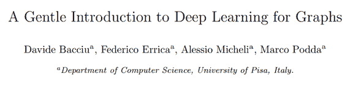
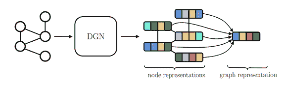
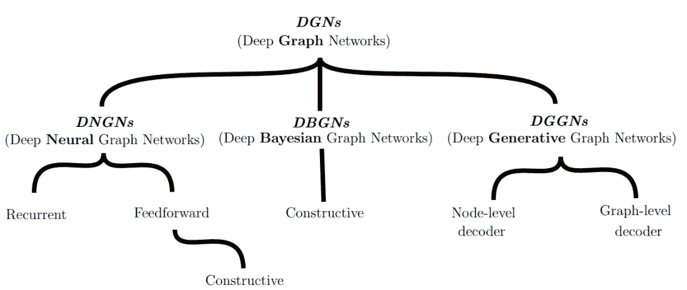
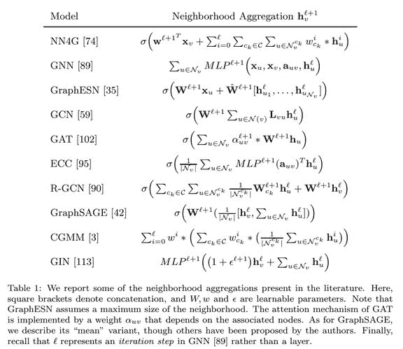
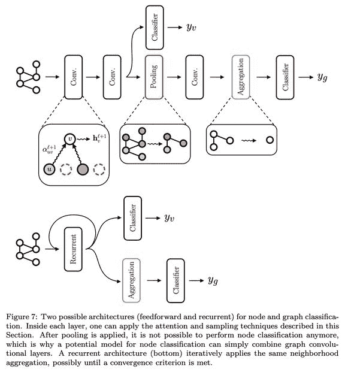
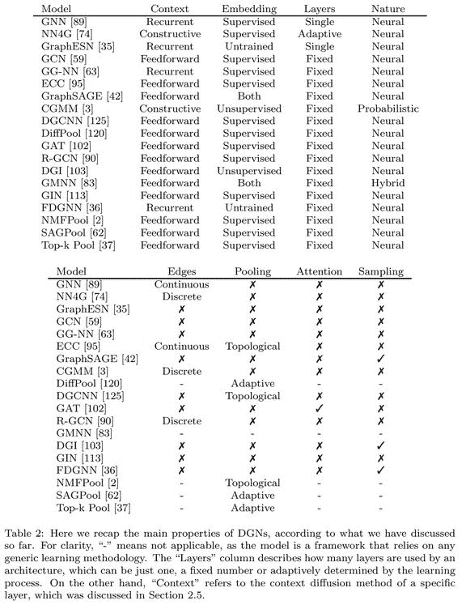

选自arXiv

**作者：****David Bacciu等**

**机器之心编译**

> 意大利比萨大学的研究者发表论文，介绍了图深度学习领域的主要概念、思想和应用。与其他论文不同的是，这篇论文更像一份入门教程，既适合初学者作为学习材料，也可以帮助资深从业者理清该领域的脉络，避免重复造轮子。

论文链接：https://arxiv.org/pdf/1912.12693.pdf

图是表示不同性质数据的强大工具，而数据来源于多种人工和自然流程。图数据具备复合性，是原子信息片段的复合体；同时它也具备关联性，定义数据结构的链接，即表示链接实体之间的关系。图通过链接方向和标签来表示大量关联（association），如离散关系类型、化学性质和分子键强度。

而最重要的一点是，图具备普遍性。在化学和材料科学中，图表示化合物的分子结构、蛋白质相互作用和药物相互作用网络，以及生物学和生物化学关联。在社会科学中，图网络被广泛用于表示人们之间的关系，以及推荐系统中的复杂购买行为。

近日，大量图数据以及越来越多的可用大型资源库，促使人们对以适应性方式处理图的深度学习模型产生了浓厚兴趣。然而，图深度学习模型面临多项方法论和实践挑战。

首先，图学习模型应能够适应大小和拓扑结构变化多样的样本。其次，我们很难获取关于节点 ID 和多个样本之间顺序的信息。此外，图是离散对象，其可微性存在一定限制，而且图的复合性阻碍了穷举搜索方法的应用。最后，最通用的图类别允许出现循环（loop），当涉及消息传递和节点访问时，循环会导致复杂度增加。也就是说，从表达能力和计算复杂度来看，处理图数据会带来前所未有的挑战。因此，对于开发和测试新型神经网络方法而言，图数据是不错的试验场。

尽管深度学习社区近期才对图数据产生浓厚兴趣，但实际上用神经网络处理图数据由来已久，可以追溯到 20 世纪 90 年代早期使用递归神经网络 (RecNN) 处理树结构化数据的开创性研究 [98, 32, 9]。后来，RecNN 方法在自然语言处理应用领域中被重新发现 [99, 97]。此外，它还从有向无环图 [75] 逐渐扩展到更复杂、更丰富的结构，通用逼近（universal approximation）对此提供了支持 [44]。对结构的递归处理也被概率方法所利用，最初是作为纯理论模型 [32]，后来通过高效的近似分布得到更加实用的方法 [6]。

递归模型共享（神经）状态转移系统（state transition system）这一思路，即遍历整个结构来计算嵌入。把这种方法扩展到一般图（有环/无环、有向/非有向）存在一个主要问题，即对环（cycle）的处理，这是由于神经递归单元定义的状态变量之间存在相互依赖性。

解决该问题的最早模型是图神经网络（Graph Neural Network，GNN）和 Neural Network for Graphs (NN4G)。与 RecNN 类似，GNN 模型也基于状态转换系统（state transition system）构建，不过它允许在状态计算中处理环。而 NN4G 利用「依靠来自架构之前层的表示可以管理变量相互依赖性」这一想法，使用多层架构打破了图循环中的递归依赖。这些模型具备开创性意义，为两种主要的图处理方法奠定了基础，即循环方法（基于 GNN）和前馈方法（基于 NN4G）。具体而言，后者现已成为主流方法，属于图卷积（神经）网络的范畴。

本文从历史的角度介绍基于图数据的神经网络领域，在现代术语中它叫做「图深度学习」（deep learning for graph）。本文并非文献综述，而更像一篇教程，旨在对该领域的主要概念和构成图神经架构的构造块进行充分连贯的介绍。

本教程的写作动机是多方面的。首先，近期图深度学习研究工作的急剧增长是以遗忘开创性、综合性工作为代价的。因此，该领域存在重新发现已有结果和模型的风险。另一方面，社区开始注意到对图深度学习模型的评估方面存在问题，因此需要一种原则性更强的方法。最后，一些综述论文开始出现，但对方法论的介绍仍然匮乏。

本教程采取自上而下的方法概述该领域，同时从清晰的历史角度介绍其主要概念和思想。

本文第 2 章为图表示学习问题提供了通用公式，从而引入本文剩余部分遵循的架构路线图。本文将着重于信息的局部和迭代处理方法，这些方法与神经网络的运作机制更加契合。因此，本文对基于谱图的全局方法（即假设一个固定邻接矩阵）不做过多关注。

第 3 章介绍创建现代图深度学习架构所需的构造块。具体而言，该章节将介绍将图卷积作为局部邻域聚合函数的概念、注意力的使用、基于图定义的采样和池化操作，最后讨论用于计算整体结构嵌入的聚合函数。

第 4 章继续介绍方法论，讨论图表示学习中的主要学习任务，以及相关的代价函数，并对相关归纳偏置进行界定。

本文最后一部分综述其他相关方法和任务（第 5 章），讨论有趣的研究挑战（第 6 章）和应用（第 7 章）。文章最后，作者记录了对未来研究方向的考量和提示。

**第 2 章：****概述**

本章首先总结了必要的数学符号，然后讨论了写作动机，并展示了该领域大部分工作所共享的主要思想。

**整体图景**

不管训练目标是什么，几乎所有图深度学习方法都会最终生成节点表示（状态）h_v, ∀_v ∈ V_g。研究 [32] 将该过程定义为：对图执行同构转换（isomorphic transduction）。这些节点表示是并行访问图节点的结果，即在没有特定节点顺序的情况下遍历整个图。下图 2 展示了整体机制，这对处理节点、边和图相关任务非常有用。例如，我们可以通过聚合节点表示，来轻松计算出图表示。

*图 2：所有图学习方法共享的机制。向深度图网络（DGN）输入图，它将输出节点表示 h_v, ∀_v ∈ V_g。将此类表示聚合起来，即可得到图表示 h_g。*

因此，研究者和从业人员的工作围绕着深度学习模型的定义展开，这类模型从图中自动提取相关特征。本文将此类模型统一命名为「深度图网络」（Deep Graph Networks，DGN）。一方面，该通用术语可以将图神经网络（GNN，[89]）和图卷积网络（GCN，[59]）区分开来。该领域文献中常常使用 GNN 和 GCN 表示在图数据上运行的全部神经网络类别，给从业人员造成概念模糊和混淆。另一方面，本文使用 DGN 作为模型分类的基础（详见图 3），该分类即本文讨论的路线图。

*图 3：**架构路线图。*

本文将 DGN 分为三个大类：深度神经图网络（DNGN），此类模型受到神经架构的启发；深度贝叶斯图网络（DBGN），其代表性模型是图概率模型；深度生成图网络（DGGN），包括利用神经模型和概率模型的图生成方法。该分类绝非对方法论的严格划分，事实上，本文关注的所有方法均基于局部关系和迭代处理来散布图中的节点语境（node context），与其神经或概率本质无关。

在本章的后半部分，作者还介绍了信息的局部关系和迭代处理以及三种语境散布（Context Diffusion）机制，详细内容可参见论文。

**第 3 章：****构造块**

现在，我们把注意力转向局部图学习模型的主要构成部分。这些构造块的架构偏置决定了模型可以计算的表示类型。本章目的不是为所有模型提供最综合通用的公式，而是展示多个架构共同使用的主要「组件」，以及如何结合这些组件来构建有效的图学习模型。

本章讨论了基于局部和迭代处理的 DGN 是如何利用可用信息的，主要内容包括：

*   邻域聚合

*   池化

*   执行节点聚合，以形成图嵌入

具体而言，本文展示了 DGN 如何聚合邻域信息、考虑边信息。更高级的方法包括注意力、池化和采样，这些技术均针对不同目标。将这些构造块结合起来，即可开发出能够散布语境信息的新型图处理方法。

下表 1 总结了一些代表性模型的邻域聚合方法：

下图 7 展示了如何排列和结合不同的构造块，来构建端到端训练的前馈或循环模型：

**第 4 章：****任务**

介绍完主要构造块和生成节点和图表示的常见方法之后，本章将讨论待解决的不同学习任务，主要涉及无监督、监督、生成和对抗学习任务，从而为该领域的研究提供综述。

表 2 依据四个核心属性区分各个模型，这四个属性分别是：语境散布方法、嵌入计算方法、层的构建方法，以及模型的本质属性（神经/概率/混合）。然后，作者添加了一些其他属性，如处理边的能力、执行池化的能力、注意邻域的能力，以及对邻域采样的能力。

**第 5 章：****其他方法和任务概览**

还有一些方法和主题暂未包含在上文分类中，本文主要关注基于局部和迭代处理的图深度学习方法。为完整概述该领域的发展，本章将简要概述上文未包含的一些主题：

*   核

*   谱方法

*   随机游走

*   图对抗训练和攻击

*   图序列生成模型

**第 6 章：****开放性挑战和研究方向**

尽管有关图学习方法论的研究数量稳步增长，但还有一些研究领域尚未得到广泛关注。本章列举了一些有潜力的研究方向：

*   时间演化图（Time-evolving graph）

*   偏差-方差权衡

*   合理利用边信息

*   超图学习（Hypergraph learning）

**第 7 章：****应用**

本章列举了部分图学习应用领域，旨在强调相比过去用平坦表示或顺序表示解决图问题，更通用的方法可能会带来更多性能提升。由于图具备普遍性，因此以下列表远远没有穷尽。本章总结了部分常见应用：

*   化学和药物设计

*   社交网络

*   自然语言处理

*   安防

*   时空预测

*   推荐系统

*AI学习路线和优质资源，在后台回复"AI"获取*

