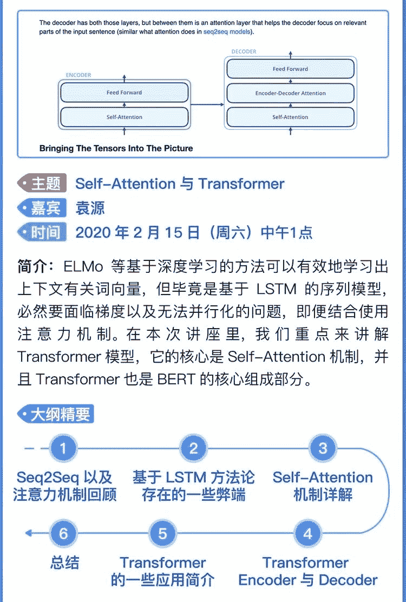

Datawhale

**Datawhale编辑**

> 现在是国家的非常时期，由于疫情各地陆续延迟复工，以及各大院校延期开学。作为一家 AI 教育领域的创业公司，贪心学院筹划了5期NLP专题直播课程，希望在这个非常时期做点有价值的事情，并携手共渡难关。

在疫情期间，贪心学院联合国内外顶尖 AI 专家一起筹划「共同战疫，贪心在行动」的计划，提供重磅级 NLP 专题系列直播课程，共五次课程，为期两周时间，供大家在线学习，全程免费。

**NLP 专题课**

这次的专题我们选择了近几年 NLP 领域最火的，你不得不了解的话题 -」预训练模型「。从简单的 **Word2Vec，ELMo，GPT，BERT，XLNet 到 ALBERT**, 这几乎是 NLP 过去 10 年最为颠覆性的成果。**作为一名 AI 从业者，或者未来想步入 AI 领域的人士，这是一门必修课。**在本次专题活动，我们会由浅入深地按照知识点的学习路径来给大家讲解每个技术背后的原理、细节以及应用。

本次的专题课程，我们也有幸邀请到了多位国内外 NLP 领域的专家，其中**蓝振忠博士作为 ALBERT 模型的第一作者，会亲自讲述当初对这份工作背后的思考以及技术细节。**希望通过本次活动，给大家带来一些认知上的收获，在疫情期间也可以充实自我，武汉加油，中国加油！

下面是关于本次专题课程的详细介绍以及安排，你可以通过扫描下方的二维码来进行报名。

本次专题活动除了贪心科技的创始人，我们还联合了国内外多位 NLP 领域专家，包括蓝振忠（ALBERT 模型第一作者，Google Lab 科学家，卡耐基梅隆大学博士），葛瀚骋（Amazon Alexa 部门科学家，Texas A&M 大学博士），袁源（美国微软推荐系统主管，新泽西理工博士）。

对于本次的专题内容，会从词向量，LSTM，Seq2Seq，注意力机制开始逐步讲解到 ELMo，Transformer，BERT，XLNET，ALBERT。这是一次体系化的专题课程，区别于常见的公开课，希望通过两周的时间让听众对这个领域有直观的认知。

本次直播分5大主题，为期两周时间：

报名**专题课程**请扫描下方二维码

**????????????**

**贪心科技是谁？**

想深入了解我们，请加入我们的活动，不见不散！大家也可以关注“**贪心科技AI学社**”公众号获取最新的动态。

阅读原文报名