来自 | 深度学习这件小事   编辑 | Datawhale

对于诸位“机器学习儿”而言，梯度下降这个概念一定不陌生，然而从直观上来看，梯度下降的复杂性无疑也会让人“敬而远之”。本文作者 Suraj Bansal 通过对梯度下降背后的数学原理进行拆解，并配之以简单的现实案例，以轻松而有趣的口吻带大家深入了解梯度下降这一在机器学习领域至关重要的方法。

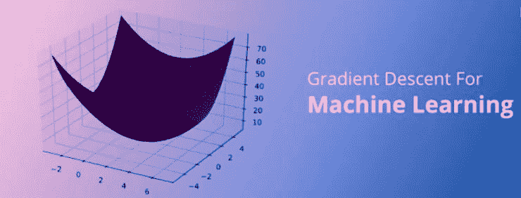

敏捷软件开发定义了迭代产品开发的过程，以下步骤可通过这一过程执行。

*   1）市场调研后进行产品构建

*   2）产品商业化并进入市场

*   3）评估消费者满意度和市场渗透率

*   4）对反馈及时回应，并更新迭代产品

*   5）重复上述过程

这个过程实质上是将市场测试、 收集反馈和产品迭代反复进行，直到能以最小的误差实现最大的市场渗透率。此循环重复多次，并确保消费者可以在每个步骤中提供一定的反馈来影响产品的更改策略。

实际上，这种看似简单的反复迭代过程很好地体现在梯度下降原理中。梯度下降能够通过首先计算出成本函数的梯度、然后更新梯度对应的现有参数从而最小化成本函数来处理。

梯度将具有众多变量的函数转换为一个向量，稍后我们将对该话题进行讨论。

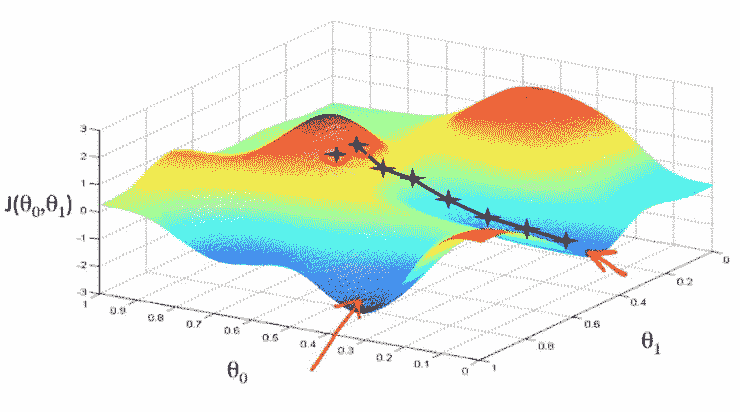

WOAHHHHHHHHHH......就此打住——这看起来太复杂啦！

你也许会对这张图片感到惊讶，但实际上你完全不用担心。

了解梯度下降背后的多元演算听起来可能会让人十分畏惧，别怕，下面我将对梯度下降背后的原理做出解释并且仅跟大家探讨理解梯度下降所需的数学概念。

在此之前，我强烈建议你们查看我此前写的一篇关于机器学习的文章或视频先对基础知识进行复习！

*   文章链接：https://medium.com/datadriveninvestor/machine-learning-making-ai-way-less-artificial-and-even-more-intelligent-cc2d5cf11ac0

*   视频链接*：*https://www.youtube.com/watch?v=yvouUpxIqts&t=145s

### **一、梯度下降变体：****不止一个**

梯度下降采用机器学习算法实现了三种主要的变体，每个变体在计算效率上各异并且都具有各自独特的优势。

1、第一种变体：批量梯度下降

批量梯度下降（Batch Gradient Descent）可以说是梯度下降变体中最简单的一种。这整个过程可以看作是训练迭代的次数（Epoch），即以决定训练用来更新模型权重的向量的次数。

批量梯度下降的误差通过训练集每一批单独的样本计算出来，并且在所有训练点数都在一个 Epoch 内经过机器学习算法的训练后更新模型参数。

更多相关信息可参考下面这篇文章（文中为大家推荐了五本机器学习相关的书籍）：

*   https://www.datadriveninvestor.com/2019/03/03/editors-pick-5-machine-learning-books/

该方法的误差梯度和收敛速度较为稳定，可以实现足够水平的计算效率。但是，由于该模型仅在分析了整个训练集之后才对权重进行迭代，此时的收敛状态可能不是最优的状态，事实上，该模型还可以优化以达到更精确的结果！

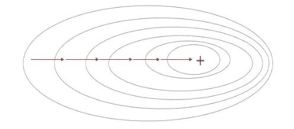

2、第二种变体：随机梯度下降

下面进入……随机梯度下降！这两种方法之间的根本区别在于，随机梯度下降法随机化了整个数据集并对每个单独的训练样本进行权重和参数的更新，而批量梯度下降是在分析了整个训练集之后对参数进行更新。

对模型连续更新可以提供更高的准确率和更快的计算速度。但是，频繁的更改会产生更多的梯度噪声，这意味着它会在误差最小值区域（成本函数最低的点）内来回振荡。因此，每次运行测试都会存在一些差异。

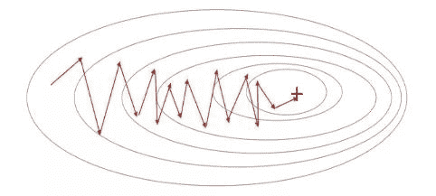

好的，这两种方法都有一些明显的优缺点，那么到底哪种方法更适合你的机器学习模型？这也不是什么很难的问题——都不是！

3、第三种变体：迷你批量梯度下降

再接下来进入……迷你批次梯度下降！它基本上结合了批量梯度下降的效率和随机梯度下降的整体鲁棒性。

该方法通过将数据集聚类为更小的批量（通常在30–500个训练点数之间），并且模型对每个单独批量执行迭代。它通过使用高度优化的矩阵来提高效率和准确性，这有效减小了参数更新的方差。

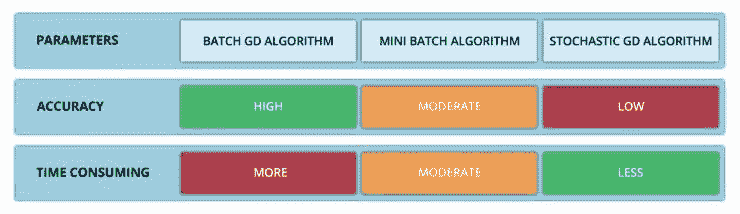

所有梯度下降变体都将使用以下公式进行建模。每当模型进行反向传播后，都会执行此迭代，直到成本函数达到其收敛点为止。

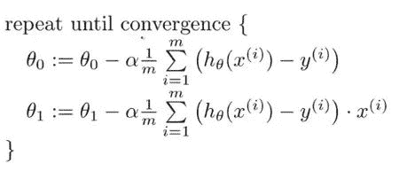

> 权重向量存在于 x-y 平面中，将对应每个权重的损失函数的梯度与学习率相乘，然后用向量减去二者的乘积。

偏导数是用于更新参数 θ0、θ1和alpha（学习率）的梯度，而alpha是需要用户自己给定的非常重要的超参数。M 代表更新的次数，i 代表梯度更新的起始点。

### **二、涉及到的一些数学概念**

1、偏导数

我们知道一个多变量函数的偏导数，就是它关于其中一个变量的导数而保持其他变量恒定。但是该函数的整个求导过程是怎样的呢？

首先，让我们了解偏导数背后的数学原理。计算像 f（x，y）=x²* y 这样的多变量函数的过程可以分解如下：

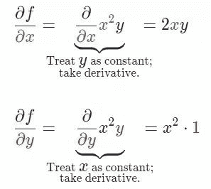

好吧，我知道你此时在想什么——导数本身已经很复杂很枯燥，为什么还使用偏导数而不完全使用导数！

函数输入由多个变量组成，因此，其中涉及的概念就是多变量演算。偏导数用于评估每个变量相对于其他变量作为常量时的变化情况。

2、梯度

梯度实质上输出的是标量值多变量函数多维输入的一维值。梯度表示图形切线的斜率，该斜率指向函数最大增长率的方向。这个导数代表了成本函数的趋势或斜率值。

本质上，任何给定函数 f 的梯度（通常用∇f表示）可以解释为一个向量所有偏导数的集合。

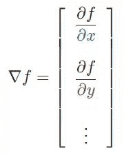

> 想象自己站在函数 f 以一定间隔排列的点（x0，y0…）之中。向量∇f（x0，y0…）将识别出使 f函数值增加的最快行进方向。有趣的是，梯度矢量∇f（x0，yo…）也垂直于函数 f 的轮廓线！

是的，多变量函数计算绝对是令人生畏的。下面，我们来总结一下。

假设偏导数是具有 n 个偏导数的 n 次导数，这些偏导数可以将每个单独的变量与其他看作常数的变量隔离开来。而梯度将每个偏导数组合成一个向量。

3、学习率

梯度可以确定移动的方向。学习率将决定我们采取步长的大小。学习率本质上是一个超参数，它定义了神经网络中权重相对于损失梯度下降的调整幅度。

这个参数决定了我们朝着最佳权重移动的速度的快慢，同时将每个步长的成本函数最小化。高学习率可以在每一步中覆盖更多的区域，但是可能会跳过成本函数的最小值；低学习率则需要花上很久的时间才能到达成本函数的最小值。

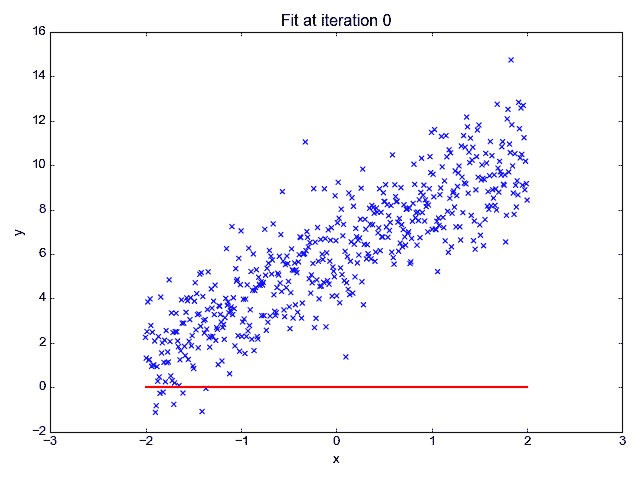

下面我以我的小外甥和他对狗的喜爱为例，来对这两种情况进行说明：

我们假设 Arnav 美梦成真：看到了25只漂亮的拉布拉多犬，并且它们都是黑色的。那自然而然地，Arnav 就会识别出这种一致的黑色，并将这种黑色关联为他之后在辨认狗这种动物时要寻找的主要特征。


假设我突然给他看一条白色的狗，然后告诉他这是一只狗，如果学习率低，他会继续认为所有的狗都一定具备黑色的特征，而这条白色的狗就是一条异常的狗。

如果学习率高，Arnav 就会转而相信所有的狗都应该是白色的，并且任何跟他的新预想不一致的情况都会被视为错误，即便之前他看到过 25只黑色狗。

在理想的学习率下，Arnav 将意识到颜色不是对狗进行分类的主要属性，他将继续去发现狗的其他特征。理想的学习速率无疑是最好的，因为它能够在准确性和时间成本之间找到一个平衡点。

4、成本函数

成本函数可以衡量模型的性能，在神经网络训练过程中，我们要确保将成本函数一直减小，直到达到最小值。

成本函数实质上是通过回归指标，例如平均绝对误差和均方误差，来量化预测值和期望值之间的总误差。

5、平均绝对误差

平均绝对误差测量的是一组预测样本中平均误差的大小，而无需评估其方向或矢量，可以通过以下公式进行建模。

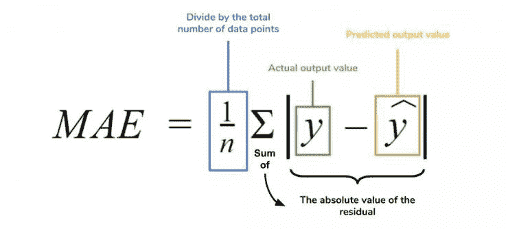

6、均方误差

均方误差可找到预测值与实际值之间平均差的平方。除了最后取值为平方而不是绝对值这一点以外，均方误差与平均绝对误差 MAE 的原理基本一致。其对于部分误差值的度量标准不再是坐标系内点之间的距离，而是找到由测量点之间的距离产生的形状（通常为正方形）区域。

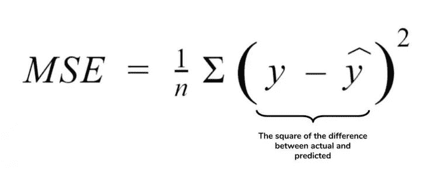

7、梯度下降（再次介绍）

让我们看这样一个类比，以进一步了解梯度下降的直观原理！


想象一下，你站在珠穆朗玛峰峰顶上，现在要完成通往山底的任务，这听起来相当简单且直观对吧？

然而，（现在有一个你需要考虑的细节信息是——你完全是一个盲人）这里出现了一则你需要重新考虑的小信息——你是盲人。

这无疑使得任务变得更加艰巨，但目标也并非完全不可能实现。在你开始朝着更大倾斜度的方向移动前，你需要迈出一小步一小步。在你抵达山底之前，此方法需要进行无数次迭代以最终达到目的地。

这从本质上模仿了梯度下降的理念，在梯度下降中，模型通过后向传播以最终到达山的最低点。

山脉类似于在空间中绘制的数据图，行走的步长类似于学习率，感受地形陡峭程度就类似于算法计算数据集参数的梯度。

若假设正确，选择的方向会降低成本函数。山的底部代表了机器的权重的最佳值（成本函数已经被最小化）。

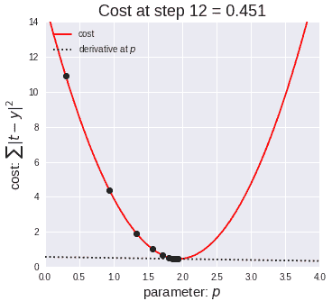

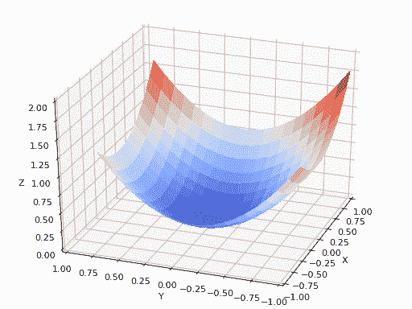

8、线性回归

对于那些不熟悉的变量，在所有统计模型学科中常常使用回归分析来研究多变量函数之间的关系以进行预测分析。

代表期望值和实验值之间误差的线称为回归线，每个残差值都可以通过与其方差与最佳拟合线连接的垂直线段描绘出来。

> 下面的公式将 x 表示为输入的训练数据（参数为单变量或单输入变量），假设进行了监督学习，则 y 表示数据的标签。

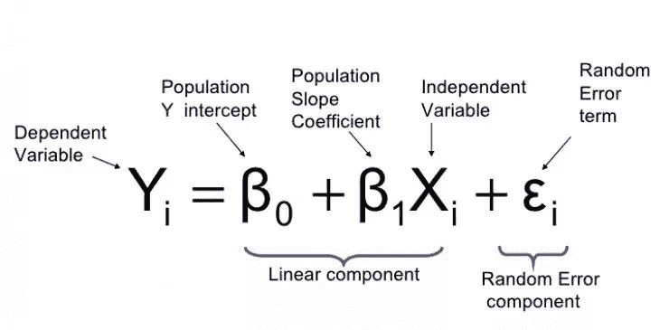

让我们通过以下示例对此做进一步了解。

Elon 在 salesx 担任兼职市场总监，他收集了过去一年的促销工作促销活动的付款额与销售额的数据，给未来销售和促销提供一些指导性建议。

Elon认为该数据应该是线性的，所以用散点图的方式来呈现这些信息，横纵坐标分别为新客户数量和花费的成本。Elon构造了回归线，其目的是为了更好地理解和预测salesx将通过新的营销理念获得多少客户。

9、多项式回归

线性回归可以很好地显示数据集中两个相关变量中存在的结构和趋势。但是，考虑到线性函数的行为，而由于在非线性关系中依然可以清楚地表现出一定的相关性，它们无法将非线性的回归关系进行准确反映。

多项式回归能够对 n 次方函数之间的关系进行建模，并且可以以低于线性回归的误差函数值拟合某些数据集。

尽管多项式回归可以更好地拟合函数的曲率，并且可以最准确地表示两个变量之间的关系，但它们对异常值极为敏感，那些异常值很容易造成数据偏离。

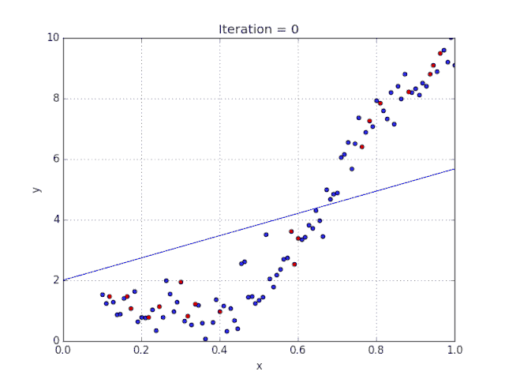

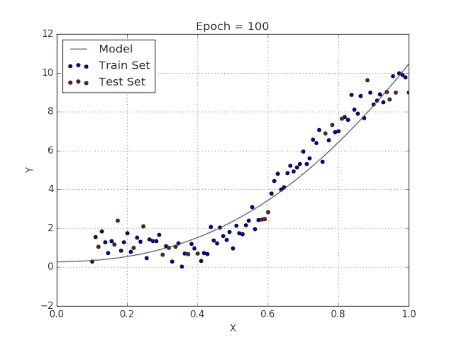

> 感谢阅读我的文章，希望大家能学到更多有关梯度下降的知识， 以及如何将这些原理应用到机器学习和人工智能中！

Via https://medium.com/datadriveninvestor/the-math-and-intuition-behind-gradient-descent-13c45f367a11

```
AI学习路线和优质资源，在后台回复"AI"获取 
```