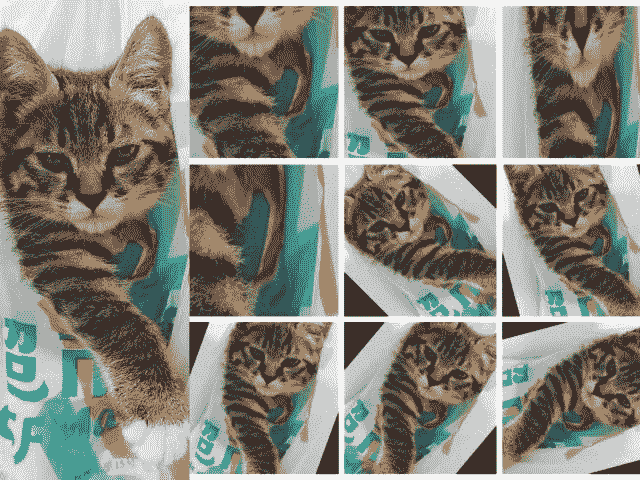
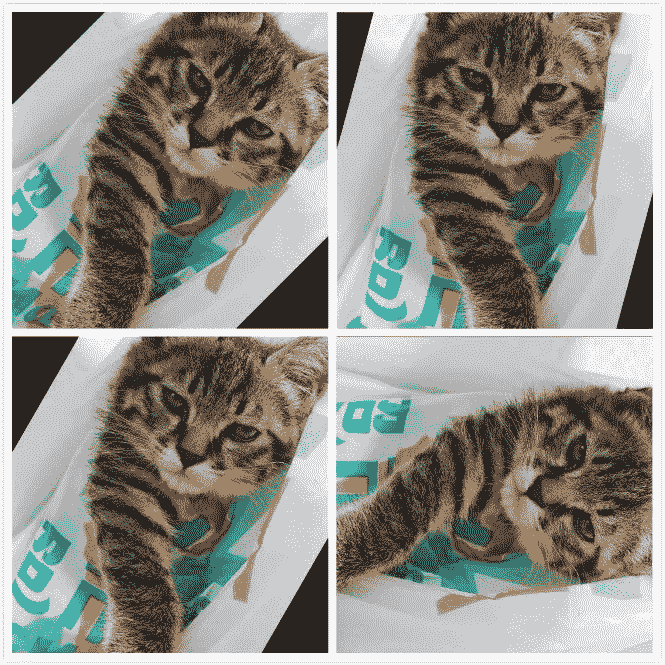
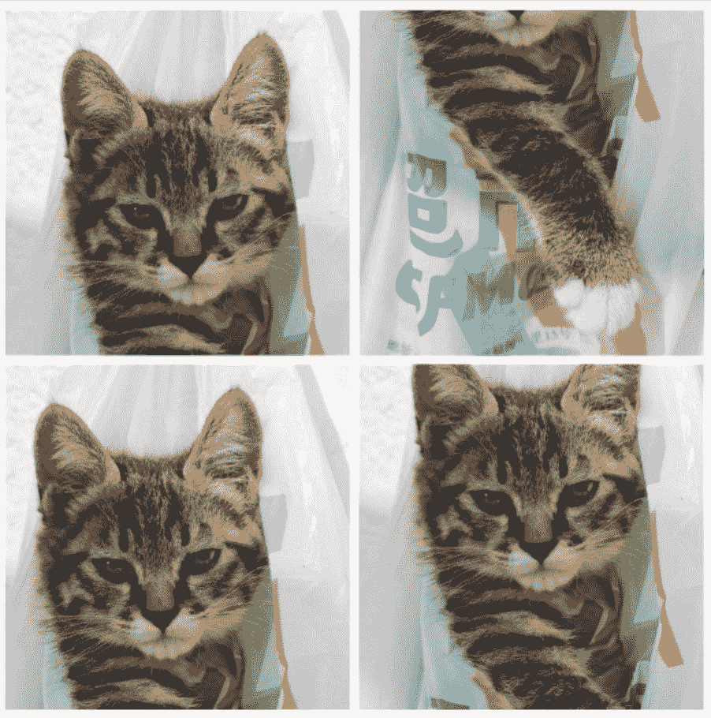
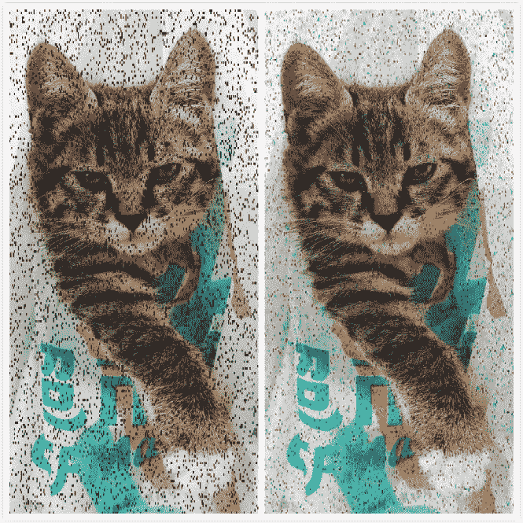
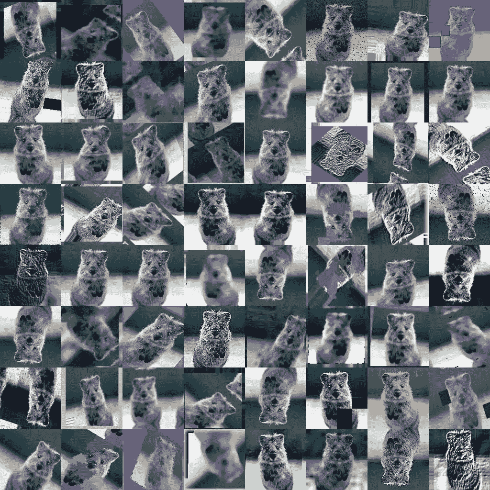
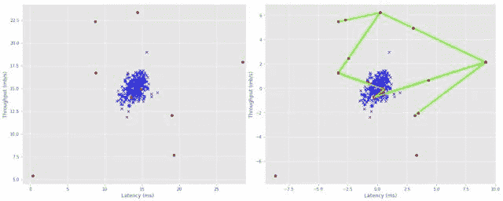
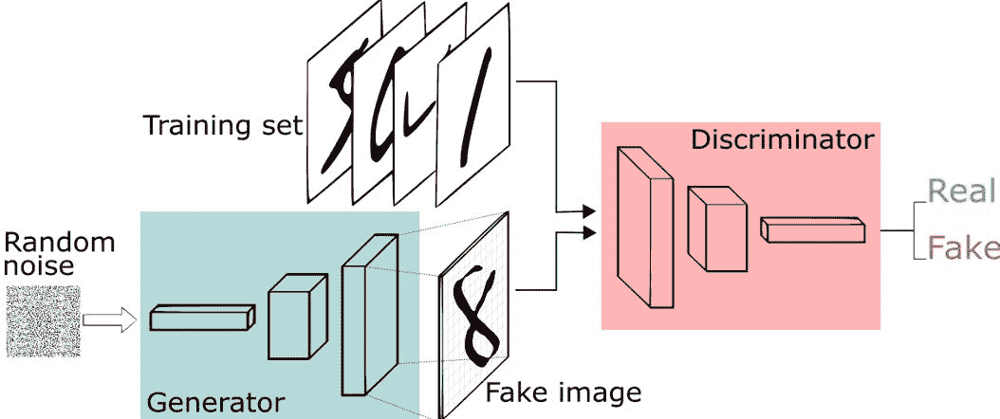
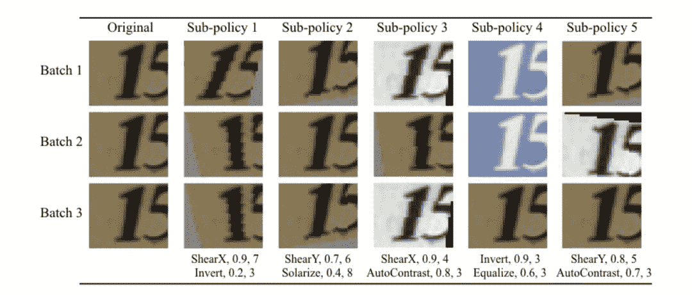
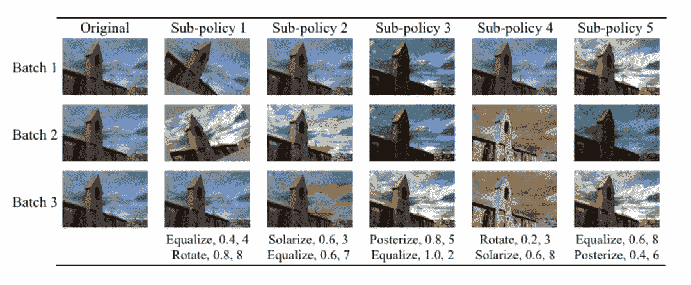

**1 什么是数据增强？**

数据增强也叫数据扩增，意思是在不实质性的增加数据的情况下，让有限的数据产生等价于更多数据的价值。



比如上图，第1列是原图，后面3列是对第1列作一些随机的裁剪、旋转操作得来。

每张图对于网络来说都是不同的输入，加上原图就将数据扩充到原来的10倍。假如我们输入网络的图片的分辨率大小是256×256，若采用随机裁剪成224×224的方式，那么一张图最多可以产生32×32张不同的图，数据量扩充将近1000倍。虽然许多的图相似度太高，实际的效果并不等价，但仅仅是这样简单的一个操作，效果已经非凡了。

如果再辅助其他的数据增强方法，将获得更好的多样性，这就是数据增强的本质。

数据增强可以分为，**有监督的数据增强和无监督的数据增强方法**。其中有监督的数据增强又可以分为**单样本数据增强和多样本数据增强方法，无监督的数据增强分为生成新的数据和学习增强策略两个方向。**

**2 有监督的数据增强**

有监督数据增强，即**采用预设的数据变换规则，在已有数据的基础上**进行数据的扩增，包含单样本数据增强和多样本数据增强，其中单样本又包括几何操作类，颜色变换类。

**2.1\. 单样本数据增强**

所谓单样本数据增强，即增强一个样本的时候，全部围绕着该样本本身进行操作，包括**几何变换类，颜色变换类**等。

**(1) 几何变换类**

几何变换类即对图像进行几何变换，包括**翻转，旋转，裁剪，变形，缩放**等各类操作，下面展示其中的若干个操作。


水平翻转和垂直翻转



随机旋转



随机裁剪


变形缩放

翻转操作和旋转操作，对于那些对方向不敏感的任务，比如图像分类，都是很常见的操作，在caffe等框架中翻转对应的就是mirror操作。

翻转和旋转不改变图像的大小，而裁剪会改变图像的大小。通常在训练的时候会采用随机裁剪的方法，在测试的时候选择裁剪中间部分或者不裁剪。值得注意的是，在一些竞赛中进行模型测试时，一般都是裁剪输入的多个版本然后将结果进行融合，对预测的改进效果非常明显。

以上操作都不会产生失真，而缩放变形则是失真的。

很多的时候，网络的训练输入大小是固定的，但是数据集中的图像却大小不一，此时就可以选择上面的裁剪成固定大小输入或者缩放到网络的输入大小的方案，后者就会产生失真，通常效果比前者差。

**(2) 颜色变换类**

上面的几何变换类操作，没有改变图像本身的内容，它可能是选择了图像的一部分或者对像素进行了重分布。如果要改变图像本身的内容，就属于颜色变换类的数据增强了，常见的包括**噪声、模糊、颜色变换、擦除、填充**等等。

基于噪声的数据增强就是在原来的图片的基础上，随机叠加一些噪声，最常见的做法就是高斯噪声。更复杂一点的就是在面积大小可选定、位置随机的矩形区域上丢弃像素产生黑色矩形块，从而产生一些彩色噪声，以Coarse Dropout方法为代表，甚至还可以对图片上随机选取一块区域并擦除图像信息。



添加Coarse Dropout噪声

颜色变换的另一个重要变换是颜色扰动，就是在某一个颜色空间通过增加或减少某些颜色分量，或者更改颜色通道的顺序。


颜色扰动

还有一些颜色变换，本文就不再详述。

几何变换类，颜色变换类的数据增强方法细致数来还有非常多，推荐给大家一个git项目：

https://github.com/aleju/imgaug

预览一下它能完成的数据增强操作吧。



**2.2\. 多样本数据增强**

不同于单样本数据增强，多样本数据增强方法利用多个样本来产生新的样本，下面介绍几种方法。

**(1) SMOTE[1]**

SMOTE即Synthetic Minority Over-sampling Technique方法，它是通过人工合成新样本来处理样本不平衡问题，从而提升分类器性能。

类不平衡现象是很常见的，它指的是数据集中各类别数量不近似相等。如果样本类别之间相差很大，会影响分类器的分类效果。假设小样本数据数量极少，如仅占总体的1%，则即使小样本被错误地全部识别为大样本，在经验风险最小化策略下的分类器识别准确率仍能达到99%，但由于没有学习到小样本的特征，实际分类效果就会很差。

SMOTE方法是基于插值的方法，它可以为小样本类合成新的样本，主要流程为：

第一步，定义好特征空间，将每个样本对应到特征空间中的某一点，根据样本不平衡比例确定好一个采样倍率N；

第二步，对每一个小样本类样本(x,y)，按欧氏距离找出K个最近邻样本，从中随机选取一个样本点，假设选择的近邻点为(xn,yn)。在特征空间中样本点与最近邻样本点的连线段上随机选取一点作为新样本点，满足以下公式：


第三步，重复以上的步骤，直到大、小样本数量平衡。

该方法的示意图如下。


在python中，SMOTE算法已经封装到了imbalanced-learn库中，如下图为算法实现的数据增强的实例，左图为原始数据特征空间图，右图为SMOTE算法处理后的特征空间图。



**(2) SamplePairing[2]**

SamplePairing方法的原理非常简单，从训练集中随机抽取两张图片分别经过基础数据增强操作(如随机翻转等)处理后经像素以取平均值的形式叠加合成一个新的样本，标签为原样本标签中的一种。这两张图片甚至不限制为同一类别，这种方法对于医学图像比较有效。


经SamplePairing处理后可使训练集的规模从N扩增到N×N。实验结果表明，因SamplePairing数据增强操作可能引入不同标签的训练样本，导致在各数据集上使用SamplePairing训练的误差明显增加，而在验证集上误差则有较大幅度降低。

尽管SamplePairing思路简单，性能上提升效果可观，符合奥卡姆剃刀原理，但遗憾的是可解释性不强。

**(3) mixup[3]**

mixup是Facebook人工智能研究院和MIT在“Beyond Empirical Risk Minimization”中提出的基于邻域风险最小化原则的数据增强方法，它使用线性插值得到新样本数据。

令(xn,yn)是插值生成的新数据，(xi,yi)和(xj,yj)是训练集随机选取的两个数据，则数据生成方式如下


λ的取指范围介于0到1。提出mixup方法的作者们做了丰富的实验，实验结果表明可以改进深度学习模型在ImageNet数据集、CIFAR数据集、语音数据集和表格数据集中的泛化误差，降低模型对已损坏标签的记忆，增强模型对对抗样本的鲁棒性和训练生成对抗网络的稳定性。

**SMOTE，SamplePairing，mixup三者思路上有相同之处，都是试图将离散样本点连续化来拟合真实样本分布**，不过所增加的样本点在特征空间中仍位于已知小样本点所围成的区域内。如果能够在给定范围之外适当插值，也许能实现更好的数据增强效果。

**3 无监督的数据增强**

无监督的数据增强方法包括两类：

(1) 通过模型学习数据的分布，随机生成与训练数据集分布一致的图片，代表方法GAN[4]。      

(2) 通过模型，学习出适合当前任务的数据增强方法，代表方法AutoAugment[5]。

**3.1 GAN**

关于GAN(generative adversarial networks)，我们已经说的太多了。它包含两个网络，一个是生成网络，一个是对抗网络，基本原理如下：

(1) G是一个生成图片的网络，它接收随机的噪声z，通过噪声生成图片，记做G(z) 。      

(2) D是一个判别网络，判别一张图片是不是“真实的”，即是真实的图片，还是由G生成的图片。



GAN的以假乱真能力就不多说了。

**2 Autoaugmentation[5]**

AutoAugment是Google提出的自动选择最优数据增强方案的研究，这是无监督数据增强的重要研究方向。它的基本思路是使用增强学习从数据本身寻找最佳图像变换策略，对于不同的任务学习不同的增强方法，流程如下：

(1) 准备16个常用的数据增强操作。

(2) 从16个中选择5个操作，随机产生使用该操作的概率和相应的幅度，将其称为一个sub-policy，一共产生5个sub-polices。

(3) 对训练过程中每一个batch的图片，随机采用5个sub-polices操作中的一种。

(4) 通过模型在验证集上的泛化能力来反馈，使用的优化方法是增强学习方法。

(5) 经过80~100个epoch后网络开始学习到有效的sub-policies。

(6) 之后串接这5个sub-policies，然后再进行最后的训练。

总的来说，就是学习已有数据增强的组合策略，对于门牌数字识别等任务，研究表明剪切和平移等几何变换能够获得最佳效果。



而对于ImageNet中的图像分类任务，AutoAugment学习到了不使用剪切，也不完全反转颜色，因为这些变换会导致图像失真。AutoAugment学习到的是侧重于微调颜色和色相分布。



除此之外还有一些数据增强方法，篇幅有限不做过多解读，请持续关注。

**4 思考**

数据增强的本质是为了增强模型的泛化能力，那它与其他的一些方法比如dropout，权重衰减有什么区别？

(1) 权重衰减，dropout，stochastic depth等方法，是专门设计来限制模型的有效容量的，用于减少过拟合，这一类是显式的正则化方法。研究表明这一类方法可以提高泛化能力，但并非必要，且能力有限，而且参数高度依赖于网络结构等因素。

(2) 数据增强则没有降低网络的容量，也不增加计算复杂度和调参工程量，是隐式的规整化方法。实际应用中更有意义，所以我们常说，数据至上。

[1] Chawla N V, Bowyer K W, Hall L O, et al. SMOTE: synthetic minority over-sampling technique[J]. Journal of Artificial Intelligence Research, 2002, 16(1):321-357.

[2] Inoue H. Data Augmentation by Pairing Samples for Images Classification[J]. 2018.

[3] Zhang H, Cisse M, Dauphin Y N, et al. mixup: Beyond Empirical Risk Minimization[J]. 2017.

[4] Goodfellow I J, Pouget-Abadie J, Mirza M, et al. Generative Adversarial Networks[J]. Advances in Neural Information Processing Systems, 2014, 3:2672-2680.

[5] Cubuk E D, Zoph B, Mane D, et al. AutoAugment: Learning Augmentation Policies from Data.[J]. arXiv: Computer Vision and Pattern Recognition, 2018.

```
AI学习路线和优质资源，在后台回复"AI"获取 
```