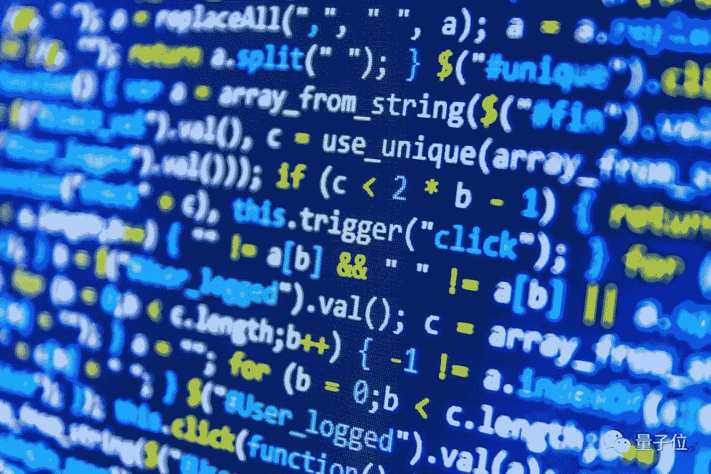

##### 晓查 发自 凹非寺 
量子位 报道 | 公众号 QbitAI

还记得你大学时的Java、C、Python等语言是怎么学习的吗？让我们打开经典教材和网络课程看一下，几乎都是下面的套路：

> 学习变量、数组、对象等专业词汇；
> 
> 查看编程示例，依葫芦画瓢写代码；
> 
> 重复以上步骤，直到学完全部课程。


然而一位程序员Jeff Olsen却认为，这种教学方式太过时了。


编程和计算机科学的关系，就如同烹饪和化学的关系一样。即使没搞清楚化学变化，一样可以做出美味的煎蛋。

为此，他提出了一套编程教学的新思路，Jeff的想法在Haker News上获得了广大程序员的赞同。

甚至连课程平台fast.ai的创始人Jeremy Howard也来捧场：“这与我们平台上深度学习的教学方法相似。”


有网友指出，对于初学者而已，归纳推理能力的形成非常重要，

这种方法不仅对老师有意义，对于自学编程的人来说也不失为一种更好的学习方法。

## 改变教学方法

Jeff提出的教学方法叫做“**预测至上**”。先给学生一段简单的代码，让他们预测会发生什么，然后从运行结果中学习语言的一些特性。

为此，Jeff提出了编程教学的5条标准，符合这些标准的教学课程才能将知识点传达到位：

1.  还不知道此语法的学生，能找出这段代码的作用吗？

2.  这段代码是否与以后可能遇到的代码合理的相似？

3.  命名的文字是否有意义，变量是否命名正确？

4.  问题是否允许学生专注于代码中最重要的部分？

5.  代码示例是否需要某些先验知识，还是能让所有人都能理解？

具体来说，就是不直接提概念，而是先提出一个难题供学生解决。

这个难题包含了当天的知识要点，然后要求学生根据这个难题创造一些新的代码，在解决问题的过程中学习专业术语。



这不仅是一份给教师的指南，我们在学习编程时，最好也带着问题去思考、学习代码，而不是机械地去重复书中的示例，这样才能真正掌握技能。

## 几个例子

Jeff首先展示了编程最基本的**Hello World**程序，他的方法与传统方法略有不同。我们先看这段代码：

```
name = "Tamara"
print("Hello" + name) 
```

运行以上程序会发生什么？

一般，我们凭借直觉能猜到运行结果中会出现Tamara，而实际的运行结果是**HelloTamara**，中间没有空格。

接下来如何让程序输出带空格的结果，必然要进行一轮调试。

在这个过程中，Jeff没有说过字符串、变量等概念，但是在解决这个问题的过程中，我们已经掌握了print函数、字符串的拼接等一系列用法。

Jeff还举了几个例子，希望能纠正传统教学课程里死板的内容。

### 1、条件判断

传统教学：

```
if 1 > 2:
    print("1大于2")
else:
    print("1不大于2") 
```

在这个例子中，学生只能查看代码，而不能通过使用代码学会条件判断。

Jeff建议把代码改成：

```
age = 15
if age >= 18:
    print("你可以购买R级电影票")
else:
    print(f"再过{18 - age}年你才满18岁") 
```

终端中将输出什么内容？你的回答应该是：再过3年你才满18岁。

接着，Jeff丢出了几个问题：

整段代码里都没有3，你怎么知道会出现“ 3年”？我们如何更改程序来显示其他语句呢？缩进对我们的程序有什么作用。

通过这3问，学生知道了if-else语句的缩进格式，还知道如何用通过更改条件来实现其他的判断。

### 2、数组

传统教学：

```
a = [3, 2, 7, 5, 3, 9]
print(a[2]) 
# returns 7 
```

在这个示例中，为何a[2]的结果是7，没学过编程的人可能无法理解，甚至会产生错误的理解：哦，原来是输出第2个数字后面的一个数字。

Jeff建议改成：

```
favorite_foods = ["寿司", "玉米粽子", "披萨", "烤鸡肉"]
print(favorite_foods[2]) 
```

这段程序的输出结果会是什么？我们如何打印出第一种食物、最后一种食物？如果把最后一句改成favorite_foods[10]会发生什么？

通过这个简单的示例，学生可以了解数组、索引已经索引超出范围的错误。

### 3、对象

传统教学

```
Class Dog:
    def __init__(self):
        pass

    def speak(self):
        print("woof!)

Fido = Dog()
Fido.speak() 
```

这段代码虽然用小狗做例子，看似生动有趣，其实存在着一些问题：

1、狗并不存在于网络空间中。
2、使用9行代码来创建和调用函数，实际可以更短。
3、这种方法创建的所有狗都只有相同的功能，那为何还要创建一个类呢？

Jeff建议改成：

```
user1 = User("Ty", "Tdog@aol.com", 16, "Pa$$word")
user2 = User("Sarai", "SMendes@hotmail.com", 15, "Kangaroo!")
user3 = User("Osu", "Osu22@gmail.com", 12, "12345abcde")
print(user2.age) 
```

提问环节：第一个用户的电子邮件是什么？哪个用户的密码最弱？最后一行将输出什么？

学生通过这种方式先学习了创建对象的方法，至于代码中出现的User()，接下来就可以很自然地教他们如何创建类了。

最后附上Jeff博客的链接，希望他的方法对你学习编程有所帮助。

原文链接：
*https://blog.upperlinecode.com/stop-teaching-code-a1039983b39*

```
AI学习路线和优质资源，在后台回复"AI"获取 
```