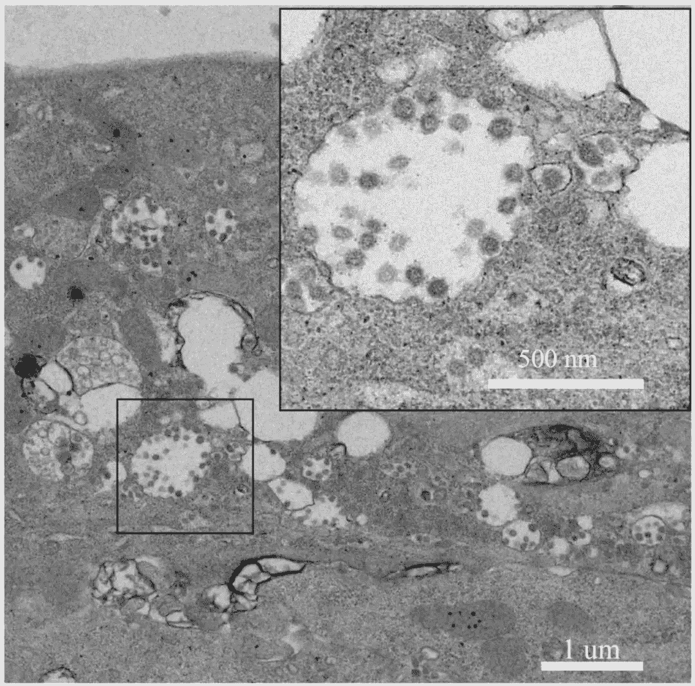
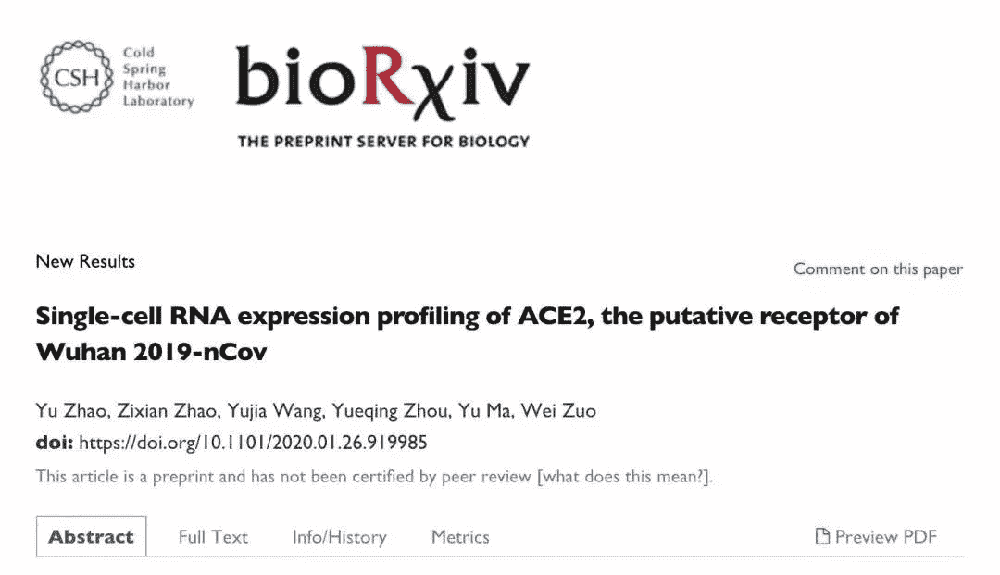
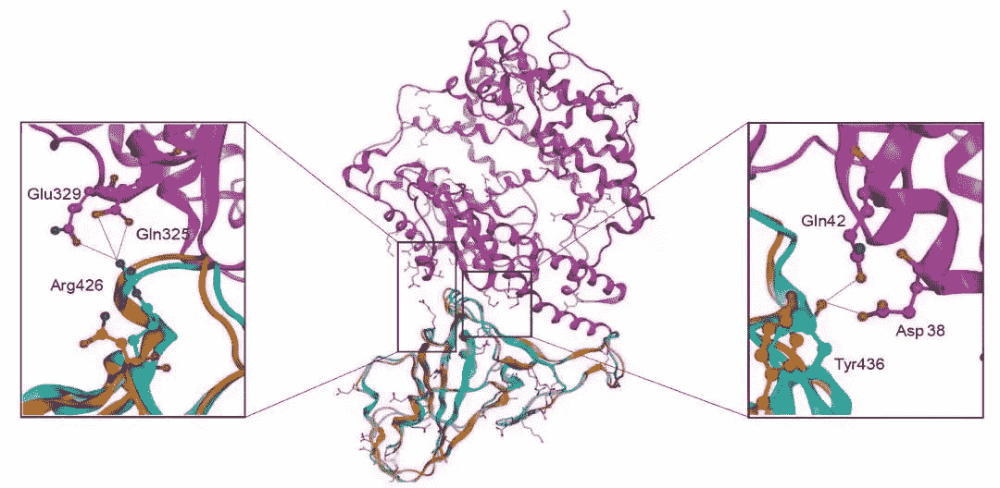
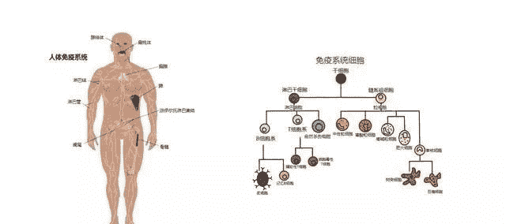
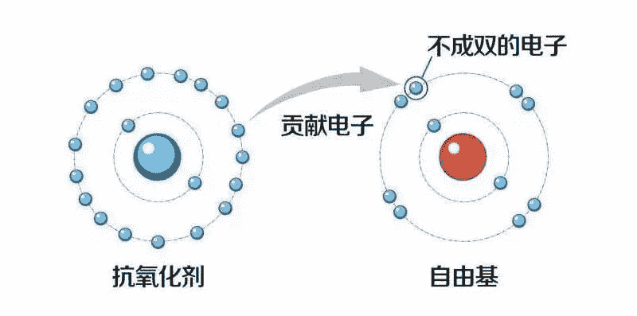

**先平复平复心境，本人将从科学范围内进行表述，****欲****将免疫力这一科普话题进行到底。**

**关键词：**病毒机制/免疫机制/膳食/运动/心理/睡眠

01

**从冠状病毒说起**

新冠状病毒2019 与SARS-CoV冠状病毒相似，一般在免疫力低下人群中发生，感染患者可出现发烧、咳嗽和急性呼吸窘迫综合征, 有时还伴有肾衰竭症状。自2020年报道以来,该病毒感染率及人传人的能力, 以及向其他国家蔓延的趋势引起各方重视和担忧。

**因此, 在我们了解人体免疫机制之前，对新冠病毒 MERS-CoV 侵入宿主细胞机制的了解也同样重要。**

冠状病毒最早于 1968 年被发现，并于 1975 年被国际病毒命名委员会归类于套式病毒目（Nidovirales）中的冠状病毒科（cirinaviridae）。



冠状病毒直径约 80～120nm，在电镜下观察它们的表面如同王冠一样，因而被命名为冠状病毒。同时也是目前已知 RNA 病毒中基因组最大的病毒。

MERS-CoV 新冠病毒与 SARS-CoV冠状病毒，同属冠状病毒科,为具囊膜的正链 RNA 病毒。病毒囊膜上含有刺突蛋白 (Spike, S), 介导病毒对宿主特异性受体分子的结合, 是起始病毒感染最重要的分子。**早在2013年，《自然》杂志发表了一篇关于新冠状病毒侵入宿主细胞机制的研究成果，**研究表明，二肽基肽酶 -4(Dipeptidyl peptidase 4, DPPIV/CD26)是 MERS-CoV 在宿主细胞的受体。主要感染无纤毛的支气管上皮细胞和人肺 II 型上皮细胞。



最新一项研究，科学家对2019新型冠状病毒（Novel coronavirus pneumonia），即“COVID-19” 的 S 蛋白进行了结构三维建模，结果表明，尽管存在氨基酸残基的替换，但“COVID-19” 的 S 蛋白与人 ACE2 受体仍然具有显著的结合亲和力。**石正丽研究团队及中国科学院上海巴斯德研究所和中国科学院武汉病毒研究所的科学家证实：**新冠状病毒（“COVID-19” ）进入细胞需要血管紧张素转化酶2（ACE2）的存在。



**也就是说，上述研究对已知 S 蛋白的 S1 多肽与受体结合相互作用，将有助于开发相应的药物或预防制剂。**

**顺便提一提冠状病毒宿主**

冠状病毒有着十分广泛的宿主种类，其中最受关注的是蝙蝠。迄今为止，在蝙蝠中已鉴定有 200 余种的新冠状病毒。

目前新冠病毒由蝙蝠传给人虽已被认可，但对于较难解释的是，由蝙蝠传给人，还需要了解其“跳出”（spillover）机制。例如，鼠、猪、羊等动物均有分别感染相应的冠状病毒，引发的疾病也有所不同，由于冠状病毒广泛存在于野生及家畜动物中，故而还有可能通过不同机制进行跨种传播。

**由于篇幅原因，关于冠状病毒侵入宿主细胞机制相关介绍告一段落，感兴趣的朋友可通过中国知网查阅相关资料。**

02

**说说人体免疫系统**

所谓免疫系统，是通过识别外部人侵的病毒和细菌等微生物，做出反应，增加特异的对抗淋巴球，产生出抗体的系统。素有人体防火墙之称。它并不存在于身体的单个部分，而是由细胞、分子、组织和器官组成的大家庭，而每一种类型的细胞都在识别、标记和攻击有害细胞中发挥着重要作用。



**那么问题来了，面对新冠状病毒，人体免疫系统发挥了什么作用？**

就本次新冠病毒来说，大多数个体接触到病毒后，并无症状或仅出现轻微症状，有的出现发热胸闷等症状，但经一段时间后便可自行好转。这正是由于免疫细胞做出的防御反应，从而消灭了外来的病毒细胞。而对于那些免疫功能不强或者低下者，病毒感染却是一场严峻考验。

也就是说，当宿主被病毒细胞入侵时，患者只能通过自身免疫系统来进行自愈，抵抗力强则战胜病毒，而抵抗力弱的则可能杀死宿主。对于目前的科学来讲，还没有任何特效药可以完全消灭病毒，仅仅只是达到抑制的作用。

**因此，对于我们而言，增强自身免疫力迫在眉睫！**

03

**如何提升自身免疫力**

翻开生物学课本你就会知道，免疫力是人体对外来侵袭病毒的一种抵抗力,也受一定遗传因素的影响,但主要因素还是受生活方式和所在的环境影响。下文将主要从饮食、运动、睡眠、情绪等方面谈谈如何增强自身免疫力。

**在《自然》杂志的一项关于食用菌对于免疫力的研究表明，**食用菌多糖、 氨基酸、 蛋白质、 维生素等, 有着明显增强人体免疫的作用，常吃食用菌不失为提高自身的免疫功能, 加强抗病菌和病毒能力的好办法。**报告指出，**食用菌对于抵抗病毒的作用主要来自其中的多糖类物质, 它的奥秘在于刺激抗体的形成, 从而提高并调整人体内部积极的防御系统, 也就是我们医学中所说的扶正固本作用。

**当然，若你认为上述内容太过官方，那我们不妨说点接地气的内容。****敲个黑板，画个重点。****顺便提一提三黄连，金银花等药物。**

**3.1健康的饮食模式 **

以植物来源的食物为主，尽量吃全天然、少加工、少盐、少包装食物。适量吃果蔬可以获取丰富的维生素、矿物质、酶和膳食纤维。少吃红肉，这类肉中的耐药菌和病毒不断出现变异对人体的免疫系统将造成巨大伤害。（牛肉、羊肉等）

除此之外，不能因为偏爱某一种食物而不吃其他的，只有多种膳食搭配，才能吸取不同的营养素。**如奶类富含丰富的钙质，豆类里面富含许多优质的蛋白质，鱼、瘦肉里面富含优质蛋白质和某些矿物质，同时要控制肥肉和荤油的摄入量，减少脂肪的摄入。****其中应以谷类为主，且应粗细搭配。**

**特别提醒：**任何一种物质摄入不足都会造成人体免疫系统降低，所以我们必须合理膳食，营养均衡，有关饮食方案，大家还可参阅最前延往期推荐《[健康密码：柳叶刀连cue中国式饮食危机》](http://mp.weixin.qq.com/s?__biz=MzI3ODM5ODkzNg%3D%3D&chksm=eb56c301dc214a176fe5a1c726b3711028f68202c9b1638db18c61a9eed932c83d58e9b3a2a7&idx=1&mid=2247487926&scene=21&sn=48a5ae52f7ea59102b629796c1d370d0#wechat_redirect)总有一款饮食方案适合你。

**3.2科普下自救措施**

整个新冠病毒感染所引起的疾病分为三个主要阶段。（前期，三到七天，伴随着乏力，干咳，没有食欲；中期，持续发高烧三到七天，后期10到15天，呼吸困难，严重影响生存）。

因此，在受感染后的早期（第一、第二阶段），就要针对过度免疫反应产生的过量氧自由基（Reactive Oxygen Species ）和炎症因子进行用药，使机体恢复正常。千万不要等核酸检测结果出来才采取治疗行动。

**第一：**大量喝温热水，每天2000毫升以上的量，或服用维生素C、E等抗自由基药物（非病患者不可服用此剂量！保健人群也不建议长期补充维生素C）可加快排出身体内的毒素。**另外居民在选择饮用水的同时，应多选择天然矿泉水，有条件的你还可选择饮用富氢水。**



**研究表明，****人体的一起病源祸首都是由于自由基造成的，而富氢水相较于普通泉水则含有丰富的氢气，有着很好的抗氧化剂。**在《自然医学》上发表的一篇关于氢气生物学论文中，**日本医科大学太田成男教授**论述氢分子可清除人体自由基，并对衰老及多种因自由基引起的慢性病毒疾病具有很好的治疗作用。

**第二，服用中药**

小柴胡汤是张仲景治疗少阳症的千古名方。可以起到祛热驱邪，调理脾胃，提升正气，从而有着提高免疫力的作用。

**现代药理学研究也证明，很多中药，就是有清除过氧化自由基的和抑制炎症因子产生的能力。**其中，板蓝根、金银花，等都是很好的抗过氧化自由基药物。这也是为什么此类药物包括三黄连药物能登上热搜的原因。（特别声明，这仅仅只是基于药物特性来说，切勿以讹传讹，对于谣言，本人可经不起折腾。）

以上是针对感染前期的自救措施，如果一旦发现呼吸相当困难，请立即联系医院，到医院接受治疗。

**3.3适量的运动**

老调重谈，运动一词仿佛是一个万能医生。你可以发现，加强运动对于心血管及癌症等疾病都有其预防的作用。尤其是在目前全民居家的状态下，适量的室内运动，可促进人体的血液循环，加快营养吸收，提高人体的免疫力。

**1.**应根据年龄、身体状况等选择自己合适的运动项目。从一些小的、简单的运动开始，由弱到强，循序渐进，长期坚持下去，自然会收到意向不到的效果。

**2.**常见的居家运动方式包括：各式球类运动，室内自行车，跳绳、广播体操等，特别是广播体操其作用极其显著，效果适合于男女老少。**另外，大家还可尝试中国式贵族运动——太极拳。**


**研究表明：**练习太极拳可增加神经系统的灵敏性、提高心肺功能、治疗慢性消化管道疾病，不仅如此， 练习太极拳还可以调节心理压力，改变不良情绪，达到身心放松的状态，对抑郁、焦虑、神经衰弱、失眠、等有着不可思议的神奇功效。可谓延年益寿之功。

生命在于运动，运动讲究科学，建议各位在家或是工作期间，都要合理安排好运动时间。锻炼身体、增强体质，就能提高自身免疫力，从而预防病毒入侵。

**3.4保证睡眠充足**

优质的睡眠不仅使人的大脑和机体得到恢复， 消除人体的疲劳，还可增强人体的免疫力，抵抗疾病的的功效。

**1.**每晚最佳睡眠时间是 7 ～ 8 小时，最低应不少于 6 小时。睡眠质量高能宠妃的改善神经和脑细胞的营养，不仅能够补脑，还能提高人体的免疫 力。反之，如果睡眠不足，会降低免疫力，造成衰老，其健康危害很大。

**2.**睡眠分为午睡、瞌睡和夜睡，这三种睡眠方式对人体都是有益的，夜睡占主要时间，午睡和瞌睡都是" 充电时间"，睡眠时间不宜过长。

**3.**睡眠禁忌: 睡前不宜进食，也不能过饥; 睡前半小时不宜做剧烈的运动，熄灯睡觉，拒绝熬夜， 黑夜的环境能够改善机体的睡眠质量，还有防癌的作用。

**3.5心理健康**

心理压力是人类的一个隐形杀手，“健康的一半是心理健康”，有许多疾病就是长期的不良心态造成的，如喜怒哀乐，这些都会影响人体的健康。

**心理学上有一个著名的“踢猫效应”：**一父亲受到了老板的批评，回到家就把玩闹的孩子骂了一顿。孩子心里窝火，就把气发在了身边的猫。猫逃到街上，正好一辆车开过来，司机赶紧避让，却把路边的孩子撞伤了。

**这就是一种典型的坏情绪的传染所导致的恶性循环。**一个人有情绪时，按照“踢猫效应”的原理，会传递到周围的人，也容易建立一个恶性循环，开启了“互相伤害”的怪圈。

**当然，面对疫情，大众的恐慌、害怕等一些负面情绪在所难免。**这时应多和家人朋友表达情绪；同时还应从官方了解信息，少接触一些负面信息。另外还可通过观看直播和微课堂，学习权威的心理学家对于惶恐的生活所带来的技巧和方法，这样可使我们的心理感受到很大的安慰。

**结束语**

在我们平静的背后，是无数的免疫细胞舍生忘死战斗的结果，我们身体看似的每一项微妙变化，都有可能令免疫细胞“临阵倒戈，**新冠病毒已经告诉我们，提高免疫力才是最佳的良药！**

**最后，想跟大家分享一段话：**

面对疫情，如果说吃饱喝足是为了活着，那么提升免疫力则是为了活得更加肆无忌惮。生活不能仅仅是为了活着，更要活得肆无忌惮！为了活着，我们还有希望和拥有。

**天佑中华，为祖国加油！**

***参考文献：***

*[1] 冠状病毒的致病性及防控，作者闻玉梅*

*Schoeman D, Fielding BC. Coronavirus envelope protein: current knowledge [J]. Virol J, 2019, 16(1): 69. *

*[2] 新冠状病毒侵入宿主细胞机制研究获进展*

*http://www.biotech.org.cn/information/109211 *

*[3] 第 23 卷 第 3 期 中国食用菌 EDIBLE FUNGI OF CHINA *

*[4] 王莉． 略论增强人体免疫力的有效途径［J］．* 

```
AI学习路线和优质资源，在后台回复"AI"获取 
```