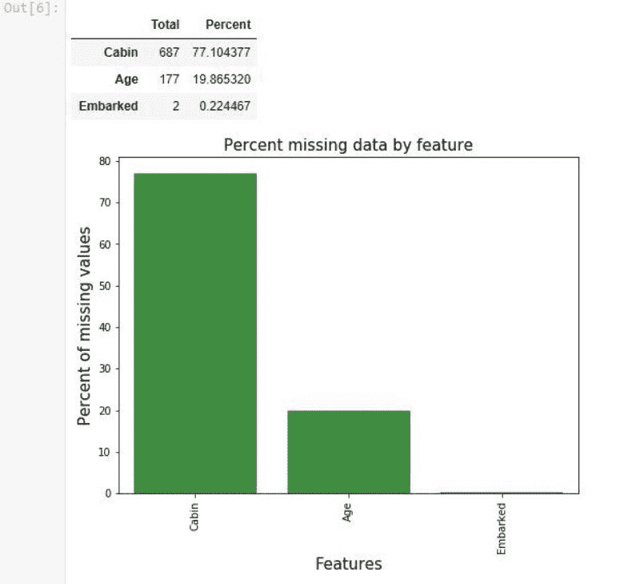
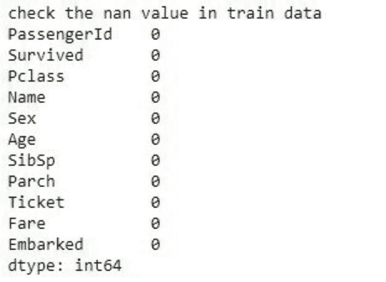
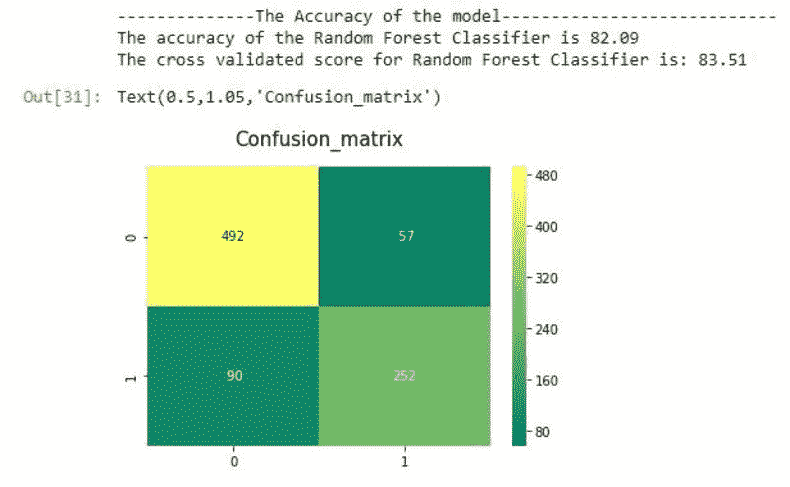

选自freecodecamp

**作者：Tirmidzi Faizal Aflahi**

**机器之心编译**

> 机器学习之路虽漫漫无垠，但莘莘学子依然纷纷投入到机器学习的洪流中。如何更有效地开始机器学习呢？所谓「八仙过海，各显神通」，本文作者以Python语言为工具进行机器学习，并以Kaggle竞赛中的泰坦尼克号项目进行详细解读。跟着小编来看看吧！

随着行业内机器学习的崛起，能够帮用户快速迭代整个过程的工具变得至关重要。Python，机器学习技术领域冉冉升起的一颗新星，往往是带你走向成功的首选。因此，用 Python 实现机器学习的指南是非常必要的。

**用 Python 实现机器学习的介绍**

那么为什么是 Python 呢？根据我的经验，Python 是最容易学习的编程语言之一。现在需要快速迭代整个过程，与此同时，数据科学家不需要深入了解这种语言，因为他们可以快速掌握它。

有多容易呢？

```
for anything in the_list:
    print(anything)
```

就这么容易。Python 的语法和英语（或人类语言，而不是机器语言）语法关系密切。在 Python 的语法中没有愚蠢的大括号造成的困扰。我有一个从事质量保证（Quality Assurance）工作的同事，虽然不是软件工程师，但她可以在一天内写出产品级的 Python 代码。（真的！）

我将在下文中介绍几个基于 Python 的库。作为数据分析师和数据科学家，我们可以利用他们的杰作来帮助我们完成任务。这些不可思议的库是用 Python 实现机器学习的必备工具。

**NumPy**

这是一个非常有名的数据分析库。从计算数据分布的中位数，到处理多维数组，NumPy 都可以帮你完成。

**Pandas**

这是用来处理 CSV 文件的。当然了，你还需要处理一些表格、查看统计数据等，那 Pandas 就是可以满足你的需求的工具。

**Matplotlib**

把数据存储在 Pandas 的数据框后，你可能需要做一些可视化来理解数据的更多信息。毕竟一图抵千言。

**Seaborn**

这是另一个可视化工具，但这个工具更侧重于统计结果的可视化，比如直方图、饼图、曲线图或相关性表等。

**Scikit-Learn**

这是用 Python 实现机器学习的终极工具。所谓用 Python 实现机器学习指的就是这个——Scikit-Learn。所有你需要的从算法到提升的内容都能在这里找到。

**Tensorflow 和 Pytorch**

针对这两个工具我不会说太多。但如果你对深度学习感兴趣的话，可以详细了解一下，它们值得你花时间去学习。（我下次会再写一篇关于深度学习的教程，敬请期待！）


**Python 机器学习项目**

当然，只是阅读和学习是没法让你达成心愿的。你需要实际练习。正如我博客中所说的，如果你没有深入数据的话，那学习这些工具将毫无意义。因此，我在这里介绍一个可以轻松找到 Python 机器学习项目的地方。

博客地址：https://thedatamage.com/


Kaggle 是一个可以直接研究数据的平台。你可以在这个平台中解决一些项目，并达到真的擅长机器学习的地步。你可能更感兴趣另外一些东西——Kaggle 举办的机器学习竞赛，奖金高达 100,000 美元。你可能会想着碰碰运气，哈哈。

Kaggle：https://www.kaggle.com/

但最重要的并不是钱——你真的可以在这里找到用 Python 实现的机器学习项目。你可以试着完成很多项目。但如果你是个新手，你可能会想参加这项竞赛。

我们将在后面的教程中用到一个示例项目：

泰坦尼克：从灾难中进行机器学习（https://www.kaggle.com/c/titanic）

这就是众所周知的泰坦尼克号。这是一场发生在 1912 年的灾难，这场灾难波及到的乘客和机组成员共 2224 人，其中 1502 人遇难死亡。这项 Kaggle 竞赛（或者说是教程）提供了灾难中的真实数据。你的任务是解释这些数据，并预测出灾难中哪些人会活下来，哪些人不会。

**用 Python 实现机器学习的教程**

在深入了解泰坦尼克号的数据之前，我们要先安装一些必需的工具。

首先当然是 Python。第一次安装 Python 需要从官网上安装。你要安装 3.6 以上的版本，这样才能跟最新版本的库保持同步。

Python 官方网站：https://www.python.org/downloads/

然后可以用 Python 的 pip 安装所有的库。你刚刚下载的 Python 发行版会自动安装 pip。

需要的其他工具都可以用 pip 安装。打开终端、命令行或 PowerShell，命令如下：

```
pip install numpy
pip install pandas
pip install matplotlib
pip install seaborn
pip install scikit-learn
pip install jupyter
```

看起来一切都运行良好。但是等一下，什么叫 jupyter？jupyter 表示 Julia、Python 和 R，因此它实际上是 Jupytr。但这个单词看起来太奇怪了，所以他们把它变成了 Jupyter。这是一个很有名的笔记本，你可以在这个笔记本上写交互式的 Python 代码。

只要在终端中输入 jupyter notebook，就可以打开如下图所示的浏览器页面：


你可以把代码写在绿色矩形中，而且可以交互式地编写并评价 Python 代码。

现在你已经安装了所有的工具。我们开始吧！

**数据探索**

探索数据是第一步。你需要从 Kaggle 的 Titanic 页面下载数据，然后将下载的数据放到你启动 Jupyter 笔记本的文件夹中。

数据下载地址：https://www.kaggle.com/c/titanic/data

然后导入必要的库：

```
import numpy as np 
import pandas as pd
import matplotlib.pyplot as plt
import seaborn as sns
import warnings
warnings.filterwarnings('ignore')
%matplotlib inline
```

载入数据：

```
train_df=pd.read_csv("train.csv")
train_df.head()
```

输出如下：


这就是我们的数据。它有下面几列：

*   PassengerId，乘客的标识符；

*   Survived，他（她）是否存活了下来；

*   Pclass，舱室类别，也许 1 表示经济舱，2 表示商务舱，3 表示头等舱；

*   Name，乘客的名字；

*   Sex，性别；

*   Age，年龄；

*   SibSp，即兄弟姐妹（siblings）或配偶（spouses），表示在船上的兄弟姐妹以及配偶的数目；

*   Parch，即父母（Parents）或子女（Children），表示在船上的父母和子女的数目；

*   Ticket，船票详情；

*   Cabin，舱号，NaN 表示未知；

*   Embarked，登船的起始地，S 表示南安普顿（Southampton），Q 表示皇后镇（Queenstown），C 表示瑟堡（Cherbourg）

在探索数据时，常常会遇到数据缺失的问题。我们来看一下

```
def missingdata(data):
    total = data.isnull().sum().sort_values(ascending = False)
    percent = (data.isnull().sum()/data.isnull().count()*100).sort_values(ascending = False)
    ms=pd.concat([total, percent], axis=1, keys=['Total', 'Percent'])
    ms= ms[ms["Percent"] > 0]
    f,ax =plt.subplots(figsize=(8,6))
    plt.xticks(rotation='90')
    fig=sns.barplot(ms.index, ms["Percent"],color="green",alpha=0.8)
    plt.xlabel('Features', fontsize=15)
    plt.ylabel('Percent of missing values', fontsize=15)
    plt.title('Percent missing data by feature', fontsize=15)
    return ms
missingdata(train_df)
```

我们会看到这样的结果：



舱号、年龄以及登船地的数据都有一些缺失值，而舱号信息有大量的缺失。我们需要对它们进行处理，也就是所谓的数据清理（Data Cleaning）。

**数据清理**

我们 90% 的时间都花在这上面。我们要针对每一个机器学习项目进行大量的数据清理。当数据清理干净时，我们就可以轻松地进行下一步了，什么都不用担心。

数据清理中最常用的技术是填充缺失数据。你可以用众数、平均数或中位数来填充缺失数据。选择这些数据没有绝对规则，你可以一一尝试，然后看看它们的表现如何。但是根据经验来讲，分类数据只能用众数，连续数据可以用中位数或平均数。所以我们用众数来填充登船地数据，用中位数来填充年龄数据。

```
train_df['Embarked'].fillna(train_df['Embarked'].mode()[0], inplace = True)
train_df['Age'].fillna(train_df['Age'].median(), inplace = True)
```

接下来的重要操作是删除数据，尤其针对大量缺失的数据。我们针对舱号数据进行以下处理：

```
drop_column = ['Cabin']
train_df.drop(drop_column, axis=1, inplace = True)
```

现在检查一下清理过的数据。

```
print('check the nan value in train data')
print(train_df.isnull().sum())
```



完美！没有任何缺失数据了！这表示数据已经清理干净了。


**特征工程**

现在数据已经清理干净了。接下来我们要进行特征工程。

特征工程基本上就是根据当前可用数据发现特征或数据的技术。有几种方法可以实现这种技术。在很多时候这都是常识。

我们以登船地数据为例——这是用 Q、S 或 C 填充的数据。Python 库不能处理这个，因为它只能处理数字。所以你需要用所谓的独热向量化（One Hot Vectorization）来处理，它可以把一列变成三列。用 0 或 1 填充 Embarked_Q、Embarked_S 和 Embarked_C，来表示这个人是不是从这个港口出发的。

再以 SibSp 和 Parch 为例。这两列没有什么有趣的，但是你可能会想知道某个乘客有多少家人登上了这艘船。如果家人多的话可能会增加生存几率，因为他们可以互相帮助。从另一个角度说，单独登船的乘客可能很难生存下去。

因此你可以创建新的一列，这一列是成员数量（family size），family size = SibSp + Parch + 1（乘客自己）。

最后一个例子是以 bin 列为例的。由于你认为很难区分具有相似值的事物，所以这种操作创建了值范围（ranges of values），然后将多个值组合在一起。比如，5 岁和 6 岁的乘客之间有显著的差异吗？或者 45 和 46 岁的人之间有显著的差异吗？

这就是创建 bin 列的原因。也许就年龄而言，我们可以创建 4 列——幼儿（0~14 岁）、青少年（14~20 岁）、成年人（20~40 岁）以及年长的人（40 岁以上）。

编码如下：

```
all_data = train_df
for dataset in all_data :
    dataset['FamilySize'] = dataset['SibSp'] + dataset['Parch'] + 1
import re
# Define function to extract titles from passenger names
def get_title(name):
    title_search = re.search(' ([A-Za-z]+)\.', name)
    # If the title exists, extract and return it.
    if title_search:
        return title_search.group(1)
    return ""
# Create a new feature Title, containing the titles of passenger names
for dataset in all_data:
    dataset['Title'] = dataset['Name'].apply(get_title)
# Group all non-common titles into one single grouping "Rare"
for dataset in all_data:
    dataset['Title'] = dataset['Title'].replace(['Lady', 'Countess','Capt', 'Col','Don', 
                                                 'Dr', 'Major', 'Rev', 'Sir', 'Jonkheer', 'Dona'], 'Rare')
dataset['Title'] = dataset['Title'].replace('Mlle', 'Miss')
    dataset['Title'] = dataset['Title'].replace('Ms', 'Miss')
    dataset['Title'] = dataset['Title'].replace('Mme', 'Mrs')
for dataset in all_data:
    dataset['Age_bin'] = pd.cut(dataset['Age'], bins=[0,14,20,40,120], labels=['Children','Teenage','Adult','Elder'])
for dataset in all_data:
    dataset['Fare_bin'] = pd.cut(dataset['Fare'], bins=[0,7.91,14.45,31,120], labels ['Low_fare','median_fare', 'Average_fare','high_fare'])

traindf=train_df
for dataset in traindf:
    drop_column = ['Age','Fare','Name','Ticket']
    dataset.drop(drop_column, axis=1, inplace = True)
drop_column = ['PassengerId']
traindf.drop(drop_column, axis=1, inplace = True)
traindf = pd.get_dummies(traindf, columns = ["Sex","Title","Age_bin","Embarked","Fare_bin"],
                             prefix=["Sex","Title","Age_type","Em_type","Fare_type"])
```

现在，你已经创建完成所有的特征了。接着我们看看这些特征之间的相关性：

```
sns.heatmap(traindf.corr(),annot=True,cmap='RdYlGn',linewidths=0.2) #data.corr()-->correlation matrix
fig=plt.gcf()
fig.set_size_inches(20,12)
plt.show()
```


相关值接近 1 意味着高度正相关，-1 意味着高度负相关。例如，性别为男和性别为女之间就呈负相关，因为必须将乘客识别为一种性别（或另一种）。此外，你还可以看到，除了用特征工程创建的内容外，没有哪两种是高度相关的。这证明我们做得对。

> 如果某些因素之间高度相关会怎么样？我们可以删除其中的一个，新列中的信息并不能给系统提供任何新信息，因为这两者是完全一样的。

**用 Python 实现机器学习**

现在我们已经到达本教程的高潮——机器学习建模。

```
from sklearn.model_selection import train_test_split #for split the data
from sklearn.metrics import accuracy_score  #for accuracy_score
from sklearn.model_selection import KFold #for K-fold cross validation
from sklearn.model_selection import cross_val_score #score evaluation
from sklearn.model_selection import cross_val_predict #prediction
from sklearn.metrics import confusion_matrix #for confusion matrix
all_features = traindf.drop("Survived",axis=1)
Targeted_feature = traindf["Survived"]
X_train,X_test,y_train,y_test = train_test_split(all_features,Targeted_feature,test_size=0.3,random_state=42)
X_train.shape,X_test.shape,y_train.shape,y_test.shape
```

Scikit-Learn 库中有多种算法供你选择：

*   逻辑回归

*   随机森林

*   支持向量机

*   K 最近邻

*   朴素贝叶斯

*   决策树

*   AdaBoost

*   LDA

*   梯度增强

你可能感到不知所措，想弄清什么是什么。别担心，只要将它当做「黑箱」对待就好——选一个表现最好的。（我之后会写一篇完整的文章讨论如何选择这些算法。）

以我最喜欢的随机森林算法为例：

```
from sklearn.ensemble import RandomForestClassifier
model = RandomForestClassifier(criterion='gini', n_estimators=700,
                             min_samples_split=10,min_samples_leaf=1,
                             max_features='auto',oob_score=True,
                             random_state=1,n_jobs=-1)
model.fit(X_train,y_train)
prediction_rm=model.predict(X_test)
print('--------------The Accuracy of the model----------------------------')
print('The accuracy of the Random Forest Classifier is', round(accuracy_score(prediction_rm,y_test)*100,2))
kfold = KFold(n_splits=10, random_state=22) # k=10, split the data into 10 equal parts
result_rm=cross_val_score(model,all_features,Targeted_feature,cv=10,scoring='accuracy')
print('The cross validated score for Random Forest Classifier is:',round(result_rm.mean()*100,2))
y_pred = cross_val_predict(model,all_features,Targeted_feature,cv=10)
sns.heatmap(confusion_matrix(Targeted_feature,y_pred),annot=True,fmt='3.0f',cmap="summer")
plt.title('Confusion_matrix', y=1.05, size=15)
```



哇哦！准确率高达 83%。就第一次尝试而言，这个结果已经很好了。

交叉验证分数的意思是 K 折验证方法。如果 K=10，就是说要把数据分成 10 个变量，计算所有分数的均值，并将它们作为最终分数。

**微调**

现在你已经完成了用 Python 实现机器学习的步骤。但再加一个步骤可以让你得到更好的结果——微调。微调的意思是为机器学习算法找到最佳参数。以上面的随机森林代码为例：

```
model = RandomForestClassifier(criterion='gini', n_estimators=700,
                             min_samples_split=10,min_samples_leaf=1,
                             max_features='auto',oob_score=True,
                             random_state=1,n_jobs=-1)
```

你需要设置许多参数。顺便说一下，上面的都是默认值。你可以根据需要改变参数。但当然了，这需要花费很多时间。

别担心——有一种叫做网格搜索（Grid Search）的工具，它可以自动找出最佳参数。听起来还不错，对吧？

```
# Random Forest Classifier Parameters tunning 
model = RandomForestClassifier()
n_estim=range(100,1000,100)
## Search grid for optimal parameters
param_grid = {"n_estimators" :n_estim}
model_rf = GridSearchCV(model,param_grid = param_grid, cv=5, scoring="accuracy", n_jobs= 4, verbose = 1)
model_rf.fit(train_X,train_Y)
# Best score
print(model_rf.best_score_)
#best estimator
model_rf.best_estimator_
```

好了，你可以自己尝试一下，并从中享受机器学习的乐趣。

**总结**

怎么样？机器学习看起来似乎并不难吧？用 Python 实现机器学习很简单。一切都已经为你准备好了。你可以做一些神奇的事，并给人们带来快乐。**

*原文链接：https://medium.freecodecamp.org/how-to-get-started-with-machine-learning-in-less-than-10-minutes-b5ea68462d23*

****本文为机器之心编译，**转载请联系公众号获得授权****。**

```
AI学习路线和优质资源，在后台回复"AI"获取 
```