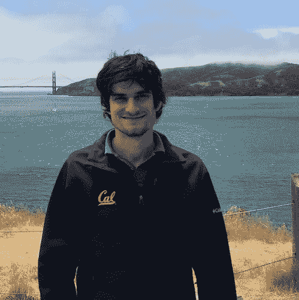
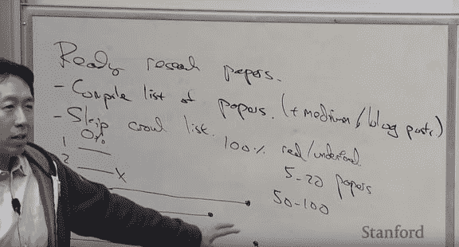
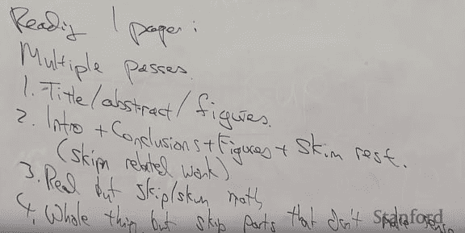
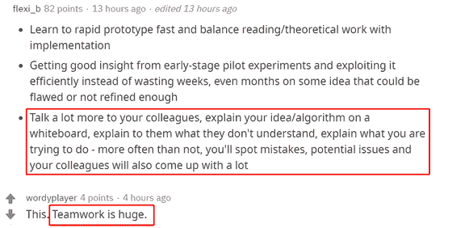
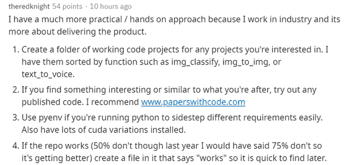
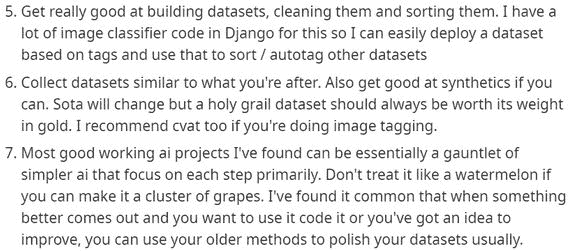

Datawhale分享

**机器之心编辑部**

> 如何成为一名高效的机器学习研究者，然后在这个领域取得一些成就？在此之前，我们需要养成什么样的习惯？近日，一篇发布在 Reddit 机器学习版块的帖子引发了众人的讨论。


近日，一位网友在 Reddit 上发帖提问：「那些高效的机器学习研究者，都有什么样的习惯？」

> 比如，在 Arxiv 上时时跟进最新的研究，利用睡觉时间训练模型，以及充分利用 Stack Overflow。其他的呢？

其实，世界上从不缺少优秀的机器学习研究者，也不缺乏好的建议和指南。想要成为一名高效的机器学习研究者，最重要的是要有彻底的自我管理能力和一点坚持到底的决心。

Open AI 的研究科学家和创始成员之一 John Schulman 曾撰写过一篇《机器学习研究指南》，提供了选择问题和时间管理方面的诸多建议。在 John Schulman 看来，成功的关键在于解决正确的问题，并在这些问题上不断取得进步，实现持续的个人成长。



此外其它很多研究者也有自己独特的见解，吴恩达在斯坦福 CS230 课程中专门开了一课介绍论文怎么看、研究怎么做；Reddit 社区资深研究者对于快速做 ML 产品、高效做 ML 研究都有独门秘籍。

**挑选研究问题**

**挑选研究问题是需要品味的，可能选择正确问题的能力比技术技能更重要。**随着研究的深入，我们会慢慢发现研究问题的各种滋味，能快速品味到哪些方法是有潜力的，哪些方法又是根本行不通的。

实际上，对于研究问题的品味，我们有好几种提升方法：

*   阅读大量论文，并认真评论与探讨；

*   成立研究小组，吸收他人研究经验；

*   找自身研究者提建议，吸收他人的看法；

*   花时间思考哪些研究能够产出成果；

对于最后一点，我们可以自问「理论在什么时候是有用的」、「实验结果普遍吗」、「为什么一些方法广泛被采纳，其它又被遗忘」。前面三点都是从其它研究者获得信息，最后则是你自己的思考。

**想法与目标，研究的原动力**

一般来说，我们有两种方式来决定下一步研究工作：

想法驱动：如果你看文献时发现对于「如何处理 X」这个问题有想法，那么就可以开启一个项目来测试新想法；

目标驱动：如要想要实现某些 AI 功能，那就要解决实现过程中的各种问题。

**这两种方法并不是相互排斥的，任何领域的机器学习的新想法都与某些目标有关。**从某种意义上来说，想法驱动的研究就是目标驱动的一部分。在博客文章中，John Schulman 以目标驱动为例，这意味着你的研究比整个子领域的目标更为具体。John 更推荐这种研究模式，他本人也一直遵循这种目标导向的研究。

值得注意的是，想法驱动的研究有一个缺点，**存在被窃取或窃取其它研究工作的风险**。因为各地研究者都在阅读相同的文献，很可能我们会产生相似的想法。如果我们想在想法驱动的研究中获得更多突破，那么首先需要对研究主题有深刻的理解，并且观点和其它研究者明显不同，这是非常难做到的。

**目标驱动的研究案例**

在博士阶段前半部分，目标是让机器人能够操作可变形的物体，如尝试打结的手术机器人以及折叠衣服的家用机器人。为了实现目标最初的想法是基于从人类示范中学习，于是打算从 RP2 打结的问题开始，而随之而来的就是各种子问题，其中之一就是轨迹优化，然而我在这个子问题上的工作最终成为这个项目里最重要以及最有影响力的产物。

在博士阶段后半段，我开始对强化学习感兴趣，并决定将重点放在机器人运动上，因为目标非常具体所以结果非常令我感到兴奋。为了让 3D 机器人能学习跑步，我将重点放在策略梯度方法上，因为此方法最适合理解以及数学分析，并且可以用上之前做优化的经验。在次期间，我开发了 TRPO 以及 GAE，并成功实现了 3D 机器人运动的初始目标。

当我正在研究如何使机器人进行运动，并使用策略梯度方法得到了第一个反馈结果时，DeepMind 的团队在 Atari 上使用 DQN 得出了结果。并且，在得出结果之后很多人便赶潮流，试图在此之上开发更好的 Q-learning 版本并应用至 Atari 领域。然而，经过对 Q-learning 了解之后，**我判断这对我的目标来说并不是一个好方法，所以继续使用策略梯度，这一坚持使得我做出了 TRPO，GAE 以及后来的 ppo。**

**目标驱动的研究：将自己定义在通用解决方案中**

以目标导向的研究会存在一个陷阱，就是将目标看得太完全化，比如在你拥有相匹配的能力时，你会以最直接甚至无趣的方式去实现该目标，但是这种模式的研究并不能推进你自己在机器学习领域中的发展。**你应该将你的研究定义为可以具有通用性以及泛化性并可以尝试应用在其他问题的解决方案上。**

例如，在研究机器人运动时，我尽量避免了将领域信息过度整合到解决方案中，而将问题聚焦在最本质的问题上——目标是在模拟中实现运动，这种方式是通用的并且之后可以实现于其他问题上。再做了一系列特征工程和奖励形成后，我小心地在做一些改变及优化，使得这些改变不会较大程度上影响到我正在开发的算法。而现在我正在用游戏作为实验平台，同时确保算法核心思想不是针对特定的设置，以便它同样也可以很好的应用至机器人技术上去。

**志存高远，一步一步走**

在机器学习领域，有时候既聪明又勤奋的人却无法做出优秀的成果。其主要原因在于，本身研究问题的潜力就不大：到底该任务能有 10% 的改善还是 10 倍的提升？经常会有研究者做看起来很合理，但却只能小幅度提升某项指标的工作。

**在更大的目标下做增量研究（10% 的提升）是最有效的。**例如 ImageNet 数据集上的开创性模型 AlexNet，它在 2012 年提出时没包含任何全新的组件，只是堆积了大量小修正，但它获得了前所未有的新结果。在日常研究工作中，性能会逐步提升，但所有步骤都应该朝着一个更大的目标前进。

如果想要做增量研究，它们的用处就决定了它们的复杂性。例如提升 10% 的效果，那么最好只有两行代码，如果提升 50%，那么可以新增 10 行代码。增量研究的性能提升决定了它能增加的复杂性，不然没有谁会用你的新方法。

**研究是条旅途**

研究是一条漫漫长路，在这条路上可能发现新算法、发篇新论文，也可能是直到最后才能知道一个结果。为了在这条旅途中开发新的算法和见解，你需要在很长一段时间内把精力集中在一个问题上。

然而我们并不知道旅途的终点是什么样的，因此这个长期的问题解决过程需要培养有效的习惯，从而使你能够不断地朝着更好的结果前进。

**保持写笔记的习惯**

养成做笔记的习惯非常重要。比如你可以每天创建一个条目，然后记下你这一天在做什么，有什么想法，以及有什么实验结果。

**在每日总结的基础上，每过一两周再进行一次回顾性的总结**，做好批注：比如实验结果的分析、一些有价值的见解（可以是自身的灵感，也可以是来自同事和朋友的金句）、代码进度以及下一步的工作规划。

这样做有什么价值？

**一方面，笔记本是帮助你及时记下想法的工具**，而且会提醒你在回顾的过程中去补全这个想法，鞭策你去重新思考一些本可能会被遗忘在角落的问题。

**另一方面，笔记本就像是一个收纳箱**，帮你把实验结果整理到一起。有些结论很容易忘记，比如哪些超参数很有价值，这时你就可以参考笔记内容。

还有，**笔记本能帮你梳理时间利用方面的问题**。有时候你可能想「上周我都干了什么」，翻翻笔记就能找到答案了。你可能意识到自己需要提升时间管理能力，也可能发现自己过去几个月里太过频繁地转换不同想法，很容易半途而废。

**关于「换坑」问题**

说到这里，继续分析一下「切换想法」的问题。一般来说，想要解决一个具有挑战性的问题，需要花费足够多的时间和精力。**但有时候则很难判定：****我是否已经付出了足够的努力？****我该不该换条路去走？**

根据经验来说，过于频繁地切换想法比呆在原地不动的故障概率更高。不排除会存在具备超强潜力的新想法，但更常见的是失望。如果你回顾笔记内容时，发现自己过去一段时间有相当多的精力都花在完成了一半的项目上，这样的项目既不能说完全失败了，但又暂无确定的成果产出。

所以可以采取一种策略，设置固定的时间去尝试那些新想法，比如每周花一天时间去探索和自己现在所从事项目完全不同的想法，这样也有利于拓宽知识面。

**个人发展**

在研究生涯中，无论如何分配时间，你都必须学习很多东西。但从长远来看，如果你有规律地留出时间专注于个人发展，则能够更有机会完成出色的工作。具体来说，在从事现有项目的同时，**你应该拨出一部分时间来继续充实机器学习领域的一般性知识**。这样以来，你学到的知识除满足日常工作所需之外，才不会停滞不前，也不会陷入到所谓的舒适区域。

**充实机器学习领域知识的方法很多，主要有阅读教材书、学位论文和其他论文，并从这些源材料中复现算法。**在研究生涯初期，作者建议把时间重新分配在教材书和论文上，重点选择一部分来消化贯通，同时基于自己感兴趣的论文来复现模型和算法。

大多数学生会在结束学校课程之后不再花时间阅读教材书，作者认为这种做法是错误的。与论文相比，**教材书一般以一种更集中的方式来吸取知识**。会议论文通常会包含一个主要的新观点，以及过于简洁的背景知识部分。此外，在阅读论文过程中，除了论文观点本身，你还需要花费更多时间来理解复杂的符号和术语。与论文不同，好的教材书融合了几十年的思想，并以循序渐进的方式将复杂符号展示出来。此外，除了阅读引导性的机器学习教材书，你也可以选择自己感兴趣的其他领域书籍。

**除了教材书之外，学位论文的阅读也是必不可少的****。**对于一些你感兴趣的研究工作，你可以阅读这些研究者的博士论文。机器学习领域的博士论文一般包括介绍性和背景材料、一些过去发表在顶会上的论文以及结论和展望。其中论文的背景材料和结论展望部分通常凝聚了专家编写的该领域过去和未来的一些统一性观点，你可能会从中受益。

阅读教材书和学位论文固然能够巩固你的基础知识，但也需要大量阅读其他论文来拓展知识前沿。在研究生涯早期，**作者建议花大量时间来复现论文中的观点，并对自己的实现结果与已发表的进行对比。**这样以来，你不仅会更深刻地理解论文主题，获得运行实验的经验，而且复现已有研究的做法会比进行原始研究更快地获得反馈。一旦你可以轻松复现 SOTA 方法，就有可能超越它。

除了阅读那些富有创造性的论文并进行复现之外，你也应该关注领域内不那么突出的论文。以批判的眼光浏览阅读即将发表的论文有助于你时刻跟上领域内的发展趋势。此外，对于一些广泛使用并为其他观点打开大门的观点，观察它们之间的依赖图也有助于你培养自己的阅读品味。

**吴恩达的读论文建议**

在 CS230 课程中，吴恩达对于研究规划与如何读论文也提出了他的一些建议。

如果要高效地阅读论文，吴恩达表示我们想要知道论文的来源，例如 arXiv 或个人博客等。下面，如果我们列出 5 篇待读论文，那么吴恩达的习惯是每一篇列一行，表示从 0 到 100 的阅读进度。最开始我们只需要阅读每一篇的 10% 左右，如果发现论文 2 不是我们想要的，就终结它。如果论文 3 是重要的，那么仔细阅读到进度 100%。

由论文 3，我们可以发现其它相关研究，因此也可以加到论文列表中，例如第 6、7 篇。读完论文 3 也许会发现论文 4 也非常有意思，那么结合 4、6、7 继续阅读，并记录阅读进度。



最后，**如果阅读 5-20 篇论文，差不多我们对该领域就有一定的了解了**。如果高效阅读 50 到 100 篇论文，那么对该领域的理解就比较完整了。Ng 的背包内每天都会带一个文本夹，里面的纸质打印论文就是他的论文列表。

那么具体如何阅读一篇论文呢，吴恩达表示，从第一个词浏览到最后一个词，这是最差的方式。一般而言，**我们要多次浏览论文，且每一次的目的都不相同****。**



首先**第一遍应该只看标题、摘要和图表**，摘要能告诉我们论文讲了什么，而对于深度学习研究工作，很多都能总结成一两张图表。**第二遍应该继续看前言、结语和图表**，其它的内容我们可以暂时不管。注意在看前言时，相关研究部分也可以不管，虽然该部分对于理解研究脉络很有帮助，但第二遍应该需要抓住主要思想。

**第三遍阅读就要纵览论文主体了**，但同时那些耗费时间的数学与推导部分可以暂时跳过，我们掌握整体脉络与框架就行。第四遍需要阅读所有的内容，但这时候肯定还会有一些部分不能理解，那么暂时跳过它们以后再攻坚。

读论文是做研究的基础，高效地读高质量论文又是重中之重。在课程中，Ng 还分享了很多读论文、追踪论文的技巧，感兴趣的读者可查看课程视频：

CS230 Lecture 8: Career advice / Reading papers：https://www.youtube.com/watch?v=733m6qBH-jI

**团队合作也很重要**

除了以上 Open AI 研究科学家 John Schulman 提出的一些建议，Reddit 网友也发表了自己关于如何成为高效 ML 研究者的观点。

一些网友认为**团队合作也很重要**，所以应该多与同事进行交流，向他们解释不理解的观点或算法，并说明自己尝试做的东西。这样以来，你通常会更容易地发现错误和潜在问题，你的同事也能提出一些自己的想法。



除了学术领域之外，另有网友分享了自己在**工业界交付产品时的一些实用方法和建议**：

*   为自己感兴趣的任何项目创建一个工作代码项目文件夹；

*   如果发现一些有趣或类似于你正在研究的东西，尝试任何已发表的代码；

*   在运行 Python 的过程中，你可以利用 pyenv 来轻松地避开不同的需求；

*   如果 repo 起作用，则创建一个标有「起作用」的文件菜单，以方便下次找到；



*   让自己擅长创建数据集并进行预处理和分类；

*   收集一些与自己研究类似的数据集；

*   当更好的代码出现时，要尝试使用；当意识到观点需要改进时，使用已有方法来打磨优化自己的数据集。



在机器学习领域，每个人都会有自己的一套研究方法，一些好的建议和做法也并不一定适用于所有人。所以，如果想要成为一个高效的机器学习学习者，认清自己进而摸索出适合自己的道路至关重要。

*参考链接：*

*http://joschu.net/blog/opinionated-guide-ml-research.html*

*https://www.reddit.com/r/MachineLearning/comments/f4oxuj/discussion_what_are_some_habits_of_highly/*

```
AI学习路线和优质资源，在后台回复"AI"获取 
```