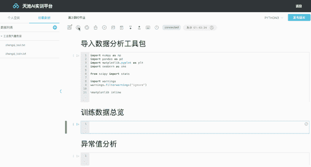
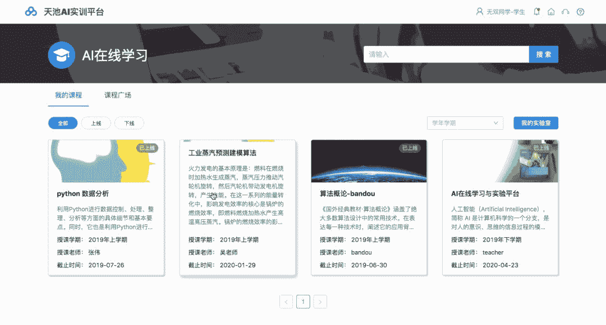

疫情肆虐，牵动着每个人的心。当下，正值抗击疫情的关键时刻，近日教育部也下发了2020年春季学期延期开学的通知，并提出利用网络平台保障防控疫情期间学生**“停课不停学”**，全国诸多高校也纷纷延迟了开学时间，很多老师将课堂搬到了线上，实行远程授课。

为响应教育部的号召，**天池大数据科研平台**在疫情期间为高校人工智能及大数据相关老师**免费**提供AI实训平台，助力老师在延学期间更好的开展线上教学。

**天池AI实训平台**是基于当前人工智能与大数据学科建设与发展需求，结合天池大数据竞赛近五年沉淀的各领域经典场景实践项目，**为新开设大数据、人工智能专业与学校的高等院校、职业院校量身打造的实训平台**。包含实训工具、教学系统、人工智能课程案例，期望能够辅助老师简单高效的开展人工智能学科的教学工作，帮助学生接触工业场景实战项目，融入实战式学习。

天池自2015年以来，开展了超过100场算法赛事，成为在校学生求职前的实战场，陪伴了数十万名大数据和AI爱好者从学校走向职场，甚至有开发者通过参加天池竞赛实现职业方向转型。

这次是天池**首次**通过实训平台开放天池历届经典比赛的实验案例、数据和代码完整教学案例，覆盖电商、交通、金融、工业等多个实际业务场景。此外也首次开放了天池选手量身定制的60课时入门AI实战课程，**从最基础的AI入门到高阶的模型算法均有覆盖，满足不同学习阶段的学生实训**。

同时，天池AI实训平台还提供基于jupyter的在线交互实验工具，并配置免费的计算资源进行线上数据训练和建模，**即开即用的实验管理模****式**，省去了部署问题，在家教学轻松方便。

**即日起**，所有**高校老师**均可免费申请，希望能为师生们在家教学尽绵薄之力！

免费申请链接：

https://survey.aliyun.com/apps/zhiliao/q_Izga5S

点击**阅读原文**，立即申请。