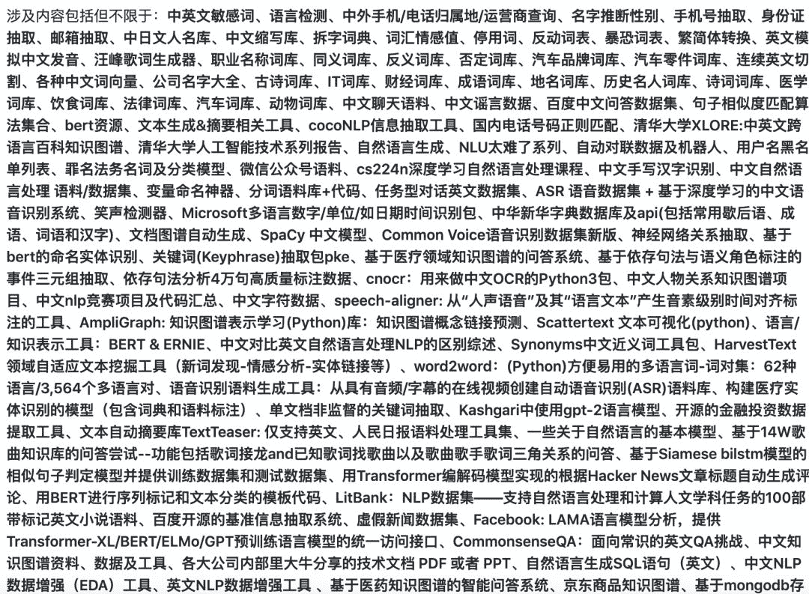

一只小狐狸带你解锁**NLP**秘籍

前言

随着BERT、ERNIE、XLNet等预训练模型的流行，解决NLP问题时不用上预训练模型似乎总显得自己有点过时。**但是这显然是不对的。**

众所周知，无论训练还是推理，预训练模型都会消耗大量的算力，且高度依赖GPU计算资源。然而，有很多的NLP问题实际上仅仅靠**字典+规则**就可以做到够用，那么这时候强行上笨重的模型无异于高射炮打蚊子，性价比是非常低的。

于是小夕就从一个比较疯狂的github repo里为大家**精挑细选**了**45个**比较实用的开源小工具和字典，让大家在搭建NLP系统、辅助炼丹的过程中少一些模型和算力的依赖，多一些小而美的代码。

*repo地址：*

*https://github.com/fighting41love/funNLP*

> 注：这是一个非常丧心病狂的repo，里面收录了300多个项目，但是比较鱼龙混杂，要记得多多横向对比哦

来，感受一下m(_ _)m



鬼知道我是怎么把这300个repo看完一遍的
(╯°□°）╯︵ ┻━┻

**1\. textfilter: 中英文敏感词过滤**

> repo: observerss/textfilter

```
 >>> f = DFAFilter()
 >>> f.add("sexy")
 >>> f.filter("hello sexy baby")
 hello **** baby
```

敏感词包括政治、脏话等话题词汇。其原理主要是基于词典的查找（项目中的keyword文件），内容很不清真

**2\. langid：97种语言检测**

> repo: saffsd/langid.py
> 
> pip install langid

```
>>> import langid>>> langid.classify("This is a test")
('en', -54.41310358047485)
```

**3\. langdetect：另一个语言检测**

> 地址：https://code.google.com/archive/p/language-detection
> 
> pip install langdetect

```
from langdetect import detectfrom langdetect import detect_langs

s1 = "本篇博客主要介绍两款语言探测工具，用于区分文本到底是什么语言，"s2 = 'We are pleased to introduce today a new technology'print(detect(s1))
print(detect(s2))
print(detect_langs(s3))    # detect_langs()输出探测出的所有语言类型及其所占的比例
```

输出结果如下：注：语言类型主要参考的是ISO 639-1语言编码标准，详见ISO 639-1百度百科

跟上一个语言检测比较，准确率低，效率高。

**4\. phone 中国手机归属地查询：**

> repo: ls0f/phone
> 
> 已集成到 python package cocoNLP中

```
from phone import Phone
p  = Phone()
p.find(18100065143)#return {'phone': '18100065143', 'province': '上海', 'city': '上海', 'zip_code': '200000', 'area_code': '021', 'phone_type': '电信'}
```

支持号段: 13*,15*,18*,14[5,7],17[0,6,7,8]

记录条数: 360569 (updated:2017年4月)

作者提供了数据phone.dat 方便非python用户Load数据。

**5\. phone国际手机、电话归属地查询：**

> repo: AfterShip/phone
> 
> npm install phone

```
import phone from 'phone';
phone('+852 6569-8900'); // return ['+85265698900', 'HKG']
phone('(817) 569-8900'); // return ['+18175698900, 'USA']
```

**6\. ngender 根据名字判断性别：**

> repo: observerss/ngender

基于朴素贝叶斯计算的概率

> pip install ngender

```
>>> import ngender>>> ngender.guess('赵本山')
('male', 0.9836229687547046)>>> ngender.guess('宋丹丹')
('female', 0.9759486128949907)
```

**7\. 抽取email的正则表达式**

> 已集成到 python package cocoNLP中

```
email_pattern = '^[*#\u4e00-\u9fa5 a-zA-Z0-9_.-]+@[a-zA-Z0-9-]+(\.[a-zA-Z0-9-]+)*\.[a-zA-Z0-9]{2,6}$'emails = re.findall(email_pattern, text, flags=0)
```

**8\. 抽取phone_number的正则表达式**

> 已集成到 python package cocoNLP中

```
cellphone_pattern = '^((13[0-9])|(14[0-9])|(15[0-9])|(17[0-9])|(18[0-9]))\d{8}$'phoneNumbers = re.findall(cellphone_pattern, text, flags=0)
```

**9\. 抽取身份证号的正则表达式**

```
IDCards_pattern = r'^([1-9]\d{5}[12]\d{3}(0[1-9]|1[012])(0[1-9]|[12][0-9]|3[01])\d{3}[0-9xX])$'IDs = re.findall(IDCards_pattern, text, flags=0)
```

**10\. 人名语料库：**

> repo: wainshine/Chinese-Names-Corpus
> 
> 人名抽取功能已加入 python package cocoNLP

```
中文（现代、古代）名字、日文名字、中文的姓和名、称呼（大姨妈、小姨妈等）、英文->中文名字（李约翰）、成语词典
```

（可用于中文分词、姓名识别）

**11\. 中文缩写库：**

> repo: zhangyics/Chinese-abbreviation-dataset

```
全国人大: 全国/n 人民/n 代表大会/n
中国: 中华人民共和国/ns
女网赛: 女子/n 网球/n 比赛/vn
```

**12\. 汉语拆字词典：**

> repo: kfcd/chaizi

```
漢字    拆法 (一)    拆法 (二)    拆法 (三)
拆    手 斥    扌 斥    才 斥
```

**13\. 词汇情感值：**

> repo: rainarch/SentiBridge

```
山泉水    充沛    0.400704566541    0.370067395878
视野            宽广    0.305762728932    0.325320747491
大峡谷    惊险    0.312137906517    0.378594957281
```

**14\. 中文词库、停用词、敏感词**

> repo: dongxiexidian/Chinese

此package的敏感词库分类更细：

反动词库， 敏感词库表统计， 暴恐词库， 民生词库， 色情词库

**15\. 汉字转拼音：**

> repo: mozillazg/python-pinyin

文本纠错会用到

**16\. 中文繁简体互转：**

> repo: skydark/nstools

**17\. 英文模拟中文发音引擎**

> repo: tinyfool/ChineseWithEnglish

```
say wo i ni
#说：我爱你
```

相当于用英文音标，模拟中文发音。

**18\. 同义词库、反义词库、否定词库：**

> repo: guotong1988/chinese_dictionary

**19\. 中文字符数据**

> repo: skishore/makemeahanzi

*   简/繁体汉字笔顺

*   矢量笔画

**20\. 无空格英文串分割、抽取单词：**

> repo: keredson/wordninja

```
>>> import wordninja>>> wordninja.split('derekanderson')
['derek', 'anderson']>>> wordninja.split('imateapot')
['im', 'a', 'teapot']
```

**21\. IP地址正则表达式：**

```
(25[0-5]|2[0-4]\d|[0-1]\d{2}|[1-9]?\d)\.(25[0-5]|2[0-4]\d|[0-1]\d{2}|[1-9]?\d)\.(25[0-5]|2[0-4]\d|[0-1]\d{2}|[1-9]?\d)\.(25[0-5]|2[0-4]\d|[0-1]\d{2}|[1-9]?\d)
```

**22\. 腾讯QQ号正则表达式：**

```
[1-9]([0-9]{5,11})
```

**23\. 国内固话号码正则表达式：**

```
[0-9-()（）]{7,18}
```

**24\. 用户名正则表达式：**

```
[A-Za-z0-9_\-\u4e00-\u9fa5]+
```

**25\. g2pC：基于上下文的汉语读音自动标记模块**

> repo: Kyubyong/g2pC

**26\. 时间抽取：**

> 已集成到 python package cocoNLP中

```
在2016年6月7日9:44执行測試，结果如下

Hi，all。下周一下午三点开会

>> 2016-06-13 15:00:00-false

周一开会

>> 2016-06-13 00:00:00-true

下下周一开会

>> 2016-06-20 00:00:00-true
```

java version：
https://github.com/shinyke/Time-NLP

python version：
https://github.com/zhanzecheng/Time_NLP

**27\. 快速转化「中文数字」和「阿拉伯数字」**

> repo: HaveTwoBrush/cn2an

*   中文、阿拉伯数字互转

*   中文与阿拉伯数字混合的情况，在开发中

**28\. 公司名字大全**

> repo: wainshine/Company-Names-Corpus

**29\. 古诗词库**

> repo: panhaiqi/AncientPoetry

更全的古诗词库：
https://github.com/chinese-poetry/chinese-poetry

**30\. THU整理的词库**

> repo: http://thuocl.thunlp.org/

已整理到本repo的data文件夹中.

```
IT词库、财经词库、成语词库、地名词库、历史名人词库、诗词词库、医学词库、饮食词库、法律词库、汽车词库、动物词库
```

**31\. PDF表格数据提取工具**

> repo: camelot-dev/camelot

**32\. 国内电话号码正则匹配（三大运营商+虚拟等）**

> repo: VincentSit/ChinaMobilePhoneNumberRegex

**33.用户名黑名单列表：**

> repo: marteinn/The-Big-Username-Blacklist

包含了用户名禁用列表，比如：

```
administrator
administration
autoconfig
autodiscover
broadcasthost
domain
editor
guest
host
hostmaster
info
keybase.txt
localdomain
localhost
master
mail
mail0
mail
```

**34\. Microsoft多语言数字/单位/如日期时间识别包：**

> repo: Microsoft/Recognizers-Text

**35\. chinese-xinhua 中华新华字典数据库及api，包括常用歇后语、成语、词语和汉字**

> repo: pwxcoo/chinese-xinhua

**36\. 文档图谱自动生成**

> repo: liuhuanyong/TextGrapher

*   TextGrapher - Text Content Grapher based on keyinfo extraction by NLP method。输入一篇文档，将文档进行关键信息提取，进行结构化，并最终组织成图谱组织形式，形成对文章语义信息的图谱化展示

**37\. 186种语言的数字叫法库**

> repo: google/UniNum

**38\. 繁简体转换**

> repo: berniey/hanziconv

**39\. 汉字字符特征提取器 (featurizer)，提取汉字的特征（发音特征、字形特征）用做深度学习的特征**

> repo: howl-anderson/hanzi_char_featurizer

**40\. 中文缩写数据集**

> repo: zhangyics/Chinese-abbreviation-dataset

**41\. 无道词典 - 有道词典的命令行版本，支持英汉互查和在线查询**

> repo: ChestnutHeng/Wudao-dict

**42\. 最好的汉字数字(中文数字)-阿拉伯数字转换工具**

> repo: Wall-ee/chinese2digits

**43\. LineFlow：面向所有深度学习框架的NLP数据高效加载器**

> repo: tofunlp/lineflow

**44\. 将自然语言数字串解析转换为整数和浮点数**

> repo: jaidevd/numerizer

**45\. 英文脏话大列表**

> repo: zacanger/profane-words

```
AI学习路线和优质资源，在后台回复"AI"获取 
```