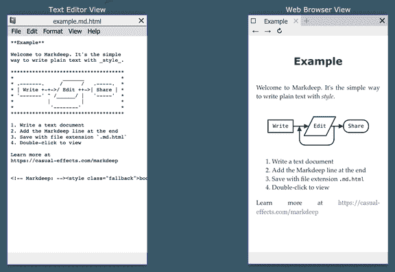
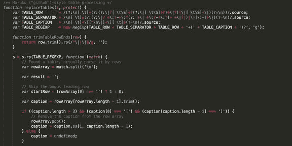
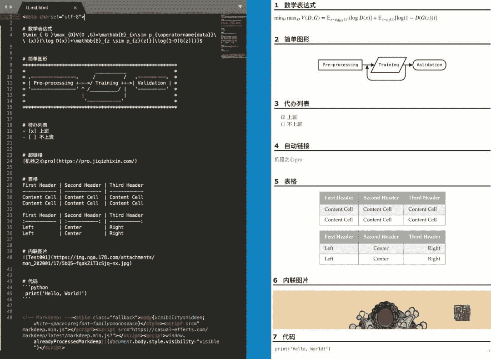
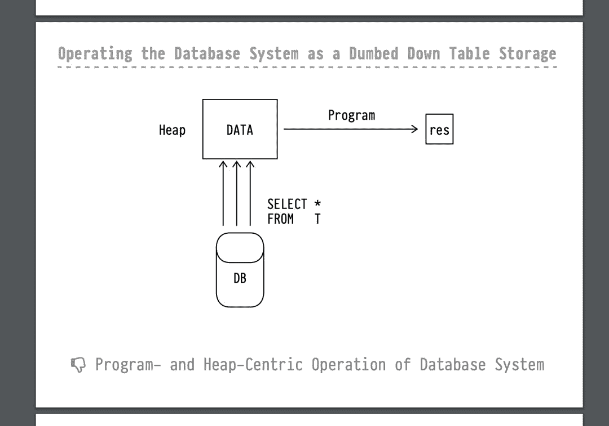
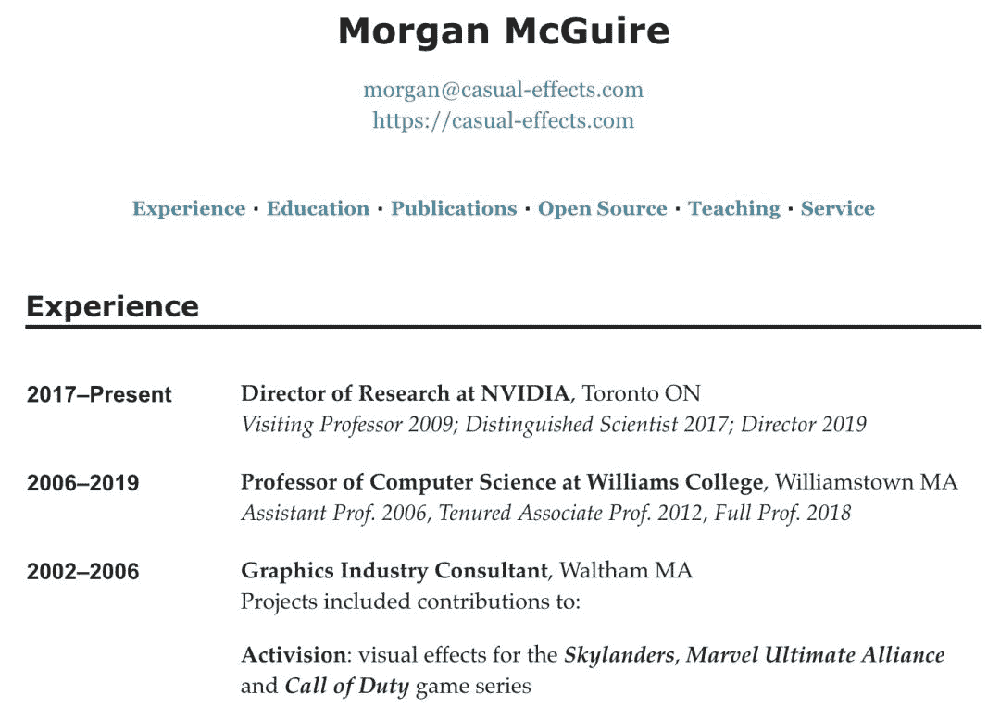

机器之心

**机器之心编辑部**

> 只要你有纯文本编辑器，加上一条语句，瞬间它就可以成为 Markdown 编辑器。


Markdeep 是一个用来写纯文本的插件，它能以 Markdown 的语法与渲染方式纯文本，并在网页上展示。同时，除了 Markdown 语法，Markdeep 还额外支持图表、数学方程等扩展能力。

项目主页：https://casual-effects.com/markdeep/

我们先看看效果，如下左边是纯文本编辑器的编辑页面，右边是在浏览器上的渲染效果：



Markdeep 非常容易使用，它也不需要安装插件或联网。如上所示只要在纯文本最后加上「<!—Markdeep→」那一行的表达式，它就可以变成一个地道的 Markdown 编辑器。Markdeep 不需要额外安装任何东西，也不需要导出、编译等杂七杂八的过程。

看着 Markdeep 很简单，但它的功能却不少，一点也不逊色于 Typora 等正统的 Markdown 编辑器。不论我们是写项目的 README 文档、实验报告，还是要做 PPT 或写论文，它都能满足。该项目提供了很多示例，例如生成的 PPT 是什么样的，后文会具体展示。

**开源代码**

Markdeep 是开源的，所以可以直接下载和修改源代码文件 markdeep.js。整个编辑器就是一个 JavaScript 脚本，上面定义了各种格式与渲染方式。作者表示，目前他正研究该如何有效降低脚本文件大小。



*用于表格处理的部分代码，整个脚本有超过 5000 行代码。*

脚本源码地址：https://casual-effects.com/markdeep/latest/markdeep.js

作者表示，这个项目本来就是一个业余项目，它并不会有完整的技术支持。不过只要提交的 Bug 足够具体，作者都会完善它。此外，该项目还会经常加入一些新特性，从 2015 年 10 月份的第一版，到今年 2 月份的最新版，这个编辑器已经维护了很长时间。

**Markdeep 怎么用**

如果你需要创建一个 Markdeep 的文件，只需要打开任意一个文本编辑器，然后开始编辑。完成文本编辑工作后，只需要在其底部写下一个简单的代码就行了。然后，将这个文档保存为纯文本文件，使用 .md.html 为扩展名。

```
<!-- Markdeep: --><style class="fallback">body{visibility:hidden;white-space:pre;font-family:monospace}</style><script src="markdeep.min.js" charset="utf-8"></script><script src="https://casual-effects.com/markdeep/latest/markdeep.min.js" charset="utf-8"></script><script>window.alreadyProcessedMarkdeep||(document.body.style.visibility="visible")</script> 
```

如果你希望在源文档中使用 Unicode，则需要在文档顶部先加上这句话：

```
<meta charset="utf-8">
```

想要看看效果？你可以将文本拖入浏览器或双击它。即使网络离线也可以查阅文档。如果不想因为离线而失去格式，可以将 markdeep.min.js 文件和文档保存在一个文件夹中。

如果想要看看 Markdeep 原始文本，在文件 URL 最后加上「?noformat」即可。

**上手示例**

小编随手测试了几个典型 Markdown 语法，比如：代办列表、自动链接、表格、内联图片、代码。与此同时，**LaTeX 的数学表达式和图形也能直接设计**，而不需要任何插件。具体效果可参考：



简而言之，配备完善，对于熟悉 Markdown 的小伙伴来说，用起来会十分顺手及方便。这意味着，在有网的情况下，随意拎一个文本编辑器后，就再也没有人能拦得了你使用 Markdown 了。与此同时，时时预览效果也非常简便，只需要在文本编辑器里修改，浏览器中刷新下便可呈现最新效果。

**Markdeep 能干什么**

只要是 Markdown 支持的，Markdeep 就能够支持，它在业界和学术界能得到广泛使用。如下所示，各种题材与格式的文档都能用 Markdeep 完成：

*   API 文档

*   教学大纲

*   游戏设计文件

*   家庭作业

*   课程 PPT

*   软件库网站

*   个人博客

*   简历

*   论文

看起来 Markdeep 似乎什么都能做，项目作者同样也展示了这些方面的效果图：



*Markdeep 制作的 PPT。*



*Markdeep 制作的个人简历。*

总之，除了使用方便、展示炫酷，Markdeep 的功能也是非常强大。正如其它开发者所强调的，Markdeep 是能制作简单图表的 Markdown 工具，它以一种「ASCII Art」的方式用纯文本制作出图形，并且不用渲染也非常明晰。

```
AI学习路线和优质资源，在后台回复"AI"获取 
```