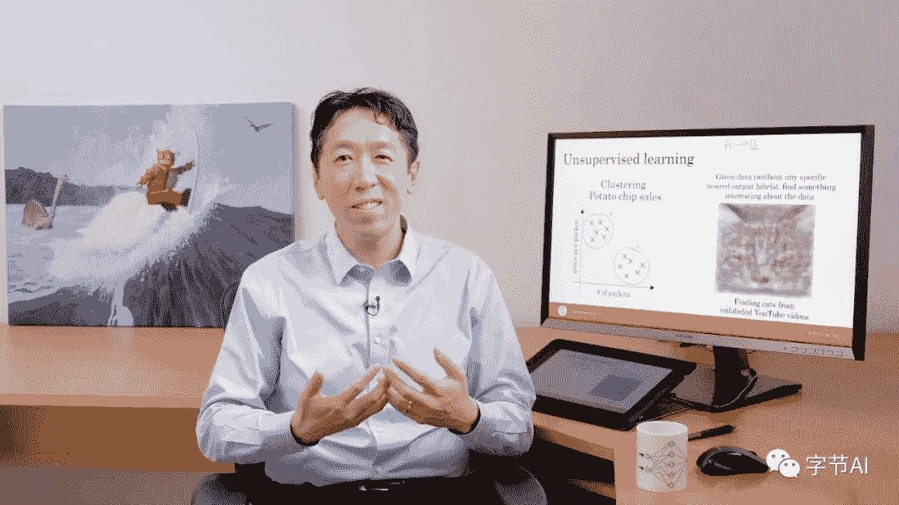

编辑 | Will

出品 | 字节AI

吴恩达（Andrew Ng），毫无疑问，是全球人工智能（AI）领域的大 IP！随着近些年来 AI 越来越火的大趋势下，吴恩达一直致力于普及、宣传、推广 AI 教育，包括最前沿、最火爆的 AI 基础课程、深度学习课程等等。惠及全球超过 500w 的人工智能爱好者。

“AI 如何更好地入门与进阶？”，“有没有一套起点不是很高的 AI 学习路径？”，“这么多优秀公开课，究竟哪一个更适合我？”等，这些往往是初学者们最为关心的几个问题。毫无疑问，吴恩达的 AI 课程在国内外都是入门的首选课程，而且有非常完整的学习路线，无数新手都从这门课中收获满满。

然而，吴恩达从最早的 CS229，到后来的 deeplearning.ai 深度学习专项课程，还有其它 AI 资源，大神发布的 AI 知名课程和资料非常多。对大部分学习者来说，肯定搜集得不完全而且非常耗时间。这确实是意见麻烦事！

没关系！我们对吴恩达所有的关于 ML、DL 等课程、资源等做了详细的搜集和整理并汇总到这篇文章里。帮助大家整理出一份超赞的吴恩达 AI 学习路线了！

下面将按照推荐的从简单到困难的学习路线来梳理吴恩达完整的 AI 课程、资源。赶紧一起来看看吧！

首先，我们整理了吴恩达完整 AI 资源的思维导图：

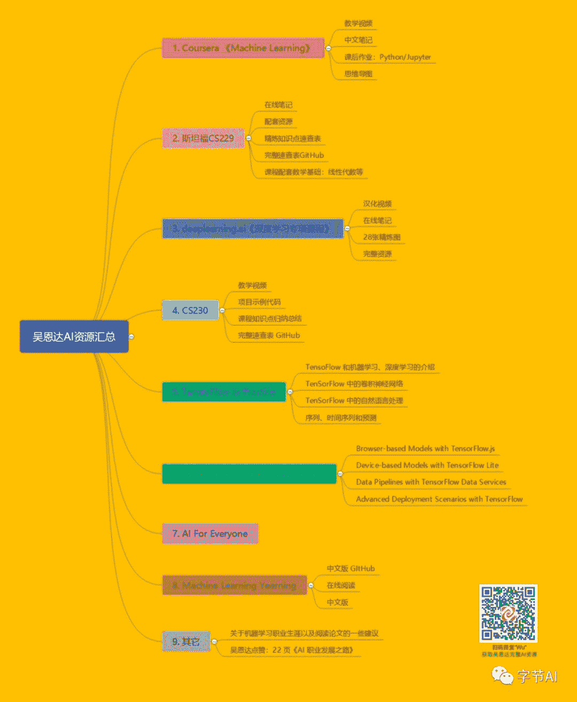

本文梳理的完整学习路线中，对吴恩达所有资源进行了汇总并整理打包，获取地址请见文末。

## Coursera 《Machine Learning》

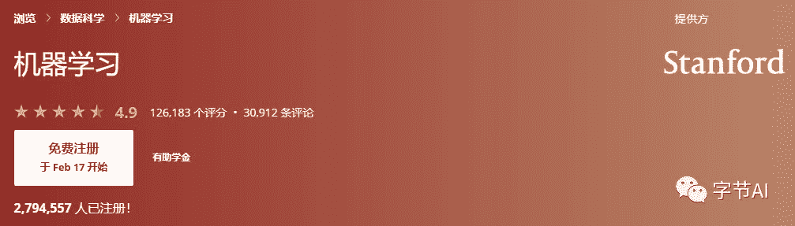

**推荐指数****：**★★★★★

**课程主页：**

https://www.coursera.org/learn/machine-learning/

**课程特色：**

这门课基本涵盖了机器学习的主要知识点：线性回归、逻辑回归、支持向量机、神经网络、K-Means、异常检测等。课程中没有复杂的公式推导和理论分析，让机器学习初学者能够快速对整个机器学习知识点有比较整体的认识，便于快速入门。

**完整中文笔记（pdf、word、markdown版本）、中英文字幕离线视频、复现的python作业：**

https://github.com/fengdu78/Coursera-ML-AndrewNg-Notes

**在线笔记：**

http://www.ai-start.com/ml2014/

**课后作业（Python 版本）：**

https://github.com/nsoojin/coursera-ml-py

**课后作业（Jupyter 版本）：**

https://github.com/kaleko/CourseraML

## 斯坦福 CS229

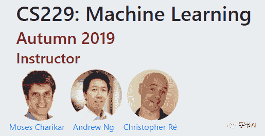

**推荐指数****：**★★★★

**课程主页：**

http://cs229.stanford.edu/

**课程特色：**

吴恩达在斯坦福教授的《机器学习》（CS 229）课程与 Coursera 上的《Machine Learning》类似，但比 Coursera 上的更全面和进阶，对机器学习和统计模式识别进行了广泛的介绍，非常适合在学完《Machine Learning》之后的提升。

**在线笔记：**

https://wei2624.github.io/machine%20learning/Machine-Learning-Notes/

**配套资源（含 pdf）：**

http://cs229.stanford.edu/summer2019/

**精炼知识点速查表：**

https://stanford.edu/~shervine/teaching/cs-229/

**完整速查表 GitHub（9.9k star）：**

https://github.com/afshinea/stanford-cs-229-machine-learning

**CS229 线性代数和概率论的翻译：**

https://github.com/fengdu78/Data-Science-Notes/tree/master/0.math/1.CS229

## deeplearning.ai《深度学习专项课程》

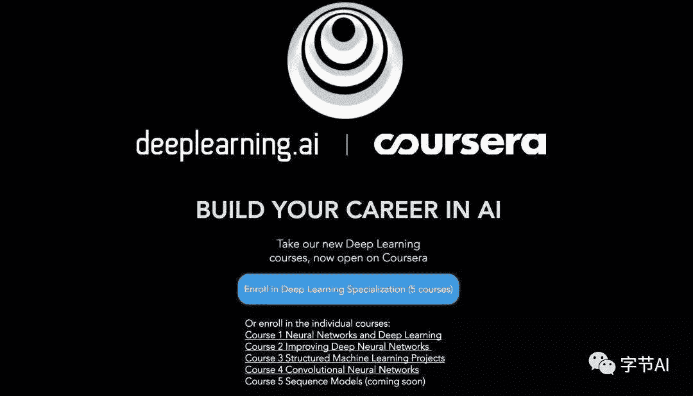

**推荐指数****：**★★★★★

**课程主页：**

https://www.deeplearning.ai/deep-learning-specialization/

https://www.coursera.org/specializations/deep-learning

**课程特色：**

吴恩达在 Coursera 上开设了由 5 门课组成的深度学习专项课程，掀起了一股人工智能深度学习热潮。该专项课程可以说是深度学习入门的最佳课程之一！不仅知识体系完善，涵盖神经网络基础、浅层神经网络、深层神经网络、神经网络优化、CNN、RNN 等知识；而且配备了相当专业的编程题。

**汉化视频：**

https://study.163.com/provider/2001053000/course.htm

**在线笔记：**

http://www.ai-start.com/dl2017/

https://redstonewill.com/category/ai-notes/andrew-deeplearning-ai/

**28 张精炼图：**

离线文件见文末！

**完整资源：**

https://github.com/fengdu78/deeplearning_ai_books

## CS230

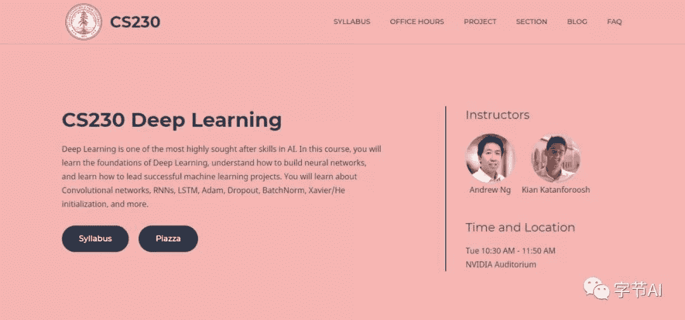

**推荐指数****：**★★★

**课程主页：**

http://cs230.stanford.edu/

**课程特色：**

CS230 是吴恩达在斯坦福大学又开设了高质量的深度学习课程。在这门课中，你将学习深度学习的基础，理解如何构建神经网络，并且学习如何领导一个成功的机器学习项目。课程配备的代码都可以使用 Python 和 TensorFlow 来实现。这门课采用翻转课堂的教学形式，你可以在家观看教学视频，完成深度编程作业和在线测试，然后来到课程做进一步讨论并完成最后的大项目。

**油管视频：**

https://www.youtube.com/playlist?list=PLoROMvodv4rOABXSygHTsbvUz4G_YQhOb

**B 站视频：**

https://www.bilibili.com/video/av47055599/

**项目示例代码：**

https://github.com/cs230-stanford/cs230-code-examples

****课程知识点归纳总结：****

https://stanford.edu/~shervine/teaching/cs-230/

**完整速查表 GitHub（4k star）：**

https://github.com/afshinea/stanford-cs-230-deep-learning

## TensorFlow in Practice

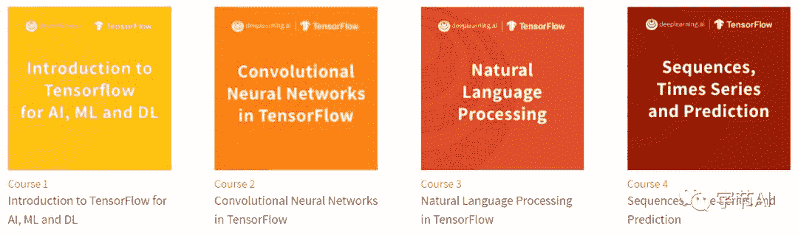

**推荐指数****：**★★★★

**课程主页：**

https://www.deeplearning.ai/tensorflow-in-practice/

https://www.coursera.org/specializations/tensorflow-in-practice

**课程特色：**

吴恩达在 Coursera 上线了新的《TensorFlow in Practice》专项课程。显然，这门专项课程更加注重实践，而且使用现在最火热的深度学习框架 TensorFlow。该专项课程总共包含四门课：

**(1). 《TensoFlow 和机器学习、深度学习的介绍》**

https://www.coursera.org/learn/introduction-tensorflow

**(2). 《TenSorFlow 中的卷积神经网络》**

https://www.coursera.org/learn/convolutional-neural-networks-tensorflow

**(3). 《TenSorFlow 中的自然语言处理》**

https://www.coursera.org/learn/natural-language-processing-tensorflow

**(4). 《序列、时间序列和预测》**

https://www.coursera.org/learn/tensorflow-sequences-time-series-and-prediction

## TensorFlow: Data and Deployment

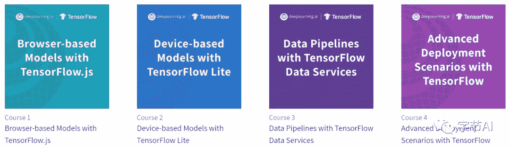

**推荐指数****：**★★★★

**课程主页：**

https://www.deeplearning.ai/tensorflow-data-and-deployment/

https://www.coursera.org/specializations/tensorflow-data-and-deployment

**课程特色：**

吴恩达在 Coursera 又有 TensorFlow 专项课程了，这回的主要内容放在了 TensorFlow.js、TensorFlow Lite 等 web 或移动端的使用。主要介绍使用 Tensorflow.js、TensorFlow Lite、TensorFlow Hub 等工具进行数据分析的方法。

该专项课程总共包含四门课：

(1). 《Browser-based Models with TensorFlow.js》

https://www.coursera.org/learn/browser-based-models-tensorflow

(2). 《Device-based Models with TensorFlow Lite》

https://www.coursera.org/learn/device-based-models-tensorflow

(3). 《Data Pipelines with TensorFlow Data Services》

https://www.coursera.org/learn/data-pipelines-tensorflow

(4). 《Advanced Deployment Scenarios with TensorFlow》

https://www.coursera.org/learn/advanced-deployment-scenarios-tensorflow

## AI For Everyone

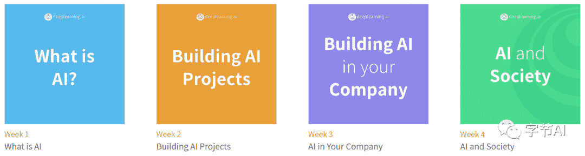

**推荐指数****：**★★★★

**课程主页：**

https://www.deeplearning.ai/ai-for-everyone/

https://www.coursera.org/learn/ai-for-everyone

**课程特色：**

《AI For Everyone》，这是一门非技术课程，更主要的是教大家如何将 AI 业务布局到公司，以及谈谈 AI 对社会的影响。你可以从这门课程中学到：

*   常见人工智能术语的含义，包括神经网络、机器学习、深度学习和数据科学。

*   人工智能做什么，不能做什么

*   如何在工作中寻找布局 AI 的机会

*   如何与 AI 团队合作并建立公司AI战略

*   怎么看待 AI 道德伦理

## 《Machine Learning Yearning》

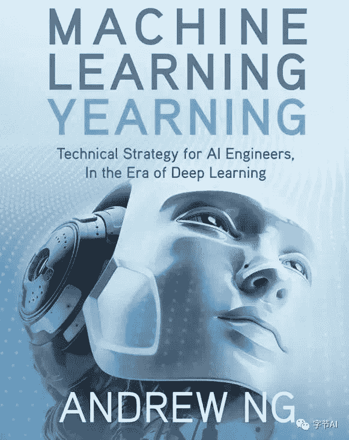

**推荐指数****：**★★★★★

**书籍介绍：**

历时半年的大作《Machine Learning Yearning》英文版和中文版《机器学习训练秘籍》已重磅问世了！这本书《Machine Learning Yearning》能够从以下几个方面给你带来收获：

*   优先考虑AI项目最有前途的方向。

*   调试机器学习项目中的错误。

*   在复杂设置中构建ML，例如训练/测试样本不匹配。

*   构建一个ML项目，接近甚至达到人类水平。

*   知道什么时候、如何使用端对端学习、迁移学习和多任务学习。

**该书中文版 GItHub 地址：**

https://github.com/deeplearning-ai/machine-learning-yearning-cn

**在线阅读：**

https://deeplearning-ai.github.io/machine-learning-yearning-cn/docs/home/

**中文版：**

https://github.com/deeplearning-ai/machine-learning-yearning-cn/releases/download/v0.5.0/MLY-zh-cn.pdf

## 其它

**吴恩达：关于机器学习职业生涯以及阅读论文的一些建议**

总结了斯坦福大学CS230深度学习课程在YouTube上的演讲：对职业发展的一些建议以及阅读研究论文的方法。

原文：

https://medium.com/@mohamedalihabib7/advice-on-building-a-machine-learning-career-and-reading-research-papers-by-prof-andrew-ng-f90ac99a0182

视频：

https://www.youtube.com/watch?v=733m6qBHjI&list=PLoROMvodv4rOABXSygHTsbvUz4G_YQhOb&index=9&t=0s

吴恩达点赞：22 页《AI 职业发展之路》

吴恩达推荐了一份精简版的《AI Career Pathways: Put Yourself on the Right Track》，只有 22 页。可谓短小精悍，旨在帮助你走上正规的 AI 职业发展道路。

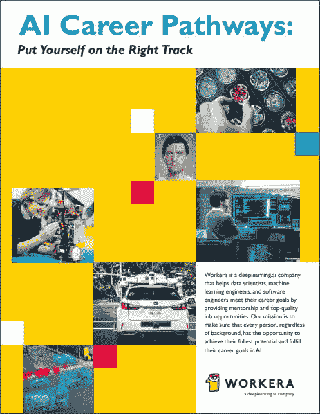

在线获取地址：

https://workera.ai/candidates/report/

## 资源获取

本文和上面思维导图整理的所有吴恩达 AI 资源，已经打包整理完毕，需要的读者可以按以下方式获取：

**1\. 扫描下方二维码**

**2\. 后台回复关键词：******Wu****

