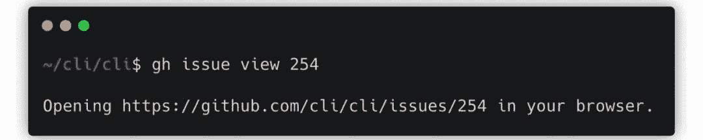

机器之心

**机器之心编辑部**

> 不想用命令行操作 GitHub 的开发者，不是好的开发者。

**Git简介**

小编私以为，Git 是世界上最好的代码版本控制工具，木有之一。在做项目的时候，通常我们会在本地写代码，并通过 Git 命令行追踪所有修改痕迹。如果你想托管或开源，也可以直接用 Git 把整个项目推送到 GitHub 上。

一般而言，Git 主要都是通过命令行操控，add、commit、push 三道命令一气呵成。当然 Git 也可以查看代码文件状态或回溯历史代码等等。自从有了 Git，命令行工具看起来都炫酷了许多。

***Git 极简教程**：**第一步添加修改的代码文件(add)，第二步将修改提交到本地代码库中(commit)，第三步将本地代码库推送到远程代码库(push)。*

当我们将本地代码提交到 GitHub 后，那么就可以在 GitHub 网站上查看各种交互信息了，例如其它开发者提的 Issue，或者提交的代码合并请求等。

**GitHub CLI简介**

Git固然是好，但如果我们能在命令行上直接查看、处理这些信息，实现从 Git 到 GitHub，命令行能提供一条龙服务，那么这一定非常酷。近日，GitHub 就满足了这种想象，其新发布了新命令行工具「GitHub CLI」，该工具能无缝对接 GitHub。正如博客所说的：「gh 命令将把 GitHub 的操作体验，都搬到命令行中」。

现在，macOS、Windows 和 Linux 都能安装这个命令行工具包。虽然 GitHub CLI 目前仍然是 Beta 版，但从我们的体验上，还是非常友好的。此外，尽管是新项目，但其已经有了 4.8K 的 Star 量，且刚推出 Beta 一天就增长了 1.3K。

******上手GitHub CLI******

因为我们试用的系统是macOS，按照官方文档，直接用 Homebrew 就好了，不需要额外的操作。安装后第一个疑惑就是，它怎么知道我的 GitHub 是啥？果然，运行命令之前是需要授权的。不过这个授权也是异常简单，只要在 GitHub 网页上点击确定就行了，gh 会自动登录我们的 GitHub 账号。

后面转到本地的 GitHub 项目，现在 gh 命令就没问题了。如下我们先交互式地提交了一条 Issue，Issue 的 Body 需要通过 nano 编辑。

是的，交互式 Issue 最后还是会打开网页，预览并提交。当然，我们也可以选择直接在命令行提交。在 GitHub 博客、文档中，我们可以找到更多的玩法，如下我们就会介绍一部分。

GitHub 首先介绍的是 Issue 和 Pull Requests 两个任务的用法，因为大多数开发者每天都会和它们打交道，后文将分为五步一一展示。同时，如果我们对某个开源项目提交代码或者进行其它操作，gh 命令也会给你不一样的体验。

1

**按需筛选Issue**

现在，我们找一个想要对它做点什么的开源项目，然后下载到本地。如果我们想看看维护者希望获得帮助的条目，那么可以使用 gh 来过滤不同的 Issue。如下所示将筛选出关于「help-wanted」的 Issue：

2

**快速浏览**

如果找到了一条你能解决的 Bug，使用 gh 能快速在网页上展示这条 Issue 的细节。

3

**创建Pull Request**

创建一条分支，并提交一些代码以修复前面 Issue 提到的 Bug，然后就可以提交一条 PR 来分享你的贡献了：

如果使用 GitHub CLI 创建 Pull Request，且你之前没有 Fork 这个项目，那么命令工具会自动 Fork 它。命令工具会将分支推送上去，并提交 PR 以等待合并修改。

4

**查看PR状态**

等到第二天，你就可以瞄一眼提交的 PR 到底有什么改变。gh 命令可以展示 Pull Request 的状态，并预览它：

5

****检查Pull Request****

一旦项目维护者看到了你提交的 PR，并作出反馈，我们就可能已经切换了分支。所以，可以使用 gh 来检查 Pull Request 分支：

修正代码、推送代码然后合并代码，现在你已经会 GitHub CLI 的基本操作了。后面，随着命令行工具越来越强大，也许 GitHub 更多更便捷的能力也能加进来，例如浏览代码等等。

工具地址：https://cli.github.com/

开源地址：https://github.com/cli/cli

gh 使用手册：https://cli.github.com/manual/

********本****文为机器之心编译，**转载请联系本公众号获得授权****。**

✄------------------------------

*AI学习路线和优质资源，在后台回复"AI"获取*

