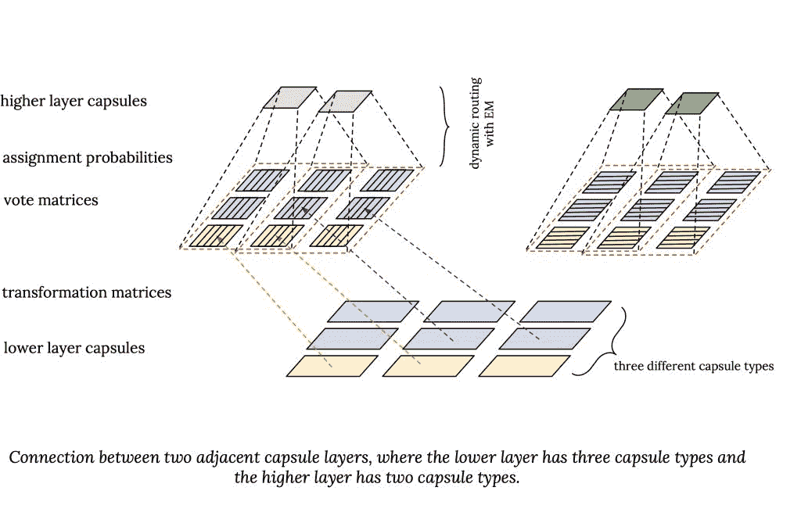
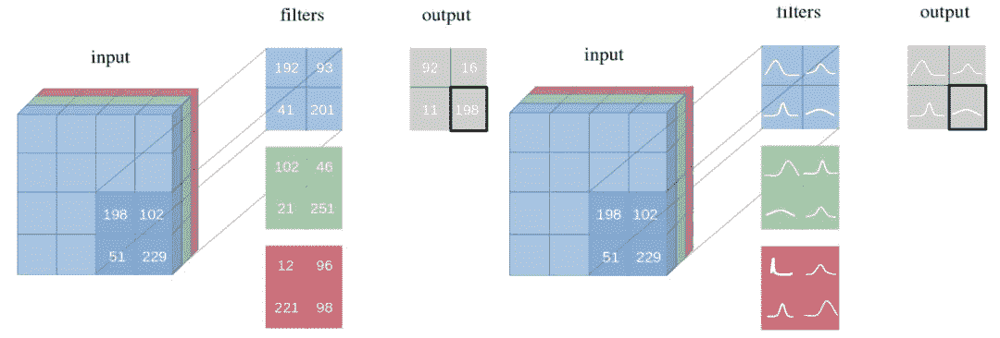

选自Medium

**作****者：****Elvis**

**机器之心编译**

> 在整个2019年，NLP领域都沉淀了哪些东西？有没有什么是你错过的？如果觉得自己梳理太费时，不妨看一下本文作者整理的结果。

2019 年对自然语言处理（NLP）来说是令人印象深刻的一年。本文将着重讲述一些 2019 年我在机器学习和自然语言处理领域有所见闻的重要事件。我会把重点主要放在自然语言处理上，但也会涉及若干人工智能领域的趣闻。主要内容包括研究论文、博客、工具和数据集、社区讨论、教程资源等。

**长文预警，建议先点收藏。**

**目录**

*   研究论文

*   机器学习/自然语言处理的创造力和社群

*   工具和数据集

*   博文文章

*   教程资源

*   人工智能伦理学

**研究论文**

2019 年，谷歌人工智能团队带来了 [ALBERT](https://mp.weixin.qq.com/s?__biz=MzA3MzI4MjgzMw%3D%3D&idx=1&mid=2650770834&scene=21&sn=00afa700f63b8418de2d9ba61d01cb9d#wechat_redirect)，它是用于情境化语言表征的自监督学习模型 [BERT](http://mp.weixin.qq.com/s?__biz=MzA3MzI4MjgzMw%3D%3D&chksm=871affc0b06d76d6ab49b2828a8b795b18e3d762b3978a83704a01dd60fb6dbcde2ed00e163d&idx=1&mid=2650749886&scene=21&sn=87080bc474d144b286d4673383f4b6d6#wechat_redirect) 的精简版。主要的改进在于减少了冗余，更加有效地分配了模型的性能。此方法在 12 个自然语言处理任务上达到了当前最佳性能（SOTA）。

2018 年底，英伟达的研究者们发表了一份热门论文 (A Style-Based Generator Architecture for Generative Adversarial Networks)（取名为 [StyleGAN](http://mp.weixin.qq.com/s?__biz=MzA3MzI4MjgzMw%3D%3D&chksm=871a8f40b06d0656f9c46989ded4286d4c61fa2bd866c1de94c0104b430f3735b420033d18bc&idx=4&mid=2650753854&scene=21&sn=683d862b174cb26c01c1e4d7541498d7#wechat_redirect)），提出了对抗生成网络的另一种生成器架构，灵感来自于风格迁移问题。2019 年，这份工作有了更新 ([Analyzing and Improving the Image Quality of StyleGAN](http://mp.weixin.qq.com/s?__biz=MzA3MzI4MjgzMw%3D%3D&chksm=871a6134b06de8229a6824b16c2b5997cf0c6e33ce00079b285ef9306dfa0cbb8dc1d315886e&idx=2&mid=2650776906&scene=21&sn=ca493a8979c9510d5ae901d00075fe8e#wechat_redirect))，着重研究了诸如重新设计生成器正则化的过程等方面。

*上面一行为目标图像，下面一行为合成图像。图源：https://arxiv.org/abs/1912.04958*

2019 年，我最喜欢的论文之一是 code2seq (https://code2seq.org/)，这是一种从结构化表征的代码中生成自然语言序列的方法。这样的研究可以对自动代码摘要和文档化的应用起到助益。

你可曾想过，有没有可能为生物医学文本挖掘训练一个生物医学的语言模型？答案就是 BioBERT (BioBERT: a pre-trained biomedical language representation model for biomedical text mining)，这是一个可以从生物医学文献中提取重要信息的语境化模型。

在 BERT 发表后，Facebook 的研究者们发布了 RoBERTa (RoBERTa: A Robustly Optimized BERT Pretraining Approach)，引入新的优化方法来改进 BERT，也在多项自然语言处理的基准测试中达到了当前最优效果。

最近，Facebook 人工智能部门的研究者们还发表了一种基于全注意力层来改进 Transformer 语言模型效率的方法 (https://ai.facebook.com/blog/making-transformer-networks-simpler-and-more-efficient/)。这个研究组的其它工作 (https://ai.facebook.com/blog/-teaching-ai-to-plan-using-language-in-a-new-open-source-strategy-game/) 还包括了如何教人工智能系统通过制定计划来使用自然语言。

*全注意力层。图来：https://arxiv.org/pdf/1907.01470.pdf*

可解释性仍然是机器学习和自然语言处理领域的重要议题。这篇论文 (Explainable Artificial Intelligence (XAI): Concepts, Taxonomies, Opportunities and Challenges toward Responsible AI) 对于可解释性、分类法以及未来研究的机遇提供了一份全面的综述。

Sebastian Ruder 的博士论文也值得一看，题为：Neural Transfer Learning for Natural Language Processing。

新加坡国立大学等机构的研究者开发了一种方法 (Emotion Recognition in Conversations with Transfer Learning from Generative Conversation Modeling)，能够在对话的情境下实现情绪识别，这将为情感化的对话生成铺平道路。

另一项相关工作则是用一种叫做 DialogueGCN (DialogueGCN: A Graph Convolutional Neural Network for Emotion Recognition in Conversation) 的图神经网络方法，来探测对话中的情绪。作者还提供了代码实现：https://github.com/SenticNet/conv-emotion/tree/master/DialogueGCN。

谷歌量子人工智能团队在 Nature 发表了一篇论文，声称开发了一台[量子计算机](http://mp.weixin.qq.com/s?__biz=MzA3MzI4MjgzMw%3D%3D&chksm=871a501db06dd90b627945f8f4cbb92b6bb1f758a9aa53191231283235a4cfde2e6fdefe5e80&idx=2&mid=2650772579&scene=21&sn=a41cfe1d0c69e96c73959ab181c011ea#wechat_redirect)，速度比世界上最大的超级计算机更快。

之前提到过，可解释性是神经网络架构里需要大幅改进的一个领域。这篇论文 ([Attention is not not Explanation](http://mp.weixin.qq.com/s?__biz=MzA3MzI4MjgzMw%3D%3D&chksm=871a99ddb06d10cb44011208153dca29be51f71aa82ccab2da3eb5d81d83592a316905250525&idx=5&mid=2650758563&scene=21&sn=9f95007fc3d272002f6b2faa99e3e4d7#wechat_redirect)) 讨论了在语言模型的情境下，注意力机制作为可解释性的一种可靠方法所具有的局限性。

神经逻辑机 ([Neural Logic Machines](http://mp.weixin.qq.com/s?__biz=MzA3MzI4MjgzMw%3D%3D&chksm=871aac28b06d253ef240dab86bf6d961d7b17f43ee9afcf530e980d111e3e8b9eae5c669824b&idx=1&mid=2650761302&scene=21&sn=361ed317d2fc6cf3a2f6136243827b18#wechat_redirect)) 是一种神经符号网络架构，在归纳学习和逻辑推理上效果都不错。这个模型尤为擅长数组排序和寻找最短路径之类的任务。

*神经逻辑机架构。图源：https://arxiv.org/pdf/1904.11694.pdf*

这里还有一篇论文 ([On Extractive and Abstractive Neural Document Summarization with Transformer Language Models](http://mp.weixin.qq.com/s?__biz=MzA3MzI4MjgzMw%3D%3D&chksm=871a4ef0b06dc7e6c73c7f10587739e97d3e159f033bdfb013186732d573e50e2417cf91ed7a&idx=1&mid=2650770062&scene=21&sn=54289dbd63de2ca6040d57e3f4a85e25#wechat_redirect))，把 Transformer 语言模型应用到了抽取式和摘要式 Neural document summarization。

研究者们开发出了一种方法，着重于利用比较来打造和训练机器学习模型。这种方法 (https://blog.ml.cmu.edu/2019/03/29/building-machine-learning-models-via-comparisons/) 不需要大量的特征-标签对，它将图像与之前见过的图像相比较，以判定这张图像是否应该属于某个标签。

Nelson Liu 等发表的论文 (Linguistic Knowledge and Transferability of Contextual Representations) 讨论了 BERT 和 ELMo 等预训练的语境模型所捕捉到的语言学知识类型。

[XLNet](http://mp.weixin.qq.com/s?__biz=MzA3MzI4MjgzMw%3D%3D&chksm=871ab006b06d3910ec88e57598d6c8b1a38dead073b3f417b793ba71ac4750ae2a8263537fa2&idx=1&mid=2650764408&scene=21&sn=92196097be1a5f993ef02de0bac8128d#wechat_redirect) 是一种自然语言处理的预训练方法，在 20 个任务上比 BERT 更胜一筹。我在这里(https://medium.com/dair-ai/xlnet-outperforms-bert-on-several-nlp-tasks-9ec867bb563b) 写过一篇关于这项重要研究的总结。

这份 DeepMind 的研究 (Learning and Evaluating General Linguistic Intelligence) 展示了一项涉及面广泛的实证调查结果，其目的为评估用于各种任务的语言理解模型。这项分析对于更好地理解语言模型捕获的内容、提高模型效率尤为重要。

VisualBERT (VisualBERT: A Simple and Performant Baseline for Vision and Language) 是一个小而强大的框架，用于为图像-语言类任务建模，相关任务包括 VQA 、Flickr30K 等。这个方法运用了堆叠的 Transformer 层和自注意力机制，来对齐一段文本和一块图像区域之中的元素。

这份研究 (To Tune or Not to Tune? Adapting Pretrained Representations to Diverse Tasks) 提供了一份比较自然语言处理迁移学习方法的详尽分析，以及为自然语言处理工作者们准备的指南。

Alex Wang 和 Kyunghyun 提出了 BERT 的一种实现方法 (BERT has a Mouth, and It Must Speak: BERT as a Markov Random Field Language Model)，可以生成高质量且流畅的结果。你可以使用这份 Colab 笔记本来试试：https://colab.research.google.com/drive/1MxKZGtQ9SSBjTK5ArsZ5LKhkztzg52RV

Facebook 的研究者们发布了 XLM 的 PyTorch 版代码 (https://github.com/facebookresearch/XLM)，这是一个跨语言的预训练模型。

这份研究 (https://www.cl.uni-heidelberg.de/statnlpgroup/blog/rl4nmt/) 对神经机器翻译领域强化学习算法的应用做了综合分析。

这篇在 JAIR 上发表的论文 (A Survey of Cross-lingual Word Embedding Models) 对跨语言词嵌入模型的训练、评估和使用做了全面综述。

The Gradient 上发表了一篇极佳的文章 (https://thegradient.pub/the-promise-of-hierarchical-reinforcement-learning/)，详述了当前强化学习的局限性，并提供了利用分层强化学习的潜在发展方向。很快就有人发布了一系列优秀的教程 (https://github.com/araffin/rl-tutorial-jnrr19/blob/master/1_getting_started.ipynb)，你可以通过这组教程来开始接触强化学习。

这篇论文 ([Contextual Word Representations: A Contextual Introduction](http://mp.weixin.qq.com/s?__biz=MzA3MzI4MjgzMw%3D%3D&chksm=871a9f46b06d1650210555a680e4824e53005699c44a7425f8c3c90981e755b09c5e84f0c68b&idx=4&mid=2650757944&scene=21&sn=4bf1e7f7c479ee98b775ee195330e235#wechat_redirect)) 是情境化词表征的精简版入门读物。

**机器学习/自然语言处理的创造力和社群**

机器学习被用于解决真实世界的各种问题，同时它也被用在了一些有趣且有创造力的地方。机器学习的创造力和人工智能的任何其他研究领域同样重要，因为最终，我们希望造出能够帮助我们塑造文化和社会的人工智能系统。

到了年末之际，Gary Marcus 和 Yoshua Bengio 在深度学习、符号人工智能和混合型人工智能系统的想法等议题上进行了[辩论](http://mp.weixin.qq.com/s?__biz=MzA3MzI4MjgzMw%3D%3D&chksm=871a6371b06dea67dac6faa8ff4913d09b219e8eb09689fcced4bc3ce304ed60cc110c1bdf7d&idx=3&mid=2650777359&scene=21&sn=f83bd675baf9376bd37806688ceab584#wechat_redirect)。

[2019 斯坦福年度AI报告](http://mp.weixin.qq.com/s?__biz=MzA3MzI4MjgzMw%3D%3D&chksm=871a6603b06def1508c8b57be31fc1db637cf5dd21914c5d6815f666a446c3f310ea39435379&idx=1&mid=2650776189&scene=21&sn=5ceb6d9b08947aef8f5b280869e011f4#wechat_redirect)于年底面世，报告中对于人工智能现状全面的分析可以帮助我们更好地理解人工智能的整体进程。

常识推理仍旧是一个重要的研究领域，因为我们想要建造的人工智能系统，不仅应该能基于数据做预测，还应该理解这些决定并对它们进行推理。这类技术可以用于对话式人工智能，其目的是使得智能代理能够自然地和人们进行对话。看看 Nasrin Mostafazadeh 的这份采访 (https://www.forbes.com/sites/ayurellahornmuller/2018/12/31/the-art-of-ai-storytelling-how-one-30-under-30-scientist-is-teaching-devices-to-make-assumptions/#12824a1e2a4f)。

他在采访中讨论了常识推理以及讲故事、语言理解等应用。你也可以看看这篇关于如何在常识推理中运用语言模型的新论文 (Explain Yourself! Leveraging Language Models for Commonsense Reasoning)。

[激活图谱](http://mp.weixin.qq.com/s?__biz=MzA3MzI4MjgzMw%3D%3D&chksm=871a9813b06d1105fb6f0b3b876b9d26aa344753dea0888b1e7229a10a6aa8aa31a80318b7f9&idx=4&mid=2650758253&scene=21&sn=0dd0ace6d2734c5c099515e1af4805a1#wechat_redirect)是谷歌和 Open AI 的研究者们开发的一项技术，用于更好地理解和可视化神经网络中神经元之间发生的交互。

*InceptionV1 的图像分类网络的激活图谱展示了很多完全实现的特征，如电子产品、建筑物、食物、动物的耳朵、植物和多水的背景。图来：博文 https://openai.com/blog/introducing-activation-atlases/ *

看一下 Geoffrey Hinton 和 Yann LeCun 出品的这份图灵课程 (https://fcrc.acm.org/turing-lecture-at-fcrc-2019)，今年他俩和 Yoshua Bengio 一起获得了[图灵奖](http://mp.weixin.qq.com/s?__biz=MzA3MzI4MjgzMw%3D%3D&chksm=871aa490b06d2d8623a3d51aef280f0d1bc29b001aa705e8344d2b95e0290dcf9f6383941637&idx=1&mid=2650759406&scene=21&sn=5914a6d3e7606fb24181b6b792e7cff3#wechat_redirect)。

这篇论文 (Tackling Climate Change with Machine Learning) 讨论了如何用机器学习应对气候变化。

OpenAI 发表了一篇涉及面很广的报告 (Release Strategies and the

Social Impacts of Language Models)，讨论了语言模型的社会影响力，包括合理使用以及潜在的技术滥用等主题。

情绪分析仍然被用于各种各样的应用。The Mojifier (https://themojifier.com/) 是一个很酷的项目，它可以查看图像并检测其中的情绪，然后把脸替换成检测到的情绪所对应的表情符号。

今年将人工智能技术应用于放射学的研究也十分热门。这里有篇不错的文章 (Radiological images and machine learning: trends, perspectives, and prospects) 总结了这个研究领域的趋势和展望。纽约大学的研究者们发布了一个基于 Pytorch 的深度神经网络 (https://medium.com/@jasonphang/deep-neural-networks-improve-radiologists-performance-in-breast-cancer-screening-565eb2bd3c9f)，能够改进放射科医生对乳腺癌的筛查。这里还发布了一个重要的数据集，叫作 MIMIC-CXR (https://physionet.org/content/mimic-cxr/2.0.0/)，其中包含了 X 光胸片和放射学文本报告的数据库。

纽约时报写了一篇报道 (https://www.nytimes.com/2019/01/02/obituaries/karen-sparck-jones-overlooked.html)，记叙了 Karen Spark Jones 在自然语言处理和信息检索领域做出的具有开创性的贡献。

OpenAI Five (https://openai.com/blog/openai-five-defeats-dota-2-world-champions/) 成为首个在电竞游戏上打败世界冠军的人工智能系统。

[全球人工智能人才报告](http://mp.weixin.qq.com/s?__biz=MzA3MzI4MjgzMw%3D%3D&chksm=871aa66fb06d2f79c89a973b9f6904d75a14f524ce8ed0909e2e1dee24ef24351cbb039c9737&idx=2&mid=2650759697&scene=21&sn=1f0474bc4bed3f88d0dff057edbad98b#wechat_redirect)对于世界范围内的人工智能人才储备，以及全球对人工智能人才的需求做了一份详细的汇总。

DeepMind 团队的播客 (https://deepmind.com/blog?filters=%7B%22category%22:%5B%22Podcasts%22%5D%7D)值得一看。这个节目的嘉宾们会讨论人工智能当下最为紧迫的话题。关于人工智能的潜力，Demis Hassbis 在经济学人做了一个访谈 (https://worldin.economist.com/article/17385/edition2020demis-hassabis-predicts-ai-will-supercharge-science?utm_medium=pr&utm_source=inf-a&utm_campaign=worldin)，谈论了一些未来学的想法，比如把人工智能作为人类大脑的延伸，或许能以此解决一些重要的科学问题。

2019 同样见证了机器学习在健康领域的卓越发展。比如，麻省总医院（波士顿综合性医院）的研究者们开发了一个可以识别脑出血的人工智能系统 (https://venturebeat.com/2019/01/04/massachusetts-generals-ai-can-spot-brain-hemorrhages-as-accurately-as-humans/)，精度可以达到人类水平。

*人工智能系统分析的脑部扫描*

Janelle Shane 总结了一组「奇怪」的实验 (https://aiweirdness.com/post/181621835642/10-things-artificial-intelligence-did-in-2018)，展示了机器学习如何地被应用于各种有趣的实验。有时候，这种实验能帮助我们真正理解人工智能系统到底在干什么，以及没有在干什么。有些实验涉及把神经网络用于生成假蛇，或者讲笑话。

*蛇的种类。图源：https://aiweirdness.com/post/181621835642/10-things-artificial-intelligence-did-in-2018*

学习如何使用基于 TensorFlow 的机器学习模型来寻找行星：https://www.blog.google/topics/machine-learning/hunting-planets-machine-learning/

OpenAI 讨论了关于发布大规模无监督语言模型的担心（包括潜在的恶意使用案例）：https://openai.com/blog/better-language-models/#sample1

这个 Colab 笔记本有一份非常棒的入门教材：https://colab.research.google.com/github/google/nucleus/blob/master/nucleus/examples/dna_sequencing_error_correction.ipynb，帮助你学习如何把 Nucleus 和 TensorFlow 用于 DNA 序列纠错。

这里还有一篇优秀的博文 (https://blog.floydhub.com/exploring-dna-with-deep-learning/)，讲了如何把深度学习架构用于探索 DNA。

*图片来源：https://raw.githubusercontent.com/google/nucleus/master/nucleus/exampl../img/consensus-approach-overview.jpg*

Alexander Rush 是一位哈佛的自然语言处理研究者，他写了一篇关于张量问题的[重要文章](http://mp.weixin.qq.com/s?__biz=MzA3MzI4MjgzMw%3D%3D&chksm=871a935ab06d1a4cabad004d37da00efa0b44b6c4e80a62f4fd8d0226e88b240ec542ce2e9c1&idx=3&mid=2650756900&scene=21&sn=d3ea8eb4d1ddb262e23bc2dff44476ef#wechat_redirect)，以及它们在当前的库上是如何暴露出来的。他也谈论了关于把命名索引用于张量的提议。

**工具和数据集**

这里我主要记录一些和软件以及数据集有关的故事，这些软件和数据集对自然语言处理和机器学习的研究和工程化起到了协助作用。

Hugging Face 发布了一个热门的 Transformer 库 (https://github.com/huggingface/transformers)，基于 Pytorch，名为 pytorch-transformers。它使得自然语言处理从业者和研究者能够简单地使用最先进的通用架构，诸如 BERT、GPT-2 和 XLM 等。

如果你对如何使用 pytorch-transformers 感兴趣，你可以从很多地方开始着手。不过这篇 Roberto Silveira 的教程 (https://rsilveira79.github.io/fermenting_gradients/machine_learning/nlp/pytorch/pytorch-transformer-squad/) 非常详尽，告诉你如何把这个库用于机器阅读理解，我特别喜欢。

TensorFlow 2.0 发布了，[有许多新的功能](http://mp.weixin.qq.com/s?__biz=MzA3MzI4MjgzMw%3D%3D&chksm=871a963fb06d1f29017ff8eefdf8c1489b4595550af5d7a620faaa568381e2f0e7bcab018e35&idx=3&mid=2650755649&scene=21&sn=3b7a5a13a7316e87588b68ac19e918d8#wechat_redirect)。在这里可以读到最佳使用方法 (https://medium.com/tensorflow/effective-tensorflow-2-0-best-practices-and-whats-changed-a0ca48767aff)。François Chollet 还在这个 Colab 笔记本 (https://colab.research.google.com/drive/1UCJt8EYjlzCs1H1d1X0iDGYJsHKwu-NO) 中写了一篇关于新功能的全面综述。

[PyTorch 1.3](http://mp.weixin.qq.com/s?__biz=MzA3MzI4MjgzMw%3D%3D&chksm=871a54edb06dddfb3aed0bd29cfbfdc3346da02cfa6c75781080f907b8b3ee2f08e3a222d7f2&idx=2&mid=2650771603&scene=21&sn=1ebf2981857adbbd002aa0d10e3cb182#wechat_redirect) 发布了，多了一大堆的新功能，其中包括命名张量和其它前端的改进。

艾伦人工智能研究所发布了 Iconary (https://iconary.allenai.org/)，这是一个可以和人类玩猜图游戏的人工智能系统。这项工作结合了图像/语言学习系统和常识推理。他们还发表了一个新的常识推理基准 (Abductive Commonsense Reasoning)，名为 Abductive-NLI。

spaCy 发布了新的库 (https://explosion.ai/blog/spacy-transformers)，支持把 Tranformer 语言模型结合到他们自己的库中，从而能够在 spaCy 自然语言处理体系中提取特征并加以运用。这项工作基于 Hugging Face 开发的著名 Transformer 库。Maximilien Roberti 还写了一篇不错的文章 (https://towardsdatascience.com/fastai-with-transformers-bert-roberta-xlnet-xlm-distilbert-4f41ee18ecb2)，讲述如何把 fast.ai 的代码和 pytorch-transformers 结合起来。

Facebook 人工智能团队发布了 PHYRE (https://phyre.ai/)，这是一个物理推理的基准，目标是通过解决各种物理问题，测试人工智能系统物理推理的能力。

*图片来源：https://phyre.ai/*

斯坦福的自然语言处理组发布了 StanfordNLP 0.2.0 (https://stanfordnlp.github.io/stanfordnlp/) 版本，这是一个用于自然语言分析的 Python 库。你可以在 70 多种不同的语言上进行不同的语言分析，比如词形还原和词性标注。

GQA (https://cs.stanford.edu/people/dorarad/gqa/) 是一个视觉问答数据集，协助在视觉推理方面的研究。

exBERT（exBERT: A Visual Analysis Tool to Explore Learned Representations in Transformers Models）是一个可视化交互工具，探索 Transformer 语言模型的嵌入向量和注意力。你可以在这里 (http://exbert.net/) 尝试 demo。

*exBERT。图源：http://exbert.net/*

Distill 发表了一篇关于如何可视化循环神经网络 (RNN) 的记忆过程的文章 (https://distill.pub/2019/memorization-in-rnns/)。

[Mathpix](http://mp.weixin.qq.com/s?__biz=MzA3MzI4MjgzMw%3D%3D&chksm=871a452bb06dcc3d8c7353799c6b539dc71777f456bc673cc0f59e0fc00cfdaa13fead193e26&idx=2&mid=2650767701&scene=21&sn=469af532eea3303e286a26518af40e8d#wechat_redirect) 这个工具可以根据你提供的一张公式图片输出 latex 版本的公式。

*图片来源：https://mathpix.com/*

Parl.ai (https://parl.ai/) 这个平台拥有许多知名数据集，涉及各项研究，包括对话和对话式人工智能。

Uber 的研究者们发布了 Ludwig (https://uber.github.io/ludwig/)，这个开源的工具使得用户们能够简单地训练和测试深度学习的模型，只要写几行代码即可。主要是为了避免训练和测试模型时的代码量。

谷歌人工智能团队发布了[「自然问题」数据集](http://mp.weixin.qq.com/s?__biz=MzA3MzI4MjgzMw%3D%3D&chksm=871a97cab06d1edcd6ba93a652c1be901851705101d59b58f49de8084bcab0c039d1b97eed12&idx=4&mid=2650756020&scene=21&sn=437a0ac0fe75de524d2a0745da397d8c#wechat_redirect)，这是一个用于训练和评测开放域上的问答系统的大规模语料库。

**博客文章**

今年是 NLP 数据科学作家和爱好者数量激增的一年。这对我们的领域非常有益，我们也鼓励更多的相互讨论和学习。这里我列出一些有趣且必看的博客文章：

Christian Perone 对最大似然估计（MLE）和最大后验概率（MAP）进行了详细介绍，它们是帮助我们理解如何估计模型参数的重要原理。文章链接：http://blog.christianperone.com/2019/01/mle/

Reiichiro Nakano 在博客中讨论了基于对抗性鲁棒分类器的神经风格迁移。文章链接：https://reiinakano.com/2019/06/21/robust-neural-style-transfer.html；

Colab 笔记本链接：https://colab.research.google.com/github/reiinakano/adversarially-robust-neural-style-transfer/blob/master/Robust_Neural_Style_Transfer.ipynb

Saif M. Mohammad 撰写了一系列文章讨论了 ACL 的历时分析。文章链接：https://medium.com/@nlpscholar/state-of-nlp-cbf768492f90

*「三张图分别表示从事 NLP 的平均学术年龄、中位数学术年龄以及作者在学术年龄发第一篇论文的百分比。」——图片来源 https://medium.com/@nlpscholar/state-of-nlp-cbf768492f90*

语言模型可以学习语法吗？这篇文章通过使用结构探测证明使用上下文表示法和查找树结构的方法是可行的。文章链接：https://nlp.stanford.edu/~johnhew/structural-probe.html

[Andrej Karpathy 写了一篇博客](http://mp.weixin.qq.com/s?__biz=MzA3MzI4MjgzMw%3D%3D&chksm=871aa3c9b06d2adf6d13a3601468e2791a0350863a20bc7bd17713bf2f70f087810711c47512&idx=1&mid=2650761143&scene=21&sn=e39d7da6124ab2c2516688f67cdb793c#wechat_redirect)总结了如何有效训练神经网络的方法并进行了实践。

Google AI 研究人员和其他研究人员协作加强了对使用 BERT 模型的搜索理解。像 BERT 这样的语境化模型足以理解搜索行为背后的意图。文章链接：https://www.blog.google/products/search/search-language-understanding-bert

Rectified Adam（RAdam）是基于 Adam 优化器的新优化技术，有助于改善 AI 架构。在寻找更好、更稳定的优化器上我们已经付出许多努力，但该文章称要将重点放在优化的其他方面，这些方面对于提高收敛性同样重要。文章链接：https://medium.com/@lessw/new-state-of-the-art-ai-optimizer-rectified-adam-radam-5d854730807b

随着近来机器学习工具的大量开发，关于如何实现机器学习系统以解决实际问题的讨论也越来越多。[Chip Huyen 写了一篇有趣的文章讨论了机器学习系统设计，强调了超参数调优和数据管道](http://mp.weixin.qq.com/s?__biz=MzA3MzI4MjgzMw%3D%3D&chksm=871a591ab06dd00c96f9d316565db658afbb1bfc94c310c4fef382511dc50b5987859dc59e2b&idx=2&mid=2650774884&scene=21&sn=488076835d05244ba5f3272e39c27621#wechat_redirect)。

[NVIDIA 创造了最大语言模型的记录](http://mp.weixin.qq.com/s?__biz=MzA3MzI4MjgzMw%3D%3D&chksm=871a46feb06dcfe89e49fc3a779d7d28dd298eb1e8dc1d42b4e149fff6dbb5409cca21b46954&idx=1&mid=2650768000&scene=21&sn=cc5d8611541f5aad71d4a6694e184090#wechat_redirect)，训练了数十亿参数的模型。

Abigail See 撰写了一篇不错的博客，解释如何在为执行自然语言生成任务而开发的系统环境中进行良好的对话。文章链接：http://www.abigailsee.com/2019/08/13/what-makes-a-good-conversation.html

Google AI 发布了两个自然语言对话数据集，旨在使用更复杂和自然的对话数据集来改善对话式应用程序，例如数字助理。文章链接：https://ai.googleblog.com/2019/09/announcing-two-new-natural-language.html

深度强化学习仍然是 AI 领域中讨论最广泛的话题之一，[它甚至引起了心理学和神经科学领域人员的兴趣](http://mp.weixin.qq.com/s?__biz=MzA3MzI4MjgzMw%3D%3D&chksm=871aac9eb06d2588bb9bb82cfab6d505e7116b10c2c51f90c652a0da9c2672d104cbb8fa8322&idx=1&mid=2650761440&scene=21&sn=2bb469bbbb56a76a8f24f51719d22869#wechat_redirect)。

Samira Abner 撰写了一篇博客，总结了 Transfoemer 和胶囊网络及其连接背后的主要构造要素。文章链接：https://staff.fnwi.uva.nl/s.abnar/?p=108

Adam Kosiorek 在基于堆叠的胶囊自动编码器（一种胶囊网络的无监督版本）上写了这篇文章，可以应用于目标检测。文章链接：http://akosiorek.github.io/ml/2019/06/23/stacked_capsule_autoencoders.html

*图片来源：https://staff.fnwi.uva.nl/s.abnar/?p=108*

研究人员在 Distill 上发表了一篇互动文章，旨在展示对高斯过程可视化的探索。文章链接：https://distill.pub/2019/visual-exploration-gaussian-processes/

通过 Distill，Augustus Odena 呼吁研究人员解决有关 GAN 的几个重要的开放性问题。

图卷积网络（GCN）的 PyTorch 实现如下，可用于对垃圾邮件发送者和非垃圾邮件发送者进行分类。PyTorch 实现：https://github.com/zaidalyafeai/Notebooks/blob/master/Deep_GCN_Spam.ipynb

年初，VentureBeat 发布了由 Rumman Chowdury、Hilary Mason、Andrew Ng 和 Yan LeCun 等专家参与的 [2019 预测列表](http://mp.weixin.qq.com/s?__biz=MzA3MzI4MjgzMw%3D%3D&chksm=871a8b97b06d0281c068b1288cd17f13c2c03a910ed45e174649386511403bb93dd8f6f3e056&idx=3&mid=2650755049&scene=21&sn=7c234e5a9db08358911dfa913a0ee9a1#wechat_redirect)。可以看看他们的预测是否正确。

这篇文章解释了如何优化 BERT 以执行多标签文本分类：https://medium.com/huggingface/multi-label-text-classification-using-bert-the-mighty-transformer-69714fa3fb3d

由于 BERT 的流行，在过去的几个月中，许多研究人员开发了一些方法来「压缩」BERT，在原来版本的基础上构建更快、更小且内存效率更高的版本。Mitchell A.Gordon 撰写了一篇介绍压缩类型与使用方法的综述。文章链接：http://mitchgordon.me/machine/learning/2019/11/18/all-the-ways-to-compress-BERT.html

超级智能仍然是专家们争论的话题。这是一个需要正确理解框架、政策以及仔细观察的重要主题。我发现了一系列的有趣综合文章，对于理解有关超级智能的问题和注意事项很有用。文章链接：https://www.fhi.ox.ac.uk/wp-content/uploads/Reframing_Superintelligence_FHI-TR-2019-1.1-1.pdf

Eric Jang 写了一篇博客介绍了元学习的概念，旨在建立和训练机器学习模型，这种模型不仅可以预测，而且可以学习。文章链接：https://blog.evjang.com/2019/02/maml-jax.html

Sebastian Ruder 总结了 AAAI 2019 的会议重点：https://ruder.io/aaai-2019-highlights/

图神经网络今年受到了广泛的讨论。David Mack 撰写了一篇不错的可视化文章，介绍了他们如何使用此技术并执行最短路径计算。文章链接：https://medium.com/octavian-ai/finding-shortest-paths-with-graph-networks-807c5bbfc9c8

贝叶斯方法仍然是一个有趣的话题，尤其是如何将它们应用于神经网络，以避免过拟合等常见问题。下面是 Kumar Shridhar 关于该话题建议的阅读清单。文章链接：https://medium.com/neuralspace/bayesian-neural-network-series-post-1-need-for-bayesian-networks-e209e66b70b2

*「以点估计为权重的网络与以概率分布为权重的网络」。图片来源：https://arxiv.org/pdf/1806.05978.pdf*

**教程资源**

在这一章，我将列出一系列教程资源。

CMU 发布了「NLP 神经网络」[课程材料和教学大纲](http://mp.weixin.qq.com/s?__biz=MzA3MzI4MjgzMw%3D%3D&chksm=871a99ddb06d10cbfedf8d01c4413d189772bcfb479d41bbf4576274be4534891a52616b500b&idx=3&mid=2650758563&scene=21&sn=91db157f614f29b1d5bbcfcd94c7da34#wechat_redirect)。

Elvis Saravia 和 Soujanya Poria 发布了一个名为 [NLP-Overview](https://mp.weixin.qq.com/s?__biz=MzA3MzI4MjgzMw%3D%3D&chksm=871a9eb5b06d17a321b4bac6de292ce20355c04f12a26cd870553732bc5cf235ef09dd761f20&idx=2&lang=zh_CN&mid=2650757835&scene=21&sn=716ddb08d3abf2103da61799f9f11b73&token=409671576#wechat_redirect) 的项目，旨在帮助学生和从业人员获得适用于 NLP 的深度学习技术的简要综述，包括理论、算法、应用程序和最新技术成果，相关链接：https://github.com/omarsar/nlp_overview

*NLP 概述。*

微软研究实验室在数据科学的基础上出版了免费的电子书，范围从马尔可夫链蒙特卡罗到随机图。电子书链接：https://www.datasciencecentral.com/profiles/blogs/new-book-foundations-of-data-science-from-microsoft-research-lab

《机器学习数学》是一本免费的电子书，介绍了机器学习中使用的最重要的数学概念。它还包括一些描述机器学习部分的 Jupyter 笔记本教程。电子书链接：https://mml-book.github.io/

Jean Gallier 和 Jocelyn Quaintance 撰写了一本免费电子书，涵盖了机器学习中使用的数学概念。电子书链接：https://www.cis.upenn.edu/~jean/math-deep.pdf

斯坦福大学发布了有关「自然语言理解」课程的[视频播放列表](http://mp.weixin.qq.com/s?__biz=MzA3MzI4MjgzMw%3D%3D&chksm=871ab006b06d39102cf139a1cfde19dc9ce4201d49d132b577578339eb2ec67d3d38f20ba232&idx=3&mid=2650764408&scene=21&sn=26409fd7864d2ce76e26463c3ca9839f#wechat_redirect)。

关于学习，OpenAI 整理了一份很棒的清单，提供了有关如何继续学习和提高机器学习技能的建议。他们的员工每天都使用这些方法来不断学习和扩展知识。清单链接：https://openai.com/blog/learning-day/ 

Adrian Rosebrock 发布了一本长达 81 页的指南，介绍如何使用 Python 和 OpenCV 实现计算机视觉。指南链接：https://www.pyimagesearch.com/start-here/

Emily M. Bender 和 Alex Lascarides 出版了一本名为《NLP 的语言基础》的书。这本书的主要讨论了 NLP 的意义，解释了 NLP 在语义学和语用学方面的基础。电子书链接：http://www.morganclaypoolpublishers.com/catalog_Orig/product_info.php?products_id=1451

Elad Hazan 在「机器学习的优化」上发表了他的课堂笔记，旨在通过简明的数学和符号将机器学习训练问题介绍为一个优化问题。笔记链接：https://drive.google.com/file/d/1GIDnw7T-NT4Do3eC0B5kYJlzwOs6nzIO/view

Deeplearning.ai 还发表了一篇很棒的文章，讨论了使用直观、可互动的方式进行神经网络参数优化。文章链接：https://www.deeplearning.ai/ai-notes/optimization/?utm_source=social&utm_medium=twitter&utm_campaign=BlogAINotesOptimizationAugust272019

Andreas Mueller 发布了一个视频列表，对应一个名为「应用机器学习」的新课程。视频链接：https://www.youtube.com/playlist?list=PL_pVmAaAnxIQGzQS2oI3OWEPT-dpmwTfA

Fast.ai 发布了新 MOOC 课程，名为「从基础中进行深度学习」。课程连接：https://www.fast.ai/2019/06/28/course-p2v3/

麻省理工学院发布了有关「深度学习入门」课程的所有视频和教学大纲。课程链接：https://www.youtube.com/playlist?list=PLtBw6njQRU-rwp5__7C0oIVt26ZgjG9NI

Chip Huyen 在推特上发布了一条极好的[入门机器学习的免费在线课程清单](http://mp.weixin.qq.com/s?__biz=MzA3MzI4MjgzMw%3D%3D&chksm=871abba3b06d32b5903ea0689a1b9c7606a689e3003a8b8f1398a1f9dc2f976ec9adebbcb645&idx=2&mid=2650767325&scene=21&sn=40fbe6cd7076bbc49eed34252066e6d7#wechat_redirect)。

Andrew Trask 出版的书名为《Grokking-Deep-Learning》。这本书是理解神经网络体系结构基本组成的一个好起点。电子书链接：https://github.com/iamtrask/Grokking-Deep-Learning

Sebastian Raschka 在 github 中上传了 80 份笔记本，其中[介绍了如何实现不同的深度学习模型](http://mp.weixin.qq.com/s?__biz=MzA3MzI4MjgzMw%3D%3D&chksm=871ab4a6b06d3db04afca019f00450a6a4f9491234c7701ce06b2697a0b6cef852a6b85c1cd1&idx=2&mid=2650763480&scene=21&sn=4bd4bc5045ce05e2c1de0c5f461e6cd5#wechat_redirect)，如 RNN 和 CNN。重要的是，所有模型都已在 PyTorch 和 TensorFlow 中实现。

教程（https://medium.com/@d3lm/understand-tensorflow-by-mimicking-its-api-from-scratch-faa55787170d）能够帮你深入了解 TensorFlow 的工作原理。

[Christian Perone 为 PyTorch 设计了一个项目](http://mp.weixin.qq.com/s?__biz=MzA3MzI4MjgzMw%3D%3D&chksm=871ad596b06d5c8070d4101159d6f7a7e89abe02845dc247f76b7c45564d3fc215c00d72f681&idx=1&mid=2650739176&scene=21&sn=46c4593f55cf294a5ff8cbf0b37011b3#wechat_redirect)。

Fast.ai 还发布了一个名为「NLP 入门」的课程，并附带一个播放列表。主题范围从情感分析到主题建模再到 Transformer。视频链接：https://www.youtube.com/playlist?list=PLtmWHNX-gukKocXQOkQjuVxglSDYWsSh9

Xavier Bresson 的演讲可以帮助理解用于分子生成的图卷积神经网络。演讲链接：https://ipam.wistia.com/medias/excbyr8gvv；PPT ：http://helper.ipam.ucla.edu/publications/glws4/glws4_16076.pdf。

讨论如何预训练 GNN 的论文：https://arxiv.org/abs/1905.12265

在图网络的主题中，一些工程师使用图网络来预测分子和晶体的特性：https://www.eurekalert.org/pub_releases/2019-06/uoc--eug060719.php。

Google AI 团队还发布了一篇出色的博客解释了他们如何使用 GNN 进行气味预测。博客链接：https://ai.googleblog.com/2019/10/learning-to-smell-using-deep-learning.html

如果你对使用 Graph Neural Networks 感兴趣，这里是各种 GNN 及其应用的全面概述：https://arxiv.org/pdf/1812.08434.pdf

这是约翰霍普金斯大学的 Rene Vidal 等无监督学习方法的视频的播放列表：https://www.youtube.com/playlist?list=PLFInMJnvb3owAddRh4qk2gCX25kGLDay-

如果你有兴趣将预训练的 TensorFlow 模型转换为 PyTorch，可以看 Thomas Wolf 的这篇博客：https://medium.com/huggingface/from-tensorflow-to-pytorch-265f40ef2a28

想了解生成型深度学习吗？David Foster 写了一本很棒的书，教数据科学家如何应用 GAN 和编码器-解码器模型来完成绘画、写作和作曲。电子书链接：https://www.oreilly.com/library/view/generative-deep-learning/9781492041931/；这是本书随附的官方代码：https://github.com/davidADSP/GDL_code，其中包含 TensorFlow 代码。利用（https://github.com/MLSlayer/Generative-Deep-Learning-Code-in-Pytorch）也可以将代码转换为 PyTorch。

该 Colab 笔记本包含一些代码块，用于实践和了解因果推理概念，例如干预（intervention）、反事实等。链接：https://colab.research.google.com/drive/1rjjjA7teiZVHJCMTVD8KlZNu3EjS7Dmu#scrollTo=T9xtzFTJ1Uwf

这是 Sebastian Ruder，Matthew Peters，Swabha Swayamdipta 和 Thomas Wolf 提供的 NAACL 2019 的「自然语言处理中的转移学习」教程的材料。材料链接：https://github.com/huggingface/naacl_transfer_learning_tutorial。他们还提供了配套的 Google Colab 笔记本：https://colab.research.google.com/drive/1iDHCYIrWswIKp-n-pOg69xLoZO09MEgf

Jay Alammar 的另一篇很棒的博客关于[数据表示](http://mp.weixin.qq.com/s?__biz=MzA3MzI4MjgzMw%3D%3D&chksm=871abdb6b06d34a0c88a51c1e9c469b7dde2febd75c698a5b1cf5bc4ef231489f60d74889123&idx=2&mid=2650765768&scene=21&sn=6ef0dae4e7a7603c7fdb15d68d990c94#wechat_redirect)的主题。他还写了许多其他有趣的插图指南，包括 GPT-2 和 BERT。Peter Bloem 还发表了非常详细的博客，解释了构成 Transformer 的所有要素。博客链接：http://peterbloem.nl/blog/transformers

*标准自我注意力机制的可视化图，图片来源：**http://peterbloem.nl/blog/transformers *

这是 Mihail Eric 撰写的关于 ACL 2019 NLP 趋势的精彩概述。包括将知识注入 NLP 体系结构、可解释性和减少偏见等。文章链接：https://www.mihaileric.com/posts/nlp-trends-acl-2019/。如果你感兴趣，这里还有另外几个概述。链接 2：https://medium.com/@mgalkin/knowledge-graphs-in-natural-language-processing-acl-2019-7a14eb20fce8和链接 3：http：/ /noecasas.com/post/acl2019/ 。

斯坦福（CStan）发布了 CS231n 2019 版的完整课程大纲。课程链接：http://cs231n.stanford.edu/syllabus.html

David Abel 发布了 ICLR 2019 的概述。文章链接：https://david-abel.github.io/notes/iclr_2019.pdf。他也提供了 [NeurlPS2019 的综述](http://mp.weixin.qq.com/s?__biz=MzA3MzI4MjgzMw%3D%3D&chksm=871a6716b06dee009af4d9f74e9f1ab7c1dc0ffe6f57b5049b4ea1583e9888161b15365946a3&idx=1&mid=2650776424&scene=21&sn=dd6daaa691e56e4fb6dfbb5dfb9bba19#wechat_redirect)。

李沐的《[动手学深度学习](https://mp.weixin.qq.com/s?__biz=MzA3MzI4MjgzMw%3D%3D&idx=3&mid=2650752789&scene=21&sn=97ec8d2f293fbe1e090b452514b9da53#wechat_redirect)》是一本很棒的书，它向读者介绍了有关深度学习的相关内容。

关于 BERT、ELMo等用于迁移学习 NLP 的插图指南链接如下：http://jalammar.github.io/illustrated-bert/

*图片来源：http://jalammar.github.io/illustrated-bert/*

Fast.ai 发布了 2019 年版「面向程序员的实用深度学习」课程。课程链接：https://www.fast.ai/2019/01/24/course-v3/

由 Pieter Abbeel 和其他教授设计的这门课程，可以帮助你了解关于深度无监督学习的知识。课程链接：https://sites.google.com/view/berkeley-cs294-158-sp19/home

Gilbert Strang 出版了一本[与线性代数和神经网络有关的新书](http://mp.weixin.qq.com/s?__biz=MzA3MzI4MjgzMw%3D%3D&chksm=871a957fb06d1c695a83776f48cec6af0cbb740dd55225444b8d87fbf49b99ad2b652cce237e&idx=5&mid=2650755329&scene=21&sn=b8c8d842e3ffc16adf00edbdb55203eb#wechat_redirect)。电子书链接：http://math.mit.edu/~gs/learningfromdata/

「Scipy 讲义」是一系列课程，教你如何掌握 matplotlib，NumPy 和 SciPy 等工具。课程链接：https://scipy-lectures.org/

这里还有一份关于理解高斯过程的优秀课程。课程链接：https://peterroelants.github.io/posts/gaussian-process-tutorial/

这是一篇必读的文章，其中 Lilian Weng 深入探讨了通用语言模型，例如 ULMFit、OpenAI GPT-2 和 BERT。文章链接：https://lilianweng.github.io/lil-log/2019/01/31/generalized-language-models.html

Papers with Code 是一个网站，显示了精选的带有代码和最新成果的机器学习论文列表：https://paperswithcode.com/

Christoph Molnar 发布了第一版的《可解释性机器学习》，该书涉及用于更好地解释机器学习算法的重要技术。链接：https://christophm.github.io/interpretable-ml-book/

David Bamman 发布了完整的课程提纲以及加州大学伯克利分校自然语言处理课程的 PPT。课程链接：http://people.ischool.berkeley.edu/~dbamman/nlp18.html

伯克利发布了「应用 NLP」类的所有材料。链接：https://github.com/dbamman/anlp19

Aerin Kim 是 Microsoft 的高级研究工程师，她撰写了与应用数学和深度学习有关的文章，主题包括条件独立性、伽玛分布等。文章链接：https://towardsdatascience.com/@aerinykim

Tai-Danae Bradley 撰写了博客，讨论了[如何理解矩阵和张量](http://mp.weixin.qq.com/s?__biz=MzA3MzI4MjgzMw%3D%3D&chksm=871aa9b6b06d20a0e3b87930d9e608885f6532220d656ef63f30b8968f20daa821b9f5cc5048&idx=2&mid=2650762696&scene=21&sn=9ebbc88f0c855af0b7e22046a473eab4#wechat_redirect)。本文以可视化效果编写，有助于更好地理解在矩阵上执行的某些转换和操作。

**人工智能中的道德**

伦理学可能是今年人工智能系统中讨论最多的方面之一，其中包括围绕偏见、公平和透明度等方面的讨论。本节提供了有关该主题的有趣故事和论文清单：

「Does mitigating ML's impact disparity require treatment disparity?」一文讨论了通过对真实数据集进行实验且应用不同学习过程的结果。文章链接：http://papers.nips.cc/paper/8035-does-mitigating-mls-impact-disparity-require-treatment-disparity

HuggingFace 发表了一篇文章在人工智能对话中开源 NLP 技术背景下的伦理问题。文章链接：https://medium.com/huggingface/ethical-analysis-of-the-open-sourcing-a-state-of-the-art-the-art-conversational-ai-852113c324b2

随着我们继续将 AI 的技术引入社会，探究伦理在 AI 研究中的作用是一项重要的工作。下面的论文提供了「伦理相关的研究在领先的人工智能、机器学习和机器人领域的应用」的分析。文章链接：https://arxiv.org/abs/1809.08328

在 NAACL 2019 上发表的论文讨论了除偏方法如何掩盖词嵌入中的性别偏见。文章链接：https://arxiv.org/abs/1903.03862

可以听听 Zachary Lipton 在他的论文《Troubling Trends in ML Scholarship》中做的演讲：https://www.youtube.com/watch?v=A2Jtqi_oa2Y]。附摘要：https://medium.com/dair-ai/an-overview-of-troubling-trends-in-machine-learning-scholarship-582df3caa518

Gary Marcus 和 Ernest Davis 发表了他们的书《重启人工智能：构建我们可信赖的人工智能》。本书的主题是讨论实现强大的人工智能必须采取的步骤。链接：https://www.amazon.com/Rebooting-AI-Building-Artificial-Intelligence/dp/1524748250

关于 AI 进步的话题，François Chollet 也写了一篇令人印象深刻的论文，提出更好的方法来测量智力。文章链接：https://arxiv.org/abs/1911.01547

由 Andrew Trask 提出的有关差异化隐私、联合学习和加密 AI 等主题的 Udacity 课程链接如下：https://www.udacity.com/course/secure-and-private-ai--ud185

关于隐私主题，Emma Bluemke 撰写了一篇很棒的文章，讨论了如何在保护患者隐私的同时训练机器学习模型。文章链接：https://blog.openmined.org/federated-learning-differential-privacy-and-encrypted-computation-for-medical-imaging/

在今年年初，Mariya Yao 发布了一份关于 AI 伦理的综合研究论文摘要。尽管论文参考清单来自 2018 年，但它们今天仍然适用。文章链接：https://www.topbots.com/most-important-ai-ethics-research/ 

*原文链接：https://medium.com/dair-ai/nlp-year-in-review-2019-fb8d523bcb19*

*原文 PDF：https://github.com/omarsar/nlp_highlights*

********本****文为机器之心编译，**转载请联系本公众号获得授权****。**

✄------------------------------

*AI学习路线和优质资源，在后台回复"AI"获取*

