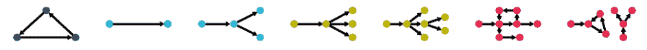

作者：Joao Schapke
编译: Congqing He

> ❝
> 
> 图神经网络有哪些应用领域？又有哪些图神经网络？这篇文章告诉你！
> 
> ❞

图结构数据在各个领域都很常见，例如{分子、社会、引用、道路}网络等，这些只是可以用图表示的大量数据中的一小部分。随着机器学习的进步，我们见证了在可用数据上应用智能算法的潜力。图神经网络是机器学习的一个分支，它以最有效的方式建立图数据的神经网络。

尽管ML在卷积网络的计算机视觉领域取得了进展，但图神经网络(GNNs)面临着一个更具挑战性的问题，即处理图的笨拙性质。与图像和文本不同，图形没有一个定义良好的结构。一个图的节点可能没有或有多个连接，这些连接可以是定向的，也可以是无定向的。数据集中的图形可能具有可变数量的节点和边，无法正确地调整大小，它们可能是无环的、循环的、联合的或不联合的。总之，它使处理数据的过程更具挑战性。

处理图的一种简单方法是连接节点，并建立一个更友好的结构化数据集，该数据集可以馈送到多层感知器（MLP）中，尽管这不是一种非常优雅的方法，但它可以提供良好的结果。尽管不足以处理多个可变大小和拓扑图或大型图，这些图会严重增加输入的维数。利用递归神经网络(RNNs)将图转换为节点序列，可以处理可变大小的图。但是，这种策略也是注定要失败的，图中最重要的信息之一就是它的结构，它在节点序列中不会留下任何痕迹。图形数据需要更健壮的方法来处理它们的结构。

然而，由于处理图的困难，以及卷积网络的发展，使得GNN领域有了更多的研究和新的方法。卷积层具有一些有用的特性，例如:局部连通性，假设它们相邻的像素高度相关。移位不变性，卷积会了解对象的特征，尽管它们具有空间位置。它们还能够在任何大小的图像上进行卷积。所有这些都是图神经网络真正吸引人的功能，应该重视局部连通性，因为节点的邻居与节点本身相关，因此它们应该是移位不变的，因为邻居应该对卷积具有相同的含义。尽管在图上所处的位置特殊，但它们也应与图的大小无关。

这就产生了在图数据中应用卷积的不同方法，主要分为基于谱的图数据卷积和基于空间的图数据卷积。

## 谱图卷积

谱图卷积(Spectral Graph Convolutions)是一种更有原则的卷积方法，它以信号预处理理论为基础。

在不深入研究谱卷积背后的理论的情况下，已经证明空间域的卷积等于频域的乘法(卷积定理)。同样的定理也适用于图，但是不是使用离散傅立叶变换矩阵作为基础，而是使用图拉普拉斯算子的特征向量。

图的拉普拉斯定义为:

其中I为单位矩阵，D为对角阶矩阵，A为图的邻接矩阵。

频谱卷积的主要限制是依赖于拉普拉斯矩阵的特征向量，每个计算都需要拉普拉斯矩阵的特征向量，反向传播时需要 的时间复杂度，特征分解时需要 的时间复杂度。

进一步的工作通过使用Chebyshev多项式和Cayley多项式逼近方程来减轻时间复杂度。

GCN（图卷积网络）对使用Chebyshev多项式的ChebNet网络进行了进一步简化。

## 空间图卷积

空间卷积是图卷积的一种更为宽松的形式，它是由GCN对之前的谱GNN进行简化而得到普及。

空间卷积在节点上进行空间卷积的方式与常规卷积相似。卷积从像素本身(像素放置在与新像素相同位置的像素)和周围像素生成新像素，空间图卷积通过聚集一个节点和它的邻居形成一个新节点来进行卷积。

下面通过图片说明网格结构图像中的正则卷积与空间图卷积之间的区别。

单个节点的空间图卷积可以定义为：

其中 表示当前节点i,对于它的邻接节点 ，  是节点 的所有邻居节点的集合

我们注意到这个卷积会将一个节点的局部信息聚合到一个新的节点中。从GCN的论文中我们有

和前面的方程相似，是一个应用于卷积的非线性激活函数。

是图的邻接矩阵加上单位矩阵，这将使每个节点与它的邻居进行集合。

是一阶对角矩阵。如果在第一个等式中注意到我们正在对节点i的所有邻居求和，并且图中的节点可以具有任意数量的邻居，则应注意，我们必须对求和结果进行归一化。乘以反对角矩阵即可。

这个简单的操作是空间卷积的基础。通过将其中的一些层与dropout层叠加，使用L2正则化并使用ReLU作为激活函数，使用Adam作为优化器，GCN能够实现3节点分类基准的SOTA。

**「注意，当前使用的事实上的方法是基于空间的卷积。这提供了一种更有效，更简单的图形卷积方法。」**

Graph神经网络可以处理各种各样的问题，列举一些问题，并给出如何解决的主要直觉：

*   节点预测: 是预测一个或多个图中节点的值或标签的任务。例如，在引文网络中预测论文的主题。

这些任务可以简单地通过应用上述卷积来解决。大多数基准测试采用半监督设置，其中数据集由单个图组成，其中一些节点标签用于训练/验证，另一些用于测试。

*   图预测:，预测一个图形的值或标签。例如，预测特定分子的毒性。

这些任务通常通过应用两个图卷积层来聚合节点之间的信息，然后使用某种读出操作将图中的所有节点聚合成固定大小的表示形式，然后应用MLP模型来获得最终结果。

读取操作可以简单地取所有节点上的average/ maxpooling。

*   图生成: 生成图形。例如，产生具有理想性质的新分子，如药物相似性和合成可及性。

这些问题可以用图自动编码器来解决。

*   边预测： 模拟到节点的预测，预测边缘的值或标签，例如预测知识库中两个实体是否相关。

预测边一般采用图卷积层来解决，虽然大多数数据集和论文都是针对节点预测的，但也有一些模型侧重于边预测，大多数节点预测模型可以推广到边预测。

更多的例子任务(以及基准和论文)可以在这里找到(https://paperswithcode.com/area/graphs)。

进一步，我们探讨了图卷积网络和GNNs的一些扩展。

## 时空图神经网络

GNNs还可以用来处理时间预测问题或处理时变数据的预测问题(如交通流量预测)。

时空图数据以多个图的形式出现，每个图表示一个时间步长，图的大小可能不同。

使用RNNs或CNNs处理序列图有两种主要的方法：

*   RNN解决方案一般将图卷积应用于节点级信息的聚合，将RNNs应用于时间级信息的聚合。

*   CNN方法遵循相同的思想，通常将图卷积应用于聚合节点，然后将一维卷积应用于时间级信息。

然后根据任务是否基于图，将读出操作应用于图以生成单个输出值。

卷积神经网络的一个缺点是不能很好地处理非局部相关。

图卷积仅考虑一阶邻居，尽管可以将多个卷积层堆叠在一起以从更大的邻域中获取信息，但是输入图的大小是任意的，因此无法正确调整大小，因此节点通常不会获取图的全局信息。

**「Example」**

下图是预测交通流量：

该图像包含几个兴趣点（POI），应该对其流量进行预测。这是非常适合时空GNN的任务，因为道路自然是图形结构，并且所有区域信息（例如附近学校或公园的存在）都可以嵌入到图形中。任务也与时间有关，流量会根据一天中的小时或一周中的一天而变化。

自然地，我们看到与预测有重要的局部相关性，交通流量取决于其附近的事物。而且我们还注意到非局部的，上下文的相关性。特别是，我们可以假设POI1和POI3的流量高度相关，因为两个点都位于附近有医院和游乐园的学校。能够识别这种上下文相关性应该可以改善模型的通用性。Geng等人(http://www-scf.usc.edu/~yaguang/papers/aaai19_multi_graph_convolution.pdf)提出的解决方案是测量兴趣点之间的相似度，如果它们非常相似，则将考虑以下信息：

是一个 矩阵，其作用与上面的GCN方程中的邻接矩阵类似。

但是，这是一个特定于任务的问题，许多任务不具有非局部相关性，而在基于图的任务中，这个问题通过读取操作得到了缓解。

## 基于注意力机制的方法

新研究的另一个重要灵感来源是注意力机制的发展和端到端的注意力模型，这些模型在NLP的各种基准中都达到了最新水平。

注意力机制的方法已成功应用于许多图卷积网络，如GAT (https://arxiv.org/pdf/1710.10903.pdf) 和 GAAN (https://arxiv.org/pdf/1803.07294.pdf)。与标准图卷积网络（如GCN）不同，GCN在执行卷积时会向所有相邻节点赋予相同的权重，而GAT引入了一种关注机制，该机制将不同的权重分配给节点的邻居。

有趣的是，NLP中最初的Transformer模型也适用于处理图数据，因此该模型被命名为Graph Transformer (https://arxiv.org/pdf/1911.07470.pdf)。

它被应用于图到序列的任务(Graph-Sequence)，其中模型接收图并输出序列，该模型必须从抽象含义表示（AMR）图中生成文本。解决任务的常用方法是为图生成嵌入（主要是通过使用GNN），然后用其训练NLP模型。

尽管图卷积通常用于生成嵌入，但作者指出，这些在学习节点之间的远距离关系方面存在困难。简而言之，他们使用图自动编码器根据节点之间的最短距离创建图的嵌入。

## 结论

与机器学习的其他每个领域类似，图神经网络是一个快速发展的领域。

但是与许多其他问题不同，GNN中的大多数问题都没有完善的解决方案或作为即插即用求解器的高级模型体系结构。图域中的问题肯定需要垂直思考，并且根据问题和数据，各种各样的解决方案都可以产生出色的结果。来自kaggle比赛的一个例子为了预测分子在特定键中原子之间的相互作用力，第一个解决方案解决了端到端图形转换器的问题，而第二个到第四个解决方案利用图手工制作了序列并使用了标准的NLP变形器其他方法使用了更通用的图卷积神经网络（例如GAT和GCN），或者使用了专门为处理该领域的数据而构建的GNN（例如SchNet）。这表明了领域内方法的异质性。

GNN内还有许多有趣的主题，此处未提及。一些未提及的主题：图递归神经网络，图自动编码器，图对抗方法，图强化学习。

## 参考文献

A Comprehensive Survey on Graph Neural Networks — Zonghan Wu

Deep Learning on Graphs: A Survey — Ziwei Zhang

Graph Neural Networks: A Review of Methods and Applications — Jie Zhou, Ganqu Cui, Zhengyan Zhang

*AI学习路线和优质资源，在后台回复"AI"获取*

