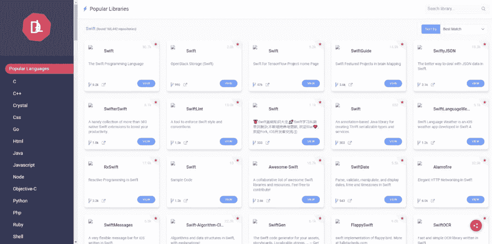
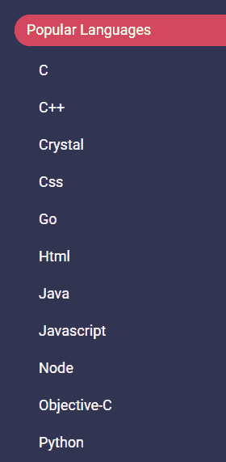
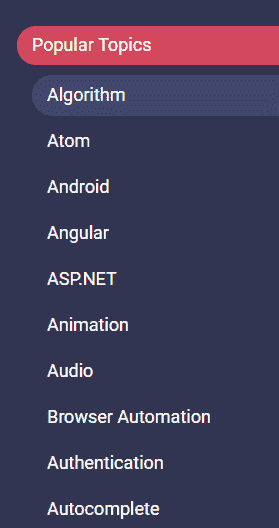
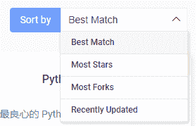
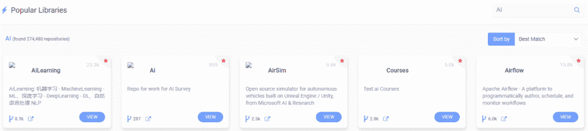
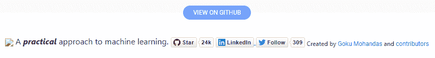

作为一名搬砖程序员，为了获取优质项目和源码，少不了逛 GitHub。一天下来，多多少少都会在 GitHub 上搜集优秀的开源项目。

但是，漫无目的地闲逛，往往得不到很好的开源项目，甚是头疼。最近几天，我无意中发现了一个超赞的在线网站，里面汇集了包含所有编程语言的开源项目和库，并可以链接到相对应的 GitHub 上。

赶紧推荐给大家，一起来看看吧~

该网站名为 **lib4dev**，首先放上 lib4dev 的在线网址：

http://www.lib4dev.in/

**简介**

使用 lib4dev 可以查找任何编程语言的最佳库，它界面简单，基本上所有编程语言的库和开源项目都可以在上面找得到。

**1. 按照编程语言分类**

我特意看了一下，里面包含的编程语言太全了，例如最常见的 C、C++、Go、Java、Python 等等。

例如我们用得比较多的应该是 Python 和 C++，在左侧点击就可以进入相应的编程语言了。

**2\. 按照主题分类**

除了按照编程语言来分，还提供了主题划分，例如算法、安卓、构建工具等等。

**3. 多类型排行**

值得一提的是该网站上的所有项目都是可以 link 到 GitHub 上的。每一种编程语言或者主题下都可以根据不同属性进行划分。

例如，我们选择 Python 语言。在页面右上角可以根据不同属性进行排行，方便我们获取最想要的开源项目。

*   按照最匹配排行

*   按照 star 数目排行

*   按照 Fork 数目排行

*   按照更新时间排行

从 4 种不同的属性，我们可以根据自己需要，寻找 star 数最多的、fork 数最多的，或者是最近更新的 GitHub 项目。

**4\. 搜索功能**

是的，lib4dev 也提供了项目搜索功能。这一点非常好用。例如我搜索“AI”，就会罗列出排行结果了。

下面举个例子，我们使用 star 最多的排行属性，搜索“AI”，在结果中，进入排名第二的“**PracticalAI**”。该项目非常不错，我之前也看过，有机会再推荐给大家。

在网站里，我们可以看到对应项目的所有内容，当然你也可以选择跳转到项目的 GitHub 仓库中去。

总的来说，lib4dev 的界面比较简单。但是搜索 GitHub 项目确实不错，基本上可以缩减我闲逛 GitHub 50% 的时间了。

最后，再次放上在线网址：

http://www.lib4dev.in/

觉得有用的话，赶紧试试吧

*AI学习路线和优质资源，在后台回复"AI"获取*

