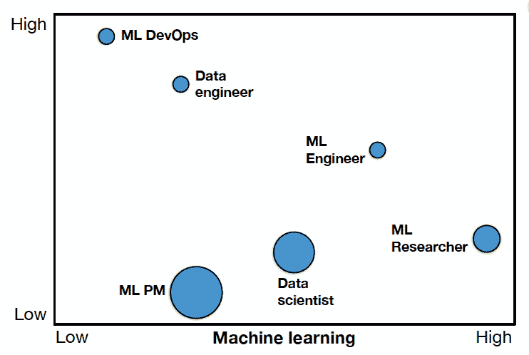
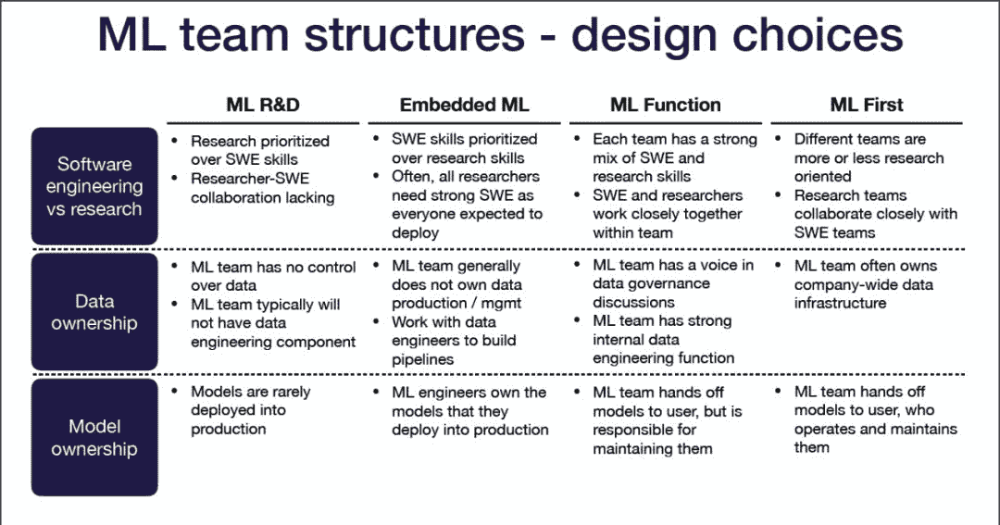
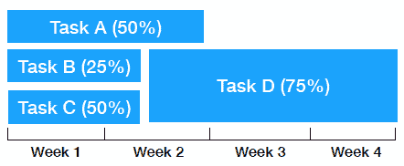

在过去的几年里，机器学习有了巨大的发展。但是，尽管机器学习是一门学科，管理机器学习团队的技艺却更年轻。当今许多机器学习管理人员被迫进入管理岗位，要么是出于需要，要么是因为他们是最好的个人贡献者，而且许多人纯粹来自学术背景。在一些公司，工程师或产品负责人的任务是建立新的机器学习能力，而没有任何真正的机器学习经验。

管理任何技术团队都是困难的：

*   你必须雇佣优秀的人。

*   你需要管理和发展它们。

*   你需要管理你的团队的输出，并确保你们的方向是一致的。

*   你会希望做出良好的长期技术选择和管理技术债务。

*   你还必须管理来自领导层的期望。

管理一个机器学习团队更加困难：

*   机器学习人才昂贵而稀缺。

*   机器学习小组有不同的角色。

*   机器学习项目时间安排不明确，不确定性高。

*   机器学习也是“技术债的高息信用卡”。

*   领导经常不理解机器学习。

我最近参加了加州大学伯克利分校的“全栈深度学习训练营”，这是一门教授全栈生产深度学习的精彩课程。Josh Tobin的一个讲座提供了关于机器学习团队的最佳实践。作为Josh讲座的一部分，本文将为你提供一些关于如果你是一名经理，如何考虑建立和管理机器学习团队的见解，如果你是一名求职者，这篇文章也可能帮助你在机器学习领域找到一份工作。

# 第1步 — 定义角色

让我们来看看最常见的机器学习角色和它们需要的技能：

1.  **机器学习产品经理**与机器学习团队一起工作，给其他业务和最终用户提供能力。这个人设计文档，创建线框图，制定出优先级和执行机器学习项目的计划。

2.  **DevOps工程师**负责部署和监控生产系统。此人负责运行部署的机器学习产品的基础设施。

3.  **数据工程师**是构建数据pipeline、从数据存储中聚合和收集数据、监控数据行为的人……这个人使用Hadoop、Kafka和Airflow等分布式系统。

4.  **机器学习工程师**是训练和部署预测模型的人。这个人使用TensorFlow和Docker等工具来处理生产中运行在真实数据上的预测系统。

5.  **机器学习研究员**是训练预测模型的人，但通常是前瞻性的或不是生产关键的。这个人使用TensorFlow，PyTorch，Jupiter建立模型和报告来描述他们的实验。

6.  **数据科学家**实际上是一个用于描述上述所有角色的总括性术语。在一些公司中，这个角色实际上需要通过分析回答业务问题。

那么这些角色需要什么技能呢？上面的图表显示了一个很好的视觉效果，横轴是机器学习的专业水平，而气泡的大小是交流和技术写作的水平(越大越好)。

1.  **机器学习DevOps**主要是一个软件工程角色，它通常来自一个标准的软件工程管道。

2.  **数据工程师**属于与机器学习团队积极合作的软件工程团队。

3.  **机器学习工程师**需要罕见的机器学习和软件工程技能的结合。这个人要么是一个自学成才的工程师，要么是一个在研究生毕业后从事传统软件工程师工作的科学/工程博士。

4.  **机器学习研究员**是机器学习专家，通常拥有计算机科学或统计学的硕士或博士学位，或完成了一个工业奖学金项目。

5.  **机器学习产品经理**和传统的产品经理一样，但是对机器学习的开发流程和思维方式有着深刻的了解。

6.  **数据科学家**的角色包括从本科生到博士生的广泛背景。

# 第2步 — 构建团队

关于构建一个机器学习团队的正确方法，目前还没有共识，但是有一些最佳实践是根据不同的公司原型及其机器学习成熟度级别而定的。首先，让我们看看不同的机器学习公司原型是什么。

## 原型1 — 初创和专业的机器学习

*   这些公司中没有人在做机器学习，或者机器学习是在一个特定的基础上完成的。显然，公司内部几乎没有机器学习的专业知识。

*   这些企业要么是中小型企业，要么是技术含量较低的教育或物流等行业的大公司。

*   机器学习经常有唾手可得的成果。

*   但机器学习项目得到的支持很少，很难聘用和留住优秀人才。

## 原型2 — 研究和开发机器学习

*   这些公司的机器学习工作集中在公司的研发部门，他们经常雇佣机器学习研究人员和有发表论文经验的博士生。

*   这些是石油和天然气、制造业或电信等部门的较大公司。

*   他们可以聘请有经验的研究人员，并致力于长期的业务重点，以获得大的胜利。

*   然而，很难获得高质量的数据，通常情况下，这类研究工作很少转化为实际的业务价值，因此投资金额通常很小。

## 原型3 — 产品中嵌入机器学习

*   在这些公司中，某些产品团队或业务单位除了拥有软件或分析人才外，还拥有机器学习专长。这些机器学习人员向团队的工程/技术主管汇报。

*   这些公司不是软件公司就是金融服务公司。

*   机器学习的改进可能会带来商业价值，此外，在创意迭代和产品改进之间存在一个紧密的反馈周期。

*   不幸的是，招聘和培养顶尖人才仍然非常困难，获取数据和计算资源可能会滞后。机器学习项目周期和工程管理之间也存在潜在的冲突，因此长期的机器学习项目可能很难被证明是正确的。

## 原型4 — 独立机器学习部门

*   这些是机器学习部门直接向高级领导汇报的公司。机器学习产品经理与研究人员和工程师合作，将机器学习构建成面向客户的产品。他们有时可以发表长期研究。

*   这些公司通常是大型金融服务公司。

*   人才密度允许他们雇用和培训顶级从业者。高级领导可以整理数据和计算资源。这使得公司可以在机器学习开发的工具、实践和文化方面进行投资。

*   缺点是，模型移交给不同的业务线可能是具有挑战性的，因为用户需要购买机器学习的好处，并在模型的使用上得到教育。此外，反馈周期可能很慢。

## 原型5 — 机器学习优先

*   在这些公司中，CEO投资机器学习，而整个行业中也有专注于快速成功的专家。机器学习部门从事具有挑战性和长期性的项目。

*   这个群体包括大型科技公司和以机器学习为重点的初创公司。

*   他们有最好的数据访问(数据思维渗透公司)，最有吸引力的招聘渠道(具有挑战性的机器学习问题往往会吸引顶级人才)，最简单的部署流程(产品团队对机器学习有足够的了解)。

*   这种类型的公司原型很难在实践中实现，因为在文化上很难在所有地方嵌入机器学习思维。

根据你的公司类似于上面的原型，你可以做出适当的设计选择，大致可分为以下三类：

*   **软件工程师vs研究**：机器学习团队在多大程度上负责构建或集成软件？软件工程技能在团队中有多重要？

*   **数据所有权**：机器学习团队对数据收集、入库、标识和流水线有多少控制？

*   **模型所有权**：机器学习团队是否负责将模型部署到生产中？谁维护已部署的模型？

以下是设计建议…

如果你的公司专注于机器学习研发：

*   研究绝对优先于软件工程技能。因此，这两个组之间可能缺乏协作。

*   机器学习团队对数据没有控制权，通常不会有数据工程师来支持他们。

*   机器学习模型很少投入生产。

如果你的公司已经将机器学习嵌入到产品中：

*   软件工程技能将优先于研究技能。通常情况下，研究人员需要很强的工程技能，因为每个人都需要生产他/她的模型。

*   机器学习团队一般没有自己的数据生产和数据管理。他们需要与数据工程师一起建立数据管道。

*   机器学习工程师完全拥有他们部署到生产中的模型。

如果你的有一个独立的机器学习部门：

*   每个小组都有很强的工程和研究技能，因此他们在团队中紧密合作。

*   机器学习团队在数据治理讨论中有发言权，并拥有强大的数据工程功能。

*   机器学习小组不干涉用户的模型，但仍然负责维护它们。

如果你的公司是机器学习优先：

*   不同的团队或多或少以研究为导向，但一般来说，研究团队与工程团队紧密合作。

*   机器学习团队通常拥有全公司范围内的数据基础设施。

*   机器学习团队将模型交给用户，由用户操作和维护。

下面的图片很好地总结了这些建议：

# 3 — 管理项目

管理机器学习项目非常具有挑战性:

*   根据Lukas Biewald的文章，即使在一个领域中，性能也可能有很大差异。

*   机器学习是非线性的。项目停滞数周或更长时间是很常见的。在早期阶段，很难计划一个项目，因为不清楚什么会起作用。因此，估计机器学习项目的时间表是非常困难的。

*   由于不同的价值观、背景、目标和规范，研究和工程之间存在文化差异。在不相容的文化中，双方往往不重视对方。

*   通常，领导阶层就是不理解这一点。

那么，如何更好地管理机器学习团队呢？秘密武器是概率性地计划机器学习项目！

本质上，从这开始：

到

下面是一些其他的好方法:

*   你应该尝试一系列的方法。

*   你应该根据投入来衡量进展，而不是结果。

*   你应该让研究人员和工程师一起工作。

*   你应该尽快把端到端管道连接起来，以证明快速的胜利。

*   你应该在机器学习时间表的不确定性上教育领导。

# 4 — 招聘人才

根据Element AI发布的《2019年全球人工智能人才报告》，有强有力的证据表明，顶级人工智能人才供不应求。在人工智能研究的前沿，大约有2.2万人在积极发表论文，并在学术会议上发言。只有大约4000人参与了对整个领域产生重大影响的研究。总共有36500人自称是人工智能专家。与此相比，软件开发者的数量在美国是420万人，在世界上是2640万人。

## 1 — 如何寻找机器学习人才？

下面是一些招聘机器学习工程师的策略：

*   聘用有软件工程技能、对机器学习有浓厚兴趣及有学习欲望的人士。然后你可以训练他们进行机器学习。

*   考虑到现在大多数计算机科学本科毕业生都有机器学习的经验，去找初级职位吧。

*   明确你需要什么。例如，并不是每个机器学习工程师都需要做DevOps。

以下是雇佣机器学习研究人员的策略：

*   关注发表文章的质量，而不是数量(例如，创意，执行质量)。

*   寻找具有研究重大问题眼光的研究人员。许多研究人员关注流行问题，却没有考虑它们的重要性。

*   寻找有学术以外经验的研究人员。

*   考虑招聘邻近领域的人才，如数学、物理和统计。

*   考虑雇佣没有博士学位的人。例如，有才华的本科生和硕士生，工业奖学金项目(谷歌，Facebook, OpenAI)的毕业生，甚至是专注的自学者。

你是如何找到这些候选人的呢？

*   有标准的信息来源，比如LinkedIn，通过招聘中介，参观大学的招聘会。

*   你应该参加著名的机器学习研究会议(NeurIPS, ICLR, ICML)的机器学习研究人员和著名的应用机器学习会议(O 'Reilly, ReWork, TensorFlow World)的机器学习工程师。

*   你可以关注ArXiv的令人印象深刻的研究论文，并联系第一作者。

对于一个长期的战略，你需要考虑如何吸引这些候选人，让你的公司脱颖而出：

*   由于机器学习实践者希望使用最先进的工具和技术，你的公司应该致力于研究型项目，在博客上公布它们，并为你的机器学习团队投资工具和基础设施。

*   由于机器学习从业者希望在一个令人兴奋的领域建立技能和知识，你的公司应该围绕学习建立团队文化(即阅读小组、学习日、专业发展预算、会议预算)。

*   由于机器学习从业者想要与优秀的人一起工作，你的公司应该招聘高知名度的人，或者帮助你最好的人通过发表博客和论文来建立他们的档案。

*   因为机器学习从业者想要处理有趣的数据集，你的公司应该在招聘材料中表现出你的数据集的唯一性。

*   由于机器学习实践者想要做重要的工作，你的公司应该推销你公司的使命和机器学习对这个使命的潜在影响。更重要的是，你应该从事那些对今天有实际影响的项目。

## 2 — 如何面试机器学习候选人？

那么，在机器学习面试中，你应该问些什么呢？

*   第一件事是**验证你对候选人优点的假设**。对于机器学习的研究人员来说，要确保他们能够创造性地思考新的机器学习问题，并探究他们对之前项目的思考程度。对于机器学习工程师，确保他们是具有扎实工程技能的多面手。

*   第二件事是**确保候选人在较弱的领域达到最低标准**。对于机器学习研究人员，测试他们的工程知识和编写良好代码的能力。对于机器学习工程师，测试他们简单的机器学习知识。

与传统的软件工程面试相比，机器学习面试的定义要模糊得多，但以下是常见的评估类型：

*   背景和文化相符

*   白板编程

*   结对编程/调试(通常是特定于机器学习的代码)

*   数学题

*   关键项目

*   应用机器学习(例如，解释如何使用机器学习解决问题)

*   以前的项目(方法、试验和错误、结果)

*   机器学习理论(如偏差-方差权衡、过拟合和欠拟合、特定算法…)

## 3 — 如何找到从事机器学习的工作？

假设您是一名机器学习候选人，正在阅读本文。你可能会问：“我怎么能找到机器学习的工作？”

*   同样，有标准的资源，如LinkedIn，招聘人员，校园招聘。

*   你可以参加机器学习研究会议，和那里的人交流。

*   你也可以直接申请公司的门户网站(记住这里有人才缺口！)

找工作当然不容易，但有几个方法可以脱颖而出：

*   建立一般的软件工程技能(通过CS课程和/或工作经验)。

*   表现出对机器学习的兴趣(通过参加会议和/或参加MOOCs)。

*   表明你对机器学习有广泛的知识(例如，写博客文章综合一个研究领域)。

*   演示完成机器学习项目的能力(例如，创建小项目和/或复现论文)。

*   证明你可以创造性地思考机器学习(例如，赢得Kaggle竞赛和/或发表论文)。

为了准备面试，你应该：

*   使用网络资源进行一般的软件工程面试的实践。

*   准备详细谈谈你过去的项目，包括你所做的权衡和决定。

*   复习机器学习理论和基本的机器学习算法。

*   创造性地思考如何使用机器学习来解决面试公司可能面临的问题。

我还建议大家去看看Chip Huyen在训练营发布的幻灯片：https://twitter.com/chipro/status/1196232680364376064，它包含了机器学习面试过程中双方的一些重要经验。文后有下载链接。

# 总结

对于大多数传统公司来说，机器学习是一门新兴的、不断发展的学科，组建机器学习团队充满了已知和未知的挑战。如果你跳到最后，以下是最后几个要点：

*   有许多不同的技能涉及到生产机器学习，所以有机会为许多人作出贡献。

*   机器学习小组变得更加独立和跨学科。

*   管理机器学习团队是困难的。没有什么灵丹妙药，但转向概率规划可能会有所帮助。

*   机器学习人才稀缺。作为一名经理，在机器学习的工作描述中，要明确哪些技能是必须具备的。作为一名求职者，作为一个局外人打入市场可能会面临残酷的挑战，所以要把项目作为树立认知度的信号。

希望这篇文章为你有效地建立机器学习团队提供了有用的信息。在接下来的博客文章中，我将分享更多我在全栈深度学习训练营中学到的东西，敬请期待！

*AI学习路线和优质资源，在后台回复"AI"获取*

