**目录：**

1.  GBDT分类算法简介

2.  GBDT二分类算法

*   2.1 逻辑回归的对数损失函数

*   2.2 GBDT二分类原理

*   GBDT二分类算法实例

*   手撕GBDT二分类算法

*   *   4.1 用Python3实现GBDT二分类算法

    *   4.2 用sklearn实现GBDT二分类算法

*   GBDT分类任务常见的损失函数

*   总结

*   Reference

*   **本文的主要内容概览：**

    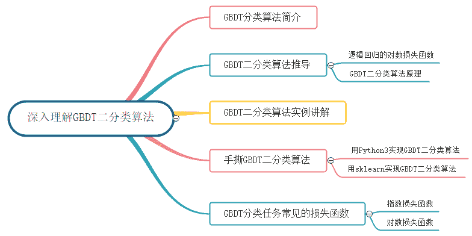

    # 1\. GBDT分类算法简介

    GBDT无论用于分类还是回归，一直使用的是CART回归树。GBDT不会因为我们所选择的任务是分类任务就选用分类树，这里的核心原因是GBDT每轮的训练是在上一轮训练模型的负梯度值基础之上训练的。这就要求每轮迭代的时候，真实标签减去弱分类器的输出结果是有意义的，即残差是有意义的。如果选用的弱分类器是分类树，类别相减是没有意义的。对于这样的问题，可以采用两种方法来解决：

    *   采用指数损失函数，这样GBDT就退化成了Adaboost，能够解决分类的问题；

    *   使用类似于逻辑回归的对数似然损失函数，如此可以通过结果的概率值与真实概率值的差距当做残差来拟合；

    下面我们就通过二分类问题，去看看GBDT究竟是如何做分类的。

    # 2\. GBDT二分类算法

    ## 2.1 逻辑回归的对数损失函数

    逻辑回归的预测函数为：

    函数  的值有特殊的含义，它表示结果取   的概率，因此对于输入   分类结果为类别   和类别   的概率分别为：

    下面我们根据上式，推导出逻辑回归的对数损失函数   。上式综合起来可以写成：

    然后取似然函数为：

    因为   和   在同一   处取得极值，因此我们接着取对数似然函数为：

    最大似然估计就是求使  取最大值时的   。这里对   取相反数，可以使用梯度下降法求解，求得的   就是要求的最佳参数：

    ## 2.2 GBDT二分类原理

    逻辑回归单个样本   的损失函数可以表达为：

    其中，   是逻辑回归预测的结果。假设第   步迭代之后当前学习器为   ，将   替换为  带入上式之后，可将损失函数写为：

    其中，第   棵树对应的响应值为（损失函数的负梯度，即伪残差）：

    对于生成的决策树，计算各个叶子节点的最佳残差拟合值为：

    由于上式没有**闭式解（closed form solution）**，我们一般使用近似值代替：

    **GBDT二分类算法完整的过程如下：**

    （1）初始化第一个弱学习器   ：

    其中，   是训练样本中   的比例，利用先验信息来初始化学习器。

    （2）对于建立   棵分类回归树   :

    a）对   ，计算第   棵树对应的响应值（损失函数的负梯度，即伪残差）：

    b）对于  ，利用CART回归树拟合数据   ，得到第   棵回归树，其对应的叶子节点区域为   ，其中   ，且   为第 棵回归树叶子节点的个数。

    c）对于  个叶子节点区域  ，计算出最佳拟合值：

    d）更新强学习器   ：

    （3）得到最终的强学习器   的表达式：

    从以上过程中可知，除了由损失函数引起的负梯度计算和叶子节点的最佳残差拟合值的计算不同，二元GBDT分类和GBDT回归算法过程基本相似。那么二元GBDT是如何做分类呢？

    将逻辑回归的公式进行整理，我们可以得到   ，其中 ，也就是将给定输入    预测为正样本的概率。逻辑回归用一个线性模型去拟合   这个事件的对数几率（odds） 。二元GBDT分类算法和逻辑回归思想一样，用一系列的梯度提升树去拟合这个对数几率，其分类模型可以表达为：

    # 3\. GBDT二分类算法实例

    ## （1）数据集介绍

    训练集如下表所示，一组数据的特征有年龄和体重，把身高大于1.5米作为分类边界，身高大于1.5米的令标签为1，身高小于等于1.5米的令标签为0，共有4组数据。

    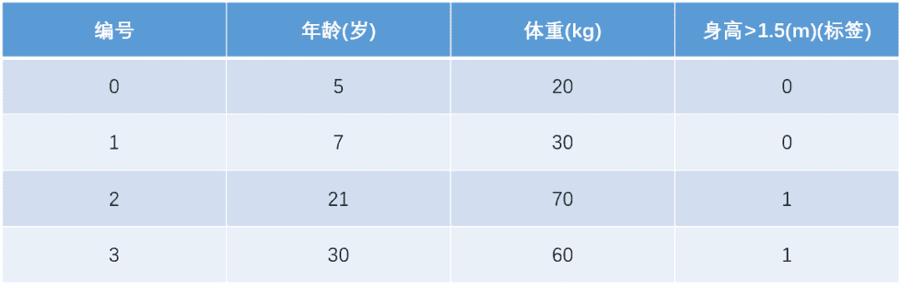

    测试数据如下表所示，只有一组数据，年龄为25、体重为65，我们用在训练集上训练好的GBDT模型预测该组数据的身高是否大于1.5米？

    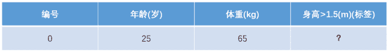

    ## （2）模型训练阶段

    > 参数设置：
    > 
    > *   学习率：learning_rate = 0.1
    >     
    >     
    > *   迭代次数：n_trees = 5
    >     
    >     
    > *   树的深度：max_depth = 3

    ### 1）初始化弱学习器：

    ### 2）对于建立 棵分类回归树 ：

    由于我们设置了迭代次数：`n_trees=5`，这就是设置了 。

    首先计算负梯度，根据上文损失函数为对数损失时，负梯度（即伪残差、近似残差）为：

    我们知道梯度提升类算法，其关键是利用损失函数的负梯度的值作为回归问题提升树算法中的残差的近似值，拟合一个回归树。这里，为了称呼方便，我们把负梯度叫做残差。

    现将残差的计算结果列表如下：

    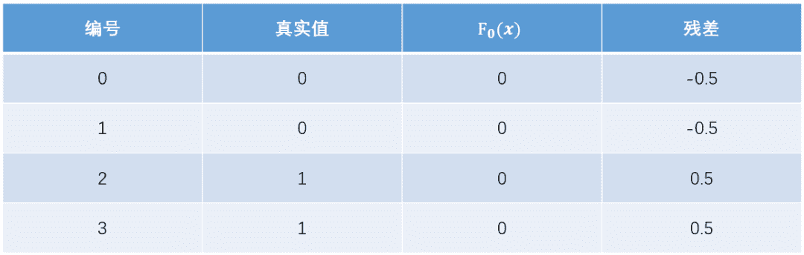

    此时将残差作为样本的标签来训练弱学习器   ，即下表数据：

    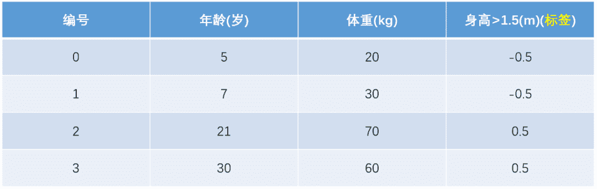

    接着寻找回归树的最佳划分节点，遍历每个特征的每个可能取值。从年龄特征值为 开始，到体重特征为 结束，分别计算分裂后两组数据的对数似然损失（Log-likelihood Error），  为左节点的对数损失，   为右节点的对数损失，找到使对数损失和   最小的那个划分节点，即为最佳划分节点。

    例如：以年龄 为划分节点，将小于 的样本划分为到左节点，大于等于 的样本划分为右节点。左节点包括  ，右节点包括样本  ，  ，  ，  ，所有可能的划分情况如下表所示：

    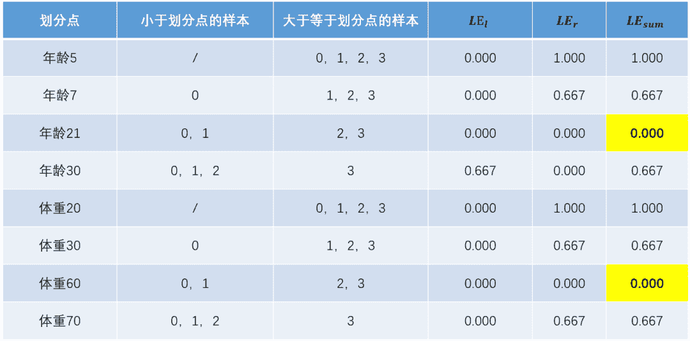

    以上划分点的总对数似然损失最小为 ，有两个划分点：年龄 和体重 ，所以随机选一个作为划分点，这里我们选年龄 。现在我们的第一棵树长这个样子：

    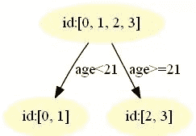

    我们设置的参数中树的深度`max_depth=3`，现在树的深度只有 ，需要再进行一次划分，这次划分要对左右两个节点分别进行划分，但是我们在生成树的时候，设置了三个树继续生长的条件：

    *   深度没有到达最大。树的深度设置为3，意思是需要生长成3层;

    *   点样本数 >= min_samples_split;

    *   此节点上的样本的标签值不一样。如果值一样说明已经划分得很好了，不需要再分;**（本程序满足这个条件，因此树只有2层）**

    最终我们的第一棵回归树长下面这个样子：

    

    此时我们的树满足了设置，还需要做一件事情，给这棵树的每个叶子节点分别赋一个参数 ，来拟合残差。

    根据上述划分结果，为了方便表示，规定从左到右为第 个叶子结点，其计算值过程如下：

    此时的第一棵树长下面这个样子：

    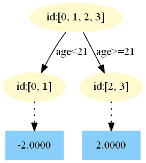

    接着更新强学习器，需要用到学习率：`learning_rate=0.1`，用`lr`表示。更新公式为：

    为什么要用学习率呢？这是Shrinkage的思想，如果每次都全部加上拟合值   ，即学习率为 ，很容易一步学到位导致GBDT过拟合。

    **重复此步骤，直到   结束，最后生成 棵树。**

    下面将展示每棵树最终的结构，这些图都是我GitHub上的代码生成的，感兴趣的同学可以去运行一下代码。https://github.com/Microstrong0305/WeChat-zhihu-csdnblog-code/tree/master/Ensemble%20Learning/GBDT_GradientBoostingBinaryClassifier

    **第一棵树：**

    

    **第二棵树：**

    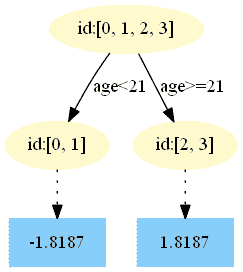

    **第三棵树：**

    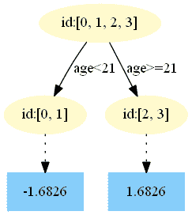

    **第四棵树：**

    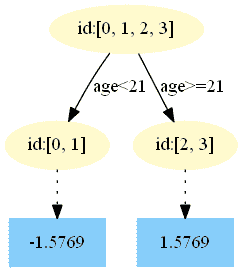

    **第五棵树：**

    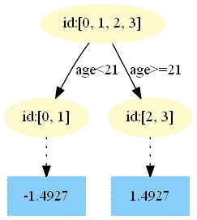

    ### 3）得到最后的强学习器：

    ## （3）模型预测阶段

    *   在   中，测试样本的年龄为 ，大于划分节点 岁，所以被预测为 。

    *   在   中，测试样本的年龄为 ，大于划分节点 岁，所以被预测为 。

    *   在   中，测试样本的年龄为 ，大于划分节点 岁，所以被预测为 。

    *   在   中，测试样本的年龄为 ，大于划分节点 岁，所以被预测为 。

    *   在   中，测试样本的年龄为 ，大于划分节点 岁，所以被预测为 。

    最终预测结果为：

    # 4\. 手撕GBDT二分类算法

    本篇文章所有数据集和代码均在我的GitHub中，地址：https://github.com/Microstrong0305/WeChat-zhihu-csdnblog-code/tree/master/Ensemble%20Learning

    ## 4.1 用Python3实现GBDT二分类算法

    **需要的Python库：**

    ```
    pandas、PIL、pydotplus、matplotlib 
    ```

    其中`pydotplus`库会自动调用`Graphviz`，所以需要去`Graphviz`官网下载`graphviz-2.38.msi`安装，再将安装目录下的`bin`添加到系统环境变量，最后重启计算机。

    由于用Python3实现GBDT二分类算法代码量比较多，我这里就不列出详细代码了，感兴趣的同学可以去我的GitHub中看一下，地址：https://github.com/Microstrong0305/WeChat-zhihu-csdnblog-code/tree/master/Ensemble%20Learning/GBDT_GradientBoostingBinaryClassifier

    ## 4.2 用sklearn实现GBDT二分类算法

    ```
    import numpy as np
    from sklearn.ensemble import GradientBoostingClassifier

    '''
    调参：
    loss：损失函数。有deviance和exponential两种。deviance是采用对数似然，exponential是指数损失，后者相当于AdaBoost。
    n_estimators:最大弱学习器个数，默认是100，调参时要注意过拟合或欠拟合，一般和learning_rate一起考虑。
    learning_rate:步长，即每个弱学习器的权重缩减系数，默认为0.1，取值范围0-1，当取值为1时，相当于权重不缩减。较小的learning_rate相当于更多的迭代次数。
    subsample:子采样，默认为1，取值范围(0,1]，当取值为1时，相当于没有采样。小于1时，即进行采样，按比例采样得到的样本去构建弱学习器。这样做可以防止过拟合，但是值不能太低，会造成高方差。
    init：初始化弱学习器。不使用的话就是第一轮迭代构建的弱学习器.如果没有先验的话就可以不用管

    由于GBDT使用CART回归决策树。以下参数用于调优弱学习器，主要都是为了防止过拟合
    max_feature：树分裂时考虑的最大特征数，默认为None，也就是考虑所有特征。可以取值有：log2,auto,sqrt
    max_depth：CART最大深度，默认为None
    min_sample_split：划分节点时需要保留的样本数。当某节点的样本数小于某个值时，就当做叶子节点，不允许再分裂。默认是2
    min_sample_leaf：叶子节点最少样本数。如果某个叶子节点数量少于某个值，会同它的兄弟节点一起被剪枝。默认是1
    min_weight_fraction_leaf：叶子节点最小的样本权重和。如果小于某个值，会同它的兄弟节点一起被剪枝。一般用于权重变化的样本。默认是0
    min_leaf_nodes：最大叶子节点数
    '''

    gbdt = GradientBoostingClassifier(loss='deviance', learning_rate=0.1, n_estimators=5, subsample=1
                                      , min_samples_split=2, min_samples_leaf=1, max_depth=3
                                      , init=None, random_state=None, max_features=None
                                      , verbose=0, max_leaf_nodes=None, warm_start=False
                                      )

    train_feat = np.array([[1, 5, 20],
                           [2, 7, 30],
                           [3, 21, 70],
                           [4, 30, 60],
                           ])
    train_label = np.array([[0], [0], [1], [1]]).ravel()

    test_feat = np.array([[5, 25, 65]])
    test_label = np.array([[1]])
    print(train_feat.shape, train_label.shape, test_feat.shape, test_label.shape)

    gbdt.fit(train_feat, train_label)
    pred = gbdt.predict(test_feat)

    total_err = 0
    for i in range(pred.shape[0]):
        print(pred[i], test_label[i])
        err = (pred[i] - test_label[i]) / test_label[i]
        total_err += err * err
    print(total_err / pred.shape[0]) 
    ```

    用sklearn中的GBDT库实现GBDT二分类算法的难点在于如何更好的调节下列参数：

    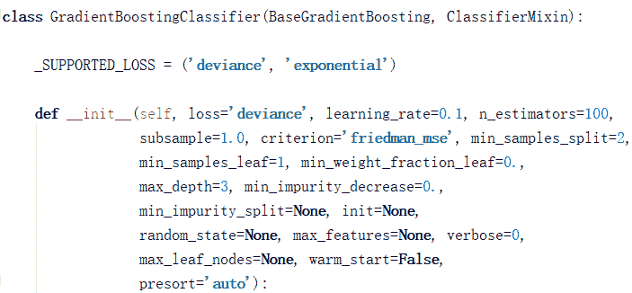

    用sklearn实现GBDT二分类算法的GitHub地址：https://github.com/Microstrong0305/WeChat-zhihu-csdnblog-code/tree/master/Ensemble%20Learning/GBDT_Classification_sklearn

    # 5\. GBDT分类任务常见的损失函数

    对于GBDT分类算法，其损失函数一般有对数损失函数和指数损失函数两种:

    （1）如果是指数损失函数，则损失函数表达式为：

    其负梯度计算和叶子节点的最佳负梯度拟合可以参看Adaboost算法过程。

    （2）如果是对数损失函数，分为二元分类和多元分类两种，本文主要介绍了GBDT二元分类的损失函数。

    # 6\. 总结

    在本文中，我们首先简单介绍了如何把GBDT回归算法变成分类算法的思路；然后从逻辑回归的对数损失函数推导出GBDT的二分类算法原理；其次不仅用Python3实现GBDT二分类算法，还用sklearn实现GBDT二分类算法；最后介绍了GBDT分类任务中常见的损失函数。GBDT可以完美的解决二分类任务，那么它对多分类任务是否有效呢？如果有效，GBDT是如何做多分类呢？这些问题都需要我们不停的探索和挖掘GBDT的深层原理。让我们期待一下GBDT在多分类任务中的表现吧！

    # 7\. Reference

    【1】Friedman J H. Greedy function approximation: a gradient boosting machine[J]. Annals of statistics, 2001: 1189-1232.
    【2】GBDT详细讲解&常考面试题要点，地址：https://mp.weixin.qq.com/s/M2PwsrAnI1S9SxSB1guHdg
    【3】机器学习算法GBDT的面试要点总结-上篇，地址：https://www.cnblogs.com/ModifyRong/p/7744987.html
    【4】Gradient Boosting Decision Tree，地址：http://gitlinux.net/2019-06-11-gbdt-gradient-boosting-decision-tree/
    【5】GBDT算法用于分类问题 - hunter7z的文章 - 知乎，地址：https://zhuanlan.zhihu.com/p/46445201
    【6】当我们在谈论GBDT：Gradient Boosting 用于分类与回归 - 余文毅的文章 - 知乎 ，地址：https://zhuanlan.zhihu.com/p/25257856
    【7】 GBDT原理与Sklearn源码分析-分类篇，地址：https://blog.csdn.net/qq_22238533/article/details/79192579
    【8】 《推荐系统算法实践》，黄美灵著。
    【9】《百面机器学习》，诸葛越主编、葫芦娃著。
    【10】GBDT模型，地址：https://www.jianshu.com/p/0bc32c8e4ca8
    【11】代码实战之GBDT，地址：https://louisscorpio.github.io/2018/01/19/%E4%BB%A3%E7%A0%81%E5%AE%9E%E6%88%98%E4%B9%8BGBDT/

    *AI学习路线和优质资源，在后台回复"AI"获取*

    