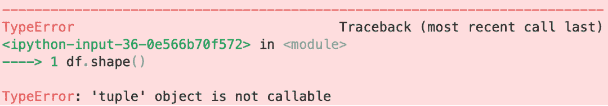
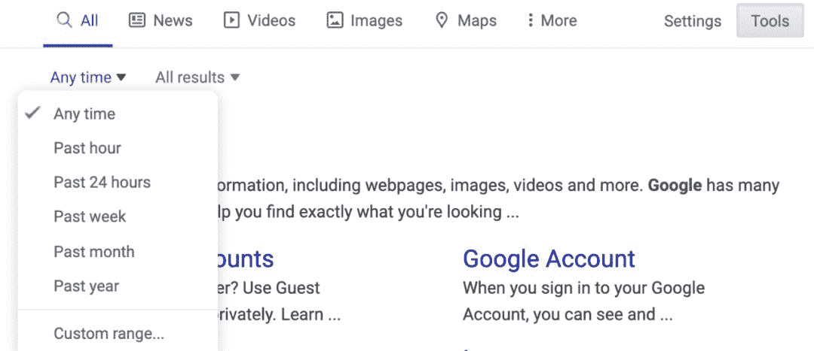

选自Medium

**作者****：****Jeff Hale**

**机器之心编译**

> 善始者实繁，克终者盖寡，这句话用来学习编程的过程也很合适。在成为顶尖选手之前，总会遇到很多困难，甚至想放弃。本文作者 Jeff Hale 是 Medium 社区中非常有名的人工智能和技术领域的专栏作家。在这篇文章里，他给所有的编程者提供了 10 个真诚而且实用的建议以及快速解决编程错误的5个步骤。

在我下决心将编程进行到底之前，大概经历了四次放弃又捡起的过程，而且我观察了一些数据科学的学生，这种事不光是我一个人做过。

缓慢且乏味的学习过程，随之而来的挫折感，这些都是造成半途而废的原因。因此，我开始思考如何消除那些本不必要但确实阻碍了人们成为合格程序员的困难。学习都会有困难的，但是我们至少要减少一些没有必要的障碍。

这里有 10 个技巧可以帮助你更快地跨越障碍，获得更多的成就感。如果你已经写了很多年的代码，这里的许多技巧可能显得用处不大，但是对新手来说就是另外一回事了。而且就算你是个编程老手，也可能会看到一两个节省时间的小窍门呢！

*1*

**分屏**

在大多数情况下，我建议你在学习编程的时候把屏幕分成两个并排的面板——一个给你的 Jupyter notebook，另一个放浏览器，浏览器用来查看文档、Stack Overflow 和一些教程。如果你的屏幕很小，建议在负担得起的前提下换个大点的显示器。在美国，你可以花 100 多美元在亚马逊 (Amazon) 上买到一台 25 英寸的显示器。等你越来越熟练的时候，你就会想要专注于一件工作——这时候可以用键盘快捷键在分屏和全屏之间切换。在 Mac 上，我喜欢用 BetterSnapTool，如果你的系统是 Windows，可以到这篇文章（https://www.excelcampus.com/tips/split-screen-view-windows-mac/）上看看。

*2*

**屏蔽干扰**

让电脑和手机静音。如果可以的话，把手机拿开。如果你在一个嘈杂的地方，播放一些安静的纯音乐或者使用降噪耳机。你越能集中注意力，你就能学得越快。

*3*

**亲手把示例代码写一遍**

你不可能读一遍教程就能记住这些内容，复制粘贴没有什么实际价值，你必须先自己写一遍，然后想想怎么扩展一下，最后根据记忆打出来。「理论上，理论和实践之间没有区别。但实际上是有的。」——本杰明·布鲁斯特（不是约吉·贝拉最先说的）。

*4*

**温故知新**

学习一个新概念之后，在几天内再测试一下自己。研究表明，需要长期记住一件事时，每隔一段时间重复一次比直接死记硬背更有效。

*5*

**通过教别人来学习**

能教会别人，说明自己彻底懂了。向别人清楚地解释一个概念（口述或是书面都行）会迫使你理解这个概念的本质，建立关系，并创建类比，使得头脑中的联系得以巩固。这个技巧是 Feynman 学习技巧的一部分。

*6*

**打好语言基础再调库**

在使用编写好的程序库之前，要充分理解一门编程语言。学习变量类型可能很无聊，调用带有属性和方法的类似乎比较高级。但是一旦你很好地理解了一门语言，这个库的使用会容易得多。这样可以减少错误，节省大量时间。

*7*

**一次只学一个东西**

不要试图同时学习两个东西，这样你学习的时间不只是变成两倍，而是变成十倍。同理, 不要分心于闪闪发光的东西。找个地方，把那些诱人但和你正在学习的东西不相关的 url 保存一下，Chrome 的插件 One Tab 就很好用。

*8*

**睡觉，锻炼，保持复原能力**

让你的大脑处于最好的状态，保持神经连接的活跃。如果想要了解更多帮助你保持好状态的技术，可以看一下 Memorable Python 这本书。

*9*

**加快打字速度**

你打特殊符号的次数越多，你打字速度就越快。然而，你只要做一件小事就能很大程度上加快这个过程——学习好的触摸打字方式。这个网站（http://www.speedcoder.net/lessons/py/1/）里是一个 SpeedCoder 的相关练习。

*10*

**学会使用快捷键**

这里整理了二份快捷键使用方法：

*   Chrome 浏览器：https://support.google.com/chrome/answer/157179?hl=en

*   Mac ：https://support.apple.com/en-us/HT201236

如果你是数据科学家或数据分析师，我在 Github 中对 Jupyter Lab 的快捷键做了整理 (https://gist.github.com/discdiver/9e00618756d120a8c9fa344ac1c375ac)。通过在~/的 Bash 配置文件中添加 ~/.bash_profile:alias gs="git status"就可以为 Mac 或 Linux 终端创建快捷方式。然后重新启动你的终端，这时候你需要键入的就是两个按键而不是两个单词了。

**最后：****如何快速解决代码中的错误**

这个话题太大了，但是却并没有得到足够的重视，我也因此在考虑是否需要写一篇。这部分算是福利：「一个快速解决错误的五步法」。

每一个程序员都会碰到很多错误。当你有经验时，碰到错误大概就只会耸耸肩，因为你可以在一分钟内解决它们。

但是对于新手来说，一个错误可能会耗费 20 倍甚至更多的时间去解决。对于初学者来说，错误会让你觉得正在脚踝深的泥浆中跋涉。

这五个步骤可以帮你快速解决 95% 的错误。

**1.看看是不是代码打错了**

有可能少括号，或者是变量或函数拼写错误。所以一定要在提供代码高亮显示的软件中进行输入，以避免错误或是快速修复缩进、少括号和类似错误。有很多好的代码编辑器可供选择。如果你是新手，我建议你使用 VSCode——它拥有最大的市场份额，而且是免费的，并且有很多方便的功能。

**2.先读错误信息里的开头和结尾**

相比于开头和结尾，错误信息的中间部分没那么有用。之后再看你的代码，看看你是否能够根据错误消息中的提示找出问题所在。如果无法快速解码错误信息，请将信息的最后一行复制并粘贴到谷歌中（如果使用的是 Python），其他语言可能在这之前也有错误消息）。新手最大的错误是没有尽快用谷歌来查询错误信息。

**3.对网络资源进行筛选以分清良莠**

这一部分列举一些快速找到高质量资源的启发性方法吧。Stack Overflow、Medium、Reddit、Hacker News、Dev 和其它的线上社区会有反馈机制（如赞等）来显示哪些答案是高质量的。这些方法并不完美，但是通常效果也挺好的。大部分解决方案都是在 Stack Overflow、 Towards Data Science、GitHub 中对应问题的 issues 板块中找到的。

在谷歌的搜索结果中，博客的质量是成败的关键。如果你用的是 Python，我可以根据我的经验推荐一些好的网站:

*   Real Python (https://realpython.com/)

*   Data School (https://www.dataschool.io/)

*   Dataquest Blog (https://www.dataquest.io/blog/)

*   DataCamp Blog (https://www.datacamp.com/community/blog)

*   Practical Business Python (https://pbpython.com/)

*   Chris Albon (https://chrisalbon.com/#machine_learning)

**4.过滤旧资源**

对于大多数问题，你需要的是近几年的资源。因此当在谷歌上搜索一个错误的解决方案时，你可以过滤掉旧的结果，比如在搜索条件里设置时间限制，或者在查看结果片段时通过大体扫一遍来肉眼过滤等。

就比如说，如果你刚开始接触 Python, 2009 年有关 Python 2 的内容可能对您没有帮助。

API 在不断发展，过去使用的方法通常在现在并不适用。你更有可能在相对近期的结果中找到一个适用的答案。

**5.读懂错误信息**

这个网站（https://inventwithpython.com/blog/2012/07/09/16-common-python-runtime-errors-beginners-find/）记录了常见错误信息在 Python 中的含义，这个网站（https://pythonforbiologists.com/29-common-beginner-errors-on-one-page）则可以帮助你解决常见的 Python 错误。

如果在用 Python 的 pandas 库来做数据处理，有很多常见的错误。这个网页（https://gist.github.com/discdiver/2f8df1c3f1c66f47129568a82c0666e5）里是我用 Jupyter notebook 整理的常见错误及其解决方案。

**总结**

只要有正确的心态、一些指导和大量的实践，任何人都可以学会编程。这个过程可能没那么快也不算简单，但希望这篇文章能使这个过程变得不那么令人沮丧。

*原文链接：https://towardsdatascience.com/ten-tips-to-save-you-time-and-frustration-when-programming-1f5a4b61f390*

********本****文为机器之心编译，**转载请联系机器之心获得授权****。**

✄----------------------------

*AI学习路线和优质资源，在后台回复"AI"获取*

