# 1\. 写在前面

如果想从事数据挖掘或者机器学习的工作，掌握常用的机器学习算法是非常有必要的, 常见的机器学习算法：

*   监督学习算法：逻辑回归，线性回归，**决策树**，朴素贝叶斯，K近邻，支持向量机，集成算法Adaboost等

*   无监督算法：聚类，降维，关联规则, PageRank等

为了详细的理解这些原理，曾经看过西瓜书，统计学习方法，机器学习实战等书，也听过一些机器学习的课程，但总感觉话语里比较深奥，读起来没有耐心，并且**理论到处有，而实战最重要**， 所以在这里想用最浅显易懂的语言写一个**白话机器学习算法理论+实战系列**。

个人认为，理解算法背后的idea和使用，要比看懂它的数学推导更加重要。idea会让你有一个直观的感受，从而明白算法的合理性，数学推导只是将这种合理性用更加严谨的语言表达出来而已，打个比方，一个梨很甜，用数学的语言可以表述为糖分含量90%，但只有亲自咬一口，你才能真正感觉到这个梨有多甜，也才能真正理解数学上的90%的糖分究竟是怎么样的。如果算法是个梨，本文的首要目的就是先带领大家咬一口。另外还有下面几个目的：

*   检验自己对算法的理解程度，对算法理论做一个小总结

*   能开心的学习这些算法的核心思想， 找到学习这些算法的兴趣，为深入的学习这些算法打一个基础。

*   每一节课的理论都会放一个实战案例，能够真正的做到学以致用，既可以锻炼编程能力，又可以加深算法理论的把握程度。

*   也想把之前所有的笔记和参考放在一块，方便以后查看时的方便。

**学习算法的过程，获得的不应该只有算法理论，还应该有乐趣和解决实际问题的能力！**

今天是白话机器学习算法理论+实战的第一篇， 我们从决策树开始。

**大纲如下**：

*   决策树是什么（生活中其实超级常见，只是没有注意罢了）

*   决策树的构造（要不要去打篮球，问问它就知道了）

*   决策树的生成算法（ID3，C4.5，CART算法简介）

*   决策树的代码底层实现（看看决策树构建底层代码张什么样子，更深的理解）

*   决策树实战（使用Sklearn实现好的决策树，对泰坦尼克号乘客的生存做出预测）

OK， let's go !

# 2\. 决策树是什么？

决策树其实在我们生活中非常常见，只是我们缺少了一双发现的眼睛。不信？举个相亲的例子吧:

> ★
> 
> 一个女孩的妈妈给他介绍男朋友的时候，一般会有这样的一段对话：
> 女孩：长得帅不帅？妈：挺帅的 女孩：那有没有房子？妈妈：在老家有一个 女孩：收入高不高？妈妈：还不错，年薪百万 女孩：做什么工作？妈妈：IT男，互联网做数据挖掘的 女孩：好， 那我见见。
> 
> ”

这个女孩做决定的方式，就是基于决策树做的决定。又一脸茫然：我都把树给画好了（画工太差，凑合着看吧）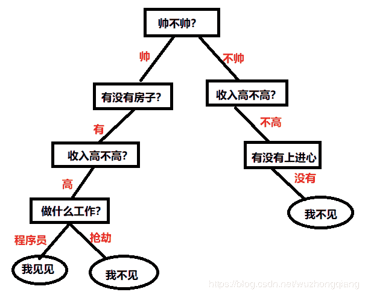这就是棵决策树了，我们在生活中做选择的时候，往往背后都是基于这么一个结构，只不过我们都没有注意罢了。 当然工作原理也就非常简单了，只要有这么一棵树在那，当面对一个新的情况时，我们就不停的这样问，根据回答，就可以最后得出答案了。（比如，女孩可以再心目中根据择偶标准建立一个这样的树，当再有人给推荐对象时，就直接给他这棵树，让他自己比对，然后告诉他：决策树代表我的心。） 但是这个树究竟要怎么构造出来比较好呢， 这个有讲究，不能随便的构造，否则，有可能找不着对象。后面会重点说。好了， 引出了决策树之后，也得说点正经的知识了：

> ★
> 
> *   决策树模型由内部结点和叶子节点构成，内部节点表示特征或者属性，叶子节点表示类标签
>     
>     
>     
> *   决策树分类过程：用决策树分类，从根结点开始，对实例的某一特征进行测试，根据测试结果，将实例分配到其子结点；这时，每一个子结点对应着该特征的一个取值。如此递归地对实例进行测试并分配，直至达到叶结点。最后将实例分到叶结点的类中。
>     
>     
> 
> ”

那么问题来了，究竟如何构造出一个决策树来呢？

# 3\. 决策树的学习（构造）

上面的那种决策树是怎么构造出来的呢？这就是决策树的学习构成，即根据给定的训练数据集构建一个决策树模型，使它能够对实例进行正确的分 类。包括三个过程：**特征选择、决策树生成和决策树剪枝** 。这三个过程分别对应下面的问题：

> ★
> 
> *   我构建决策树的过程中， 这个根节点怎么选择，也就是这个特征要怎么选择？答：当然我们是想去找一个分类效果或者说区分度较大的特征把数据集进行分开。那么这个分类效果或者区分度怎么去衡量？  ---**特征选择问题**
>     
>     
>     
>     
> *   我们构建的时候并不是选择所有的特征进行划分，因为那样的话，每 个叶子节点只对应了一个实例， 这样的结果就是对训练集拟合的非常好，但是泛化能力比较差，容易造成过拟合。所以过拟合问题怎么解决？我们应该分到什么程度的时候就停止，不继续分下去了？    ----  **决策树生成过程中的问题**
>     
>     
>     
>     
> *   假如我们真的生成了一棵决策树了，因为我们是根据训练集进行生成的，事先也不知道它的泛化能力怎么样，万一，我们拿过真的实例来测试，还是过拟合怎么办呢？ ---- **决策树的剪枝问题**
>     
>     
> 
> ”

好了，上面的话是不是又有点官方了啊，并且可能还出现了例如过拟合，泛化能力，剪枝等生词，不要着急，还是以找对象的那个例子来理解这三个问题就是下面这样：

> ★
> 
> *   我的择偶标准里面：帅不帅、有没有房子、工资高不高、有没有上进心等。这些特征里面，要先把哪个作为根节点，对男人进行分类？这就是特征选择问题
>     
>     
> *   如果我选男人的标准分的太细，那么就有可能分出的树，顺着一条标准找下去，那里只对应一个男的。这样的树就不太好了，因为每个男人肯定不是完全一样的啊，如果真有新的男的来了，我根本就对应不到我的标准里面去，那我还怎么选择？ 这就是构建树的时候，建的太细了，过拟合了。标准只适用于特定的人。
>     
>     
> *   那我要是真的建了这样一棵非常细的树之后怎么办？可以从底下进行剪枝，太细的标准去掉，变成叶子节点就行了啊。
>     
>     
> 
> ”

下面就围绕着这三个问题展开了，究竟如何选择特征，又如何生成决策树，生成决策树之后，又如何剪枝。

为了让下面的知识不那么大理论话，我用一个例子来进行展开：假设我又下面打篮球的一个数据集，我应该怎么构造一棵树出来以决定我是否去打篮球呢？

## 3.1 特征选择

就是我们应该怎么去选择特征作为分裂的节点？比如上面这个例子，特征有天气、湿度、温度、刮风，我先考虑哪一个特征进行分裂呢？

解决这个问题之前，得引入三个概念：**纯度、信息熵和信息增益**。不要晕，这么来理解吧，

*   可以把决策树的构造过程理解成为寻找纯净划分的过程。数学上，我们可以用纯度来表示，纯度换一种方式来解释就是让目标变量的分歧最小。这样有利于我们做出决策 这里先举个例子：假设我有三个集合，每个集合6个样本：

> ★
> 
> 1.  集合1：6次都去打篮球
>     
>     
> 2.  集合2：4次去打篮球，2次不去打篮球
>     
>     
> 3.  集合3：3次去打篮球，3次不去打篮球
>     按照纯度指标：集合1 > 集合2 > 集合3。因为集合1的分歧最小，集合3的分歧最大。
>     
>     
> 
> ”

*   信息熵表示了信息的不确定度，理解起来就是衡量一组样本的混乱程度，样本越混乱，越不容易做出决定。计算公式如下：p(i|t) 代表了节点 t 为分类 i 的概率，其中 log2 为取以 2 为底的对数。这里不是来介绍公式的，而是说存在一种度量，它能帮我们反映出来这个信息的不确定度。当不确定性越大时，它所包含的信息量也就越大，信息熵也就越高。只需要举个例子看看怎么算一组样本的信息熵：假设我有两个集合：

> ★
> 
> *   集合1：5次去打篮球，1次不去打篮球
>     
>     
> *   集合2：3次去打篮球，3次不去打篮球
>     在集合 1 中，有 6 次决策，其中打篮球是 5 次，不打篮球是 1 次。那么假设：类别 1 为“打篮球”，即次数为 5；类别 2 为“不打篮球”，即次数为 1。那么节点划分为类别 1 的概率是 5/6，为类别 2 的概率是 1/6，带入上述信息熵公式可以计算得出：同样，集合 2 中，也是一共 6 次决策，其中类别 1 中“打篮球”的次数是 3，类别 2“不打篮球”的次数也是 3，那么信息熵为多少呢？我们可以计算得出：从上面的计算结果中可以看出，信息熵越大，纯度越低。当集合中的所有样本均匀混合时，信息熵最大，纯度最低。这时候也最难做出决定。
>     
>     
> 
> ”

那我们应该怎么办呢？ 其实用特征对样本进行划分之后，会让**混乱程度减小，就是熵变小，纯度变高**，简单理解起来就是你分类了啊。

> ★
> 
> 一开始，比如3次打篮球，3次不打，没法做判断，但是如果用刮风这个特征来划分一下子，相当于有了一个条件，这时候，可能刮风的条件下，有2次不打篮球，1次打篮球， 这不就纯度提高了，有利于做出决策了，不去打。
> 
> ”

这时候我们解决了如何选择特征的一个问题，就是我给定一个条件，如果使我的样本纯度增加的最高，也就是更利于我做出选择，那么我就选这个作为分裂节点。 但是又有一个问题， 怎么衡量这个纯度提高了多少呢？

*   信息增益就是其中的一种方式，在得知特征X的信息后，而使得类Y的信息的不确定性减少的程度。计算公式如下：即划分之前的信息熵与给定一个特征a划分样本之后的信息熵之差，就是特征a带来的信息增益。好吧，公式可能说的有点晕，我们看看怎么计算就可以啦， 就拿上面的那个例子，我把图片放到这里来：看看上面每个特征信息增益应该怎么算：

> ★
> 
> 1.  首先，应该先算信息熵 根据信息熵的公式，7个样本，4个否，3个是，则信息熵：
>     
>     
> 2.  分别计算每个特征的条件熵（就是划分之后的混乱度） 首先将天气作为属性的划分，会有三个叶子节点 D1、D2 和 D3，分别对应的是晴天、阴天和小雨。我们用 + 代表去打篮球，- 代表不去打篮球。那么第一条记录，晴天不去打篮球，可以记为 1-，于是我们可以用下面的方式来记录 D1，D2，D3：分别计算三个叶子节点的信息熵如下：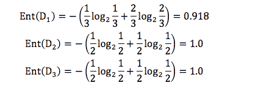
>     
>     
> 3.  计算特征的信息增益 还是拿天气这个特征，最后的信息增益就是：Gain（D,天气） = Ent(D) - 3/7Ent(D1) - 2/7Ent(D2) - 2/7Ent(D3) = 0.02
>     
>     
> 
> ”

如果不好理解上面的过程，我还画了个图理解：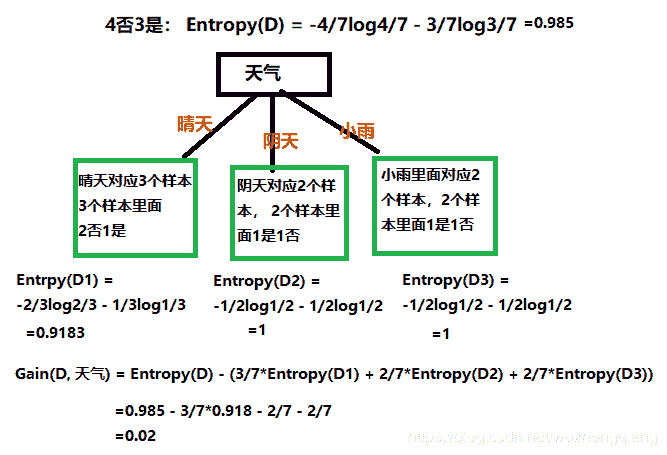根据上面的这个思路，我们就可以分别计算湿度，温度，刮风的信息增益如下：

*   Gain(D，天气) = 0.02

*   Gain(D , 温度)=0.128（这个最大）

*   Gain(D , 湿度)=0.020

*   Gain(D , 刮风)=0.020

可以看出来，温度作为属性的信息增益最大，所以，先以这个为节点，划分样本。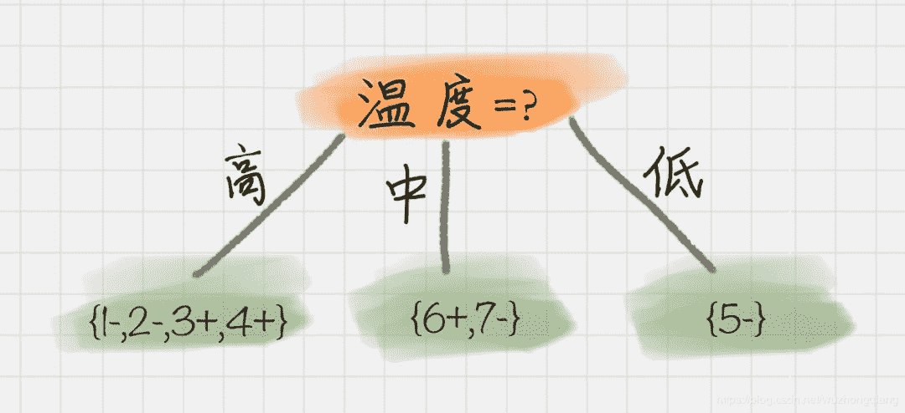然后我们要将上图中第一个叶节点，也就是 D1={1-,2-,3+,4+}进一步进行分裂，往下划分，计算其不同属性（天气、湿度、刮风）作为节点的信息增益，可以得到：

*   Gain(D , 湿度)=1

*   Gain(D , 天气)=1

*   Gain(D , 刮风)=0.3115

我们能看到湿度，或者天气为 D1 的节点都可以得到最大的信息增益，这里我们选取湿度作为节点的属性划分。同理，我们可以按照上面的计算步骤得到完整的决策树，结果如下：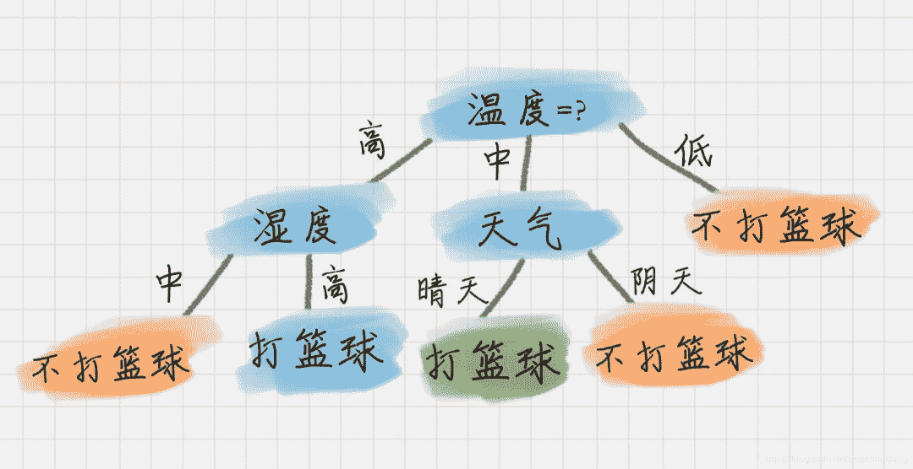

这样，如果有小伙伴再叫我去打篮球的话，就会有下面的对话：

> ★
> 
> 我：今天的温度怎么样？小伙伴：今天的温度适中 我：今天的天气怎么样？小伙伴：今天的天气晴天 我：Go Play！
> 
> ”

这样，打不打篮球，决策树来告诉你。

## 3.2 决策树的生成

决策树的构造过程可以理解成为寻找纯净划分的过程。而衡量不纯度的指标有三种，而每一种不纯度对应一种决策树的生成算法：

*   上面给出的信息增益（ID3算法，其实上面的构造决策树的步骤就是著名的ID3算法）

*   信息增益比（C4.5算法）

*   基尼指数（CART算法）

后面第三大块，会详细介绍。

## 3.3 决策树的剪枝

而关于剪枝，在这里不讲太多，因为有点难理解，这里只是简单的介绍一下，顺带着说一下之前提到的生词：过拟合，欠拟合，泛化能力等。想学习详细步骤的可以参考下面给出的笔记参考《统计学习方法之决策树》 《西瓜书之决策树》。

> ★
> 
> 决策树构造出来之后是不是就万事大吉了呢？也不尽然，我们可能还需要对决策树进行剪枝。剪枝就是给决策树瘦身，这一步想实现的目标就是，不需要太多的判断，同样可以得到不错的结果。之所以这么做，是为了防止“过拟合”（Overfitting）现象的发生。
> **过拟合**这个概念你一定要理解，它指的就是模型的训练结果“太好了”，以至于在实际应用的过程中，会存在“死板”的情况，导致分类错误。
> **欠拟合**，和过拟合就好比是下面这张图中的第一个和第三个情况一样，训练的结果“太好“，反而在实际应用过程中会导致分类错误。造成过拟合的原因之一就是因为训练集中样本量较小。如果决策树选择的属性过多，构造出来的决策树一定能够“完美”地把训练集中的样本分类，但是这样就会把训练集中一些数据的特点当成所有数据的特点，但这个特点不一定是全部数据的特点，这就使得这个决策树在真实的数据分类中出现错误，也就是模型的“泛化能力”差。
> **泛化能力**指的分类器是通过训练集抽象出来的分类能力，你也可以理解是举一反三的能力。如果我们太依赖于训练集的数据，那么得到的决策树容错率就会比较低，泛化能力差。因为训练集只是全部数据的抽样，并不能体现全部数据的特点。
> 
> ”

既然要对决策树进行剪枝，具体有哪些方法呢？一般来说，剪枝可以分为“预剪枝”（Pre-Pruning）和“后剪枝”（Post-Pruning）。

*   预剪枝是在决策树构造时就进行剪枝。方法是在构造的过程中对节点进行评估，如果对某个节点进行划分，在验证集中不能带来准确性的提升，那么对这个节点进行划分就没有意义，这时就会把当前节点作为叶节点，不对其进行划分。

*   后剪枝就是在生成决策树之后再进行剪枝，通常会从决策树的叶节点开始，逐层向上对每个节点进行评估。如果剪掉这个节点子树，与保留该节点子树在分类准确性上差别不大，或者剪掉该节点子树，能在验证集中带来准确性的提升，那么就可以把该节点子树进行剪枝。方法是：用这个节点子树的叶子节点来替代该节点，类标记为这个节点子树中最频繁的那个类。

# 4\. 决策树的生成算法

## 4.1 ID3算法

这个算法就不多介绍了，上面的决策树生成过程就是用的ID3算法，为了白话一点，这里不给出算法的步骤，具体的看统计学习方法里面的算法步骤（包括什么时候应该结束，这里没给出），这里只需要记住，ID3算法计算的是**信息增益**。
ID3 的算法规则相对简单，可解释性强。同样也存在缺陷，比如我们会发现 ID3 算法倾向于选择取值比较多的属性。

> ★
> 
> 假设我们把样本编号也作为一种属性的话，那么有多少样本，就会对应多少个分支，每一个分支只有一个实例，这时候每一个分支上Entropy(Di)=0，没有混乱度，显然这时候Gain(D,编号) = Entropy(D) - 0 。显然是最大的，那么按照ID3算法的话，会选择这个编号当做第一个分裂点。
> 我们知道，编号这个属性显然是对我们做选择来说没有意义的，出现过拟合不说，编号这个属性对分类任务作用根本就不大。所以这就是ID3算法存在的一个不足之处。
> 
> ”

这种缺陷不是每次都会发生，只是存在一定的概率。在大部分情况下，ID3 都能生成不错的决策树分类。针对可能发生的缺陷，后人提出了新的算法进行改进。

## 4.2 在 ID3 算法上进行改进的 C4.5 算法

那么 C4.5 都在哪些方面改进了 ID3 呢？

1.  **采用信息增益比**因为 ID3 在计算的时候，倾向于选择取值多的属性。为了避免这个问题，C4.5 采用信息增益率的方式来选择属性。

> ★
> 
> **定义(信息增益比）**：特征A对训练数据集D的信息增益比gR(D,A)定义为其信息增益g(D,A)与训练数据集D在特征A的划分下数据集本身的一个混乱程度(熵）HA(D)：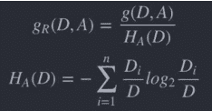比如我下面这个编号的属性，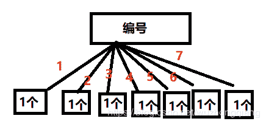HA(D) = -1/7log1/7 * 7 = -log1/7 也就是说类别越多，混乱程度越大，这时候信息增益比也会减小
> 
> ”

当属性有很多值的时候，相当于被划分成了许多份，虽然信息增益变大了，但是对于 C4.5 来说，属性熵也会变大，所以整体的信息增益率并不大。上面那个例子，如果用C4.5算法的话，天气属性的信息增益比：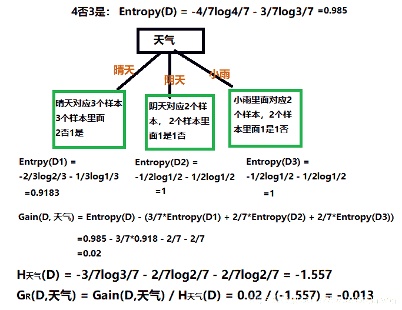

1.  **采用悲观剪枝**ID3 构造决策树的时候，容易产生过拟合的情况。在 C4.5 中，会在决策树构造之后采用悲观剪枝（PEP），这样可以提升决策树的泛化能力。悲观剪枝是后剪枝技术中的一种，通过递归估算每个内部节点的分类错误率，比较剪枝前后这个节点的分类错误率来决定是否对其进行剪枝。这种剪枝方法不再需要一个单独的测试数据集。

2.  **离散化处理连续属性**C4.5 可以处理连续属性的情况，对连续的属性进行离散化的处理。比如打篮球存在的“湿度”属性，不按照“高、中”划分，而是按照湿度值进行计算，那么湿度取什么值都有可能。该怎么选择这个阈值呢，**C4.5 选择具有最高信息增益的划分所对应的阈值。**

3.  **处理缺失值**针对数据集不完整的情况，C4.5 也可以进行处理。假如我们得到的是如下的数据，你会发现这个数据中存在两点问题。

*   第一个问题是，数据集中存在数值缺失的情况，如何进行属性选择？

*   第二个问题是，假设已经做了属性划分，但是样本在这个属性上有缺失值，该如何对样本进行划分？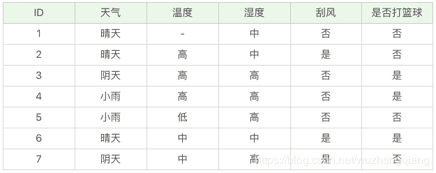我们不考虑缺失的数值，可以得到温度 D={2-,3+,4+,5-,6+,7-}。温度 = 高：D1={2-,3+,4+} ；温度 = 中：D2={6+,7-}；温度 = 低：D3={5-} 。这里 + 号代表打篮球，- 号代表不打篮球。比如 ID=2 时，决策是不打篮球，我们可以记录为 2-。
    针对将属性选择为温度的信息增为：Gain(D′, 温度)=Ent(D′)-0.792=1.0-0.792=0.208 属性熵 =1.459, 信息增益率 Gain_ratio(D′, 温度)=0.208/1.459=0.1426。
    D′的样本个数为 6，而 D 的样本个数为 7，所以所占权重比例为 6/7，所以 Gain(D′，温度) 所占权重比例为 6/7，所以：

> ★
> 
> Gain_ratio(D, 温度)=6/7*0.1426=0.122。
> 这样即使在温度属性的数值有缺失的情况下，我们依然可以计算信息增益，并对属性进行选择。
> 
> ”

而对于上面的第二个问题，需要考虑权重。具体的参考《西瓜书之决策树》 这里只给出答案：

*   针对问题一， 就是假如有些样本在某个属性上存在值缺失，那么我计算信息增益的时候，我不考虑这些样本就可以了。但用了多少样本，要在不考虑带缺失值样本的前提下计算的信息增益的基础上，乘以一个权重。

*   针对问题二，如果出现样本在该属性上的值缺失， 则把该样本划分到所有的分支里面，但是权重不一样（这个权重就是每个分支里的节点个数占的总数比例），这样，如果再往下划分属性，对于该样本来说，算条件熵的时候，得考虑上他本身的一个权重了。

## 4.3 CART算法

CART 算法，英文全称叫做 Classification And Regression Tree，中文叫做分类回归树。ID3 和 C4.5 算法可以生成二叉树或多叉树，而 CART 只支持二叉树。同时 CART 决策树比较特殊，既可以作分类树，又可以作回归树。

首先，得先知道什么是分类树，什么是回归树？

我用下面的训练数据举个例子，你能看到不同职业的人，他们的年龄不同，学习时间也不同。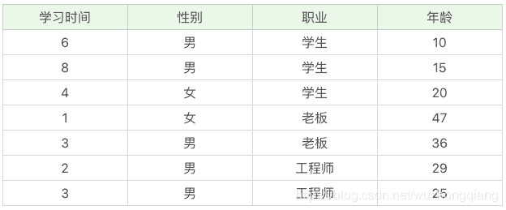

*   如果我构造了一棵决策树，想要基于数据判断这个人的职业身份，这个就属于分类树，因为是从几个分类中来做选择。分类树可以处理离散数据，也就是数据种类有限的数据，它输出的是样本的类别

*   如果是给定了数据，想要预测这个人的年龄，那就属于回归树。回归树可以对连续型的数值进行预测，也就是数据在某个区间内都有取值的可能，它输出的是一个数值。

### 4.3.1 CART分类树的工作流程

我们通过上面已经知道决策树的核心就是寻找纯净的划分，因此引入了纯度的概念。
在属性选择上，我们是通过统计“不纯度”来做判断的，ID3 是基于信息增益做判断，C4.5 在 ID3 的基础上做了改进，提出了信息增益率的概念。
实际上 CART 分类树与 C4.5 算法类似，只是属性选择的指标采用的是**基尼系数**。

对，这里又出现了一个新的概念，不要晕，这个东西本身反应了样本的不确定度，当基尼系数越小的时候，说明样本之间的差异性小，不确定程度低。这一点和熵的定义类似。

> ★
> 
> 你可能在经济学中听过说基尼系数，它是用来衡量一个国家收入差距的常用指标。当基尼系数大于 0.4 的时候，说明财富差异悬殊。基尼系数在 0.2-0.4 之间说明分配合理，财富差距不大。
> 
> ”

分类的过程本身是一个不确定度降低的过程，即纯度的提升过程。所以 CART 算法在构造分类树的时候，会选择基尼系数最小的属性作为属性的划分。

下面给出基尼指数的计算公式：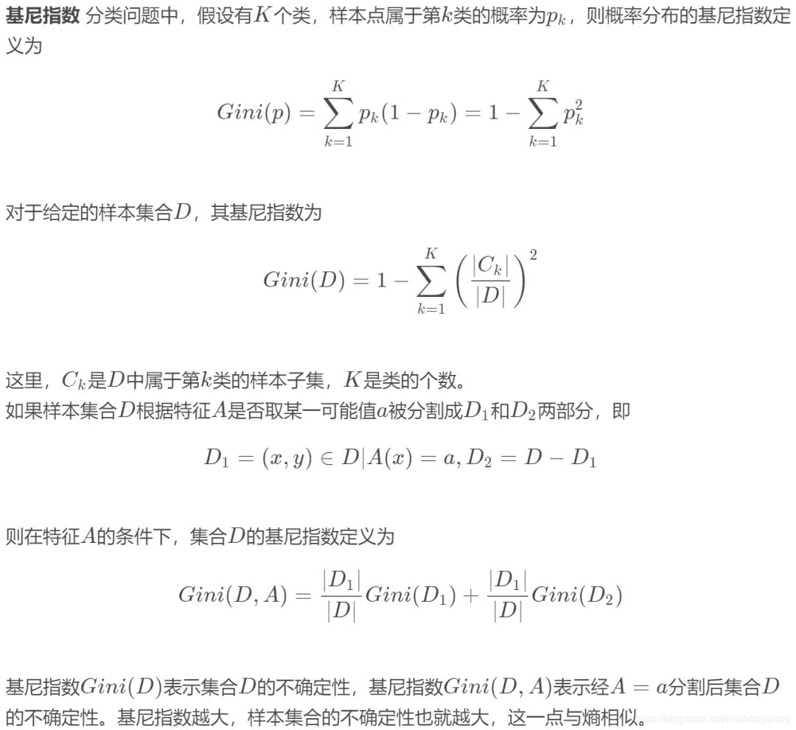

*   由于CART算法中，只把类别分为两类，所以K=2，二分类问题概率表示：              p1(1-p1) + p2(1-p2)

*   我们看看这个基尼指数表示的是什么：其实和信息增益一样， 也是数据集的混乱程度只不过这里换了一表示方法。看看怎么算：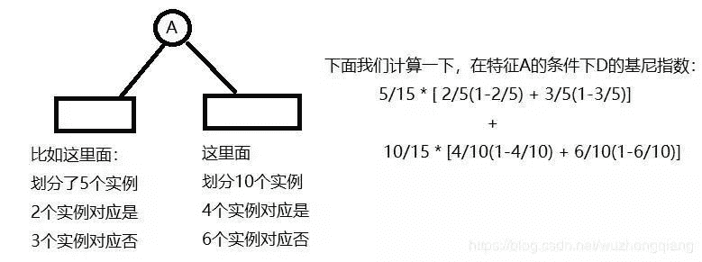这样，我们在选择特征的时候，就可以根据基尼指数最小来选择特征了。不用考虑HA(D),也就是不用考虑D在A的划分之下本身样本的一个混乱程度了。因为每次都分两个叉，不用担心叉太多影响结果了。

根据这个，回归打篮球的例子，假设属性 A 将节点 D 划分成了 D1 和 D2，如下图所示：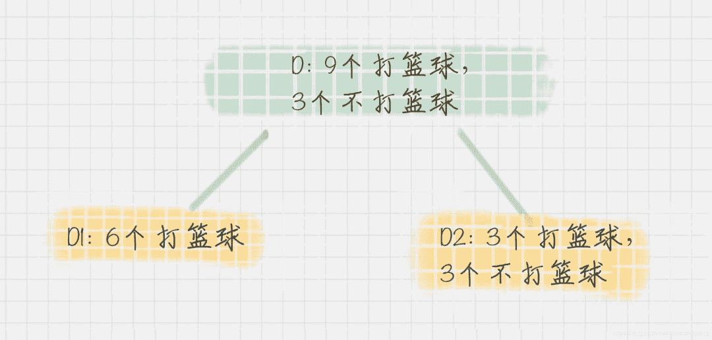这时候，计算出D1和D2的基尼指数：

> ★
> 
> GINI(D1)=1-1=0 GINI(D2)=1-（0.5*0.5+0.5*0.5）=0.5
> 在属性A的划分下，节点D的基尼指数为：
> 
> ”

这样，就可以分别计算其他属性的基尼指数，然后进行划分了。具体的例子，看《统计学习方法之决策树》

### 4.3.2 如何使用CART算法来创建分类树

上面已经知道了CART算法是基于基尼指数来做属性划分的。但是具体实现，我们可以使用写好的代码，调用sklearn包来实现就好了。

Python 的 sklearn 中，如果我们想要创建 CART 分类树，可以直接使用 DecisionTreeClassifier 这个类。创建这个类的时候，默认情况下 criterion 这个参数等于 gini，也就是按照基尼系数来选择属性划分，即默认采用的是 CART 分类树。

下面，我们来用 CART 分类树，给 iris 数据集构造一棵分类决策树。iris 这个数据集，我在 Python 可视化中讲到过，实际上在 sklearn 中也自带了这个数据集。基于 iris 数据集，构造 CART 分类树的代码如下：

```
# encoding=utf-8
from sklearn.model_selection import train_test_split
from sklearn.metrics import accuracy_score
from sklearn.tree import DecisionTreeClassifier
from sklearn.datasets import load_iris
# 准备数据集
iris=load_iris()
# 获取特征集和分类标识
features = iris.data
labels = iris.target
# 随机抽取33%的数据作为测试集，其余为训练集
train_features, test_features, train_labels, test_labels = train_test_split(features, labels, test_size=0.33, random_state=0)
# 创建CART分类树
clf = DecisionTreeClassifier(criterion='gini')
# 拟合构造CART分类树
clf = clf.fit(train_features, train_labels)
# 用CART分类树做预测
test_predict = clf.predict(test_features)
# 预测结果与测试集结果作比对
score = accuracy_score(test_labels, test_predict)
print("CART分类树准确率 %.4lf" % score) 
```

运行结果：

```
CART分类树准确率 0.9600 
```

如果我们把决策树画出来，可以得到下面的图示：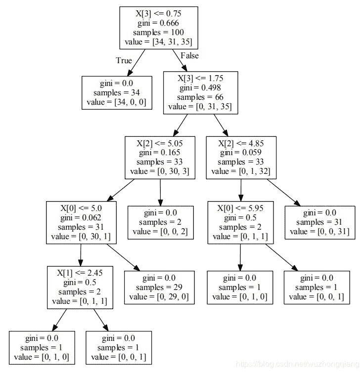涉及到代码了，简单说一下上面的代码：

> ★
> 
> 首先 train_test_split 可以帮助我们把数据集抽取一部分作为测试集，这样我们就可以得到训练集和测试集。
> 使用 clf = DecisionTreeClassifier(criterion=‘gini’) 初始化一棵 CART 分类树。这样你就可以对 CART 分类树进行训练。
> 使用 clf.fit(train_features, train_labels) 函数，将训练集的特征值和分类标识作为参数进行拟合，得到 CART 分类树。
> 使用 clf.predict(test_features) 函数进行预测，传入测试集的特征值，可以得到测试结果 test_predict。
> 最后使用 accuracy_score(test_labels, test_predict) 函数，传入测试集的预测结果与实际的结果作为参数，得到准确率 score。
> 
> ”

我们能看到 sklearn 帮我们做了 CART 分类树的使用封装，使用起来还是很方便的。

### 4.3.3 CART回归树的流程

CART 回归树划分数据集的过程和分类树的过程是一样的，只是回归树得到的预测结果是连续值，而且评判“不纯度”的指标不同。

在 CART 分类树中采用的是基尼系数作为标准，那么在 CART 回归树中，如何评价“不纯度”呢？实际上我们要根据样本的混乱程度，也就是样本的离散程度来评价“不纯度”。

样本的离散程度具体的计算方式是，先计算所有样本的均值，然后计算每个样本值到均值的差值。我们假设 x 为样本的个体，均值为 u。为了统计样本的离散程度，我们可以取差值的绝对值，或者方差。

其中差值的绝对值为样本值减去样本均值的绝对值：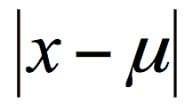方差为每个样本值减去样本均值的平方和除以样本个数：

所以这两种节点划分的标准，分别对应着两种目标函数最优化的标准，即用最小绝对偏差（LAD），或者使用最小二乘偏差（LSD）。这两种方式都可以让我们找到节点划分的方法，通常使用最小二乘偏差的情况更常见一些。

我们可以通过一个例子来看下如何创建一棵 CART 回归树来做预测。如何使用 CART 回归树做预测。

这里我们使用到 sklearn 自带的波士顿房价数据集，该数据集给出了影响房价的一些指标，比如犯罪率，房产税等，最后给出了房价。根据这些指标，我们使用 CART 回归树对波士顿房价进行预测，代码如下：

```
# encoding=utf-8
from sklearn.metrics import mean_squared_error
from sklearn.model_selection import train_test_split
from sklearn.datasets import load_boston
from sklearn.metrics import r2_score,mean_absolute_error,mean_squared_error
from sklearn.tree import DecisionTreeRegressor
# 准备数据集
boston=load_boston()
# 探索数据
print(boston.feature_names)
# 获取特征集和房价
features = boston.data
prices = boston.target
# 随机抽取33%的数据作为测试集，其余为训练集
train_features, test_features, train_price, test_price = train_test_split(features, prices, test_size=0.33)
# 创建CART回归树
dtr=DecisionTreeRegressor()
# 拟合构造CART回归树
dtr.fit(train_features, train_price)
# 预测测试集中的房价
predict_price = dtr.predict(test_features)
# 测试集的结果评价
print('回归树二乘偏差均值:', mean_squared_error(test_price, predict_price))
print('回归树绝对值偏差均值:', mean_absolute_error(test_price, predict_price)) 
```

运行结果（每次运行结果可能会有不同）：

```
['CRIM' 'ZN' 'INDUS' 'CHAS' 'NOX' 'RM' 'AGE' 'DIS' 'RAD' 'TAX' 'PTRATIO' 'B' 'LSTAT']
回归树二乘偏差均值: 23.80784431137724
回归树绝对值偏差均值: 3.040119760479042 
```

> ★
> 
> 我们来看下这个例子，首先加载了波士顿房价数据集，得到特征集和房价。
> 然后通过 train_test_split 帮助我们把数据集抽取一部分作为测试集，其余作为训练集。
> 使用 dtr=DecisionTreeRegressor() 初始化一棵 CART 回归树。
> 使用 dtr.fit(train_features, train_price) 函数，将训练集的特征值和结果作为参数进行拟合，得到 CART 回归树。
> 使用 dtr.predict(test_features) 函数进行预测，传入测试集的特征值，可以得到预测结果 predict_price。
> 最后我们可以求得这棵回归树的二乘偏差均值，以及绝对值偏差均值。
> 
> ”

我们能看到 CART 回归树的使用和分类树类似，只是最后求得的预测值是个连续值。

# 5\. 决策树的代码底层实现

构造决策树时， 需要解决的第一个问题就是，当前数据集上的哪个特征在划分数据集时起到决定 作用， 需要找到这样的特征，把原始数据集划分为几个数据子集， 然后再在剩余的特征里面进 一步划分，依次进行下去， 所以分下面几个步骤：

## 5.1 计算给定数据的香农熵

```
def calcShannonEnt(dataset):
    numEntries = len(dataset)     # 样本数量
    labelCounts = {}
    for featVec in dataset:
        currentLabel = featVec[-1]         # 遍历每个样本，获取标签
        if currentLabel not in labelCounts.keys():
            labelCounts[currentLabel] = 0
        labelCounts[currentLabel] += 1

    shannonEnt = 0.0
    for key in labelCounts:
        prob = float(labelCounts[key]) / numEntries
        shannonEnt -= prob * math.log(prob, 2)

    return shannonEnt 
```

## 5.2  按照给定的特征划分数据

```
# 按照给定特征划分数据集
def splitDataSet(dataset, axis, value):
    retDataSet = []
    for featVec in dataset:
        if featVec[axis] == value:
            reducedFeatVec = featVec[:axis]
            reducedFeatVec.extend(featVec[axis+1:])
            retDataSet.append(reducedFeatVec)
    return retDataSet 
```

## 5.3  选择最好的数据集划分数据

```
def chooseBestFeatureToSplit(dataSet):
    numFeatures = len(dataSet[0]) - 1   # 获取总的特征数
    baseEntropy = calcShannonEnt(dataSet)
    bestInfoGain = 0.0
    bestFeature = -1

    # 下面开始变量所有特征， 对于每个特征，要遍历所有样本， 根据遍历的样本划分开数据集，然后计算新的香农熵
    for i in range(numFeatures):
        featList = [example[i] for example in  dataSet]   #  获取遍历特征的这一列数据，接下来进行划分
        uniqueVals = set(featList)              # 从列表中创建集合是Python语言得到唯一元素值的最快方法
        newEntropy = 0.0
        for value in uniqueVals:
            subDataSet = splitDataSet(dataSet, i, value)
            prob = len(subDataSet) / float(len(dataSet))
            newEntropy += prob * calcShannonEnt(subDataSet)
        infoGain = baseEntropy - newEntropy
        if (infoGain > bestInfoGain):
            bastInfoGain = infoGain
            bestFeature = i

    return bestFeature 
```

## 5.4 递归的创建决策树

```
 # 返回最多的那个标签
def majorityCnt(classList):
    classCount = {}
    for vote in classList:
        if vote not in classCount.keys():
            classCount[vote] = 0
            classCount[vote] += 1
    sortedClassCount = sorted(classCount.values(), reverse=True)

    return sortedClassCount[0]

# 递归构建决策树
def createTree(dataSet, labels):
    classList = [example[-1] for example in dataSet]
    if classList.count(classList[0]) == len(classList):   # 类别完全相同则停止划分 这种 (1,2,'yes') (3,4,'yes')
        return classList[0]
    if len(dataSet[0]) == 1:          # 遍历所有特征时，(1, 'yes') (2, 'no')这种形式 返回出现次数最多的类别
        return majorityCnt(classList)

    bestFeat = chooseBestFeatureToSplit(dataSet)    # 选择最好的数据集划分方式,返回的是最好特征的下标
    bestFeatLabel = labels[bestFeat]         # 获取到那个最好的特征
    myTree = {bestFeatLabel:{}}        # 创建一个myTree,保存创建的树的信息
    del(labels[bestFeat])          # 从标签中药删除这个选出的最好的特征，下一轮就不用这个特征了
    featValues = [example[bestFeat] for example in dataSet]    # 获取到选择的最好的特征的所有取值
    uniqueVals = set(featValues)
    for value in uniqueVals:
        subLabels = labels[:]
        myTree[bestFeatLabel][value] = createTree(splitDataSet(dataSet, bestFeat, value), subLabels)  # 这是个字典嵌套字典的形式

    return myTree 
```

这就是ID3算法的底层代码。

可以参考隐形眼镜分类的这个项目：https://github.com/zhongqiangwu960812/MLProjects/tree/master/MachineLearningInAction/DecisionTree

# 6\. 决策树Sklearn实战

不知不觉，篇幅有点超过想像，所以这里没法详细的介绍Sklearn中的决策树对Titanic尼克号人的生存预测，那么就先简单的介绍一下Sklearn中决策树怎么用，然后实战项目参考后面的链接吧。

## 6.1 sklearn 中的决策树模型

首先，我们需要掌握 sklearn 中自带的决策树分类器 DecisionTreeClassifier，方法如下：

```
clf = DecisionTreeClassifier(criterion='entropy') 
```

到目前为止，sklearn 中只实现了 ID3 与 CART 决策树，所以我们暂时只能使用这两种决策树，在构造 DecisionTreeClassifier 类时，其中有一个参数是 criterion，意为标准。它决定了构造的分类树是采用 ID3 分类树，还是 CART 分类树，对应的取值分别是 entropy 或者 gini：

*   entropy: 基于信息熵，也就是 ID3 算法，实际结果与 C4.5 相差不大；

*   gini：默认参数，基于基尼系数。CART 算法是基于基尼系数做属性划分的，所以 criterion=gini 时，实际上执行的是 CART 算法。

我们通过设置 criterion='entropy’可以创建一个 ID3 决策树分类器，然后打印下 clf，看下决策树在 sklearn 中是个什么东西？

```
DecisionTreeClassifier(class_weight=None, criterion='entropy', max_depth=None,
            max_features=None, max_leaf_nodes=None,
            min_impurity_decrease=0.0, min_impurity_split=None,
            min_samples_leaf=1, min_samples_split=2,
            min_weight_fraction_leaf=0.0, presort=False, random_state=None,
            splitter='best') 
```

这里我们看到了很多参数，除了设置 criterion 采用不同的决策树算法外，一般建议使用默认的参数，默认参数不会限制决策树的最大深度，不限制叶子节点数，认为所有分类的权重都相等等。当然你也可以调整这些参数，来创建不同的决策树模型。

这些参数代表的含义如下：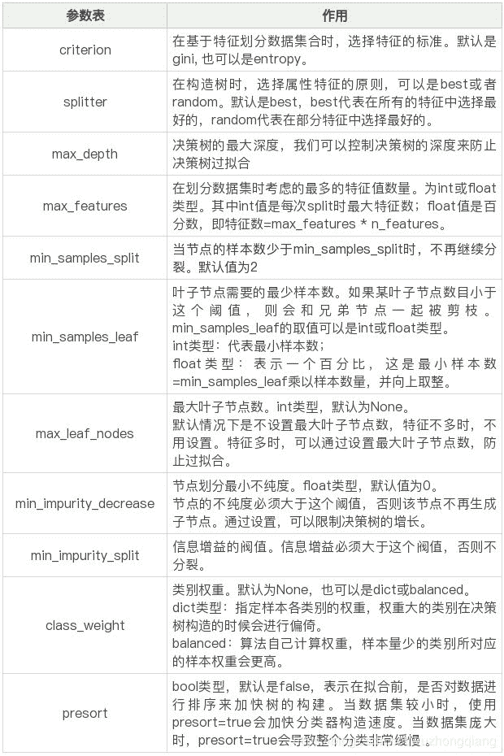在构造决策树分类器后，我们可以使用 fit 方法让分类器进行拟合，使用 predict 方法对新数据进行预测，得到预测的分类结果，也可以使用 score 方法得到分类器的准确率。

下面这个表格是 fit 方法、predict 方法和 score 方法的作用。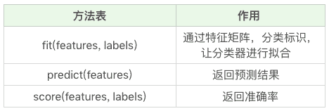

## 6.2 Titanic 乘客生存预测

这个具体的看后面的参考笔记吧，有点多。

# 7\. 总结

花费了一天的时间，才整理完了白话机器学习算法第一篇决策树，虽然说白话，但是难免会有代码和公式，但这些都是必须要知道的，也是基础。后面的项目实战应该好好练练，因为光有理论，可能很快就会忘记了，所以得多练。

**参考：**

*   http://note.youdao.com/noteshare?id=d7c88adb49a4500a18a1b9662a8fd0dd&sub=EDFC5B4E5196440381D46261A2BCB99D

*   http://note.youdao.com/noteshare?id=5db5352df6b3e5130cff7c508658ee2d&sub=3A5B312A580948D0816313FD45B8E899

*   http://note.youdao.com/noteshare?id=3caf31ca2b3bae95b38ae25e35f37787&sub=F983373BBC064EBFB4DCC656535FB6D5

*   http://note.youdao.com/noteshare?id=cff65e21bd4bd9c21206608edec65f9f&sub=45E434F63B5341F7BC2AD1DF7E5FA6F4

*   https://blog.csdn.net/c406495762/article/details/76262487

*   https://blog.csdn.net/c406495762/article/details/75663451

```
AI学习路线和优质资源，在后台回复"AI"获取 
```