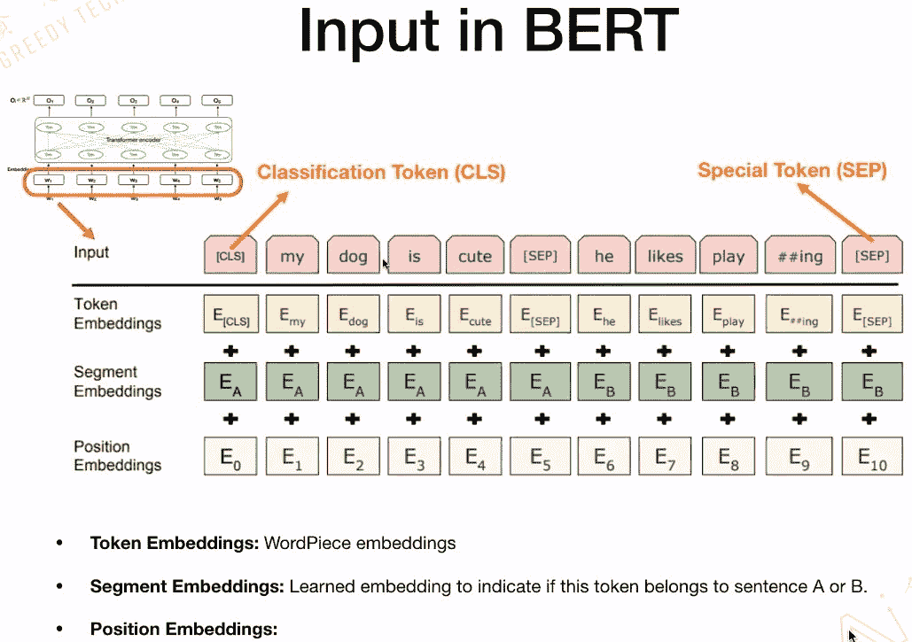
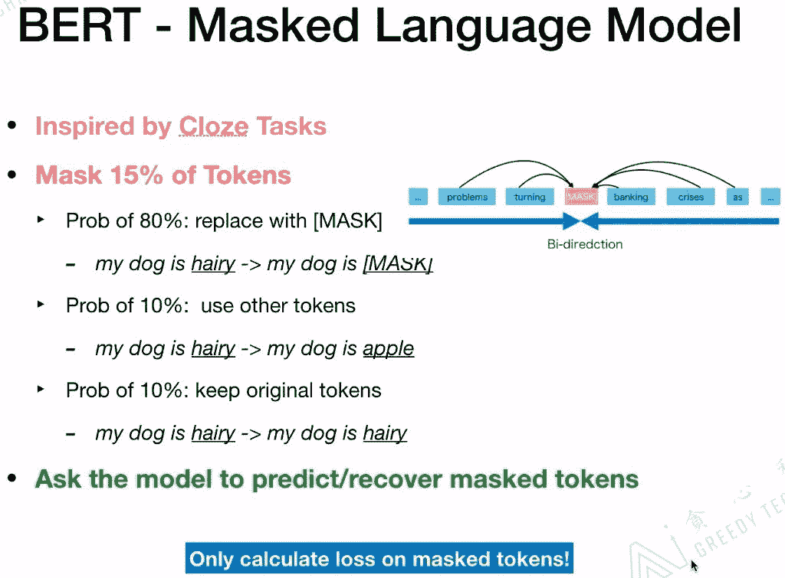
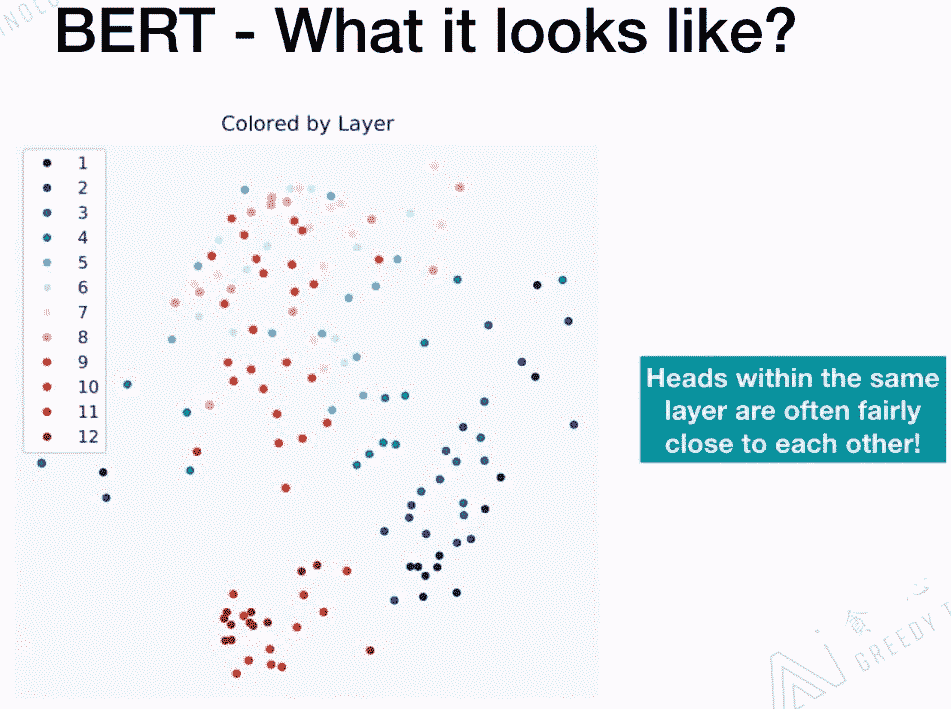

> **目录：**
> 
> 1.  ELMo与Transformer的简单回顾
>     
>     
> 2.  DAE与Masked Language Model
>     
>     
> 3.  BERT模型详解
>     
>     
> 4.  BERT模型的不同训练方法
>     
>     
> 5.  如何把BERT模型应用在实际项目中
>     
>     
> 6.  如何对BERT减肥
>     
>     
> 7.  BERT存在的问题

# 1\. ELMo与Transformer的简单回顾

## 1.1 一词多义

## 1.2 ELMo

ELMo是一个语言模型，主要是做给定文本的Context，预测下一个词。ELMo最重要的一个特点是部分解决了一词多义的情况，没有完全解决哟！它为解决一词多义提供了一个很好的解决方案。像word2vec、glove提供的embedding是静态的，一旦训练完成embedding是不变的。而ELMo其实考虑更多的是Context的信息，对每一个词会给出3个embedding，这3个embedding可以看作是一个词的3个embedding特征，对3个embedding特征会添加三个位置，对于不同的任务会赋予不同的权重，最后根据权重把这三个embedding结合起来做向量平均，把合并后的embedding作为最后词的embedding。

ELMo用的是long contexts信息，而不是其他模型用到的window size contexts信息。ELMo用到的是Bi-LSTM，如果ELMo换成Transformer那就和BERT结构基本一样了。

## 1.3 Transformer

**LSTM和Transformer的区别：**

*   基于RNN的LSTM训练是迭代的，当前这个字进入完LSTM单元后才能输入下一个字，是一个串行的过程。

*   Transformer的训练是并行的，它是所有的字都可以同时并行训练，大大的加快了计算效率。而且Transformer加入了位置嵌入，帮助模型理解语言的顺序。使用Self-Attention和全连接层来计算是Transformer的一个基本结构。

Transformer中最重要的就是Multi-Head Attention。

Transformer中Encoder的五个核心部分如下图：

Skip connections：反向传播的时候，防止梯度消失的问题。

# 2\. DAE与Masked Language Model

## 2.1 什么是DAE与Masked Language Model

随着一些奇怪的高维数据出现，比如图像、语音，传统的统计学-机器学习方法遇到了前所未有的挑战。数据维度过高，数据单调，噪声分布广，传统的特征工程很难奏效。

为了解决高维度的问题，出现的线性学习的PCA降维方法，PCA的数学理论确实无懈可击，但是却只对线性数据效果比较好。于是，寻求简单的、自动的、智能的特征提取方法仍然是机器学习的研究重点。

于是，CNN另辟蹊径，利用卷积、降采样两大手段从信号数据的特点上很好的提取出了特征。对于一般非信号数据，该怎么办呢？

研究者提出了自动编码器（AutoEncoder），自动编码器基于这样一个事实：原始input（设为   ）经过加权（  <svg xmlns="http://www.w3.org/2000/svg" viewBox="0 -750 3042.9 950" style="vertical-align: -0.452ex;width: 6.884ex;height: 2.149ex;"><g stroke="currentColor" fill="currentColor" stroke-width="0" transform="matrix(1 0 0 -1 0 0)"><g><g transform="translate(1325.8, 0)">、</g></g></g></svg>  ）、映射（Sigmoid）之后得到   ，再对   反向加权映射回来成为   。网络结构如下图：

自动编码器的过程很有趣，首先，它没有使用数据标签来计算误差update参数，所以是无监督学习。其次，利用类似神经网络的双隐层的方式，简单粗暴地提取了样本的特征。

为了缓解经典AutoEncoder容易过拟合的问题，一个办法是在输入中加入随机噪声，所以Vincent在2008年的论文《Extracting and Composing Robust Features with Denoising Autoencoders》中提出了AutoEncoder的改良版Denoising AutoEncoder（DAE）。

怎么才能使特征很鲁棒呢？就是以一定概率分布（通常使用二项分布）去擦除原始input矩阵，即每个值都随机置0,  这样看起来部分数据的部分特征是丢失了。以这丢失的数据   去计算   ，计算    ，并将    与原始   做误差迭代，这样，网络就学习了这个破损（Corruputed）的数据。网络结构如下图：

这个破损的数据是很有用的，原因有二：

*   **通过与非破损数据训练的对比，破损数据训练出来的Weight噪声比较小。** 降噪因此得名。原因不难理解，因为擦除的时候不小心把输入噪声给擦掉了。

*   **破损数据一定程度上减轻了训练数据与测试数据的代沟。** 由于数据的部分被擦掉了，因而这破损数据一定程度上比较接近测试数据。（训练、测试肯定有同有异，当然我们要求同舍异）。这样训练出来的Weight的鲁棒性就提高了。

## 2.2 BERT与DAE、Masked Language Model的关系

BERT是一种基于Transformer Encoder来构建的一种模型，它整个的架构其实是基于DAE（Denoising Autoencoder，去噪自编码器）的，这部分在BERT文章里叫作Masked Lanauge Model（MLM）。MLM并不是严格意义上的语言模型，因为整个训练过程并不是利用语言模型方式来训练的。BERT随机把一些单词通过MASK标签来代替，并接着去预测被MASK的这个单词，**过程其实就是DAE的过程。** BERT有两种主要训练好的模型，分别是BERT-Small和BERT-Large， 其中BERT-Large使用了12层的Encoder结构。整个的模型具有非常多的参数。

虽然BERT有很好的表现，但本身也有一些问题。比如，**BERT并不能用来生成数据。** 由于BERT本身是依赖于DAE的结构来训练的，所以不像那些基于语言模型训练出来的模型具备很好地生成能力。之前的方法比如NNLM、ELMo是基于语言模型生成的，所以用训练好的模型可以生成出一些句子、文本等。但基于这类生成模型的方法论本身也存在一些问题，因为理解一个单词在上下文里的意思的时候，**语言模型只考虑了它的上文，而没有考虑下文！**

BERT在2018年提出，当时引起了爆炸式的反应，因为从效果上来讲刷新了非常多的记录，之后基本上开启了这个领域的飞速的发展。

# 3\. BERT模型详解

## 3.1 BERT简介

**B**idirection：BERT的整个模型结构和ELMo类似，都是双向的。

**E**ncoder：是一种编码器，BERT只是用到了Transformer的Encoder部分。

**R**epresentation：做词的表征。

**T**ransformer：Transformer是BERT的核心内部元素。

BERT的基本思想和Word2Vec、CBOW是一样的，都是给定context，来预测下一个词。BERT的结构和ELMo是相似的都是双向结构。第一个利用Transformer的并不是BERT，而是GPT。

## 3.2 BERT的模型结构

BERT的模型结构是Seq2Seq，核心是Transformer encoder，而Transformer encoder里面又包含前面介绍的五个很重要的部分。

## 3.3 BERT的输入

接下来看一下BERT的输入，BERT的输入包含三个部分：Token Embeddings、Segment Embeddings、Position Embeddings。这三个部分在整个过程中是可以学习的。

**特殊字符介绍：**

*   CLS，全称是Classification Token（CLS），是用来做一些分类任务。“CLS”token为什么会放在第一位？因为本身BERT是并行结构，“CLS”放在尾部也可以，放在中间也可以。放在第一个应该是比较方便。

*   SEP，全称是Special Token（SEP），是用来区分两个句子的，因为通常在train BERT的时候会输入两个句子。从下面图片中，可以看出SEP是区分两个句子的token。

*   **Token Embedding：** 就是对输入的每次单词进行Embedding。

*   **Segment Embedding：** 标记输入的Token是属于句子A还是句子B。

*   **Position Embedding：** 具体标记每一个Token的位置。

最后，把这三个Embedding的对应位置加起来，作为BERT最后的输入Embedding。

# 4\. BERT模型的不同训练方法

## 4.1 BERT的预训练

BERT是如何做预训练的？有两个任务：一是Masked Language Model（MLM）；二是Next Sentence Predicition（NSP）。在训练BERT的时候，这两个任务是同时训练的。所以，BERT的损失函数是把这两个任务的损失函数加起来的，是一个多任务训练。

BERT官方提供了两个版本的BERT模型。一个是BERT的BASE版，另一个是BERT的LARGE版。BERT的BASE版有12层的Transformer，隐藏层Embedding的维度是768，head是12个，参数总数大概是一亿一千万。BERT的LARGE版有24层的Transformer，隐藏层Embedding的维度是1024，head是16个，参数总数大概是三亿四千万。

## 4.2 BERT-Masked Language Model

什么是Masked Language Model？它的灵感来源于完形填空。具体在BERT中，掩盖了15%的Tokens。这掩盖了15%的Tokens又分为三种情况：一是，有80%的字符用“MASK”这个字符替换；二是，有10%的字符用另外的字符替换；三是，有10%的字符是保持不动。最后在计算损失时，只计算被掩盖的这些Tokens，也就是掩盖了15%的Tokens。

## 4.3 BERT-Next Sentence Prediction

Next Sentence Prediction是更关注于两个句子之间的关系。与Masked Language Model任务相比，Next Sentence Prediction更简单些。

## 4.4 BERT-Training Tips

## 4.5 BERT-What it looks like？

训练好BERT之后，我们来研究BERT内部的机制。BERT的BASE版本有12个head，每一个head是否有相同的功能？如下图所示，第一个head的连线非常的密集，它是Attends broadly；对于第3个head到第1个head，更关注的是下一个单词；对于第8个head到第7个head，更关注的是句子的分割符（SEP）；对于第11个head到第6个head，更关注的是句子的句号。

所以，对于每一个head来说，代表的意义是不一样的，这也是BERT强大的原因。BERT本身的Multi-Headed结构可以抓住不一样的特征，包括全局的特征、局部的特征等。

BERT的BASE版有12层的Transformer，下图中的每一个颜色代表一层的Transformer，相同颜色会聚集的比较近。相同层的head是非常相近的！

针对上面两幅图进行总结，对于含有12层+12个Head的BERT模型，对于每一层来说，它的Head的功能是相似的；对于每一个Head里面的Attention表现出的功能是完全不一样的。

## 4.6 BERT-What it learns？

在论文“ Tenney I, Das D, Pavlick E. Bert rediscovers the classical nlp pipeline[J]. arXiv preprint arXiv:1905.05950, 2019.”中研究了BERT的LARGE版本中每层Transformer在不同NLP任务中所做的贡献。

从上图可知，蓝色部分越长表示改层Transformer对该NLP任务所起的作用更大。在Coref.任务中，可以看到18、19、20层所起的作用更大。

## 4.7 BERT-Multilingual Version

相关的GitHub地址：https://github.com/google-research/bert/blob/master/multilingual.md

# 5\. 如何把BERT模型应用在实际项目中

我们有了BERT模型，也已经把BERT模型预训练好了，那么我们能用BERT模型做哪些NLP的任务呢？

*   Classification

*   Questions & Answering

*   Named Entity Recognition（NER）

*   Chat Bot（Intent Classification & Slot Filling）

*   Reading Comprehension

*   Sentiment Analysis

*   Reference Resolution

*   Fact Checking

*   etc.

## 5.1 Classification

**BERT论文提到：**
【1】Devlin J, Chang M W, Lee K, et al. Bert: Pre-training of deep bidirectional transformers for language understanding[J]. arXiv preprint arXiv:1810.04805, 2018.

## 5.2 Questions & Answering

**BERT论文提到：**
【1】Devlin J, Chang M W, Lee K, et al. Bert: Pre-training of deep bidirectional transformers for language understanding[J]. arXiv preprint arXiv:1810.04805, 2018.

我们来看一下如何在QA系统中应该BERT：

具体信息可以参看：Bert时代的创新（应用篇）：Bert在NLP各领域的应用进展 - 张俊林的文章 - 知乎 https://zhuanlan.zhihu.com/p/68446772

## 5.3 Named Entity Recognition（NER）

**BERT论文提到：**
【1】Devlin J, Chang M W, Lee K, et al. Bert: Pre-training of deep bidirectional transformers for language understanding[J]. arXiv preprint arXiv:1810.04805, 2018.

## 5.4 Chat Bot（Intent Classification & Slot Filling）

**相关论文：**
【1】Chen Q, Zhuo Z, Wang W. Bert for joint intent classification and slot filling[J]. arXiv preprint arXiv:1902.10909, 2019.

## 5.5 Reading Comprehension

# 6\. 如何对BERT减肥

BERT表现的非常好，但是它参数太多了。我们能不能把BERT模型进行压缩一下，方便我们使用呢？压缩模型常用方法如下：

*   Pruning-remove parts from the model

*   Quantization-covert Double to Int32

*   Distillation-teach a small model

## 6.1 知识蒸馏

# 7\. BERT存在的问题

**相关论文：**
【1】Niven T, Kao H Y. Probing neural network comprehension of natural language arguments[J]. arXiv preprint arXiv:1907.07355, 2019\. 该论文指出，现存的数据集不能很好的评估BERT模型的表现。
【2】Si C, Wang S, Kan M Y, et al. What does BERT Learn from Multiple-Choice Reading Comprehension Datasets?[J]. arXiv preprint arXiv:1910.12391, 2019\. 该论文在数据集中添加干扰文本，结果显示BERT的表现非常差。

# 8\. Reference

【1】本文是Microstrong在观看葛瀚骋在B站上讲解的直播课程《从Transformer到BERT模型》的笔记。直播地址：https://live.bilibili.com/11869202
【2】从BERT, XLNet, RoBERTa到ALBERT - 李文哲的文章 - 知乎 https://zhuanlan.zhihu.com/p/84559048
【3】降噪自动编码器（Denoising Autoencoder)，地址：https://www.cnblogs.com/neopenx/p/4370350.html
【4】 【自然语言处理】NLP免费直播（贪心学院），地址：https://www.bilibili.com/video/av89296151?p=3

*AI学习路线和优质资源，在后台回复"AI"获取*

