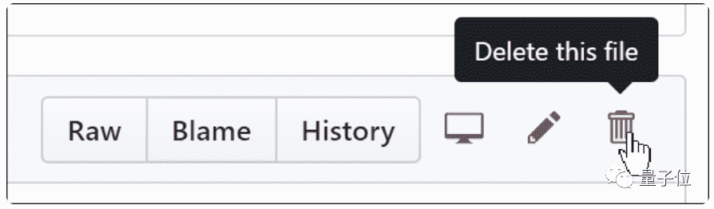

##### 赖可 发自 凹非寺
量子位 报道 | 公众号 QbitAI

GitHub不仅可以传代码，还可以建博客。利用GitHub Pages平台，就可以搭建非常好用的个人博客。

但是难点在于，你在要敲很多代码才能搭出一个博客。对于小白和新手来说，太不友好。

没关系！现在不用写代码也可以了。

不需要敲码，不用写使用命令行，可以自定义主题，还能有自己的域名。

Fast.ai提供了模版，只要注册一个github账号，小白就能够完成搭建博客的操作。

真是文科生友好～

下面是小白教程。

## 创建存储库&创建主页

首先，你需要注册一个github账号，并确保在线。

然后，点击这个网页地址：https : //github.com/fastai/fast_template/generate

注册一个**存储库**(repository)，就是存储博客的地方。注册名字的格式是：**github上的名字+github.io**；储存库的性质选择**公共**Public。

如果选择Private就是仅自己可见，这样需要付费

下面就可以进行博客主页的一些基本设置。

进入主页，会看到的是一个名字为**index.md**的文件，这是个Markdown文件。Markdown是一个目前创建格式化文本的便捷又强大的方法。在输入普通文本的时候，只需要加入一些特定字符就可以增加特定的样式。比如在一个一个词或者短语前后都输入*，就可以使其变成斜体。

单击这个文件打开它，进入新的页面，点击**编辑按钮**，即铅笔符号开始编辑。

点击**Preview changes**可以浏览文本效果

###### **△**blog被设置成斜体

###### 

滚动到底部并单击**Commit changes**绿色按钮来提交。在GitHub上，“提交”意味着将其保存到GitHub服务器。

博客的域名就是，****github上注册的名字+github.io**，页面就会显示刚才输入的内容。

还可以对博客进行其它设置，单击名为**_config.yml** 的文件，然后像之前一样单击**编辑按钮**，在冒号后面输入相应的内容，可以更改标题，描述和GitHub用户名值。输入的内容就会在主页显示。

## 写文章

下面可以写博客文章了！

所有的文章都会放在**_posts**文件夹中。单击它，然后单击**创建文件**按钮，创建一个新的文件。文件名命名的格式是：year-month-day-name.md，其中year是四位数，而month和day是两位数。“name”可以自定义，扩展名md则用于Markdown。

写文章的时候也用Markdown来标注格式。第一行作为一级标题，开头加上#，如果文章里面还需要小标题，##用于二级标题，###用于三级标题。点击**Preview**可以浏览。

同样，点击绿色按钮**Commit new file**来提交。

提交完成后，文章就会出现在博客主页上：

点进去的文章界面是这样：

想删除文章，同样进入**_posts**文件夹，找到对应的文件，进行操作。

**记住**，和写文章一样，点完了删除后，还需要点击绿色的**commit**，才算操作成功。

如果想在文章里面加入图片，需要先把图片上传：

然后在文章中以如下字符串来加入：

> $，或者想让它单行显示的时候，在上下两行各加**$$**，像这样：

> $$
> \sum_n (x)
> $$

显示出来就会是：

以上～

学会这些内容，你就成了Github pages博客初级玩家，是不是超级易懂易上手？

如果你想用玩转博客，也可继续钻研，说不定玩着玩着就发现，已然沉迷于技术～

## 传送门

https://www.fast.ai/2020/01/16/fast_template/

*AI学习路线和优质资源，在后台回复"AI"获取*

