选自towardsdatascience

**作者：****Rohit Pandey**

**机器之心编译**

> 作者说：我以前一直没有真正理解支持向量机，直到我画了一张图。

**1\. 问题**

支持向量机（SVM）旨在解决「分类」问题。数据通常包含一定数量的条目/行/点。现在，我们想对每个数据点进行分类。为简单起见，我们假设两个类别：「正类」和「负类」。这或许可以帮助解答以下问题：

*   基于图像的像素数据，判断这张图像中是否有猫（有猫则标签为正类）；

*   基于邮件的主题、发送者、文本等，判断该邮件是否为垃圾邮件；

*   判断某个病人是否患有某种疾病。

其精髓在于，当我们知道正确答案时，我们会想到一些将数据分为两类的规则（对于支持向量机而言，「规则」是画一个平面，一侧的所有点均为「正」，另一侧的所有点均为「负」）。当我们遇到不知道类别的新数据点时，我们使用规则对其进行分类。分类问题严重依赖约束优化，同时也是约束优化的一个直观示例。大家可以参考以下博客或吴恩达的文章。

*   博客地址：https://towardsdatascience.com/lagrange-multipliers-with-pictures-and-code-ace8018dac5e

*   吴恩达文章地址：http://cs229.stanford.edu/notes/cs229-notes3.pdf

**1.1 图解**

我以前一直没有真正理解支持向量机，直到我画了一张图。

我们可以看到特征空间中有一些点。为方便可视化，我们使用一个可在屏幕上观看的 2D 特征空间。该空间中散落着一些数据点，每个点具备二元标签（(1/-1）。如下图所示，我们将绿色点看作正类，红色点看作负类，黄色点类别未知。如果让你猜测黄色点的标签，你会怎么选？你可能会发现其中一些点并不是那么容易确认类别。

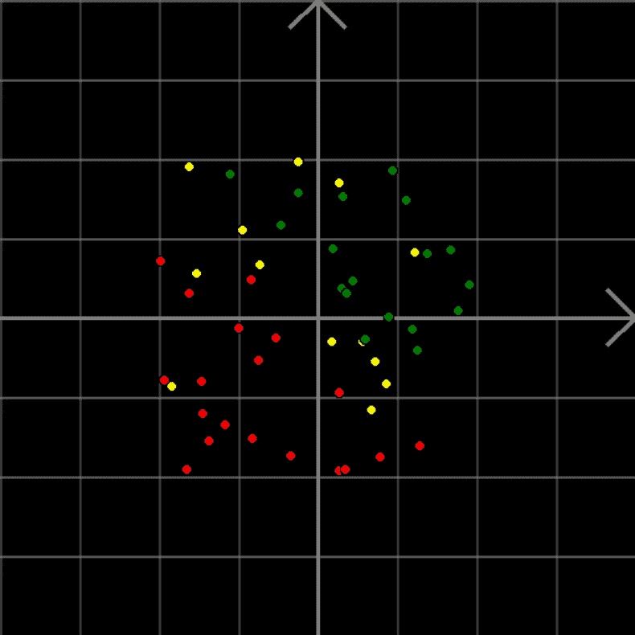

*图 1：**2-D 分类问题。**绿色点是正类，红色点是负类。**你可以猜出黄色点的标签吗？**（绘图工具：**https://github.com/ryu577/pyray）*

现在，如果我画一条紫色线将两个类别分割开，那么黄色点属于哪个类别就清晰多了（紫色线上方是绿色点，下方是红色点）。

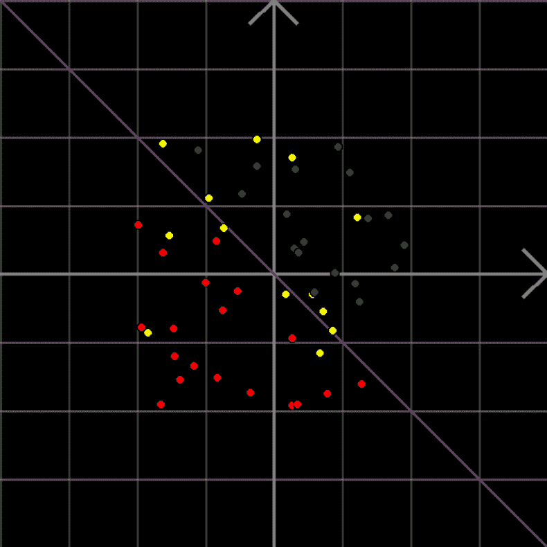

*图 2：**画一条线，作为将正类标签和负类标签分割开来的「规则」。**现在，我们可以使用该规则标注每个黄色点的类别。*

然而，这条线并非唯一。有很多条紫色线可以将绿色点和红色点完美分割（见下图）。随着下图中紫色线的移动，某些黄色点就显得很微妙了（它们处于紫色线的不同侧，因此它们的类别取决于你选择使用哪条紫色线）。

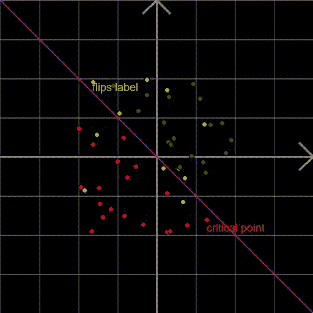

*图 3：**将红色点和绿色点完美分割的线有很多条。**那么我们应该选择哪一条呢？*

问题在于，所有候选线中，哪一条是「最优」的？有一点很清楚：当上图中的紫色线接近右下角的红色点（critical point）时，其泛化效果不好，而当它远离那个点时，其分割效果要好得多。因此，这个红色点可以说明紫色线的分类效果，因此它是「关键点」。我们可以说，远离该红色点的线同样远离所有训练样本，而靠近该红色点的线最终的分类效果并不好。因此，离最近的训练样本较远的线才是优秀的分类器。

接下来，我们来看如何利用数学知识绘制分割线。

**2\. 绘制分割线**

现在我们要（在 2D 空间中）画一条分割线（在更高维度的空间中，则为分割面）。那么这条线是什么呢？它是具备某种共性的点的无限集合。这些点满足一个特定公式。为了找到这个公式，我们先从最简单的线 x 轴开始。x 轴上所有点的位置向量存在什么共性？v_x = [x,0]，即它们对应的 y 坐标均为 0。

也就是说，x 轴上每个点的位置向量与指向 y 轴方向的向量是正交（垂直）的。

这个说法可能看起来比较晦涩难懂，但是我们必须这么说，因为这种现象其实对所有线都成立，而并非只适用于 x 轴。我们希望将此说法泛化至任意线。现在每次挪动一小步，我们来看看穿过原点的线（如 x 轴）。如下图所示，只需将 x 轴旋转一定角度，就可以得到这些线。

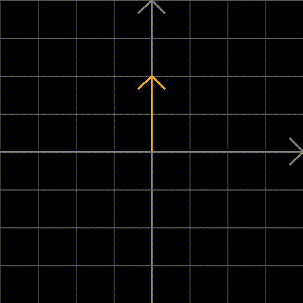

*图 4：**旋转 x 轴可以得到穿过原点的任意线。**这些线上的每个点都与橙色向量相垂直。*

随着线的变化，与线相垂直的向量也在变化，但是所有线上每个点的位置向量都与某个向量垂直。我们把这个与线垂直的向量叫做 w。当我们改变 w 时，就可以捕捉到所有此类线。

注意，对于任意给定线而言，存在多个 w 值。如果我们将向量 w 扩展或缩小一定数值，该线上每个点的位置向量仍与向量 w 垂直。

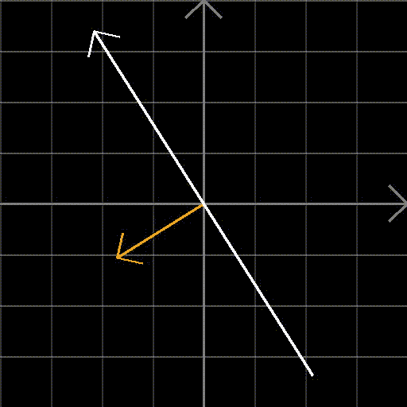

*图 5：**扩大或缩小正交 w 向量。*

为什么不把 w 向量限制在大小为 1 呢？下文中，我们将 w 向量的大小设为 1。

现在我们已经将穿过原点的所有线都参数化了。那么那些没有穿过原点的线呢？我们将穿过原点的线移动一定量，即在该线法向量 w 的方向上移动 b。现在，w 与该线上每个点的位置向量的点积不为零，而是常量 b（参见下图）。w 向量是从原点指向紫色线的单位向量，且与紫色线垂直。A 即紫色线上与原点最接近的点。假设 OA 的距离是 -b。现在，考虑两个随机点 B 和 C（分别是图中绿色点和橙色点）。将 OB 或 OC 与单位向量 w 相乘，分别得到三角形 OAB 和 OAC 的底。

在这两种情况中，OA 为 -b。由于这两个点只是紫色线上的任意点，我们可以推断出，紫色线上的所有点均满足 w^T x+b=0（其中 x 表示紫色线上点的位置向量）。

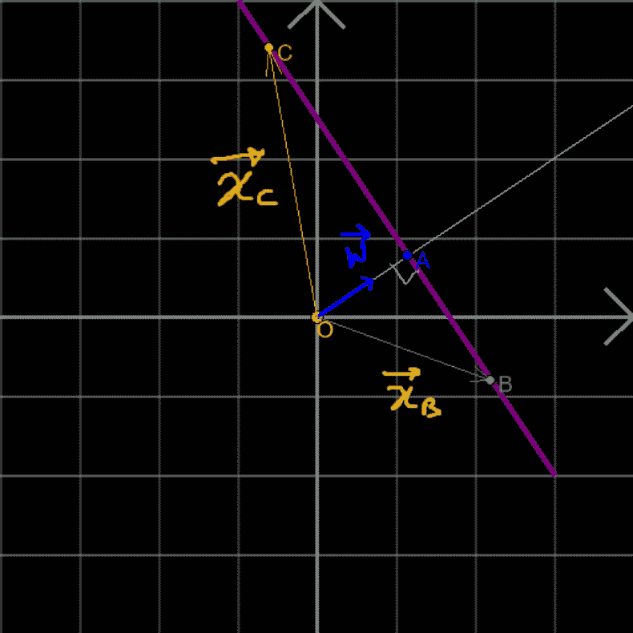

*图 6：**未穿过原点的线。*

如果我们将不在该线上的点应用于上述公式呢？得到的结果不是零，而是从该点到紫色线的垂直距离（对于紫色线上的点而言也是如此，所以它们所对应的公式结果为零）。我们需要注意：这个结论仅适用于 |w|=1 的情况。下图清晰说明了这一结果。B 为不属于紫色线的任意点，B』』 为从 B 到紫色线的垂点，B』 为从 B 到 w 向量的垂点。从 B 到紫色线的垂直距离为 BB』』。但是由于 A-B』-B-B』』 是一个矩形，因此该垂直距离等于 AB』=OB』-OA。现在，OB』 是 B 的位置向量与 w 的点积。因此，如果 x 是 B 的位置向量，则 |OB』| = w^T x。这意味着 |AB』|=w^T x-(-b)（OA=-b）。因此从点 B 到紫色线的距离是：|AB』|=w^T x+b（该公式恰好是紫色线的公式）。


*图 7：**将不在紫色线上的点应用于紫色线公式会发生什么？**我们得到该点与紫色线之间的垂直距离。*

注意，在 w 指向方向一侧的所有点（如图 7 中的点 B）到紫色线的垂直距离为正值，而另一侧点的垂直距离为负值。

在 w 指向方向一侧的所有点均得到正类标签 (t_i=1)，而另一侧的所有点均得到负类标签 (t_i=-1)。因此，如果我们将这些标签与垂直距离相乘，则所有点调整后的垂直距离均为正，前提是这些点均被紫色线正确分类（即具备正类标签的点在线一侧，具备负类标签的点在另一侧）。

**3\. 最佳分割线**

现在到了 SVM 的重点了。我们将任意点到分割线的调整后垂直距离叫做「间距」（margin）。那么，对于任意给定分割线，所有点均具备间距（如果点被分割线正确分类，则间距为正，反之则间距为负）。我们想获取将正类和负类完美分割的线。也就是说，间距越大越好，即使是对于邻近界限（分割平面）的点。

那么，最大化所有间距（甚至是最接近分割线的点的间距）的分割平面应该能够很好地分割这些点。现在，给出 (w,b)，第 i 个点的间距为：

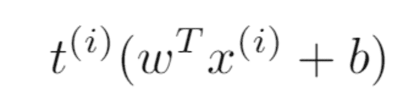

*间距公式。*

其中 x_i 表示特征空间中的位置向量，t_i 表示标签：1 为正类，-1 为负类。

所有点中的最小间距为：

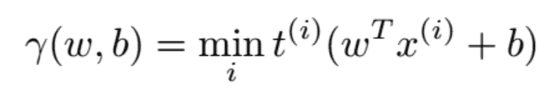

*公式 1：**所有点中的最小间距。*

我们想让 (w,b) 最大化上述最小间距。也就是：

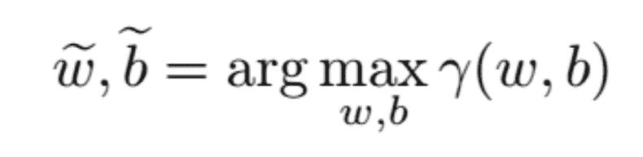

即我们想让 (w,b) 满足 |w|=1，且最大化间距：


*公式 2：**SVM 目标函数。*

注意：如果这条线没有分离数据，那么对于 (w,b)，某些点的间距


*间距公式。*

为负。且这些点中的其中一个会在第一次最小化中「脱颖而出」，这意味着 (w,b) 无法在第二次 arg max 时胜出。因此，该公式保证了胜出的 (w,b) 能够分割数据。

公式 2 是一个优化问题，涉及最小化和最大化（mini-max）。解决一级优化总比二级优化要简单。因此，我们尝试将公式 2 转化为约束优化问题。

我们用 γ 表示所有点的最小间距。

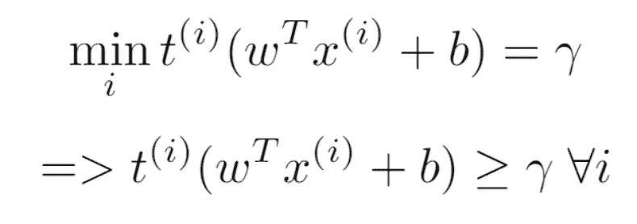

*公式 3：**约束。*

最终得到的优化问题为：

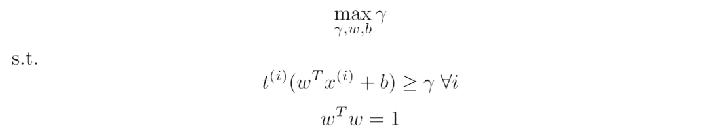

*公式 4：**SVM 优化问题。*

上述优化问题具备二次/线性约束和线性目标函数。我们可以使用二次规划求解器（quadratic programming solver）和最优分割线/平面 (w,b) 解决该问题。

现在，我们来试着进一步简化该问题。我们发现可以去除 γ。其代价是，我们必须放弃 w^T w = 1 这一要求。但这是值得的。我们使用 γ 将约束分割为两部分，得到：

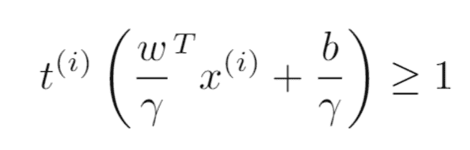

*公式 5：**使用 γ 分割分割平面公式。*

现在，使

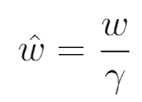

*引入新的 w 变量。*

为两侧取绝对值：


*取绝对值。*

我们之前要求 |w|=1。这意味着：

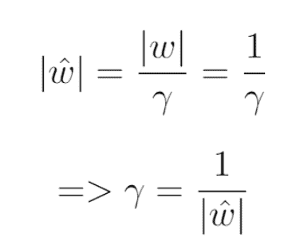

因此，公式 3 变成了：

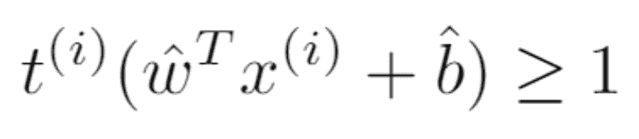

公式 5 和公式 6 使公式 4 中的优化问题变成了：

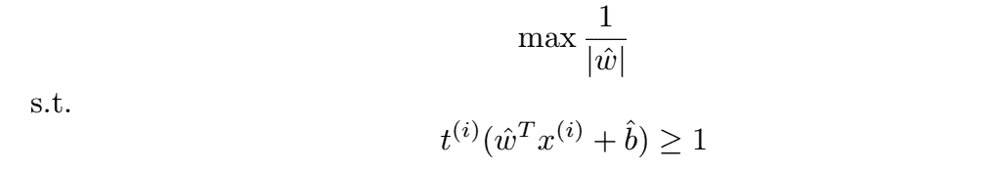

现在，优化问题有了一个丑陋的目标函数。但是最大化 1/|w| 等同于最小化 |w|，等同于最小化 |w|²。添加 1/2 使得计算更加简单。

因此，上述优化问题变为：

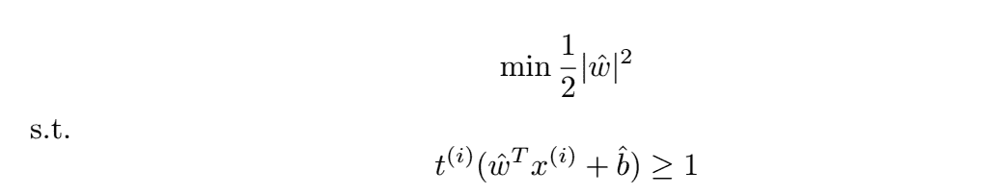

*公式 7*

现在，该优化问题具备二次目标函数和线性约束（线性约束二次规划，LCQP）。使用二次规划求解器即可解决该问题。

现在，我们知道如何通过解决优化问题找出最优分割线了。透过表面查看解决这类优化问题的真正机制，会帮助我们对该问题了解更多，具备更强大的洞察和见解。

```
AI学习路线和优质资源，在后台回复"AI"获取 
```