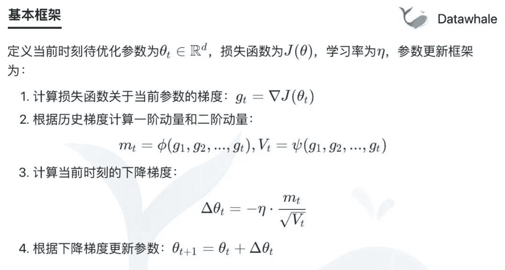
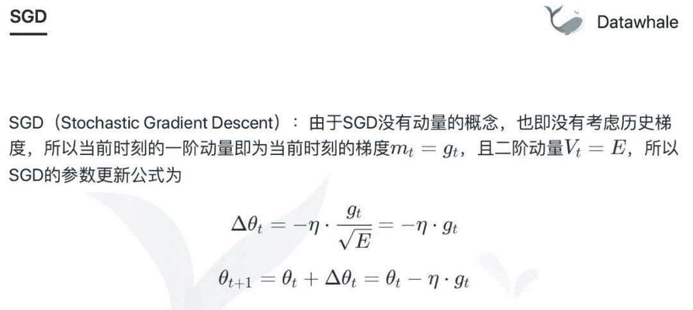
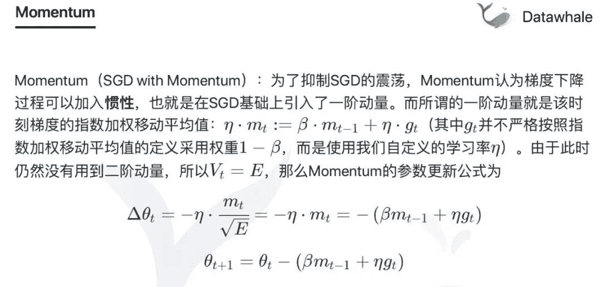
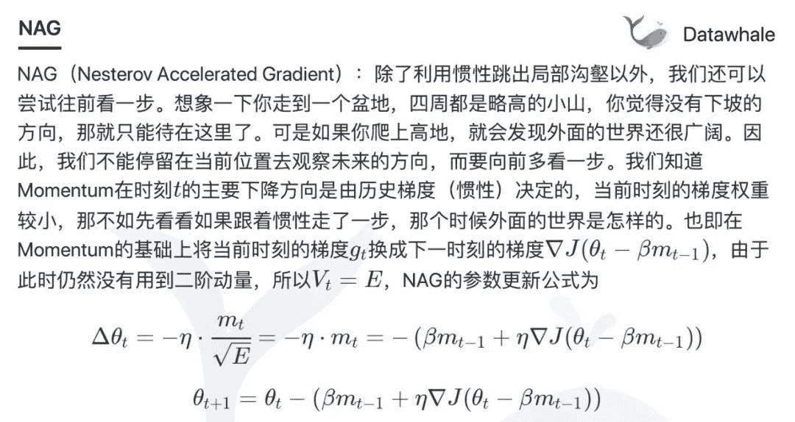
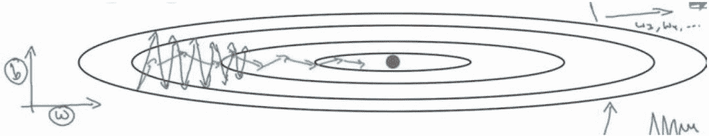
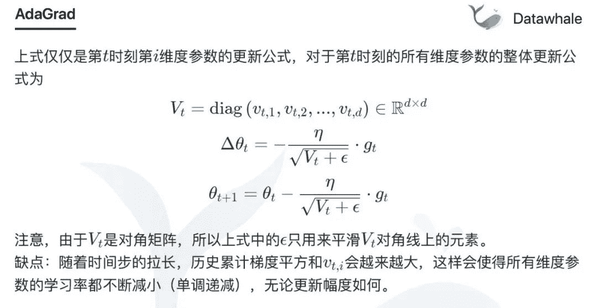
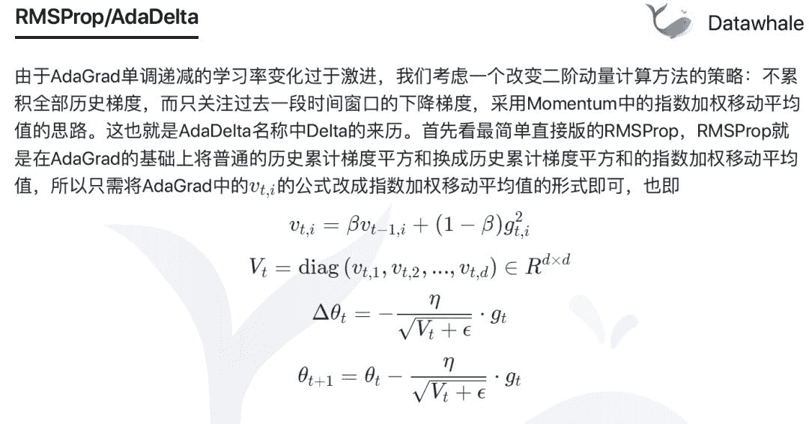
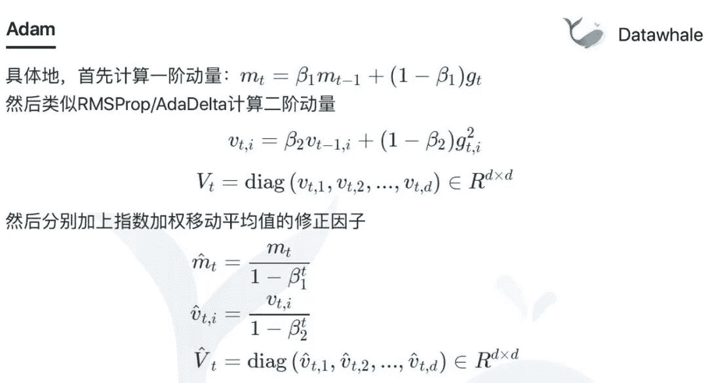
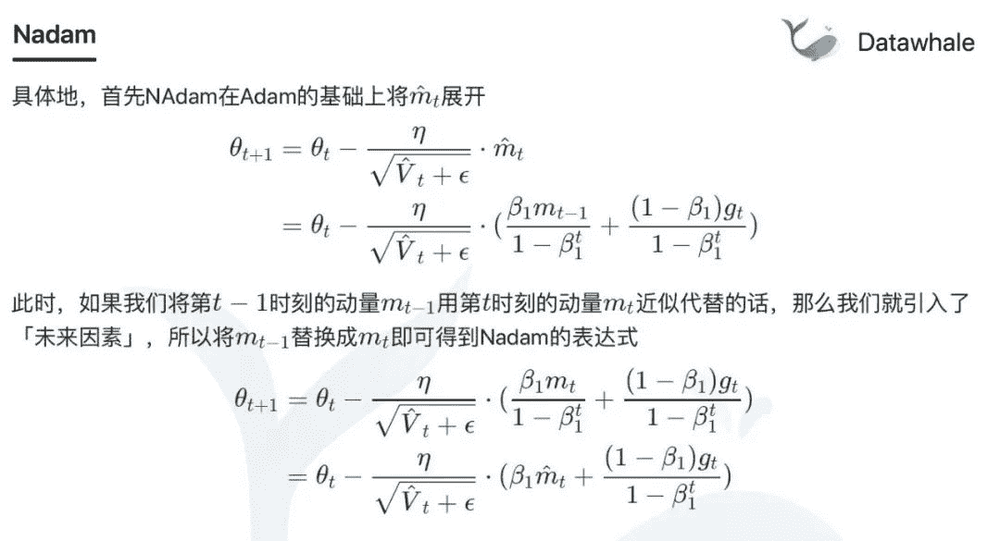

Datawhale原创

**作者：****谢文睿，Datawhale成员**

寄语：优化算法是一个超参数，一个优化算法不是适合所有损失函数的，没有哪个优化算法是绝对的好或绝对的坏，是要根据损失函数判断的

本文对深度学习中的优化算法进行了梳理。首先，介绍了整个优化算法的基本框架。然后将目前用的主流优化算法进行讲解，带领大家了解优化算法从SGD到Adam及Nadam的转变。

***视频链接***：https://www.bilibili.com/video/av94067702/

## 基本框架

为什么这些算法是能串讲的呢？因为这些算法都是相通的。为什么是相通的呢？因为所有的优化算法均基于下面优化算法的基本框架。

其中，一阶动量和二阶动量分别是历史梯度的一阶函数和二阶函数。

## SGD随机梯度下降算法

首先，讲一下最基础的SGD算法:

**缺点**：容易陷入局部最优。由于SGD只考虑当前时刻的梯度，在局部最优点的当前梯度为0。由计算公式可知，此时参数不再进行更新，故陷入局部最优的状态。

**改进策略及算法**

*   引入历史梯度的一阶动量，代表算法有：Momentum、NAG

*   引入历史梯度的二阶动量，代表算法有：AdaGrad、RMSProp、AdaDelta

*   同时引入历史梯度的一阶动量及二阶动量，代表算法有：Adam、Nadam

## 改进策略1：引入一阶动量

**Momentum**

**改进思想**：为了抑制SGD的震荡，Momentum认为梯度下降过程可以加入惯性，也就是在SGD基础上引入了一阶动量。

其中，关于历史梯度的一阶动量的计算采取指数加权移动平均值的思想进行计算，具体计算步骤详见PPT或视频讲解。

**NAG**

**改进思想**：除了利用惯性跳出局部沟壑以外，我们还可以尝试往前看一步。即：在Momentum考虑历史梯度的基础上，把当前梯度转换为未来梯度。

## 改进策略2：引入二阶动量

二阶动量的出现，才意味着“自适应学习率”优化算法时代的到来。在SGD及其引入一阶动量的改进算法中，均已相同的学习率去更新参数。但是，以相同的学习率进行变化经常是不合理的。

在神经网络中，参数需要用不同的学习率进行更新。对于经常更新的参数，我们已经积累了大量关于它的知识，不希望被单个样本影响太大，希望学习速率慢一些；对于偶尔更新的参数，我们了解的信息太少，希望能从每个偶然出现的样本身上多学一些，即学习速率大一些。

以神经网络中的**W**及b为例，如下图为损失函数图像，**W**为x轴，b为y轴。发现每次b变动很大，而**W**每次仅更新一小步。但是，纵观整个损失函数我们发现，**W**其实可以迈开步子往前走，b是不是可以跳跃不那么大。

于是，出现了不同针对不同维度的参数采用不同学习率的二阶动量改进算法。

**AdaGrad**

**改进思想**：从数学的角度来看，更新幅度很大的参数，通常历史累计梯度的平方和会很大；相反的，更新幅度很小的参数，通常其累计历史梯度的平方和会很小。

**缺点**：随着时间步的拉长，历史累计梯度平方和会越来越大，这样会使得所有维度参数的学习率都不断减小（单调递减），无论更新幅度如何。

**RMSProp/AdaDelta**

**改进思想**：不累积全部历史梯度，而只关注过去一段时间窗口的下降梯度，采用Momentum中的指数加权移动平均值的思路。

## 改进策略3：同时引入一阶动量及二阶动量

**Adam**

**改进思想**：加入Momentum的一阶动量计算方法及AdaGrad的二阶动量计算方法。

**Nadam**

**改进思想**：Nadam = Nesterov + Adam。核心在于计算当前时刻的梯度时使用了未来梯度。

***视频链接（或**阅读原文**）***

https://www.bilibili.com/video/av94067702/

*如需本文PPT，在后台回复"PPT"获取*

