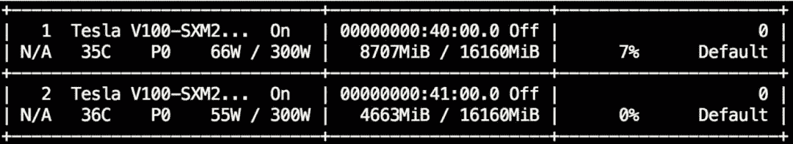
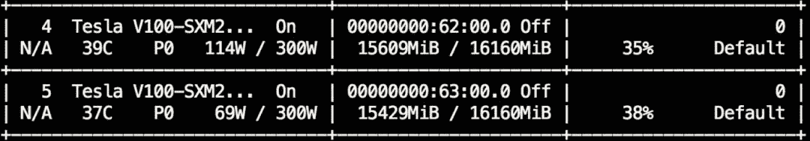
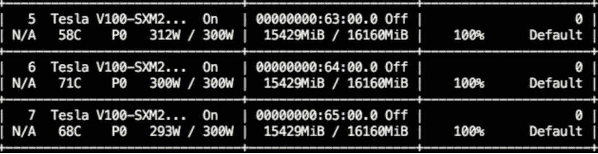
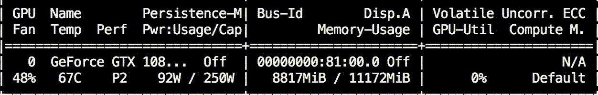
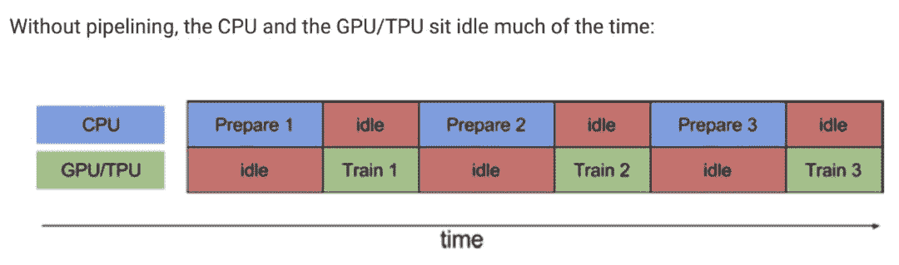
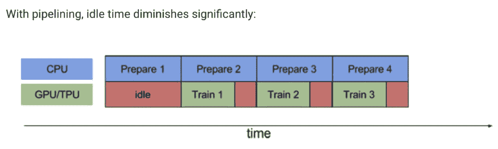
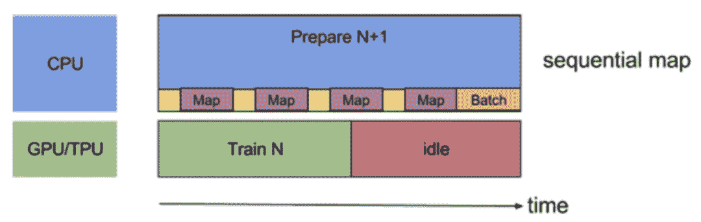
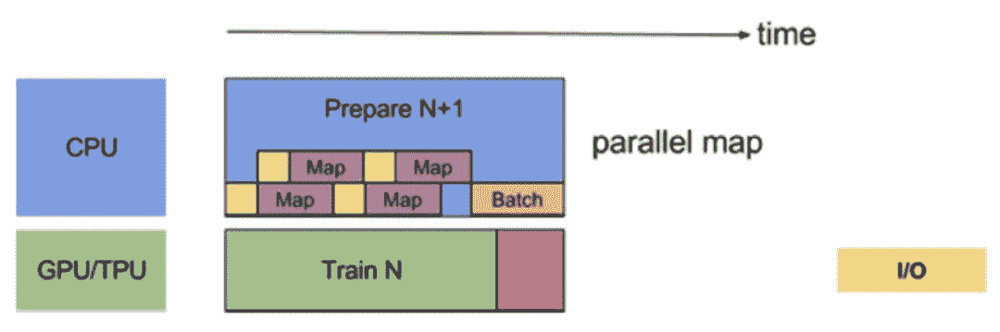

## 前言

首先，如果你现在还是在进行session.run(..)的话！尤其是苦恼于GPU显存都塞满了利用率却上不去的童鞋，这篇文章或许可以给你打开新世界的大门噢

如果发现经过一系列改良后训练效率大大提高了，记得关注、星标、推荐三连。

## 缘起

很早很早之前，在刚接触tensorflow和使用GPU加速计算的时候，就产生过一个疑惑。为什么显卡的显存都快满了，GPU利用率还显示这么低呢？好浪费呀，但是又无可奈何。当时GPU利用率100%的情况基本是仅存于一块显卡塞4、5个不费显存的小任务的情况。

在比较极端的情况下，甚至GPU的利用率会降到10%以下，就像这样：



而大部分情况下写出来的代码train起来后是这样的：



可以看到，虽然显卡的显存都塞满了，但是显卡功率（最左边那一栏，114W和69W）和利用率（最右边那一栏，35%和38%）却远远没有达到极限。大部分人的想法是，算了算了这不重要，我去做实验了再见

然而！如果你在做大型实验，train一次跑几天呢？这个细节会极大的影响你的实验效率和DDL到来前的实验次数！想一下，完全一样的model和设置，你的代码要train一周，然而隔壁老王只需要train三天

> 路人甲：我有256张显卡
> 
> 小夕：好了这篇文章你可以X掉了

那么，我们有没有可能一直这样呢：



是不是这功率和利用率看起来不可思议！不要怀疑这是PS的图！这只是小夕的日常截图！tricks用的好GPU利用率掉不下来99%，然鹅代码写的足够蠢，也可以上不去5%！

## 原因

不要急，我们来放大一下那些gpu利用率只有30%几的代码在训练时的gpu利用率的变化情况（好像句子有点长

```
watch -n 0.1 nvidia-smi
```



> ps:（可能掉帧太严重了看着不连贯，建议在自己的机器上试一下，会直观的多～）

看！是不是一下子就发现问题啦？可以看到，其实gpu利用率并不是一直在比较低的水平，而是很有规律的周期性的从0涨到接近100再跌到0，再重新涨到100再跌回0。如果同时开着打印日志的窗口，你就会发现这个周期恰好跟每个训练step的时长一致！也就是说，在每个step，其实有一些时间并没有花在GPU里，那当然就是花在cpu里啦。

那在cpu里干什么的呢？当然就是load下一个batch、预处理这个batch以及在gpu上跑出结果后打印日志、后处理、写summary甚至保存模型等，这一系列的花销都要靠cpu去完成。回顾一下我们常写的代码：

```
create_graph()
create_model_saver()
create_summary_writer()
create_session()
do_init()
for i in range(num_train_steps):
    load_batch(...)                # cpu
    preprocess(...)                # cpu
    feed_dict = {...}              # cpu
    fetch_list = [...]             # cpu
    buf = session.run(fetch_list, feed_dict)    # gpu
    postprocess(buf)               # cpu
    print(...)                     # cpu
    if i % x == 0:
        summary_writer.write(...)  # cpu
    if i % xx == 0:
        model_saver.save(...)      # cpu
```

看，尤其是preprocess(…)任务比较重的话就容易导致代码在cpu里也要跑好一段时间，gpu利用率自然就会上不去而且呈现周期性变化啦。

## Tricks

## 有没有什么办法降低cpu时间，提高gpu时间呢？一个很自（愚）然（蠢）的想法就是把一切训练代码都用tf的api重写不就好啦，甚至最外层的那个`for i in range(num_train_steps)`其实都可以用tf.while_loop重写呀。嗯，小夕还真的这么尝试过，然后发现


TF api这特喵的都是些什么鬼！各种跟numpy和python内置函数重名却行为不一致是什么鬼！卧槽这个api少了个参数我该怎么办？python里就一行代码就能搞定的事情我为什么写了几十行？？


所以除了函数式编程的大牛，小夕极力的不建议重蹈覆辙！尤其是我们这些遇到汇编会哭，看到Lisp会崩溃的90后小仙女！

所以没办法把整个train loop都描述进计算图了？

别怕别怕，好在后来其实tensorflow已经封装了一个特别好（多）用（坑）的上层API来把整个train loop都能轻松的封装在计算图中，从而实现超级高的GPU利用率和训练效率！

### Estimator

不用管它为啥叫Estimator，只需要知道，它把我们刚才想做的事情基本都给封装好了就行。把刚才的那个经典的写法搬过来

```
1\. create_model()
2\. create_model_saver()
3\. create_summary_writer()
4\. create_session()
5\. do_init()
6\. for i in range(num_train_steps):
7\.      load_batch(...)                # cpu
8\.      preprocess(...)                # cpu
9\.      feed_dict = {...}              # cpu
10\.     fetch_list = [...]             # cpu
11\.     buf = session.run(fetch_list, feed_dict)    # gpu
12\.     postprocess(buf)               # cpu
13\.     print(...)                     # cpu
14\.     if i % x == 0:
15\.         summary_writer.write(...)  # cpu
16\.     if i % xx == 0:
17\.         model_saver.save(...)      # cpu
```

1-5行在estimator中都封装好啦，你只需要把相关配置塞进estimator的RunConfig就可以啦～

7-9行也封装好啦，你只需要把数据集载入和预处理的相关代码的函数塞给estimator.train的input_fn～

第10行也封装好啦，你只需要把要fetch的loss、train_op丢进estimator的EstimatorSpec～

第11行也封装好啦，你只需要把描述模型计算图的函数塞给estimator的model_fn~

第12-13行不用操心细节了，global_step和loss自动完成了，剩下的丢给tf.Print和LoggingTensorHook吧～

第14-17行不用你写了，自动完成了

经过这么一顿折腾，我们发现GPU利用率大大提高啦～直逼80%甚至90%。那么还有没有可以压榨的空间呢？

其实这时仔细一分析就会发现虽然estimator把大部分的代码写进计算图里了，但是从数据的载入和预处理依然是在cpu里**串行**进行呀，而且比如一个batch有128个样本，那么estimaor内部在run每个step的时候还是要等着这128个样本串行的处理完才行。这显然就是最后的瓶颈啦！有没有办法消除掉呢？·当然有，那就是

### tf.data

TF的dataset API可以说让人又爱又恨了，它确实看似提供了一种把整个预处理都搬进计算图进行并行化处理的途径，但是！如果你真的完全用tensorflow API来做复杂的预处理的话，真的会让人疯掉的QAQ因此，这里在用tf.data之前，小夕极力的建议先把数据集尽可能的transform成预处理后的样子，包括**做分词、做截断、做word2id等，不过padding和input_mask可以留在TF里面做**，毕竟都只需要一行。

那做完这些预处理后，数据该怎么存储会更方便后续的读取和处理呢？最最最建议的方式还是使用`tf.records`来存储，磁盘、内存的存储和IO效率都会相比传统方式更快一些，x和y也不用分开了。当然这样的唯一的坏处就是不能直接打开看数据集，毕竟数据集被做成了二进制文件。

但是实在比较懒不想用tf.record的话，那么**极力建议把x和y分开存储**，并且尽量让tf.data在读取数据的时候做完上面的那些必要的预处理，以避开难用的字符串基础操作API并且减轻训练时的cpu和内存压力。

**tf.data还有一个很大的好处就是可以很天然的支持以streaming的方式读取数据**，这样在面对大数据集时就不会发生数据load完后发现显卡被占的尴尬事件了。

好像讲了这么久，还是没讲怎么用tf.data加速QAQ，来来来进入正题啦。

想想哈，没用tf.data的时候，我们写出来的代码实际跑起来就是这个样子的：



这也是文章开头解释的为什么gpu利用率上不去并且周期性变化的重要原因。那么我们可以不可以消除idle，像下面这样让prepare和train的过程并行进行呢？



当然可以！那就是

**prefetch**

从prefetch的意思就可以理解，那就是预先获取下一个step要load的batch。使用tf.data里面的叫做prefetch的神奇api就可以轻松完成啦，这个api里的参数buffer_size就是讲的是额外的fetch多少份，比如buffer_size=1，然后我们要prefetch的是batch的话，那么模型每次prepare完一个batch后，就会自动再额外的prepare一个batch，这样下一个train step到来的时候就可以直接从内存中取走这个事先prepare好的batch啦。（详情见后面）

等下，看上图的话，有木有发现，如果prepare一个batch耗时很短的话确实两全齐美，但是如果耗时比较久，尤其一下子prefetch好几个batch的话，一旦prepare的用时超过了train一个step的用时，那么每个train step的性能就会受限于prepare的效率啦。放大一下这个问题的话如下图所示



看，prepare用时太久反而会导致train完一个step后gpu空闲了（虽然其实下个step的batch可能已经prepare好了）

那么能不能确保prepare阶段的用时小于train阶段的用时呢？

**parallel mapping**

一个很简单的想法当然就是让样本并行处理啦～如果batch size是128，prefetch size=1，那么准备一个batch要**串行的**跑128*2=256次的预处理，但是如果我们开4个线程去跑，是不是就看起来快多啦。幸运的是我们也不用自己手撸多线程了，tf.data.Dataset在map（预处理）函数里有一个参数`num_parallel_calls`，给这个参数赋值就可以并行parse啦。如图：



这样的话只要**prefetch的buffer_size和map的num_parrellel_calls取得合适**，基本就可以实现不间断的train啦，也就是几乎达到100%的GPU利用率！

好啦，思想明白了，代码就容易理解啦。不使用tf.record，直接从预处理好的纯文本格式的数据集load数据时的典型过程如下

```
def build_input(..):
    x = tf.data.XXDataset(..)
    x = x.map(..., num_parallel_calls=N)        # parellel

    y = tf.data.XXDataset(..)
    y = y.map(..., num_parallel_calls=N)

    dataset = tf.data.Dataset.zip((x, y))
    dataset = dataset.repeat(num_epochs)    
    if is_train:
        dataset = dataset.shuffle(..)
    dataset = dataset.batch(batch_size)
    dataset = dataset.prefetch(buffer_size=1)   # prefetch
    iterator = dataset.make_xx_iterator()
    return iterator.get_next()
```

当然，如果用上`tf.record`后，就不用分别从x和y俩文件中读数据啦，感兴趣的童鞋可自行去了解一下。

**补充**

当然，刚从传统的代码迁移到tf.data+estimator的时候可能会不太适应，最主要的还是debug的方式，不能像之前一样直接session.run(debug_tensor)了，那怎么办呢？

一般来说我们打印tensor有两种情况，一种是计算图出错时需要打印一次或几次来定位问题，一种是像global_step，loss等需要周期性check。对于这两种情况，之前是习惯session.run的时候把要打印的tensor也run出来，而现在这两种情况可以区分对待啦。

对于第一种，感觉最高效的还是直接在计算图里插tf.Print(..)，使用非常方便，debug能力很强大！如果打印还需要配合global step，加一条tf.cond就搞定啦。对于第二种，其实global step和loss的话estimator默认就会打印出来，如果是其他需要周期性打印的tensor，那么就用tf.train.LoggingTensorHook包装一下然后丢进estimator.train里吧～习惯之后竟然还感觉挺方便的m(_* _*)m

最后，愿天下没有空闲的显卡

```
AI学习路线和优质资源，在后台回复"AI"获取 
```