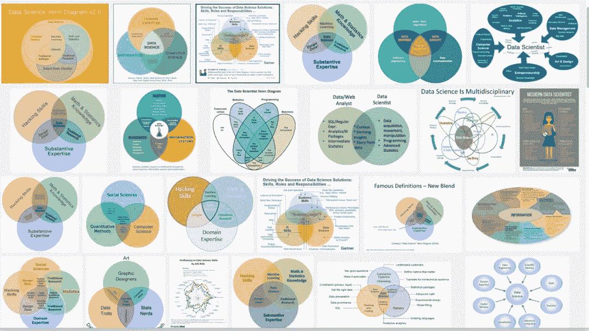

<figcaption>图片</figcaption>

大概是因为马上要开始秋招提前批了，小夕在知乎和微信后台收到了不少小伙伴的岗位/团队选择的求助。于是小夕这里写一篇扫盲贴，给即将毕业的师弟师妹们提供一个参考（后面再有师弟师妹问我这个问题的时候我就有文章可以甩了。

> 如有描述偏颇之处，欢迎经验丰富的老司机们在评论区指出。

说起来国内的岗位名称，真可谓穷尽了眼花缭乱的高大上名词。经历过秋招的小伙伴一定都曽经历过岗位选择的困扰：

*   XX公司在招人工智能研究员，感觉很高端啊，怕怕的呢

*   XX公司在招NLP工程师，听起来跟java工程师没什么区别嘛

即将找工作的可爱的师弟师妹们千万不要被HR小姐姐们迷惑了，虽然岗位不分高低贵贱，但是不同的岗位工作性质和对能力的侧重点是很不一样的。

凡是以AI相关概念开头的岗位，无论是研究员/算法工程师/算法研究员/技术研究员/研发工程师/工程师，都可以统一理解成是等价的概念。其实本来是不应该等价的，但是实际上国内有大把的“研究员”岗位在做狭义的开发工作，疲于搬砖，毫无研究性质可言（哪家企业就不点名了，自己擦亮眼睛），也有一些不赶潮的企业比较偷懒，无论工作性质怎样，统一叫做“工程师/研发人员”。

# 概览

参考知乎**@霍华德** 的这个回答????，互联网行业的算法岗主要分为三种：

https://www.zhihu.com/question/366503145/answer/978673635

*   **业务导向的算法工程师**（Development）：最为典型的算法工程师，市场上招聘的大多是此类算法工程师，主要存在于业务部门。一些拥有独立业务的大厂技术部门（如百度NLP部门的百度翻译业务）也可能会有这种定位的小团队，研究院很少会有，除非公司真的缺钱了。这种岗位以快速解决业务中的算法问题为首要目标，创新成果可能写成专利。

*   研究导向的算法工程师（R&D）：主要聚集在大厂的技术部门，大厂研究院和大型业务部门也可能会有这种定位的小团队。这种岗位以重点攻克业务中的复杂算法问题为首要目标，研究成果一般以专利或论文的形式发表，也可能不发表。

*   狭义的研究员（Research）：主要聚集在大厂的研究院/AI lab，大厂技术部门也会有这种定位的团队或组，而业务团队很少会招聘真正意义上的研究员。这种岗位注重探索学术前沿，也会适当照顾业务线的长线需求，以打造业界影响力（paper为主要表现形式）为首要目标。

显然，这三类岗位，自上到下：

*   市场需求依次递减

*   不确定性（成果产出的难度）依次递增

*   研究与创新能力要求依次递增

小夕在Research岗和R&D岗都呆过一段时间，暂时没有机会接触业务型算法岗的细节，因此这类岗位的相关讲解由某大厂核心业务团队的刷分上线小能手**@兔子酱** 提供。

在开始之前先声明一下，本文内容仅适用于一般意义的讨论，即观点和经历不可能复制到所有团队的所有人身上。不同公司对AI lab定义不同，不同业务团队对业务算法工程师的定位和要求也有差异，同一家公司同一个团队的两个R&D也可能定位非常不同，**因此本文的打开方式是为师弟师妹们进行一般意义上的科普，请勿拿个例较真噢。**

# Research

之前看到过一句话，无论一家公司再怎么宣称自己是科技公司，在“科技”之前，一定还藏着“商业”二字。因此，哪怕是谷歌、百度这种技术立命的互联网公司，也一定是先商业，后技术的。而Research岗，表面来看天然的与商业化相悖，往往产出与投入非常的不成正比。

对企业自身来说，需要对Research团队倾注大量的资源（金钱、人才、时间等）才可能换来可见的收益。而Research团队的产出也很难用金钱来衡量，这些或轻或重的科研成果会转化成**业界的影响力**，这对于吸引顶尖人才、发展长线战略是非常重要的。此外，投资长线研究项目也是一种社会责任感的体现，毕竟这种高风险高投入还有机会引发行业甚至全人类的巨大变革（大到Google的AlphaGo、微软的ResNet，细到百度的混合精度训练、Ring Allreduce）。

然而，对研究院绝大部分的重金投入，换来的收入增长和影响力却是微乎其微的，反映到Researcher个人上，更是能感受到 **能力****比****收益、付出****比****产出 的巨大落差**。Google等来Alpha Go和BERT，微软等来ResNet都不是一朝一夕的几块钱投入换来的。因此，处在Research岗上的人都无法回避的就是产出问题。高影响力的成果可能需要数年的前置铺垫，但是显然企业是很难给你这个试错时间的。哪怕企业的技术包容性非常强，你也需要考虑你自己的青春是否经受得起这份风险。

回想起跟着大佬和一群顶尖的小伙伴们做Research的那段时间，总时不时的要考虑一个无解的问题：

*ACL挂了的话这半年就是0产出了(　ﾟдﾟ)*

*ACL中了但是短期也没法证明有什么影响力呀(｡ ́︿ ̀｡)*

*想晋升加薪却发现根本没有拿得出手的产出m(_ _)m*

*既没有给公司创造财富，又没有给公司带来影响力的提升，那么拿什么述职答辩呢？…>_<…*

*我太南了。。。*

这就是为什么Research团队成员大多是PhD。团队的每个人都是极其优秀的，一般都是Top2起步，尽管在做Research的日子里很享受智慧的碰撞和灵感的迸发所带来的愉悦感，但是现实的骨感就导致了工业界Research团队的高流动性——每每有能力超强的小伙伴因为投入产出远不成正比而离开，心里就感觉无比的难过。

因此，在盲目崇拜和跟风Research岗之前，需要首先问自己一个问题，**自己的能力和热爱是否足够承担的起这种高风险低产出的工作性质？是否真的已经对算法研究热爱到几乎放弃业务的程度了呢？**仅仅有一般意义上的“优秀”，是远不足以撑起这个岗位的，“优秀”只是Research岗的必要不充分条件。

# Research&Development

R&D岗，或者说研究导向的算法工程师岗就相比Research岗温和了很多。小夕从Research岗的生活状态切换到R&D状态后，总结起来的体验就是

*“体力劳动交换了一些脑力劳动，身体压力置换了一些精神压力，还多了一些镣铐”*

与Research岗不同，研究向的算法工程师岗的*问题需求往往来自于业务线，研究成果也是要直接反馈给业务线的，不把paper和学术影响力当作第一目标*。与业务向的算法工程师岗也不同，研究向算法岗接触的业务需求（算法问题）大多是 **挑战大，研究性更强，往往需要数个月的集中投入，但是一旦解决则会带来巨大的线上收益的**。这里举几个NLP中的例子：

1.  搜索业务中的智能问答/阅读理解问题：做的不好不会直接导致搜索引擎不能用，但是一旦做好了，就会给用户的搜索体验带来巨大的提升。

2.  广告业务中的文本匹配问题：做的不好也能用，无非就是少赚点，但是一旦做好，就是高转化率带来的真金白银+用户体验提升了。

3.  对话机器人业务中的闲聊问题：做的不好不会导致对话系统的核心服务直接挂掉，但是一旦做好，就会为用户带来极大的惊喜感和情感附加值。

这里要注意跟Research岗面对的问题困难度进行区分。Research岗往往要明显更困难一些，例如对话机器人业务，提给Research团队的需求可能就变成了“开放域对话理解”问题，这个问题一旦解决，绝对会给公司的对话业务带来翻天覆地的发展，甚至一举成为赛道的领头羊。但问题就在于，全世界都为这个问题头疼很久了。

由此可以看出，R&D岗相比Research岗要面临的**不确定性小了很多，产出曲线平滑了很多**。虽然R&D依然需要足够的创新能力和解决问题的能力，但是相比之下更容易获得与付出和能力相匹配的产出（除非遭遇了不靠谱需求）。

因此，对于一些业务线上提来的算法需求，可能由于问题难度不够大，或者你在该方向上的敏感度已经不错了，那么你能够熟练的通过几轮策略迭代就把问题的解决方案给探索出来了，进而给出一个可以上线的版本。相比Research的体验来说，算法问题的解决虽然会给业务方爸爸带来巨大的惊喜，不过对自身来说会多一些枯燥，少一些成就感，毕竟身上是有时间节点和线上性能（效率）的镣铐的，一些太天马行空的idea是不敢轻易去尝试的。此外，研究成果是要上线业务的，因此一套测试和部署流程下来，也免不了一些重复性的体力劳动。

除了这一段提到的镣铐问题和“创造性体力劳动的枯燥”之外，R&D岗的另一个问题就是你更难有时间去写paper了，一方面是排期原因（虽然你有几个月的时间探索策略，但是并不会给你留出写paper的时间），另一方面就是能解决业务重大问题的研究成果很可能是不方便对外公开的（虽然你感觉创新和突破也不算很大，但是竞品却很可能短时间内连这点突破都没做到，这就为业务带来了市场竞争力）。

既然问题需求是提炼于业务线的，显然研究导向算法岗相比业务算法岗来说，更加**难以窥见业务的全貌**。因此你可能为搜索或广告业务解决了一个重大问题，带来了可观的提升，但是你仍然不知道怎么去搭建一个简单的搜索引擎或广告系统。不过，从这个缺点也可以反向推理出来一个优点，就是**你可以同时接触到企业各大业务线中的疑难杂症**。

因此，在跟风和崇拜研究导向算法岗之前，也不妨问自己两个问题，*自己到底是有多大的能力和热忱来研究和解决算法问题呢？有没有到Research岗的程度呢？自己到底更爱业务，还是更爱算法？*

# Development

听完了小夕讲述Research岗和R&D岗的体验，下面就由**@兔子酱** 和**@小鹿鹿鹿** 来为大家讲讲业务算法岗的体验吧。

与前两种岗位相比，业务算法岗风险相对低，产出也比较可预期，除此之外还有一个很重要的优点是**可以看到业务全貌**。对问题有宏观的认识，对不管是后面做更细节的技术点的深耕，还是往管理方向发展都有很大的帮助。

顾名思义，业务导向算法工程师的*首要目标就是解决业务问题*，而对于一个商业价值明确的业务来说，大部分的业务部门使用的算法都是已经被学术界打磨很久的了，所以一般不需要像Researcher和Research导向算法工程师那样花大力气去做算法上的前瞻研究。这里我想强调一点，虽然我们基本不会花大力气开展算法的前瞻研究，但是业务导向的算法工程师也是离不开创新和智慧的，*不是单纯的经验性的体力劳动，而是需要切换视角，更切合实际的从用户出发解决问题。*

我们需要从实际产品中发现用户的**痛点和难点**，提出**高性价比**的解决方案并快速上线，通过真实的用户反馈来不断的检验算法的效果并调整策略，如此**往复迭代**。在这个过程中，*相比算法的创新性，我们更加注意的是算法的可控性，可维护性和线上性能/推理效率的问题*。毕竟复杂算法在标准测试集上几个点的提升，对实际使用产品的用户来说，很有可能根本感受不到效果的优化，却实实在在的感受到了复杂算法带来的长达数百毫秒的延迟。

R&D和Researcher往往从算法模型角度去解决问题。与之不同，业务算法工程师擅长更加开放和巧妙的解决问题，比如通过产品设计呀或者其他的一些方式来弥补和绕开算法瓶颈。这些都离不开对产品和业务的熟悉、对用户体验的理解和各种灵光一现的抖机灵。

在日常的工作节奏上，也是跟小夕所在的团队有明显的不同。由于业务团队需求多而明确，需要快速迭代，*因此要求我们业务算法工程师要有比较高的编程效率，能快速解决手中需求，跟上持续高速优化的业务节奏。*

总结一下，如果你更爱业务，想解决实际业务中的算法问题，那么就可以考虑跟兔子酱一样从事业务算法；如果更爱算法和研究，想解决挑战性和收益更大的算法问题，那么就可以考虑像小夕一样从事研究型算法工程师甚至风险系数更高的Researcher。**希望大家根据自身情况理性选择，避免盲目崇拜和盲目跟风哦。**

```
AI学习路线和优质资源，在后台回复"AI"获取 
```