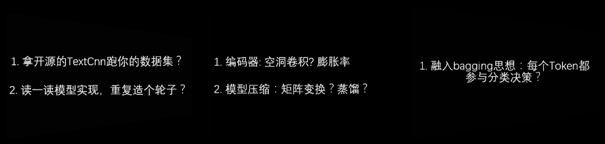
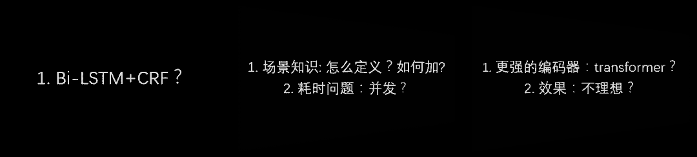
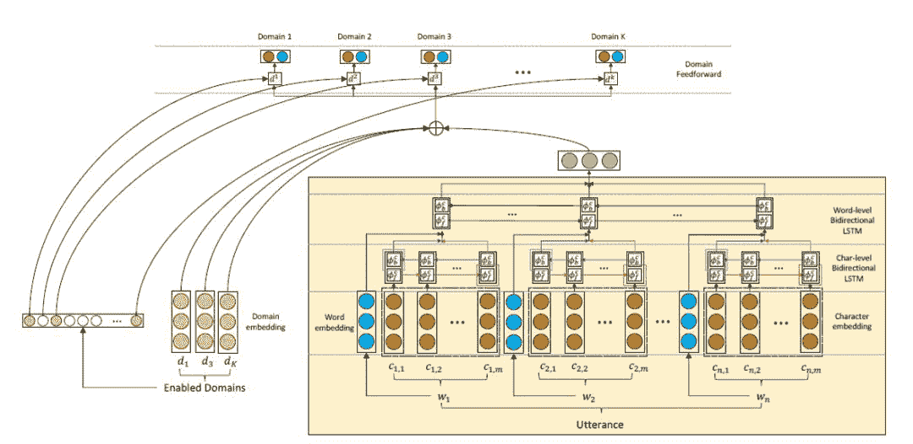

Datawhale原创

**作者：****康兵兵，Datawhale成员**

寄语：NLP入门，科学有效的方法是找到切入点，一个具体任务。从任务实践入手，做到既见树木也见森林。

笔者从2018年初开始接触机器学习，现在是某一线互联网公司的NLP算法工程师。从小白一步步走来，积累了一些学习和实践过程中的经验。现在，从个人情况、入门心得和案例分享三个方面，介绍一下NLP的入门经历和学习方法，希望能帮助到大家。

## **个**人情况

**1.0阶段**

**契机：**一个关于空气质量预测的数据挖掘类项目

**问题：**对ML领域并不了解，没有能力完成一个项目，作为项目负责人更是无从下手。

**解决办法**

*   快速通读领域知识，对机器学习宏观认知。利用一天半时间，快速看完谷歌的机器学习速成课程；

*   阅读论文并了解现有解决方案。主要关注相关领域的综述论文；

*   查漏补缺，对理论知识进行迭代。遇到不清晰的概念回顾相关内容，加深理解；

*   了解、借鉴，最后根据实际数据和场景进行改进。

**收获**

*   基于auto-encoder结构完成了初版模型；

*   所用编程语言变动，从matlab、Tflearn ，到最后的DeepLearning4j；

*   主要对机器学习和深度学习相关概念有了初步了解和实践，为后边的实习、比赛和工作打下了基础。

**2.0阶段**

**契机：**“去哪儿”公司实习，参与“蜻蜓旅行”的内部孵化项目。项目背景是根据用户给定的出发地、目的地及出行日期区间，为用户推荐价格最低的航班班次，帮助用户更好的决策。

**收获**

*   机器学习相关内容，从rf到xgboost，再到lightgbm，还有facebook的prophet；

*   实际场景问题加深了理论理解，理论反过来指导了我的实践，如此循环，令人收益匪浅。

**吐槽**：日常加班，特别在几次发版的日子里，需要工作到凌晨两点。

**3.0阶段**

**契机**：小米实习，工作内容与大数据相关。同期也拿到了百度金融的offer，但因为没有做过大数据，想要尝试一下，最终选择了小米。

**收获**：

*   对spark，Hadoop， Kafka等一套大数据相关技术栈有了一个基础的了解，对现在的工作也很有帮助；

*   尝试一个月后，发现还是喜欢做机器学习相关的。刚好接到了现在公司给我发的面试邀约，也比较顺利地拿到了offer。这段经历坚定了我走机器学习这条路，也给我之后转型做nlp下定了决心。所以，如果有机会的话，尽量多去尝试。

**4.0阶段**

研究生毕业后，入职到现在，这期间伴随着打比赛，做项目。这个阶段的内容会穿插在后边给大家分享。

## 入门心得

笔者认为，科学有效的入门方法是找到一个切入点，它应该是一个比较具体的任务。这个任务不建议复杂，完全可以从简单任务入手，比如做文本分类或者序列标注等。这个切入点于我们来说，就像是树根对大树一样，给了一个在NLP领域扎根的支撑点，你可以从它入手，向下不断深究这个领域；同时，你还可以借由深度拓宽广度，增加横向的视野。下面，利用文本分类和实体识别两个任务，来阐述我的入门方法。

**文本分类**

文本分类任务比较简单，基本上也已经被做透了。但怎么去判断自己有没有完全理解这个任务呢？假设你从TextCnn这个模型入手



TextCnn模型学习过程

**步骤1：**跑模型。拿开源的模型去跑一跑你的数据集。跑完后得到了一个比较好的结果并不意味着工作就完成了。随后，有些同学也会选择读一读模型实现，自己造个轮子。这个工作会让你的工程能力得到一定提升，但仍然是不够的。

**步骤2：**进一步思考为什么有些模型work，有些模型不work，加深对任务及相关模型的理解，可以从以下几方面考虑：

*   比如挑选RNN系还是CNN系呢（可以从模型及数据特点入手分析，一个依赖整体，一个依赖N-gram）

*   如果选择了CNN系，那么是否可以尝试空洞卷积呢？

*   假如使用了空洞卷积，它的膨胀率要怎么选择呢，有没有什么技巧？这些都是可以去帮助你理解任务或者说是模型的工作。

**步骤3：**基本指标完成后，考虑做一些模型优化的工作，例如：模型压缩（剪枝、蒸馏、矩阵变换）的相关工作；

**步骤4：**发动你的奇思妙想，结合之前的知识来做这个任务，比如：是否可以把bagging思想融入分类任务中呢。举个列子，假如待分类Query有十个token，并且给每个token都赋予一个标签，就可以用投票来决定句子最终的标签，这个思想是哈工大的一篇论文提出的【详见Reference 1】。

当你深入地实践了上面几个步骤后，会发现分类任务其实在NLU或SLU也完全用得到，因为这些任务中包括意图识别这样的子任务，上面提到哈工大的那篇论文，就是做SLU的。

**序列标注**

笔者在去年10月份，参与了一个实体识别任务。该任务和百度的LAC（也就是词法分析）类似，即在一个任务里完成分词、词性标注、实体识别这三个子任务，但其本质也是序列标注问题，和NER是一致的。



序列标注任务实践过程

**步骤1：**跑模型。该任务最经典有效的模型是Bi-LSTM+CRF，可能你魔改了一些模型加上精调参数，最后效果还不如它。

**步骤2：**根据相关要求优化模型。

**2.1****：**允许加入场景知识的要求

*   如何定义场景知识。它可以认为是某个垂直领域下已有的词典。为什么可以这么定义呢，因为我们的任务就是找出实体（切分边界），那么你提前告诉模型可能的一些切分边界，不就相当于知识吗？

*   如何加入场景知识。采用N-gram的方式添加特征，简单来说就是根据词典计算每个token的2-gram~5-gram，然后用二进制标识是否存在该词，即可得到N-gram特征。

*   在加入特征的过程中，有几种策略。比如是把这个特征加在Embedding层之后，还是加在靠近输出层的位置；加入的特征是否需要分类呢等。这些点都可以深入探索，帮助我们更好的理解任务。

**2.2：**满足并发的要求

*   从编码器入手。例如：考虑用CNN代替LSTM（GRU），当你采用了CNN之后，可以考虑用矩阵变化来进行参数缩减从而压缩耗时（参考ALBERT）。

*   从解码器入手。尝试了编码器部分后，也可以考虑解码器部分，例如：用LAN替换CRF（虽然效果可能要差一点）。

**步骤3：**尝试用transformer做实验。因为transformer具有更强的特征抽取能力。但是根据当时的实验结果来看，效果其实不太理想。

*   **原因：**NER这个任务是比较依赖句子间单词的相对位置关系这一特征的。举个例子：“小明喜欢乔丹的品牌”，在这句话中，“乔丹”更可能是一个Person；“小明喜欢乔丹品牌”，在这句话中，“乔丹”更可能是一个Brand而不是一个Person。这两句话的差别就是“乔丹”这个词与“品牌”这个词的相对位置，一个是-2，一个是-1。而原始的transformer不能很好的表示方向性和相对位置，所以对于NER这个任务效果不理想。

*   **解决方案：**复旦大学邱锡鹏老师组在19年的一篇论文中提出了解决方法。论文中，对位置编码和参数缩减做了一些改进【详见Reference 2】。

按照上面过程实践，你会发现你对NER这个任务的理解会慢慢加深。同样，在深入实践了序列标注这个任务后你会发现，这些技术在NLU里也完全都能用到，因为NLU的槽位填充就是一个序列标注任务。

当你完成了上面提到的分类任务和序列标注任务之后，就可以将两者结合起来去做NLU。过程中你可能需要学习如何使用Attention。再比如小样本学习，其中的一个解决思想就是交互匹配算距离的过程。如果你对（检索式）问答比较熟悉的话，就可以更快的上手。

**通过上述两个案例的讲解，笔者想要表达的观点是：**

*   切入点复杂与否没有那么重要，重要的是动手实践，并且深入理解该任务和相关模型，不断思考。这样就可以从简单问题过渡到复杂问题。

*   用深度（对任务的理解程度）来拓展宽度（了解不同的任务）。同时，伴随着深度的加深，又迫使我们不断地获取知识来拓宽视野，这两个形成了一个良性的循环。

*   既见树木也见森林。首先，快速过一遍当前领域的综述或者权威资料，掌握该领域的一些基本概念、基本任务定义及评价指标。然后，拿一些项目或者比赛练手。最后，在实践的过程中不断反思，当遇到理论盲点时，要对知识点进行补充，形成实践和理论的闭环操作。

切忌在初学时期一头扎进理论知识的海洋里无法自拔，这样学习效率并不高，而且会很大程度上打击学习的热情。

## 案例分享

最后，简单分享一个在工作中遇到的案例：Domain分类拓展。它是一个分类任务，待解决问题：能够快速支持分类未训练的领域，意义在于快速响应用户需求。举个例子，假设我们本来支持10个分类，突然有天用户希望可以额外支持新增的5个分类，也就是一共15个类，那么就希望在不重新训练15个分类的情况下，快速支持用户的新需求。



模型的整体结构

完成Domain分类拓展任务的具体解决方案和图中略有出入，但可以从以下三个方面来着手：

**1\. 编码器/分类器解耦**。该部分的作用是，当新增类别时可以把编码器冻结，只需训练新增的分类器就好。

*   图中黄色的框是编码器部分，它的输入是一个句子，绿色部分是它的输出**h**（一个固定维度的向量），编码器类型可以自由选择。

*   分类器就是图里的一个个小框框，一个框是一个分类器。每个分类器有两个输出单元：红色和蓝色；假如经过softmax之后红色比蓝色大，定义为正类，否则为反类。

**2\. 增量学习**。假设已经有一个100-Domain的分类器，现在需要新增20个Domain。如果之前的100个Domain有100W条数据，新增的20个Domain仅有5W数据。在此基础下，不需要对105W全量数据进行训练，仅需要5W（新增Domain）+1W（已有Domain）数据训练就好。

**3\. Attention**。1和2保证了时间要求，Attention则保证了准确率要求。

*   了解domain-embedding的概念，也就是图中的左下方。简单理解domain-embedding其实和word-embedding是一个意思，只不过这里的“词表”对应你有多少个Domain，向量具体如何得出不做展开【详见Reference 3】，只需要记住它是一个类似word-embedding的参数矩阵就好。

*   开始做Attention，有如下三个选择：

    **选择1**：所有分类器输入相同，但参数不同。把domain-embedding（假设每个domain维度256，有100个Domian需要分类）当做**K**（同时也是**V**），那么**K**就是一个100*256的向量；然后用上面提到的句子编码向量**h**作为**Q**，计算**Q**和**K**的相似度得到一个1*100的权重，依据这个权重对**V**进行加权平均；最终得到的结果依次被当做每个分类器的输入。

    **选择2**：所有分类器的输入不同。把每个Domain的domain-embedding（假设每个Domain维度256）拿出来作为**Q**，那么**Q**就是一个1*256的向量；然后用上面提到的句子编码向量**h**作为**K**(假设句子长度固定为35，同时也是**V**)，计算**Q**和**K**的相似度得到一个1*35的权重，依据这个权重对**V**进行加权平均；最终得到的结果依次被当做每个分类器的输入。

    **选择3**：选择1+选择2结合使用。


Reference


1.  A Stack-Propagation Framework with Token-Level Intent Detection for Spoken Language Understanding

2.  TENER: Adapting Transformer Encoder for Named Entity Recognition

3.  Efficient Large-Scale Domain Classification with Personalized Attention

```
AI学习路线和优质资源，在后台回复"AI"获取 
```