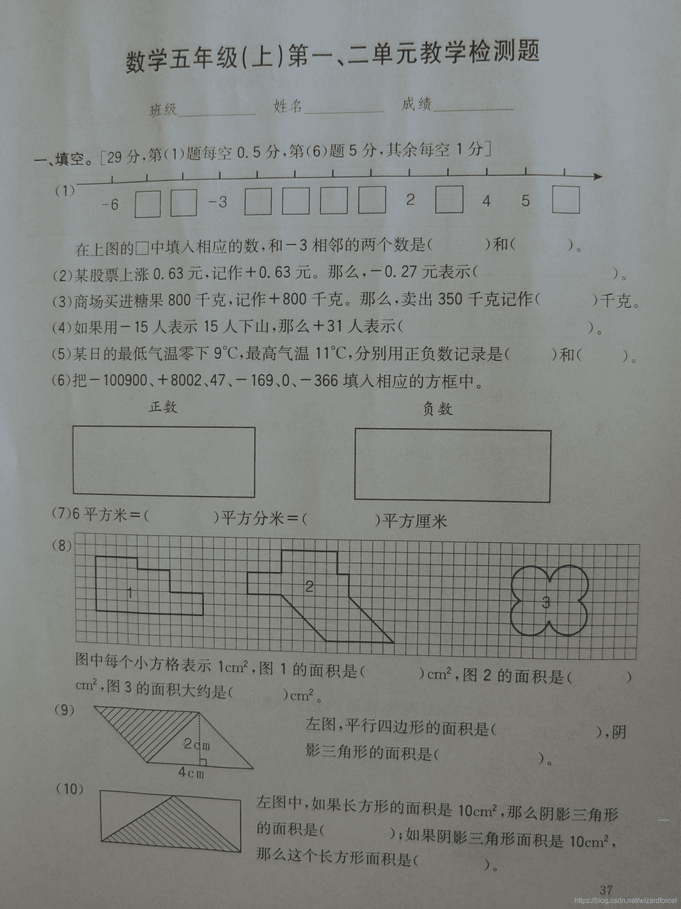
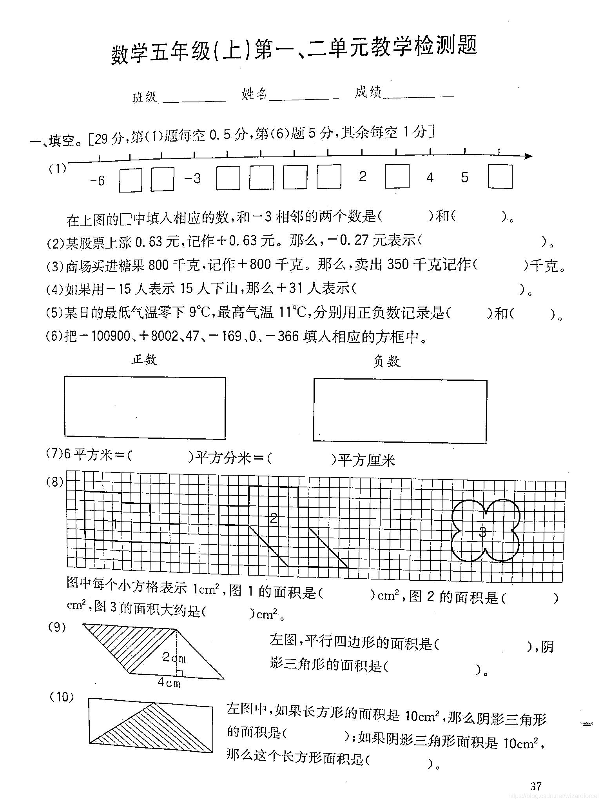

扫描全能王的增强锐化其实是自适应二值化的变体。

直接用 OpenCV 的函数会让背景变花，因为背景是渐变的，直接拿均值当阈值的话，总有一些背景像素在阈值下面。所以需要将阈值乘以一个系数，比如 0.9，过滤掉所有背景。同时，因为文字的像素值很小，不受影响。

```
import numpy as np
from scipy import signal

def adaptive_thres(img, win=9, beta=0.9):
    if win % 2 == 0: win = win - 1
    # 边界的均值有点麻烦
    # 这里分别计算和和邻居数再相除
    kern = np.ones([win, win])
    sums = signal.correlate2d(img, kern, 'same')
    cnts = signal.correlate2d(np.ones_like(img), kern, 'same')
    means = sums // cnts
    # 如果直接采用均值作为阈值，背景会变花
    # 但是相邻背景颜色相差不大
    # 所以乘个系数把它们过滤掉
    img = np.where(img < means * beta, 0, 255)
    return img 
```


