前阵子微软开源了DeepSpeed训练框架，从测试效果来看有10倍的速度提升，而且对内存进行了各种优化，最大可以训练100B(illion)参数的模型。同时发布了这个框架训练出的17B模型 Turing-NLG，处于目前壕赛事的顶端。

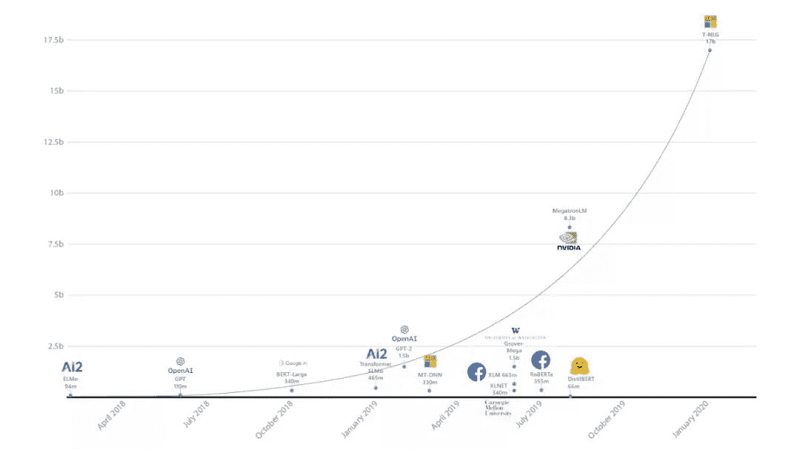

训100B的模型就先别想了（狗头），先把110M的BERT-base训好上线吧。本文主要介绍模型训练中速度和内存的优化策略，针对以下几种情况：

1.  我明天就要答辩了，今天必须把这十个实验跑完

2.  我的模型有些大，好不容易放到一张卡上，训完一亿样本之前我就可以领N+1了

3.  我想出了一个绝妙的T6模型，却加载不进12GB的卡里，又拿不到今年的best paper了

（以上纯属虚构，如有雷同请赶紧看下文）

现实总是残酷的，其实限制大模型训练只有两个因素：**时间和空间(=GPU=钱)**，根据不同情况可以使用的方案大致如下：

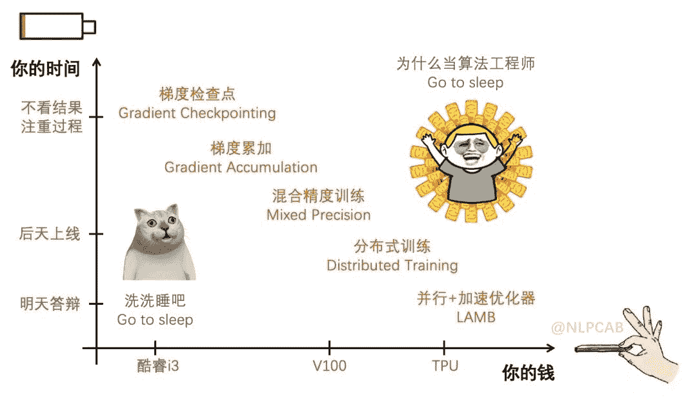

### 1\. 梯度累加 Gradient Accumulation

如果只有单卡，且可以加载模型，但batch受限的话可以使用梯度累加，进行N次前向后反向更新一次参数，相当于扩大了N倍的batch size。

正常的训练代码是这样的：

```
for i, (inputs, labels) in enumerate(training_set):
  loss = model(inputs, labels)              # 计算loss
  optimizer.zero_grad()								      # 清空梯度
  loss.backward()                           # 反向计算梯度
  optimizer.step()                          # 更新参数 
```

加入梯度累加后：

```
for i, (inputs, labels) in enumerate(training_set):
  loss = model(inputs, labels)                    # 计算loss
  loss = loss / accumulation_steps                # Normalize our loss (if averaged)
  loss.backward()                                 # 反向计算梯度，累加到之前梯度上
  if (i+1) % accumulation_steps == 0:
      optimizer.step()                            # 更新参数
      model.zero_grad()                           # 清空梯度 
```

要注意的是，batch扩大后，如果想保持样本权重相等，**学习率也要线性扩大或者适当调整**。另外**batchnorm也会受到影响**，小batch下的均值和方差肯定不如大batch的精准，可以调整BN中的momentum参数解决[2]。

### 2\. 梯度检查点 Gradient Checkpointing

如果只有一张卡，又想训大模型，可以尝试压缩模型所占显存。

梯度检查点是一种以时间换空间的方法，通过减少保存的激活值压缩模型占用空间，但是在计算梯度时必须从新计算没有存储的激活值。

细节可以参考陈天奇的Training Deep Nets with Sublinear Memory Cost[3]，最近的Reformer（参考RevNet）也是这种思想[4]。

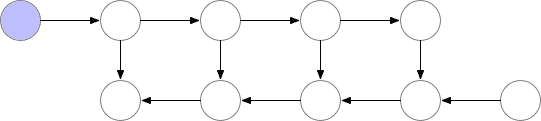

<figcaption></figcaption>

注：第一行节点是前向，第二行是反向

### 3\. 混合精度训练 Mixed Precision Training

混合精度训练在单卡和多卡情况下都可以使用，通过cuda计算中的half2类型提升运算效率。**一个half2类型中会存储两个FP16的浮点数，在进行基本运算时可以同时进行，因此FP16的期望速度是FP32的两倍**。举个Gelu的FP16优化栗子：

```
//FP32的gelu运算float gelu(float x)
{
  float cdf = 0.5f * (1.0f + tanhf((0.7978845608028654f * (x + 0.044715f * x * x * x))));
  return x * cdf;
}
//FP16的gelu运算half2 gelu(half2 val)
{
  half2 val_pow3 = __hmul2(val, __hmul2(val, val)); //同时计算两个x*x*x
  float2 tmp_pow = __half22float2(val_pow3);
  float2 cdf =  __half22float2(val);
  //由于tanhf不支持half2类型，只能分开算
  cdf.x = 0.5f * (1.0f + tanhf((0.7978845608028654f * (cdf.x + 0.044715f * tmp_pow.x))));
  cdf.y = 0.5f * (1.0f + tanhf((0.7978845608028654f * (cdf.y + 0.044715f * tmp_pow.y))));
  //同时计算两个x * cdf;return __hmul2(val, __float22half2_rn(cdf));
} 
```

混合精度训练[5]不是很难理解，但要注意以下几点：

1.  混合精度训练不是单纯地把FP32转成FP16去计算就可以了，只用FP16会造成80%的精度损失

2.  Loss scaling：由于梯度值都很小，用FP16会下溢，因此先用FP32存储loss并放大，使得梯度也得到放大，可以用FP16存储，更新时变成FP32再缩放

3.  在涉及到累加操作时，比如BatchNorm、Softmax，FP16会上溢，需要用FP32保存，一般使用GPU中TensorCore的FP16*FP16+FP32=FP32运算

**整体流程：FP32权重 -> FP16权重 -> FP16计算前向 -> FP32的loss，扩大 -> 转为FP16 -> FP16反向计算梯度 -> 缩放为FP32的梯度更新权重**

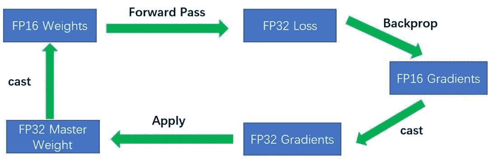

！！手工分割线：接下来就是壕赛道了！！

### 4\. 分布式训练 Distributed Training

分布式训练就是多张卡并行训练，一般有以下两种情况：

*   Multi-GPU：单机多卡，通过PCIE、NVlink、GPU Direct P2P来通信

*   Multi-Node：多机多卡，通过Sockets (Ethernet) 或者InfiniBand with GPU Direct RDMA通信

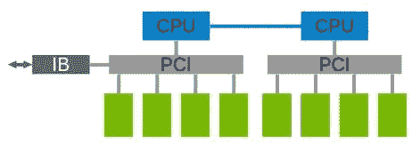

实践中可以使用英伟达的NCCL通信框架，多机通过IB(InfiniBand)可以接近机内的通信速度[6]。底层的东西就不多说了（我也不太懂），实际上对于炼丹师来说就是找运维爸爸提供帮助，并借助开源框架配置上服务器地址就行了。

**并行训练有多种优化策略，主要目的就是减少计算中的参数同步(Sync)和数据传输。**

目前32GB的卡最多能放1.3B参数的模型，塞得下的话可以使用数据并行的方式，否则可以把不同层放在不同机器上进行训练。两种方式的区别看下图[7]就明白啦：

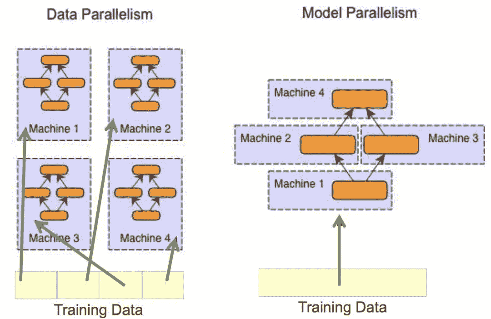

#### 4.1 数据并行 Data Parallelism

数据并行有两种方式[9]：

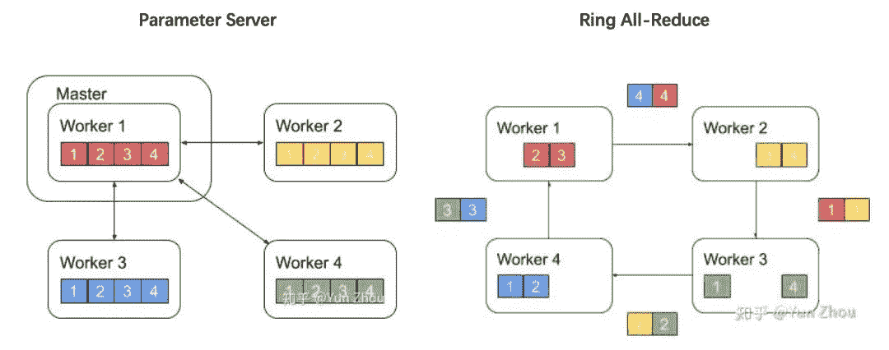

**Parameter Server**

集群中有一个master和多个worker，master需要等待所有节点计算完毕统一计算梯度，在master上更新参数，之后把新的参数广播给worker。这种方式的主要瓶颈在master，因此也可以异步训练，即不等待其他节点，收到一个worker的梯度后就更新参数，但这样其他worker在旧参数上算完后的梯度会作用到新参数上，导致模型优化过头，陷入次优解。

**Ring All-Reduce**

集群中所有worker形成一个闭环，把数据分成K份，计算完一份就把累加好的梯度传给下家，同时接受上家的梯度，迭代到最后所有worker的梯度都是相等的，可以同步更新参数，比PS架构要高效，是目前的主流方式。下图[10]展示了Scatter Reduce和All Gather两个阶段：

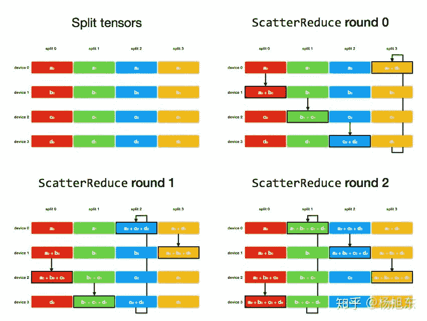

<figcaption>preview</figcaption>

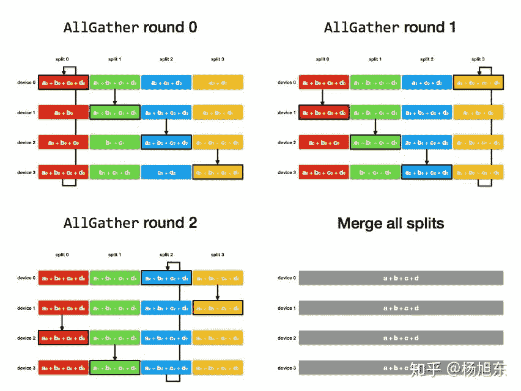

#### 4.2 模型并行 Model Parallelism

模型并行目前并不常见，一是因为大部分模型单卡都放得下，二是因为通讯开销比数据并行多，因为反向传播需要把loss对每层激活值的梯度都传回去，样本数量大的话激活值也有很多。

**Pipelined Parallelism**

Pipeline的并行方式就是把模型的不同层放到不同机器上，顺序地进行前向和反向计算。19年谷歌和微软先后放出了GPipe[11]和PipeDream[12]的论文和源码，给大家梳理一下他们的心路历程：

首先来看最naive的模型并行方式，实在是有些浪费生命：

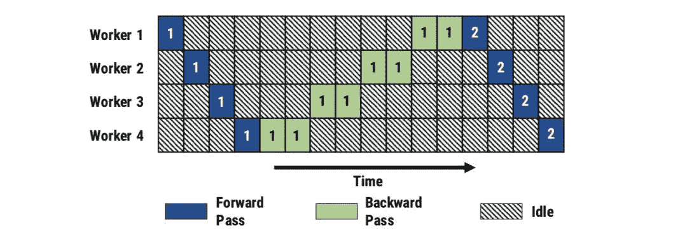

注：反向需要计算对参数和激活值的偏导，所以耗时更长。

所以谷歌GPipe提出了一个改进，其实就是把数据分片，像allreduce一样计算完一些就传给下个节点，最后**同步**更新参数，但这样看还是不能挽救我们的青春：

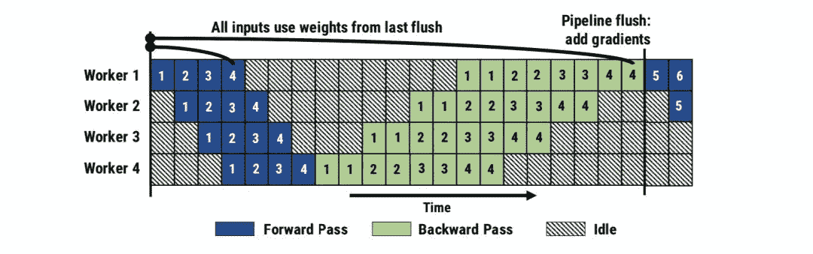

于是微软提出了PipeDream，其实就是**把同步变为了小数据上的异步**，计算完一个数据分片就立刻反向，反向完了就更新梯度，谁也别等谁，大家一起疯狂干起来：

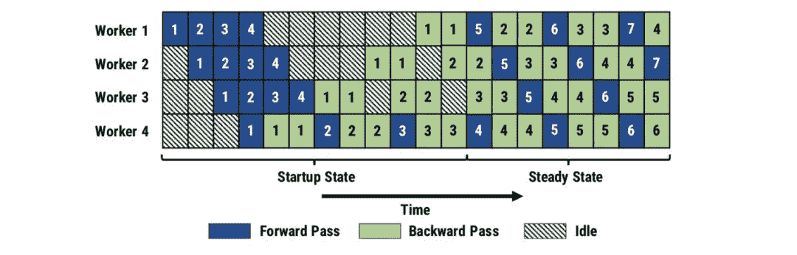

但这样就有一个问题，就是大家越干越乱，比如worker1在计算5的前向时用的是1反向后的参数，但之后计算5反向的梯度时参数早就被2/3/4更新了。于是作者加入了**Weight stashing**机制，把每个数据对应的参数都存起来！这样worker1在5反向的时候就可以从百宝箱里拿出之前的参数，进行更新：

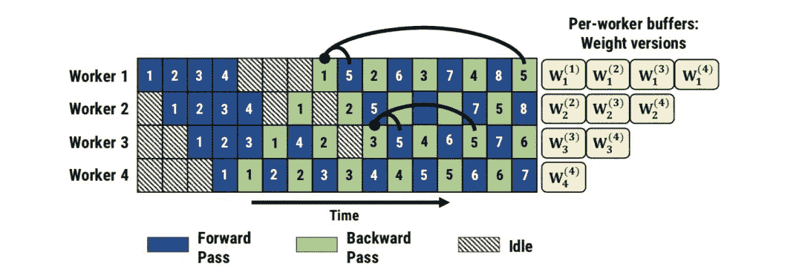

那问题又来了：worker1上5的前向是用1的参数，但worker3上是用3的，最后汇总的时候不就又乱了？于是作者又加入了**Vertical Sync**机制，强制所有worker在计算5的时候都用1的参数。这样在最后汇总模型的时候，就能拿到一致的参数了。但这样同步会导致很多计算作废，比如5更新时用的1的权重，但2/3/4的权重都白计算了，所以默认是不用Vertical Sync的，这样每层虽然不完全一致，但由于weight stashing，所有的参数都是有效的。

**Tensor Slicing**

神经网络可以看作一个复合函数，本质就是各个tensor之间的计算，我们定义好的CNN、RNN其实就是计算函数的集合。从这个角度来思考，**模型并行其实就是把各个tensor计算分散到不同的机器上**。这方面的研究有18年的FlexFLow和Mesh-TensorFlow，英伟达的威震天[13]也是使用这个策略。下面以Transformer为例说明一下如何拆分。

Transformer主要有self-attention和FFN组成，对于FFN中的第一层Y=GLUE(XA)可以有两种拆分方式：

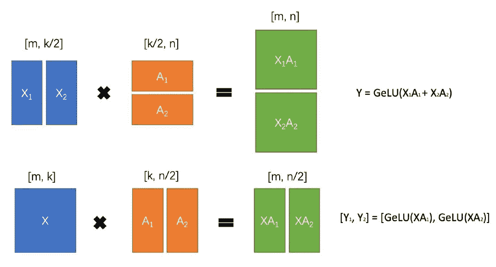

可以看到，第一种需要在计算GLUE时同步，因此威震天通过第二种方式进行tensor切片，self-attention也采用类似的策略，这样只需要在前向时通过g聚合，反向时通过f聚合就可以了：

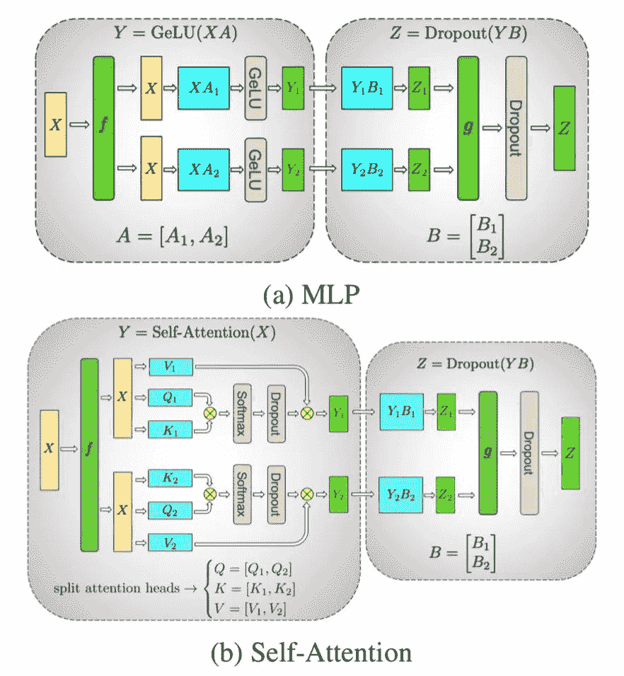

剩下的Layernorm和dropout还是需要同步后计算：

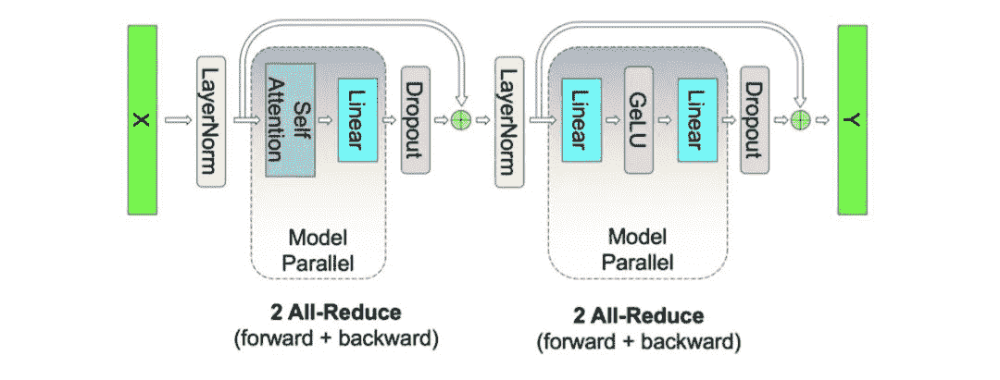

同时，作者也在vocab的维度对embedding进行了切分，并把最后的MLM预测和cross-entropy融合到一起，减少网络通信量（否则需要传输batch_size*seq_len *vocab_size个prob，改过后只传batch_size *seq_len个loss值）。

随着模型越来越大，分布式训练甚至推理肯定是一个趋势，在工程上还有很多可以优化的点，不仅是上面介绍的分布式策略，还有网络通信优化、内存优化等。

### 5\. 加速优化器 LAMB

上文提到的数据并行虽然可以接近线性地提升训练速度，但过大的Batch会降低模型精度和收敛速度（对数据的拟合变差）。因此谷歌在19年推出了LAMB[14]优化器，全称为**Layer-wise Adaptive Moments optimizer for Batch training**，针对大batch做了优化，在分布式训练的场景下可训65536/32768的样本，减少迭代次数，从而缩短训练时间，感受一下金钱的味道：

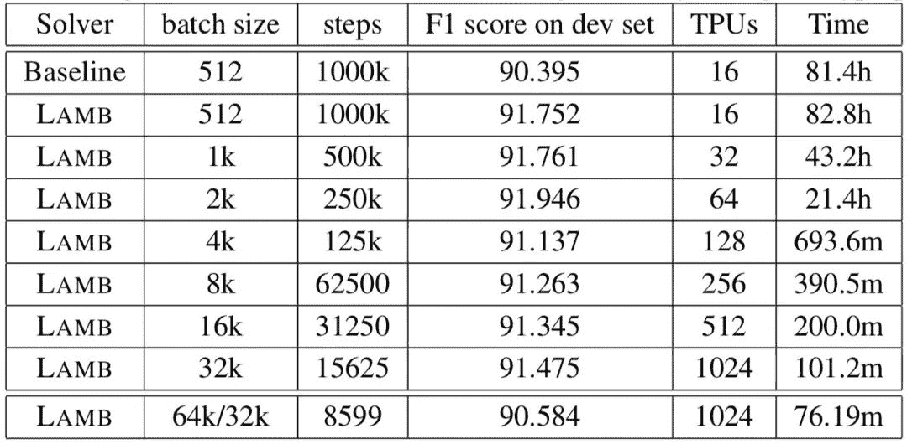

LAMB主要是综合了Adam和LARS（Layerwise Adaptive Rate Scaling），对学习率进行调整。上文提到当batch变大时学习率也需要变大，这样会导致收敛不稳定，LARS通过给LR乘上权重与梯度的norm比值来解决这个问题[15]：

这里的norm都是取一层的权重计算，所以是layerwise。可以这样理解上面的公式：刚开始训练时，权重比较小，而loss和梯度比较大，所以学习率开始较小，但随着权重变大&梯度变小会慢慢warmup。当对一些样本拟合很好，loss接近0时，梯度变小，学习率又会增大，跳出局部最优，防止过拟合。

LAMB融合了这种layerwise的自适应思想：

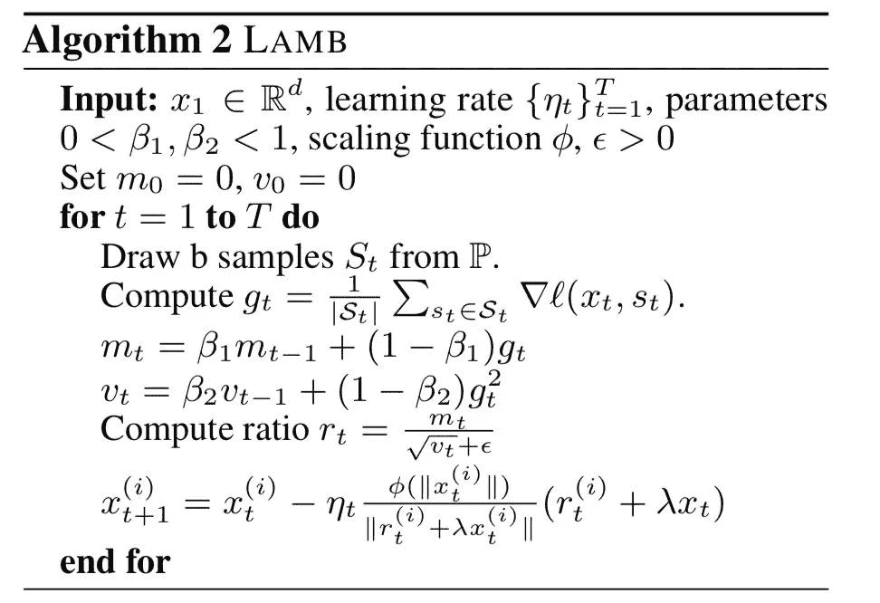

图中的公式稍稍有改动，一个是给权重norm加了映射，本质都是起scale的作用；另一个是梯度公式中加了weight decay，也就是目标函数中的L2正则化。

### 总结

本文介绍了从速度和内存去优化模型训练的几种方式，实践中各种都是可以混合起来的，比如混合精度+数据并行、数据并行+模型并行、数据并行+梯度检查点等。DeepSpeed里基本涵盖了本文所讲的策略，用pytorch的同学可以安排起来了～

最后，在介绍各种策略的时候，由于篇幅原因也有省略一些假设和最终效果，感兴趣的同学们可以深入研读参考资料里的内容～如果路过的大佬们发现哪里有错误烦请指出～

### 参考资料

[1]. 微软Turing-NLG：https://www.microsoft.com/en-us/research/blog/turing-nlg-a-17-billion-parameter-language-model-by-microsoft/

[2]. 梯度累加：https://www.zhihu.com/question/303070254/answer/573037166

[3]. 陈天奇 Training Deep Nets with Sublinear Memory Cost：https://www.zhihu.com/question/274635237/answer/755102181

[4]. 高开远 Reformer解读：https://zhuanlan.zhihu.com/p/104935987

[5]. 混合精度训练：https://zhuanlan.zhihu.com/p/84219777

[6]. 英伟达NCCL：https://www.zhihu.com/question/63219175/answer/206697974

[7]. 数据并行与模型并行：https://www.zhihu.com/question/53851014/answer/158794752

[8]. 分布式之数据并行：https://zhuanlan.zhihu.com/p/68615246

[9]. AllReduce：https://zhuanlan.zhihu.com/p/100012827

[10]. AllReduce细节：https://zhuanlan.zhihu.com/p/56991108

[11]. GPipe：https://arxiv.org/pdf/1811.06965.pdf

[12]. PipeDream：https://arxiv.org/pdf/1806.03377.pdf

[13]. Megatron-LM：https://arxiv.org/abs/1909.08053

[14]. LAMB：https://arxiv.org/abs/1904.00962v3

[15]. LAMB解读：https://towardsdatascience.com/an-intuitive-understanding-of-the-lamb-optimizer-46f8c0ae4866

```
AI学习路线和优质资源，在后台回复"AI"获取 
```