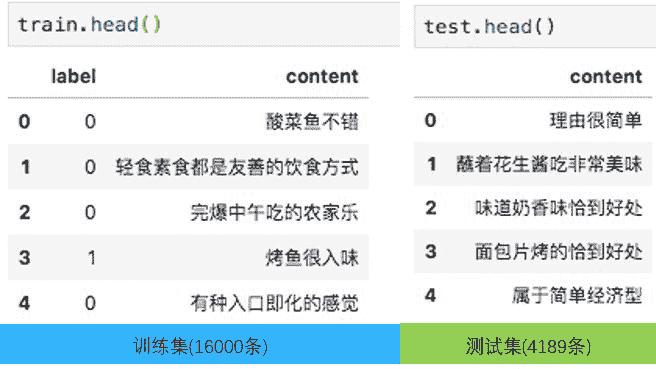

Datawhale

**作者：****高宝丽，Datawhale优秀学习者**

寄语：Bert天生适合做分类任务。文本分类有fasttext、textcnn等多种方法，但在Bert面前，就是小巫见大巫了。

推荐评论展示指的是从众多用户评论中选出一个作为店铺的推荐理由，以希望更多的人点开这个店铺。

这像是一个推荐系统，因为要把合适的评论推荐给不同用户看。比如，同样一家粤菜餐厅，用户A对环境要求高，如果推荐理由是“环境好”的话，A就会点进去；而用户B更加关注菜的口味，对环境要求不高，那么推荐理由像“好吃到爆”的话，B更有可能点进去。也就是说，同样一家店铺，根据用户喜好，不同人看到的推荐理由不同。

本次任务是一个典型的短文本(最长20个字)二分类问题，使用预训练的Bert解决。下面，从题目描述、解题思路及代码实现进行讲解。

## 题目描述

**背景描述**

本次推荐评论展示任务的目标是从真实的用户评论中，挖掘合适作为推荐理由的短句。点评软件展示的推荐理由应该满足以下三个特点：

*   具有长度限制

*   内容相关性高

*   具有较强的文本吸引力

一些真实的推荐理由如下图蓝框所示：


**数据集**

该任务是一个二分类任务，故正负样本比是比较重要的。该训练集共16000条，正负样本比约为1：2，有一些不平衡，但总体不算严重。

***数据链接***：https://pan.baidu.com/s/1z_SJ5KhHLh-uMENnGpwlxA 提取码: mb6f

或在Datawhale后台回复关键词 推荐数据 获取



## 解题思路

**ML/DL的前提假设**

不管是机器学习还是深度学习，都基于“训练集和测试集独立同分布”的前提假设。只有满足这个前提，模型的表现才会好。简单地分析文本长度，如果训练集是短文本，测试集是长文本的话，模型不会表现太好。

```
train['length'] = train['content'].apply(lambda row:len(row))
test['length'] = test['content'].apply(lambda row:len(row)) 
```

对数据分析结果如下图：


对于评论长度，可以看出以下两点特征：

*   训练集和测试集的分位数几乎是一模一样的：


*   在看训练集和测试集的均值和标准差也大致相同

| 
 | 均值
 | 标准差
 |
| 训练集
 | 8.67
 | 3.18
 |
| 测试集
 | 8.63
 | 3.11
 |

所以，训练集和测试集在评论长度上来说，是独立同分布的，且label为0和label为1的长度差不太多，将文本长度作为特征对分类的作用不大。同时得出，如果我们的模型在训练集上表现比较好的话，也有理由相信其在测试集上会表现良好。

**主要思路**

文本分类有很多种方法，fasttext、textcnn或基于RNN的等，但在Bert面前，这些方法就如小巫见大巫。Bert天生就适合做分类任务。

官方做法是取[CLS]对应的hidden经过一个全连接层来得到分类结果。这里为了充分利用这个时间步的信息，把Bert最后一层取出来，然后进行一些简单的操作，如下：

*   Bert，得到每个时间步的一个隐层的表示，时间步t就是句子长度。

*   综合时间步隐层表示信息，有三种方法：全局平均池化、全局最大池化及[CLS]与序列其他位置的注意力得分。

*   将综合信息放入全连接层，进行文本分类。

**模型训练**

用了五折交叉验证，即：将训练集分为五部分，一部分做验证集，剩下四部分做训练集，相当于得到五个模型。由下图可看出，验证集组合起来就是训练集。五个模型对测试集的预测取均值得到最终的预测结果。


因为Bert模型是有非常多参数的，而训练集只有16000条，为了防止过拟合，采用了early stopping的方法。

Keras实现如下：

```
from keras_bert import load_trained_model_from_checkpoint, Tokenizer
from keras_self_attention import SeqSelfAttention

def build_bert(nclass, selfloss, lr, is_train):
    """
    nclass:output层的节点数；
    lr:学习率；
    selfloss:损失函数
    is_train:是否微调bert
    """

    bert_model = load_trained_model_from_checkpoint(config_path, checkpoint_path, seq_len=None)

    for l in bert_model.layers:
        l.trainable = is_train

    x1_in = Input(shape=(None,))
    x2_in = Input(shape=(None,))

    x = bert_model([x1_in, x2_in])
    x = Lambda(lambda x: x[:, :])(x)

    avg_pool_3 = GlobalAveragePooling1D()(x)
    max_pool_3 = GlobalMaxPooling1D()(x)
    attention_3 = SeqSelfAttention(attention_activation='softmax')(x)
    attention_3 = Lambda(lambda x: x[:, 0])(attention_3)

    x = keras.layers.concatenate([avg_pool_3, max_pool_3, attention_3])
    p = Dense(nclass, activation='sigmoid')(x)

    model = Model([x1_in, x2_in], p)
    model.compile(loss=selfloss,
                  optimizer=Adam(lr),
                  metrics=['acc'])
    print(model.summary())
    return model 
```

也尝试了一些复杂操作（比如后面接一个CNN或者接一层GRU）；还尝试了把最后三层的特征都取出来做一些操作，虽然效果没有提升，但也还不错。

**优化改进**

训练集中正负样本比为1：2，虽然样本不平衡不明显，但也算不上平衡。一般损失函数是交叉熵，但交叉熵与AUC之间并不是严格单调的关系，交叉熵的下降并不一定能带来AUC的提升，最好的方法是直接优化AUC，但AUC难以计算。

在样本平衡的时候AUC、F1、准确率(accuary)效果是差不多的。但在样本不平衡的时候，accuary是不可以用来做评价指标的，应该用F1或者AUC来做评价指标。仔细想想，AUC和F1都是与Precision和Recall有关的，所以就选择直接优化F1。但F1是不可导的，也是有办法的，推荐苏剑林大佬写的函数光滑化杂谈：不可导函数的可导逼近。直接用F1_loss做损失函数。

```
def f1_loss(y_true, y_pred):
    # y_true:真实标签0或者1；y_pred:为正类的概率
    loss = 2 * tf.reduce_sum(y_true * y_pred) / tf.reduce_sum(y_true + y_pred) + K.epsilon()
    return -loss 
```

## 结果分析

**模型1**：batch=16，交叉熵损失函数，学习率1e-5，微调Bert层，即：

```
build_bert(1, 'binary_crossentropy', 1e-5, True) 
```

**模型2**：加载模型1，固定Bert层，微调全连接层，batch依旧为16，学习率取为1e-7，即：

```
build_bert(1, f1_loss, 1e-7, False) 
```

比较如下：


完整代码


GPU上大概运行1小时，CPU也是可以跑的，可能需要四五小时

```
import keras
from keras.utils import to_categorical
from keras.layers import *
from keras.callbacks import *
from keras.models import Model
import keras.backend as K
from keras.optimizers import Adam
import codecs
import gc
import numpy as np
import pandas as pd
import time
import os
from keras.utils.training_utils import multi_gpu_model
import tensorflow as tf
from keras.backend.tensorflow_backend import set_session
from sklearn.model_selection import KFold
from keras_bert import load_trained_model_from_checkpoint, Tokenizer
from keras_self_attention import SeqSelfAttention
from sklearn.metrics import roc_auc_score
# 线下0.9552568091358987 batch = 16 交叉熵 1e-5  线上 0.96668
# 线下0.9603767202619631 batch = 16 在上一步基础上用f1loss 不调bert层 1e-7 线上0.97010

class OurTokenizer(Tokenizer):
    def _tokenize(self, text):
        R = []
        for c in text:
            if c in self._token_dict:
                R.append(c)
            elif self._is_space(c):
                R.append('[unused1]')  # space类用未经训练的[unused1]表示
            else:
                R.append('[UNK]')  # 剩余的字符是[UNK]
        return R

 def f1_loss(y_true, y_pred):
    # y_true:真实标签0或者1；y_pred:为正类的概率
    loss = 2 * tf.reduce_sum(y_true * y_pred) / tf.reduce_sum(y_true + y_pred) + K.epsilon()
    return -loss

def seq_padding(X, padding=0):
    L = [len(x) for x in X]
    ML = max(L)
    return np.array([
        np.concatenate([x, [padding] * (ML - len(x))]) if len(x) < ML else x for x in X
    ])

class data_generator:
    def __init__(self, data, batch_size=8, shuffle=True):
        self.data = data
        self.batch_size = batch_size
        self.shuffle = shuffle
        self.steps = len(self.data) // self.batch_size
        if len(self.data) % self.batch_size != 0:
            self.steps += 1

    def __len__(self):
        return self.steps

    def __iter__(self):
        while True:
            idxs = list(range(len(self.data)))

            if self.shuffle:
                np.random.shuffle(idxs)

            X1, X2, Y = [], [], []
            for i in idxs:
                d = self.data[i]
                text = d[0][:maxlen]
                # indices, segments = tokenizer.encode(first='unaffable', second='钢', max_len=10)
                x1, x2 = tokenizer.encode(first=text)
                y = np.float32(d[1])
                X1.append(x1)
                X2.append(x2)
                Y.append([y])
                if len(X1) == self.batch_size or i == idxs[-1]:
                    X1 = seq_padding(X1)
                    X2 = seq_padding(X2)
                    Y = seq_padding(Y)
                    # print('Y', Y)
                    yield [X1, X2], Y[:, 0]
                    [X1, X2, Y] = [], [], []

def build_bert(nclass, selfloss, lr, is_train):
    bert_model = load_trained_model_from_checkpoint(config_path, checkpoint_path, seq_len=None)

    for l in bert_model.layers:
        l.trainable = is_train

    x1_in = Input(shape=(None,))
    x2_in = Input(shape=(None,))

    x = bert_model([x1_in, x2_in])
    x = Lambda(lambda x: x[:, :])(x)

    avg_pool_3 = GlobalAveragePooling1D()(x)
    max_pool_3 = GlobalMaxPooling1D()(x)
    # 官方文档：https://www.cnpython.com/pypi/keras-self-attention
    # 源码 https://github.com/CyberZHG/keras-self-attention/blob/master/keras_self_attention/seq_self_attention.py
    attention_3 = SeqSelfAttention(attention_activation='softmax')(x)
    attention_3 = Lambda(lambda x: x[:, 0])(attention_3)

    x = keras.layers.concatenate([avg_pool_3, max_pool_3, attention_3], name="fc")
    p = Dense(nclass, activation='sigmoid')(x)

    model = Model([x1_in, x2_in], p)
    model.compile(loss=selfloss,
                  optimizer=Adam(lr),
                  metrics=['acc'])
    print(model.summary())
    return model

def run_cv(nfold, data, data_test):
    kf = KFold(n_splits=nfold, shuffle=True, random_state=2020).split(data)
    train_model_pred = np.zeros((len(data), 1))
    test_model_pred = np.zeros((len(data_test), 1))

    lr = 1e-7  # 1e-5
    # categorical_crossentropy (可选方案：'binary_crossentropy', f1_loss)
    selfloss = f1_loss
    is_train = False  # True False

    for i, (train_fold, test_fold) in enumerate(kf):
        print('***************%d-th****************' % i)
        t = time.time()
        X_train, X_valid, = data[train_fold, :], data[test_fold, :]

        model = build_bert(1, selfloss, lr, is_train)
        early_stopping = EarlyStopping(monitor='val_acc', patience=3)
        plateau = ReduceLROnPlateau(monitor="val_acc", verbose=1, mode='max', factor=0.5, patience=2)
        checkpoint = ModelCheckpoint('/home/codes/news_classify/comment_classify/expriments/' + str(i) + '_2.hdf5', monitor='val_acc',
                                     verbose=2, save_best_only=True, mode='max', save_weights_only=False)

        batch_size = 16
        train_D = data_generator(X_train, batch_size=batch_size, shuffle=True)
        valid_D = data_generator(X_valid, batch_size=batch_size, shuffle=False)
        test_D = data_generator(data_test, batch_size=batch_size, shuffle=False)

        model.load_weights('/home/codes/news_classify/comment_classify/expriments/' + str(i) + '.hdf5')

        model.fit_generator(
            train_D.__iter__(),
            steps_per_epoch=len(train_D),
            epochs=8,
            validation_data=valid_D.__iter__(),
            validation_steps=len(valid_D),
            callbacks=[early_stopping, plateau, checkpoint],
        )

        # return model
        train_model_pred[test_fold] = model.predict_generator(valid_D.__iter__(), steps=len(valid_D), verbose=1)
        test_model_pred += model.predict_generator(test_D.__iter__(), steps=len(test_D), verbose=1)

        del model
        gc.collect()
        K.clear_session()

        print('time:', time.time()-t)

    return train_model_pred, test_model_pred

if __name__ == '__main__':

    config = tf.ConfigProto()
    config.gpu_options.per_process_gpu_memory_fraction = 0.8  # 定量
    config.gpu_options.allow_growth = True  # 按需
    set_session(tf.Session(config=config))

    t = time.time()
    maxlen = 20  # 数据集中最大长度是19
    config_path = '/home/codes/news_classify/chinese_L-12_H-768_A-12/bert_config.json'
    checkpoint_path = '/home/codes/news_classify/chinese_L-12_H-768_A-12/bert_model.ckpt'
    dict_path = '/home/codes/news_classify/chinese_L-12_H-768_A-12/vocab.txt'
    token_dict = {}
    with codecs.open(dict_path, 'r', 'utf8') as reader:
        for line in reader:
            token = line.strip()
            token_dict[token] = len(token_dict)

    tokenizer = OurTokenizer(token_dict)

    data_dir = '/home/codes/news_classify/comment_classify/'
    train_df = pd.read_csv(os.path.join(data_dir, 'union_train.csv'))
    test_df = pd.read_csv(os.path.join(data_dir, 'test.csv'))

    print(len(train_df), len(test_df))

    DATA_LIST = []
    for data_row in train_df.iloc[:].itertuples():
        DATA_LIST.append((data_row.content, data_row.label))
    DATA_LIST = np.array(DATA_LIST)

    DATA_LIST_TEST = []
    for data_row in test_df.iloc[:].itertuples():
        DATA_LIST_TEST.append((data_row.content, 0))
    DATA_LIST_TEST = np.array(DATA_LIST_TEST)

    n_cv = 5
    train_model_pred, test_model_pred = run_cv(n_cv, DATA_LIST, DATA_LIST_TEST)

    train_df['Prediction'] = train_model_pred
    test_df['Prediction'] = test_model_pred/n_cv

    train_df.to_csv(os.path.join(data_dir, 'train_union_submit2.csv'), index=False)

    test_df['ID'] = test_df.index
    test_df[['ID', 'Prediction']].to_csv(os.path.join(data_dir, 'submit2.csv'), index=False)

    auc = roc_auc_score(np.array(train_df['label']), np.array(train_df['Prediction']))
    print('auc', auc)

    print('time is ', time.time()-t)  # 2853s 
```


Reference


1\. How to Fine-Tune BERT for Text Classification?

2\. 苏剑林大佬写的函数光滑化杂谈：不可导函数的可导逼近