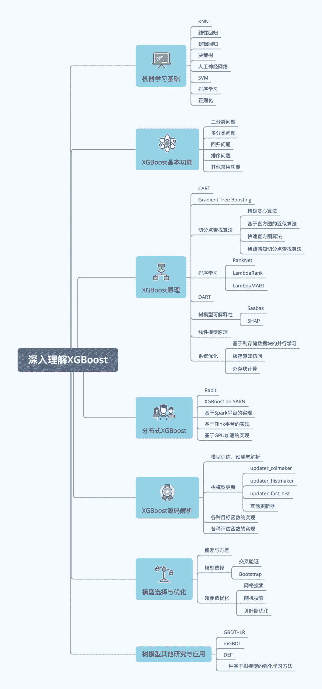
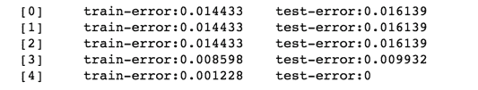

**导读：**本文介绍了集成学习中比较具有代表性的方法，如Boosting、Bagging等。而XGBoost是集成学习中的佼佼者，**目前，一些主流的互联网公司如腾讯、阿里巴巴等都已将XGBoost应用到其业务中。**本文对XGBoost的历史演化、应用场景及其优良特性进行了阐述，为入门XGBoost并进一步学习打下基础。


**01 集成学习**

**集成学习的基本思想是把多个学习器通过一定方法进行组合，以达到最终效果的提升。**虽然每个学习器对全局数据的预测精度不高，但在某一方面的预测精度可能比较高，俗话说“三个臭皮匠顶个诸葛亮”，将多个学习器进行组合，通过优势互补即可达到强学习器的效果。

集成学习最早来自于Valiant提出的 **PAC**（Probably Approximately Correct）学习模型，该模型首次定义了**弱学习**和**强学习**的概念：识别准确率仅比随机猜测高一些的学习算法为弱学习算法；识别准确率很高并能在多项式时间内完成的学习算法称为强学习算法。

该模型提出给定任意的弱学习算法，能否将其提升为强学习算法的问题。1990年，Schapire对其进行了肯定的证明。

这样一来，**我们只需要先找到一个弱学习算法，再将其提升为强学习算法，而不用一开始就找强学习算法**，因为强学习算法比弱学习算法更难找到。目前集成学习中最具代表性的方法是：Boosting、Bagging和Stacking。


**1\. Boosting**

简单来讲，**Boosting会训练一系列的弱学习器，并将所有学习器的预测结果组合起来作为最终预测结果**，在学习过程中，后期的学习器更关注先前学习器学习中的错误。

1995年，Freund等人提出了AdaBoost，成为了Boosting代表性的算法。AdaBoost继承了Boosting的思想，并为每个弱学习器赋予不同的权值，将所有弱学习器的权重和作为预测的结果，达到强学习器的效果。

Gradient Boosting是Boosting思想的另外一种实现方法，由Friedman于1999年提出。与AdaBoost类似，Gradient Boosting也是将弱学习器通过一定方法的融合，提升为强学习器。

与AdaBoost不同的是，它将损失函数梯度下降的方向作为优化的目标，新的学习器建立在之前学习器损失函数梯度下降的方向，代表算法有**GBDT**、**XGBoost**（XGBoost会在下文详细介绍）等。

一般认为，Boosting可以有效提高模型的准确性，但各个学习器之间只能串行生成，时间开销较大。

**2\. Bagging**

Bagging（Bootstrap Aggregating）对数据集进行有放回采样，得到多个数据集的随机采样子集，用这些随机子集分别对多个学习器进行训练（对于分类任务，采用简单投票法；对于回归任务采用简单平均法），从而得到最终预测结果。

**随机森林是Bagging最具代表性的应用**，将Bagging的思想应用于决策树，并进行了一定的扩展。一般情况下，Bagging模型的精度要比Boosting低，但其各学习器可并行进行训练，节省大量时间开销。

**3\. Stacking**

Stacking的思想是通过训练集训练好所有的基模型，然后用基模型的预测结果生成一个新的数据，作为组合器模型的输入，用以训练组合器模型，最终得到预测结果。组合器模型通常采用逻辑回归。

下面我们来具体了解下XGBoost。

**02 XGBoost**

XGBoost（Extreme Gradient Boosting）由华盛顿大学的陈天奇博士提出，最开始作为分布式（深度）机器学习研究社区（DMLC）小组的研究项目之一。后因在希格斯（Higgs）机器学习挑战赛中大放异彩，被业界所熟知，在数据科学应用中广泛应用。


**目前，一些主流的互联网公司如腾讯、阿里巴巴等都已将XGBoost应用到其业务中**，在各种数据科学竞赛中，XGBoost也成为竞赛者们夺冠的利器。

**XGBoost在推荐、搜索排序、用户行为预测、点击率预测、产品分类等问题上取得了良好的效果。**

虽然这些年神经网络（尤其是深度神经网络）变得越来越流行，但XGBoost仍旧在训练样本有限、训练时间短、调参知识缺乏的场景下具有独特的优势。相比深度神经网络，XGBoost能够更好地处理表格数据，并具有更强的可解释性，另外具有易于调参、输入数据不变性等优势。

XGBoost是Gradient Boosting的实现，相比其他实现方法，XGBoost做了很多优化，在模型训练速度和精度上都有明显提升，其**优良特性**如下。

1.  将正则项加入目标函数中，控制模型的复杂度，防止过拟合。

2.  对目标函数进行二阶泰勒展开，同时用到了一阶导数和二阶导数。

3.  实现了可并行的近似直方图算法。

4.  实现了缩减和列采样（借鉴了GBDT和随机森林）。

5.  实现了快速直方图算法，引入了基于loss-guide的树构建方法（借鉴了LightGBM）。

6.  实现了求解带权值的分位数近似算法（weighted quantile sketch）。

7.  可根据样本自动学习缺失值的分裂方向，进行缺失值处理。

8.  数据预先排序，并以块（block）的形式保存，有利于并行计算。

9.  采用缓存感知访问、外存块计算等方式提高数据访问和计算效率。

10.  基于Rabit实现分布式计算，并集成于主流大数据平台中。

11.  除CART作为基分类器外，XGBoost还支持线性分类器及LambdaMART排序模型等算法。

12.  实现了DART，引入Dropout技术。

目前已经有越来越多的开发人员为XGBoost开源社区做出了贡献。**XGBoost实现了多种语言的包，如Python、Scala、Java等。**Python用户可将XGBoost与scikit-learn集成，实现更为高效的机器学习应用。另外，XGBoost集成到了Spark、Flink等主流大数据平台中。

附上XGBoost的**学习路径：**



### **03 XGBoost运行环境搭建**

XGBoost安装分为两种方式，一种是直接通过pip安装（适用于Ptyhon），另一种是直接编译源码安装。

#### **1\. 通过pip安装**

通过pip安装Python包既简单又方便。如果读者准备在Python环境下使用XGBoost，即可以采用此方法。只需执行如下命令：

```
pip install xgboost
```

若Python版本为3.X，则执行命令为pip3 install xgboost。安装完毕后，即可在Python里直接引用XGBoost包，如下：

```
import xgboost as xgb
```

#### **2\. 通过源码编译安装**

虽然通过pip安装XGBoost虽然方便，但其安装的XGBoost可能并非最新版本。源码编译安装XGBoost主要分为两个步骤：① 通过C++代码构建共享库；② 安装相应语言包。

**1）构建共享库**

Linux下首先通过Git将XGBoost项目从github上克隆下来。因为XGBoost使用了Git submodules来管理依赖，因此在执行克隆时需加上--recursive选项，然后通过make对源码直接编译，如下：

```
git clone --recursive https://github.com/dmlc/xgboost
cd xgboost
make
```

**2）Python包安装**

共享库编译完成之后，即可安装相应的语言包，此处以Python包为例。XGBoost使用Distutils来实现Python环境中的构建和安装，对于用户来讲安装过程十分简单。XGBoost的Python包在python-package中，用户只需进入该目录然后执行安装命令即可，如下：

```
cd python-package
sudo python setup.py install
```

## **04 XGBoost告诉你蘑菇是否有毒**

XGBoost安装完成后，本节通过一个简单的示例，介绍如何使用XGBoost解决机器学习问题。该示例使用的是XGBoost自带的数据集（位于/demo/data文件夹下），该数据集描述的是不同蘑菇的相关特征，比如大小、颜色等，并且每一种蘑菇都会被标记为可食用的（标记为0）或有毒的（标记为1）。

**我们的任务是对蘑菇特征数据进行学习，训练相关模型，然后利用训练好的模型预测未知的蘑菇样本是否具有毒性。**下面用XGBoost解决该问题，如下：

```
import xgboost as xgb
# 数据读取
xgb_train = xgb.DMatrix('${XGBOOST_PATH}/demo/data/agaricus.txt.train ')
xgb_test = xgb.DMatrix('${XGBOOST_PATH}/demo/data/agaricus.txt.test ')

# 定义模型训练参数
params = {
    "objective": "binary:logistic",
    "booster": "gbtree",
    "max_depth": 3
         }
# 训练轮数
num_round = 5

# 训练过程中实时输出评估结果
watchlist = [(xgb_train, 'train'), (xgb_test, 'test')]

# 模型训练
model = xgb.train(params, xgb_train, num_round, watchlist) 
```

**首先读取训练集和测试集数据**（其中${XGBOOST_PATH}代表XGBoost的根目录路径），XGBoost会将数据加载为自定义的矩阵DMatrix。**数据加载完毕后，定义模型训练参数，****然后对模型进行训练**，训练过程的输出如图1所示。




▲图1 训练过程输出

由图1中可以看到，XGBoost训练过程中实时输出了训练集和测试集的错误率评估结果。随着训练的进行，训练集和测试集的错误率均在不断下降，说明模型对于特征数据的学习是十分有效的。**最后，模型训练完毕后，即可通过训练好的模型对测试集数据进行预测。**预测代码如下：

```
# 模型预测
preds = model.predict(xgb_test)
preds 
```

输出：

```
array([ 0.10455427,  0.80366629,  0.10455427, ...,  0.89609396,
        0.10285233,  0.89609396], dtype=float32)
```

可以看到，预测结果为一个浮点数的数组，其数组大小和测试集的样本数量是一致的。数组中的值均在0~1的区间内，每个值对应一个样本。该值可以看作是模型对于该样本的预测概率，即模型认为该蘑菇是有毒蘑菇的概率。

关于作者：何龙，现就职于滴滴出行，XGBoost开源社区贡献者，专注于人工智能和机器学习领域，从底层算法原理到上层应用实践都有广泛的兴趣和研究。较早接触XGBoost，熟悉XGBoost应用开发，深入阅读源码，具有丰富的项目开发经验。

本文摘编自《深入理解XGBoost：高效机器学习算法与进阶》，经出版方授权发布。

延伸阅读《深入理解XGBoost》

点击上方链接了解及购买

**推荐语：**知名互联网公司资深工程师撰写，打通高效机器学习脉络，掌握竞赛神器XGBoost。以机器学习基础知识做铺垫，深入剖析XGBoost原理、分布式实现、模型优化、深度应用等。


**有话要说******????****

**Q: 你想用XGBoost实现哪些神操作？**

欢迎留言与大家分享

**更多精彩????**

**今晚8点，机器学习主题分享**


*AI学习路线和优质资源，在后台回复"AI"获取*

